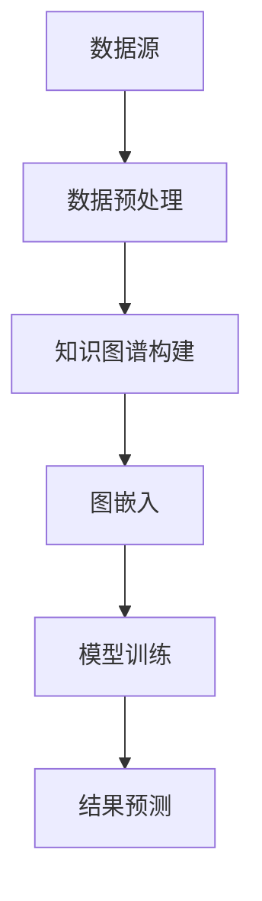
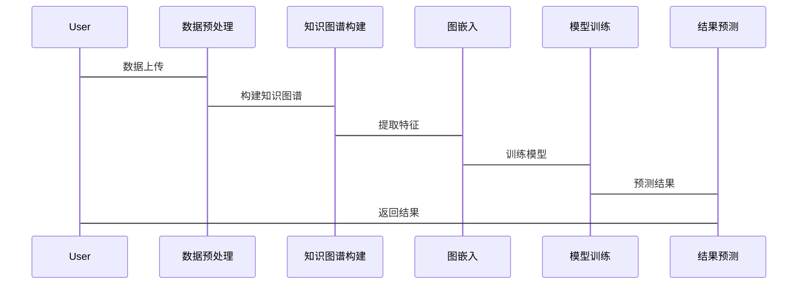

                 


# 《构建基于知识图谱的金融监管沙盒测试结果预测平台》

> **关键词**：知识图谱、金融监管、监管沙盒、风险预测、图嵌入、机器学习、系统架构

> **摘要**：本文详细探讨了如何利用知识图谱构建金融监管沙盒测试结果预测平台。通过分析金融监管中的关键问题，结合知识图谱的构建与应用，提出了一种基于图嵌入算法的解决方案。文章从背景介绍、核心概念、算法原理、系统架构到项目实战，全面阐述了平台的设计与实现过程，并通过实际案例验证了平台的有效性。

---

## 第一章：背景介绍

### 1.1 问题背景
随着金融市场的快速发展，金融监管的重要性日益凸显。金融监管沙盒作为一种创新监管工具，旨在为金融机构提供一个安全的环境，测试创新产品或服务的合规性与风险。然而，传统监管方式存在数据分散、信息孤岛、风险预测能力不足等问题，难以应对日益复杂的金融环境。

### 1.2 问题描述
金融监管沙盒测试的核心目标是通过模拟真实市场环境，评估创新金融产品的风险。然而，现有方法依赖于传统的统计分析和规则引擎，难以捕捉复杂的关联关系和隐含风险。知识图谱作为一种新兴的技术，能够通过结构化数据和语义理解，为金融监管提供更强大的支持。

### 1.3 问题解决思路
通过构建知识图谱，整合金融机构、产品、市场行为等多维度数据，利用图嵌入算法提取语义特征，结合机器学习模型，实现对金融监管沙盒测试结果的预测。

### 1.4 边界与外延
本平台仅关注金融监管沙盒测试结果的预测，边界包括数据收集、知识图谱构建、模型训练与部署。平台不涉及实际的监管决策，但可为监管机构提供数据支持和风险预警。

### 1.5 概念结构与核心要素
- **核心概念**：知识图谱、金融监管、图嵌入。
- **核心要素**：金融机构、产品、市场行为、风险因素。

---

## 第二章：知识图谱的核心原理

### 2.1 知识图谱的定义与特点
知识图谱是一种以图结构形式表示知识的技术，具有语义丰富、结构化、可扩展性强等特点。

### 2.2 知识图谱的构建过程
1. **数据收集**：从多种数据源收集金融机构、产品、市场行为等数据。
2. **实体识别与关系抽取**：通过NLP技术识别实体及其关系。
3. **知识图谱存储**：使用图数据库存储实体及其关系。

### 2.3 知识图谱与金融监管的结合
- **实体关系分析**：识别金融机构之间的关联关系。
- **风险评估**：通过图结构分析风险传播路径。
- **政策支持**：为监管政策提供数据支持。

---

## 第三章：算法原理讲解

### 3.1 图嵌入算法
图嵌入算法通过将图结构转化为低维向量，提取节点的语义特征。

#### 3.1.1 Word2Vec算法
- **训练流程**：通过Skip-Gram模型训练节点向量。
- **代码示例**：
  ```python
  import numpy as np
  # 初始化词向量
  def init_embeddings(vocab_size, embedding_dim):
      return np.random.randn(vocab_size, embedding_dim)
  ```

#### 3.1.2 图嵌入数学模型
- **公式**：$$P(w_i|w_j) = \text{similarity}(w_i, w_j)$$

---

## 第四章：系统架构设计

### 4.1 系统功能设计
- **领域模型**：金融机构、产品、市场行为。
- **功能模块**：数据采集、知识图谱构建、模型训练、预测结果展示。

### 4.2 系统架构图


### 4.3 系统接口设计
- **输入接口**：金融机构数据。
- **输出接口**：预测结果。

### 4.4 系统交互流程


---

## 第五章：项目实战

### 5.1 环境搭建
- **工具**：Python、TensorFlow、Neo4j。

### 5.2 核心实现代码
```python
import tensorflow as tf
from tensorflow.keras import layers

# 定义图嵌入模型
class GraphEmbeddingModel:
    def __init__(self, vocab_size, embedding_dim):
        self.embedding = layers.Embedding(vocab_size, embedding_dim)
        self.flatten = layers.Flatten()
        self.dense = layers.Dense(1, activation='sigmoid')

    def call(self, inputs):
        embedded = self.embedding(inputs)
        flattened = self.flatten(embedded)
        output = self.dense(flattened)
        return output
```

### 5.3 代码解读与分析
- **模型训练**：使用训练数据优化模型参数。
- **预测结果**：输入新的数据，输出预测结果。

### 5.4 实际案例分析
- **案例1**：预测某金融机构的风险等级。
- **案例2**：评估某金融产品的市场影响。

---

## 第六章：总结与展望

### 6.1 总结
本文详细介绍了基于知识图谱的金融监管沙盒测试结果预测平台的设计与实现，通过图嵌入算法和机器学习模型，提升了金融监管的效率和准确性。

### 6.2 展望
未来工作将探索更复杂的图嵌入算法，如GraphSAGE和GAT，进一步优化模型性能。

### 6.3 最佳实践 tips
- 数据质量至关重要。
- 模型调优需要结合业务需求。

---

通过以上章节的详细阐述，本文为构建基于知识图谱的金融监管沙盒测试结果预测平台提供了完整的解决方案，为金融监管的智能化提供了有力支持。

