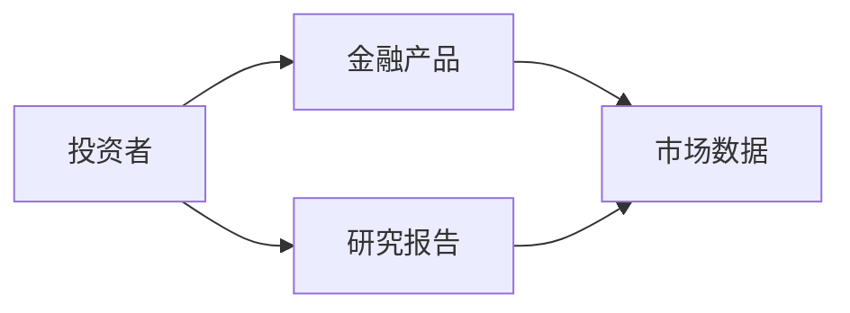
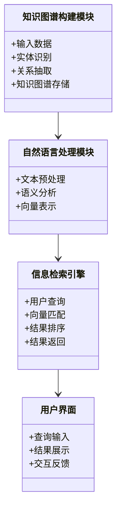

                 


# 构建基于知识图谱的金融研报智能检索系统

## 关键词：知识图谱、自然语言处理、金融研报、智能检索系统、信息检索

## 摘要：本文将详细介绍如何利用知识图谱和自然语言处理技术构建一个高效的金融研报智能检索系统。通过分析传统金融研报检索的痛点，引入知识图谱技术，结合自然语言处理算法，设计并实现一个智能化的金融研报检索系统。文章将从系统架构设计、算法原理、项目实战等多个方面展开，为读者提供全面的技术指导。

---

## 第一部分: 知识图谱与金融研报智能检索系统概述

### 第1章: 问题背景与需求分析

#### 1.1 问题背景
金融行业每天产生大量的研究报告，这些报告包含丰富的行业信息和数据。然而，传统的金融研报检索系统存在以下痛点：
- **信息过载**：海量报告难以快速筛选。
- **检索效率低**：基于关键词的检索方式难以满足语义需求。
- **准确性差**：传统检索系统无法理解上下文关系，导致结果不准确。

引入知识图谱技术，可以将金融研报中的实体（如公司、行业、市场数据）及其关系进行建模，从而实现更智能的检索。

#### 1.2 问题描述
金融研报检索的核心目标是帮助用户快速找到与其需求最相关的报告。然而，传统检索系统依赖关键词匹配，难以处理复杂的语义需求。知识图谱的引入可以弥补这一不足，通过构建金融领域的知识图谱，实现基于实体和关系的智能检索。

#### 1.3 解决方案
- **知识图谱构建**：提取研报中的实体及其关系，构建领域知识图谱。
- **自然语言处理**：利用NLP技术对研报内容进行深度分析，提取语义信息。
- **智能检索引擎**：结合知识图谱和语义分析结果，实现更精准的检索。

#### 1.4 边界与外延
- **边界**：系统专注于金融研报的智能检索，不涉及外部数据源。
- **外延**：未来可以扩展至其他领域的知识图谱构建。

---

### 第2章: 核心概念与联系

#### 2.1 核心概念原理
- **知识图谱**：一种图结构的数据模型，由节点（实体）和边（关系）组成。
- **自然语言处理（NLP）**：通过对文本进行处理，提取语义信息。
- **信息检索**：基于用户查询，从大规模文档中找到相关结果。

#### 2.2 核心概念属性对比
| 概念         | 属性           | 描述                                                                 |
|--------------|----------------|----------------------------------------------------------------------|
| 知识图谱     | 表示形式       | 图结构（节点与边）                                                 |
| 自然语言处理 | 核心任务       | 文本理解与生成                                                     |
| 信息检索     | 目标           | 找到相关文档或信息                                                 |

#### 2.3 ER实体关系图


---

### 第3章: 系统架构与功能设计

#### 3.1 系统架构设计


#### 3.2 功能模块设计


---

## 第二部分: 算法原理与数学模型

### 第4章: 知识图谱构建算法

#### 4.1 知识图谱构建流程


#### 4.2 实体识别算法
- **基于规则的实体识别**：通过正则表达式匹配特定模式的文本。
- **基于机器学习的实体识别**：使用CRF模型进行序列标注。

#### 4.3 关系抽取算法
- **基于规则的关系抽取**：通过预定义的规则匹配文本中的关系。
- **基于深度学习的关系抽取**：使用RCNN或BERT模型进行关系抽取。

---

### 第5章: 自然语言处理算法

#### 5.1 BERT模型
- **BERT模型结构**：
  - 输入层：将文本转换为嵌入向量。
  - 编码层：通过多层Transformer进行编码。
  - 输出层：生成词向量和句子向量。

- **数学公式**：
  $$\text{BERT}(x) = \{ h_1, h_2, \dots, h_n \}$$
  其中，$h_i$ 表示第i个词的嵌入向量。

---

## 第三部分: 系统分析与架构设计方案

### 第6章: 项目场景介绍
- **项目背景**：金融行业的数据量大、信息复杂。
- **目标用户**：金融机构分析师、投资者。

### 第7章: 系统功能设计
- **知识图谱构建**：实体识别、关系抽取、知识图谱存储。
- **自然语言处理**：文本预处理、语义分析。
- **信息检索引擎**：用户查询、向量匹配、结果排序。

### 第8章: 系统架构设计


---

## 第四部分: 项目实战

### 第9章: 环境安装
- **工具安装**：Python、TensorFlow、PyTorch。
- **库安装**：`pip install numpy pandas transformers`。

### 第10章: 核心实现
```python
import numpy as np
from transformers import BertTokenizer, BertModel

# 加载BERT模型
tokenizer = BertTokenizer.from_pretrained('bert-base-uncased')
model = BertModel.from_pretrained('bert-base-uncased')

# 文本处理
text = "金融市场的波动性增加，主要受全球经济影响。"
tokens = tokenizer.tokenize(text)
input_ids = tokenizer.encode(text, return_tensors='np')

# 模型推理
outputs = model(input_ids)
embeddings = outputs.last_hidden_state.numpy()[0]
print(embeddings)
```

### 第11章: 案例分析
- **案例背景**：用户搜索“如何应对股市波动”。
- **系统处理**：基于知识图谱和BERT模型进行检索。
- **结果展示**：返回相关报告和市场数据。

---

## 第五部分: 最佳实践与总结

### 第12章: 最佳实践
- **数据质量**：确保知识图谱的数据准确性和完整性。
- **模型优化**：定期更新NLP模型，提升检索效果。

### 第13章: 小结
本文详细介绍了基于知识图谱的金融研报智能检索系统的构建过程，从系统架构设计到算法实现，再到项目实战，为读者提供了全面的技术指导。

### 第14章: 注意事项
- **数据隐私**：确保金融数据的安全性和隐私性。
- **系统性能**：优化系统性能，提升检索速度。

### 第15章: 拓展阅读
- 推荐阅读《知识图谱入门与实践》、《深度学习自然语言处理》等相关书籍。

---

通过本文的详细讲解，读者可以全面了解如何利用知识图谱和自然语言处理技术构建一个高效的金融研报智能检索系统。

