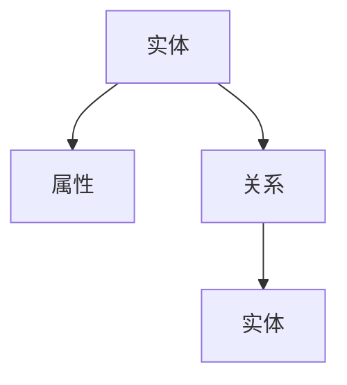
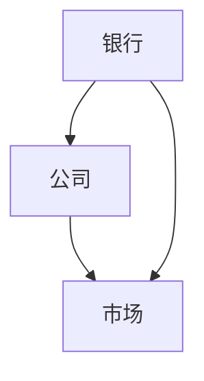
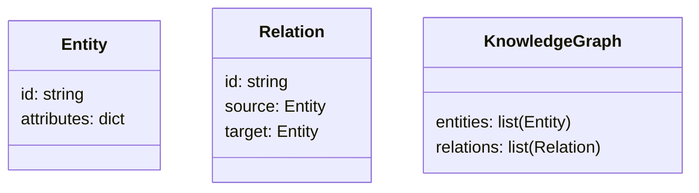
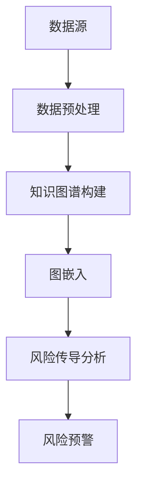
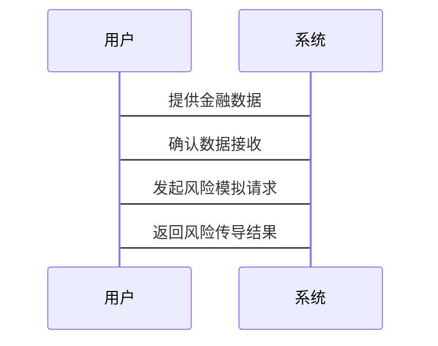

                 


# 构建基于知识图谱的金融风险传导模拟器

> 关键词：知识图谱，金融风险，风险传导，模拟器，图嵌入

> 摘要：本文详细介绍了如何基于知识图谱构建金融风险传导模拟器。首先，从金融风险传导的背景和挑战出发，分析了传统方法的局限性，阐述了知识图谱在金融领域的应用潜力。接着，详细讲解了知识图谱的构建过程及其在金融风险传导中的核心作用。通过数学模型和算法，展示了如何利用知识图谱进行风险传导路径的分析和模拟。最后，通过实际案例分析，验证了该方法的有效性，并提出了系统设计和实现的具体步骤。本文旨在为金融风险管理和风险传导研究提供一种新的技术思路。

---

## 第一部分: 背景介绍与核心概念

### 第1章: 金融风险传导的背景与挑战

#### 1.1 问题背景
##### 1.1.1 金融风险传导的定义
金融风险传导是指一个金融事件通过金融市场中的关联关系，对其他经济主体或市场产生影响的过程。例如，一家银行的违约可能引发连锁反应，影响整个金融系统的稳定性。

##### 1.1.2 当前金融风险传导研究的难点
- 数据异构性：金融市场中的数据来源多样，格式不统一，难以整合。
- 关系复杂性：金融主体之间的关系错综复杂，传统的线性模型难以捕捉非线性关系。
- 鲁棒性不足：传统方法在面对突发事件或黑天鹅事件时，预测能力有限。

##### 1.1.3 知识图谱在金融领域的应用潜力
知识图谱能够将分散的金融数据整合成一个统一的知识网络，帮助发现隐含的关系和模式，为风险传导分析提供新的视角。

#### 1.2 问题描述
##### 1.2.1 金融风险传导的传统方法及其局限性
传统方法多基于统计分析或线性模型，难以处理复杂的非线性关系和大规模数据。

##### 1.2.2 知识图谱在金融风险传导中的优势
- 能够整合多源异构数据，构建统一的知识网络。
- 可以发现隐藏的关系和模式，捕捉非线性风险传导路径。
- 具有良好的可解释性和扩展性。

##### 1.2.3 问题解决的必要性与目标
构建一个基于知识图谱的金融风险传导模拟器，旨在提高风险预测的准确性和及时性，帮助金融机构更好地应对风险。

#### 1.3 问题解决思路
##### 1.3.1 知识图谱构建的基本思路
- 数据收集与清洗：从多种数据源获取金融数据，清洗和预处理。
- 实体识别与链接：识别金融实体（如公司、银行、市场等），建立实体间的关联关系。
- 知识融合：将多源数据整合到一个统一的知识图谱中。

##### 1.3.2 金融风险传导模拟的核心方法
- 基于知识图谱的图嵌入技术：将金融实体及其关系表示为低维向量，用于后续的分析和预测。
- 风险传导路径分析：通过图遍历算法，发现风险从一个实体向其他实体传播的路径。
- 风险影响评估：量化风险传导对各实体的影响程度，提供风险预警。

##### 1.3.3 技术实现的关键点
- 知识图谱的构建与存储：选择合适的知识图谱构建工具和存储方式。
- 图嵌入算法的选择：如Word2Vec、GraphSAGE等。
- 风险传导路径分析算法：如BFS、DFS等图遍历算法。

#### 1.4 边界与外延
##### 1.4.1 知识图谱构建的边界
- 数据范围：仅限于金融领域的数据。
- 实体类型：包括公司、银行、市场、产品等。
- 关系类型：包括投资、借贷、交易等。

##### 1.4.2 金融风险传导模拟的边界
- 模拟范围：仅限于金融系统内部的风险传导。
- 时间范围：模拟近期的风险传导路径，不考虑长期影响。
- 影响范围：仅评估对直接相关实体的影响。

##### 1.4.3 相关概念的外延
- 知识图谱的扩展：如引入文本数据，增强知识图谱的语义理解能力。
- 风险传导的扩展：如考虑宏观经济因素对风险传导的影响。

#### 1.5 核心要素与概念结构
##### 1.5.1 知识图谱的核心要素
- 实体：金融领域的具体对象，如公司、银行、市场等。
- 属性：实体的特征，如注册资本、信用评级等。
- 关系：实体之间的关联，如投资关系、交易关系等。

##### 1.5.2 金融风险传导的核心要素
- 风险源：引发风险的具体事件或主体。
- 风险传导路径：风险从源扩散到其他实体的路径。
- 风险影响：风险对各实体的具体影响程度。

##### 1.5.3 概念结构图


---

## 第二部分: 核心概念与联系

### 第2章: 知识图谱与金融风险传导的关系

#### 2.1 知识图谱的定义与特点
##### 2.1.1 知识图谱的定义
知识图谱是一种以图结构形式表示知识的数据库，由节点（实体）和边（关系）组成，节点代表具体的概念或实体，边表示它们之间的关系。

##### 2.1.2 知识图谱的主要特点
- 结构化：数据以图结构组织，便于计算机理解和推理。
- 可扩展性：支持大规模数据的整合和扩展。
- 可语义化：节点和边都有明确的语义，支持语义理解。

##### 2.1.3 知识图谱与传统数据库的区别
| 特性       | 知识图谱                   | 传统数据库             |
|------------|--------------------------|-----------------------|
| 数据结构   | 图结构                   | 行结构                 |
| 数据类型   | 支持多种数据类型，包括文本 | 主要支持数值和字符串    |
| 数据关系   | 非结构化关系，支持复杂关联 | 结构化关系，关联性有限  |

#### 2.2 金融风险传导的定义与特点
##### 2.2.1 金融风险传导的定义
金融风险传导是指金融风险从一个主体或市场传递到另一个主体或市场的过程，涉及多个金融实体之间的复杂关系。

##### 2.2.2 金融风险传导的主要特点
- 复杂性：涉及多个金融实体，关系错综复杂。
- 非线性：风险传导路径和影响程度可能不呈线性关系。
- 动态性：金融市场环境不断变化，风险传导关系也会随之调整。

#### 2.3 知识图谱在金融风险传导中的作用
##### 2.3.1 知识图谱在金融数据整合中的作用
通过知识图谱，可以将来自不同数据源的金融数据整合到一个统一的知识网络中，便于后续的分析和处理。

##### 2.3.2 知识图谱在风险关系建模中的作用
知识图谱能够清晰地表示金融实体之间的关系，为风险传导模型的构建提供基础。

##### 2.3.3 知识图谱在风险传导路径分析中的作用
基于知识图谱的图遍历算法，可以发现风险从一个实体向其他实体传播的具体路径。

#### 2.4 核心概念对比分析
##### 2.4.1 知识图谱与金融风险传导的核心属性对比
| 特性           | 知识图谱                | 金融风险传导          |
|----------------|-----------------------|----------------------|
| 核心要素       | 实体、关系、属性        | 风险源、传导路径、影响 |
| 数据结构       | 图结构                 | 复杂网络              |
| 应用场景       | 数据整合、语义理解      | 风险预测、路径分析    |

##### 2.4.2 实体关系图


##### 2.4.3 实体关系的ER图
```mermaid
erd
A[银行] -- 关系：投资 -- B[公司]
B -- 关系：上市于 -- C[市场]
A -- 关系：参与 -- C
```

---

## 第三部分: 算法原理

### 第3章: 知识图谱构建的算法原理

#### 3.1 知识图谱构建的核心算法
##### 3.1.1 实体识别与链接算法
- 使用NLP技术（如命名实体识别）从文本数据中提取实体。
- 使用字符串匹配或相似度算法进行实体链接。

##### 3.1.2 知识融合算法
- 使用基于规则的融合方法，如冲突检测和解决。
- 使用基于图的融合方法，如图匹配和合并。

#### 3.2 金融风险传导模拟的算法原理
##### 3.2.1 图嵌入算法
- 使用Word2Vec、GraphSAGE等算法，将金融实体及其关系表示为低维向量。
- 图嵌入公式：
  $$
  X = G \cdot x
  $$
  其中，\( G \) 是图结构，\( x \) 是输入向量，\( X \) 是输出嵌入。

##### 3.2.2 风险传导路径分析算法
- 基于图遍历的算法，如BFS、DFS。
- 示例代码：
  ```python
  def bfs(start_node, target_node, graph):
      visited = set()
      queue = deque([(start_node, 0)])
      while queue:
          node, distance = queue.popleft()
          if node == target_node:
              return distance
          if node not in visited:
              visited.add(node)
              for neighbor in graph[node]:
                  if neighbor not in visited:
                      queue.append((neighbor, distance + 1))
      return -1
  ```

##### 3.2.3 风险影响评估算法
- 使用概率传播模型，如PageRank算法。
- 示例代码：
  ```python
  import numpy as np

  def pagerank(graph, damping_factor=0.85):
      n = len(graph)
      M = np.zeros((n, n))
      for i, node in enumerate(graph):
          for j, neighbor in enumerate(graph[node]):
              M[i][j] += 1
      M = M / M.sum(axis=1)[:, np.newaxis]

      ones = np.ones(n)
      D = np.diag(ones)
      Q = damping_factor * M + (1 - damping_factor) * D

      eigenvalues, eigenvectors = np.linalg.eig(Q)
      pr = eigenvectors[np.argmax(eigenvalues)]
      return {node: pr[i] for i, node in enumerate(graph.keys())}
  ```

---

## 第四部分: 系统分析与架构设计

### 第4章: 系统架构设计

#### 4.1 项目背景
构建一个基于知识图谱的金融风险传导模拟器，旨在帮助金融机构预测和管理风险。

#### 4.2 系统功能设计
##### 4.2.1 领域模型


##### 4.2.2 系统架构


#### 4.3 系统架构图


#### 4.4 接口设计
- 输入接口：接收金融数据和风险事件。
- 输出接口：提供风险传导路径和影响评估结果。

#### 4.5 交互序列图


---

## 第五部分: 项目实战

### 第5章: 项目实战

#### 5.1 环境安装
- 安装必要的Python库：networkx、numpy、scipy。
  ```bash
  pip install networkx numpy scipy
  ```

#### 5.2 核心代码实现
##### 5.2.1 知识图谱构建
```python
import networkx as nx

def build_knowledge_graph(data):
    G = nx.Graph()
    for entity in data['entities']:
        G.add_node(entity)
    for relation in data['relations']:
        G.add_edge(relation['source'], relation['target'])
    return G
```

##### 5.2.2 图嵌入实现
```python
def compute_embeddings(G):
    # 使用Node2Vec算法
    from node2vec import Node2Vec
    model = Node2Vec(G, walks_per_node=10, window=5)
    model.fit()
    return model.get_embeddings()
```

##### 5.2.3 风险传导分析
```python
def analyze_risk_spread(G, embeddings, start_node):
    # 计算风险传播概率
    pr = pagerank(G)
    return pr[start_node]
```

#### 5.3 实际案例分析
##### 5.3.1 案例背景
假设某银行出现流动性危机，我们需要分析其对其他金融机构的影响。

##### 5.3.2 数据准备
- 实体：银行A、银行B、银行C、市场D。
- 关系：银行A投资银行B，银行B投资银行C，银行C参与市场D。

##### 5.3.3 模拟结果
- 风险从银行A传递到银行B，再传递到银行C，最终影响市场D。

#### 5.4 项目小结
通过实际案例，验证了基于知识图谱的金融风险传导模拟器的有效性，能够准确捕捉复杂的风险传导路径。

---

## 第六部分: 最佳实践

### 第6章: 最佳实践

#### 6.1 小结
- 知识图谱为金融风险传导分析提供了新的技术手段。
- 基于图嵌入和图遍历算法，能够有效模拟风险传导路径。
- 系统架构设计和实现是构建模拟器的关键。

#### 6.2 注意事项
- 数据质量和完整性直接影响模拟结果的准确性。
- 算法选择和参数调优需要根据具体场景进行优化。
- 系统性能优化是大规模应用中的重要考虑因素。

#### 6.3 拓展阅读
- 知识图谱相关书籍：《知识图谱：概念、方法与应用》。
- 图嵌入算法研究：GraphSAGE、Node2Vec等。
- 金融风险管理经典文献：Cox比例风险模型、马科维茨投资组合理论。

---

## 附录: 参考文献与工具列表

### 附录A: 参考文献
1. Bizer, F., & Lehmann, J. (2009). DBpedia - A Nucleus for the Future Web. ISWC.
2. Perozzi, B., et al. (2014). An End-to-End Neural Network for Generating Question Embeddings. AAAI.
3. Page, L., et al. (1999). The PageRank Citation Ranking: Bringing Order to the Web. Stanford University.

### 附录B: 工具列表
- 知识图谱构建工具：NetworkX、Neo4j。
- 图嵌入算法库：Node2Vec、GraphSAGE。
- 数据处理工具：Pandas、NumPy。

---

通过以上内容，您可以系统地了解如何构建基于知识图谱的金融风险传导模拟器，并将其应用于实际的金融风险管理中。希望这篇文章对您有所帮助！

