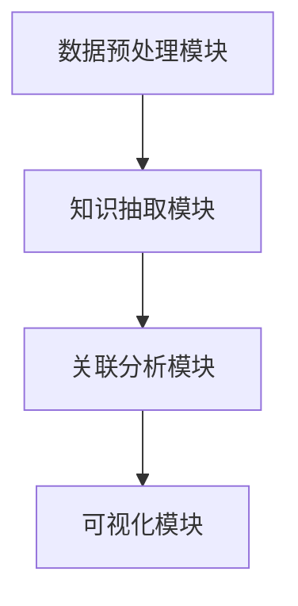

                 


# 构建基于知识图谱的金融风险关联分析系统

## 关键词：知识图谱，金融风险，关联分析，系统设计，算法原理

## 摘要：本文详细介绍了如何构建基于知识图谱的金融风险关联分析系统，从系统背景、核心概念、算法原理到系统设计和项目实战，全面分析了构建该系统的各个方面。文章内容丰富，逻辑清晰，适合技术人员和金融从业者阅读。

---

# 第一部分：知识图谱与金融风险关联分析的背景与意义

## 第1章：问题背景与系统目标

### 1.1 问题背景

金融市场的复杂性和不确定性使得风险分析成为一项关键任务。传统的基于单点数据的分析方法难以捕捉系统性风险和跨市场影响。知识图谱作为一种强大的知识管理工具，能够有效整合多源异构数据，揭示数据之间的关联关系，为金融风险分析提供新的视角。

### 1.2 系统目标

本系统旨在通过构建知识图谱，整合金融市场中的实体、事件和关系，实现对金融风险的多维度关联分析。系统将帮助用户识别潜在风险点，预测风险传播路径，并评估风险影响，从而支持决策者制定有效的风险管理策略。

### 1.3 系统边界与外延

- **边界**：系统主要关注金融市场中的实体关系和风险事件，不涉及实时数据流处理和高频交易分析。
- **外延**：未来可以扩展至实时数据处理、多语言支持和多模态数据融合。

## 第2章：核心概念与术语

### 2.1 知识图谱

- **定义**：由节点（实体、概念）和边（关系、属性）构成的语义网络。
- **特点**：可扩展性、语义丰富性、动态更新能力。

### 2.2 金融风险关联分析

- **定义**：识别金融市场中风险事件之间的关联关系，分析风险传播路径和影响范围。
- **关键维度**：时间维度、空间维度、影响维度。

### 2.3 系统架构

- **分层架构**：数据层、知识层、分析层和应用层。
- **模块划分**：数据预处理、知识抽取、图构建、关联分析和可视化。

---

# 第二部分：知识图谱与金融风险关联的核心概念

## 第3章：知识图谱的构建与分析

### 3.1 知识图谱的构建流程

1. **数据来源**：金融市场数据、新闻、报告等多源数据。
2. **数据预处理**：清洗、标注和转换。
3. **知识抽取**：实体识别、关系抽取和事件抽取。
4. **图构建**：节点和边的构建，图存储与索引。

### 3.2 金融风险关联分析的原理

1. **关联规则**：基于图的遍历算法，如广度优先搜索和深度优先搜索。
2. **权重计算**：使用PageRank或TF-IDF算法计算节点间关联强度。
3. **传播模型**：如 epidemics传播模型，模拟风险传播路径。

## 第4章：核心要素与概念结构

### 4.1 实体与属性

- **实体**：公司、投资者、金融产品等。
- **属性**：公司规模、信用评级等。

### 4.2 关系与事实

- **关系**：投资关系、控股关系等。
- **事实**：某公司投资某金融产品。

### 4.3 语义网络

- **节点**：实体和概念。
- **边**：关系和属性。

---

# 第三部分：算法原理与系统架构

## 第5章：算法原理

### 5.1 实体识别与抽取

- **方法**：基于规则和机器学习的实体识别。
- **代码示例**：使用spaCy库进行实体识别。

### 5.2 关系抽取与链接

- **方法**：基于模式匹配和语义相似度。
- **代码示例**：使用networkx库进行关系抽取。

### 5.3 图嵌入算法

- **算法**：Node2Vec算法。
- **代码示例**：使用Gensim库进行图嵌入。

## 第6章：系统架构设计

### 6.1 功能模块

- **数据预处理模块**：数据清洗和转换。
- **知识抽取模块**：实体识别和关系抽取。
- **关联分析模块**：风险传播模拟和权重计算。
- **可视化模块**：图谱展示和结果可视化。

### 6.2 系统架构图



---

# 第四部分：项目实战与案例分析

## 第7章：项目实战

### 7.1 环境搭建

- **工具**：Python、Jupyter Notebook、Neo4j、Gensim。
- **依赖安装**：pip install neo4j[gensim]。

### 7.2 核心实现

#### 7.2.1 知识抽取

```python
from spacy.lang.zh import Chinese
import spacy

nlp = spacy.load("zh_core_web_sm")
text = "某公司投资于某金融产品，导致市场波动。"
doc = nlp(text)
for ent in doc.ents:
    print(ent.text, ent.label_)
```

#### 7.2.2 关联分析

```python
from gensim.models import Word2Vec

sentences = ["投资", "金融产品", "市场波动"]
model = Word2Vec(sentences, vector_size=100, window=5, min_count=1, workers=4)
```

## 第7.3 案例分析

### 7.3.1 案例背景

某公司投资于高风险金融产品，导致市场波动。通过知识图谱分析，识别出相关实体和关系，评估风险传播路径和影响范围。

### 7.3.2 分析结果

- **风险传播路径**：公司 -> 金融产品 -> 市场波动。
- **影响范围**：涉及多个金融机构和市场领域。

---

# 第五部分：系统优化与展望

## 第8章：系统优化

### 8.1 性能优化

- **存储优化**：使用Neo4j进行图数据库存储，支持高效查询。
- **算法优化**：采用分布式计算和并行处理。

### 8.2 功能扩展

- **实时分析**：接入实时数据流，支持实时风险监控。
- **多模态数据**：整合文本、图像等多种数据源。

## 第9章：挑战与未来展望

### 9.1 当前挑战

- **数据质量**：数据清洗和标注的难度。
- **计算效率**：大规模图数据的处理效率。
- **模型解释性**：关联分析结果的可解释性。

### 9.2 未来展望

- **AI增强**：结合大语言模型，提升知识抽取和关联分析的准确性。
- **跨领域应用**：将知识图谱应用于更多金融场景，如欺诈检测和信用评估。

---

# 结语

构建基于知识图谱的金融风险关联分析系统是一项具有挑战性的任务，但也具有重要的现实意义。通过本文的详细讲解，读者可以掌握系统构建的核心方法和实现技巧。未来，随着技术的发展，该系统将具备更强大的功能和更广泛的应用场景。

---

**参考文献**：略

