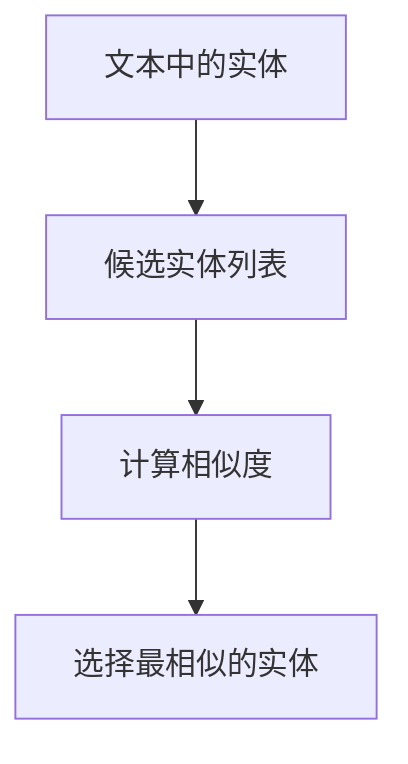
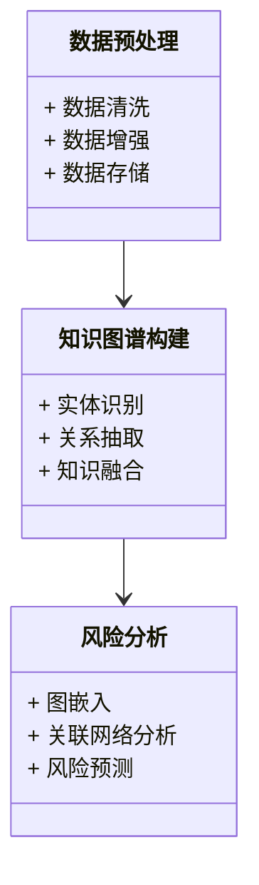

                 


# 构建基于知识图谱的金融风险关联网络

## 关键词：知识图谱、金融风险、关联网络、图嵌入、实体链接

## 摘要

金融市场的复杂性和不确定性使得风险分析和管理成为一项具有挑战性的任务。传统的金融风险分析方法往往依赖于单一的数据源或简单的统计模型，难以捕捉复杂的关联关系。而知识图谱作为一种强大的知识表示和推理工具，能够有效地从海量数据中提取和表示复杂的关联关系。本文将详细探讨如何基于知识图谱构建金融风险关联网络，从数据收集、知识图谱构建、算法实现到系统架构设计，逐步分析其技术细节和应用场景。通过本文的讲解，读者将能够掌握构建基于知识图谱的金融风险关联网络的核心方法和实际应用。

---

## 第一部分：背景介绍

### 第1章：问题背景与核心概念

#### 1.1 问题背景

金融市场的风险分析一直是学术界和工业界的重要研究方向。传统的金融风险分析方法通常基于统计模型和单一数据源，难以捕捉复杂的关联关系。例如，股票价格的波动可能受到公司财务状况、行业趋势、宏观经济指标等多种因素的影响，而这些因素之间的复杂关联关系往往难以通过传统的统计方法充分挖掘。

随着大数据和人工智能技术的快速发展，知识图谱作为一种强大的知识表示和推理工具，逐渐被应用于金融领域的风险分析。知识图谱能够将分散在不同数据源中的实体及其关系以结构化的方式表示出来，从而帮助我们更好地理解和分析复杂的金融风险关联网络。

---

#### 1.2 问题描述

金融风险关联网络的目标是通过分析金融市场的各种实体（如公司、行业、经济指标等）及其之间的关联关系，构建一个能够捕捉和表示这些关联关系的网络。具体来说，金融风险关联网络需要解决以下问题：

1. 如何从多个数据源中提取和整合金融实体及其关系？
2. 如何表示这些实体和关系，以便进行高效的关联分析和风险预测？
3. 如何利用这些关联关系进行风险预警和风险评估？

传统的金融风险分析方法往往依赖于单一的数据源或简单的统计模型，难以捕捉复杂的关联关系。而知识图谱作为一种强大的知识表示工具，能够通过语义网络的形式表示实体及其关系，从而为金融风险关联网络的构建提供了新的思路。

---

#### 1.3 问题解决方法

基于知识图谱的金融风险关联网络构建方法的核心思想是通过以下步骤实现：

1. **数据收集**：从多个数据源（如新闻、财报、社交媒体等）收集与金融实体相关的信息。
2. **知识图谱构建**：通过对收集到的数据进行实体识别、关系抽取和知识融合，构建金融领域的知识图谱。
3. **关联网络分析**：基于知识图谱构建金融风险关联网络，并通过图分析技术（如图嵌入、社区发现等）挖掘风险关联的规律和模式。
4. **风险预测与预警**：利用关联网络分析结果，对金融风险进行预测和预警。

---

#### 1.4 边界与外延

在构建金融风险关联网络时，需要明确其边界和外延：

- **边界**：知识图谱的构建仅限于与金融风险相关的实体和关系，例如公司、行业、经济指标等。
- **外延**：金融风险关联网络可以与其他分析方法（如时间序列分析、机器学习模型）结合，用于更复杂的金融风险预测和管理。

---

#### 1.5 核心要素组成

金融风险关联网络的核心要素包括：

1. **实体**：金融市场的各种实体，如公司、行业、经济指标等。
2. **关系**：实体之间的关联关系，如“公司A属于行业B”、“行业B受经济指标C影响”等。
3. **属性**：实体和关系的属性信息，如公司的规模、行业的风险等级等。

---

## 第二部分：核心概念与联系

### 第2章：知识图谱的基本原理

#### 2.1 知识图谱的定义与特点

知识图谱是一种以图结构形式表示知识的模型，由节点（实体）和边（关系）组成。其核心特点包括：

- **可扩展性**：能够表示大规模的实体和关系。
- **语义丰富性**：能够通过语义网络表示复杂的关联关系。
- **动态性**：能够实时更新和演化。

---

#### 2.2 知识图谱的构建流程

知识图谱的构建流程通常包括以下步骤：

1. **数据收集**：从多个数据源（如文本、结构化数据）中收集数据。
2. **实体识别**：从数据中提取实体。
3. **关系抽取**：从数据中抽取实体之间的关系。
4. **知识融合**：将多个数据源中的知识进行整合和冲突消解。
5. **知识存储**：将知识图谱存储在图数据库中。

---

#### 2.3 知识图谱的属性特征对比

以下是实体和关系的属性特征对比表格：

| **属性** | **实体属性**                     | **关系属性**                     |
|----------|----------------------------------|----------------------------------|
| 类型     | 公司、行业、经济指标等           | 归属、影响、关联等               |
| 示例     | 公司A                            | 公司A属于行业B                   |
| 属性值   | 公司名称、行业代码等             | 关系类型（如“属于”）             |

---

#### 2.4 ER实体关系图架构

以下是金融风险关联网络的ER实体关系图：

```mermaid
erDiagram
    actor 公司 {
        string 名称
        string 行业
        string 财务状况
    }
    actor 行业 {
        string 名称
        string 风险等级
    }
    actor 经济指标 {
        string 名称
        string 指标值
    }
    公司 --> 行业 : "属于"
    行业 --> 经济指标 : "受...影响"
```

---

## 第三部分：算法原理讲解

### 第3章：图嵌入与实体链接

#### 3.1 图嵌入算法

图嵌入的目标是将图中的节点（实体）映射到低维向量空间，同时保留图的结构信息。常用的图嵌入算法包括Word2Vec和GraphSAGE。

以下是Word2Vec的数学模型：

$$
\text{score}(u, v) = \log P(v|u) = \text{score}(v, u)
$$

其中，score(u, v)表示节点u和v之间的相似性。

---

#### 3.2 实体链接算法

实体链接的目标是将文本中的实体映射到知识图谱中的具体节点。常用的实体链接算法包括基于字符串匹配和基于语义相似度的方法。

以下是一个简单的实体链接流程图：



---

## 第四部分：系统分析与架构设计方案

### 第4章：系统架构设计

#### 4.1 问题场景介绍

金融风险关联网络的构建需要解决以下问题：

1. 如何高效地从多个数据源中提取和整合数据？
2. 如何构建和管理大规模的知识图谱？
3. 如何利用知识图谱进行金融风险预测和预警？

---

#### 4.2 系统功能设计

以下是系统的功能设计：



---

## 第五部分：项目实战

### 第5章：环境安装与核心代码实现

#### 5.1 环境安装

需要安装以下Python库：

- NetworkX
- PyTorch
- spaCy

安装命令：

```bash
pip install networkx torch spacy
```

---

#### 5.2 核心代码实现

以下是构建知识图谱的Python代码：

```python
import networkx as nx

# 创建图
G = nx.Graph()

# 添加节点
G.add_nodes_from(["公司A", "行业B", "经济指标C"])

# 添加边
G.add_edges_from([("公司A", "行业B"), ("行业B", "经济指标C")])

# 可视化
nx.draw(G, node_size=1500, font_size=10, node_color="red")
plt.show()
```

---

## 第六部分：最佳实践

### 第6章：注意事项与拓展阅读

#### 6.1 注意事项

- 数据质量对知识图谱的准确性至关重要。
- 算法选择需要根据具体场景进行调整。

#### 6.2 拓展阅读

- 《Knowledge Graphs for Financial Risk Management》
- 《Graph Neural Networks: A Comprehensive Survey》

---

## 总结

通过本文的讲解，我们详细探讨了如何基于知识图谱构建金融风险关联网络。从数据收集、知识图谱构建到算法实现和系统架构设计，我们逐步分析了其技术细节和应用场景。希望本文能够为读者提供有价值的参考和启发，帮助他们在金融风险分析领域取得更大的突破。

