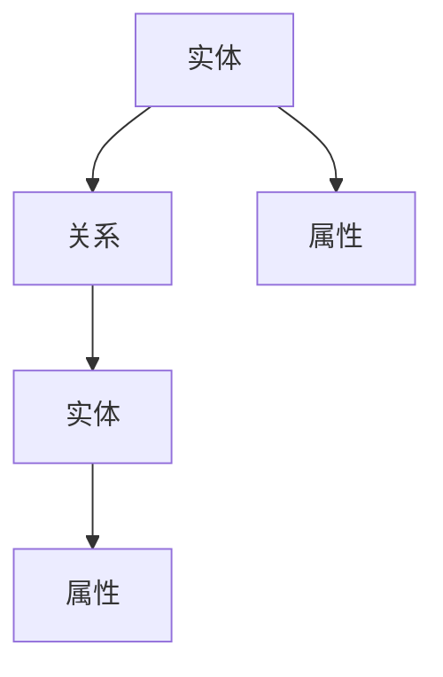
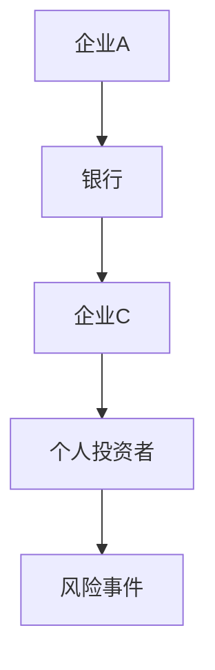
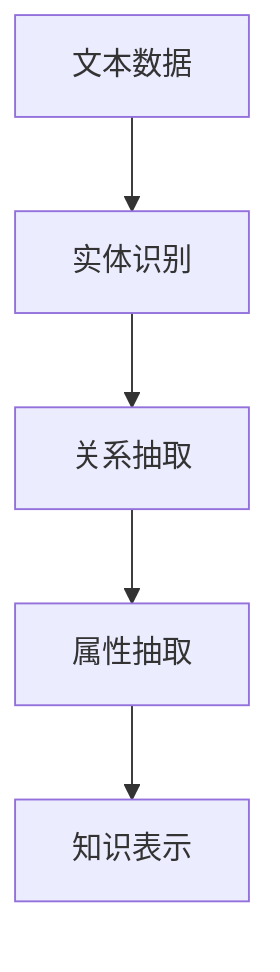
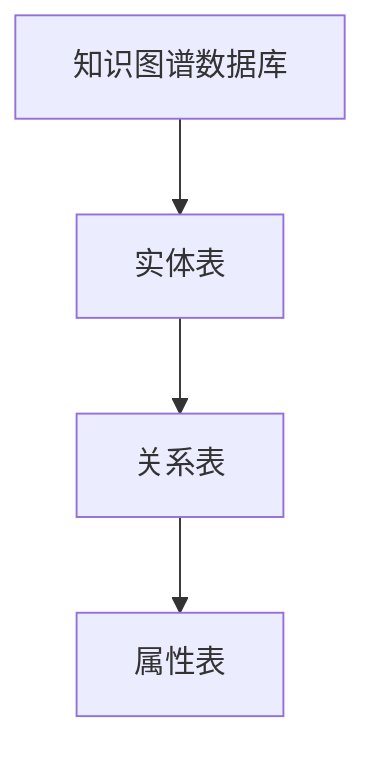
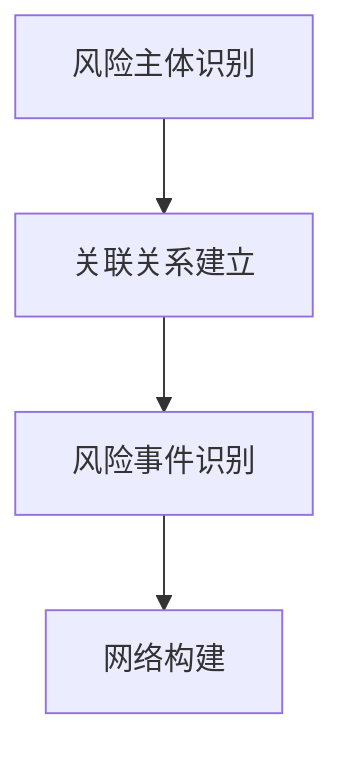
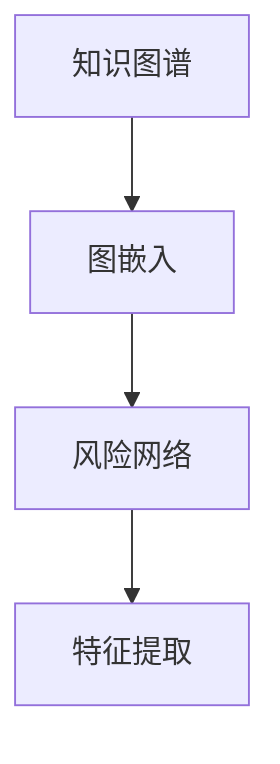
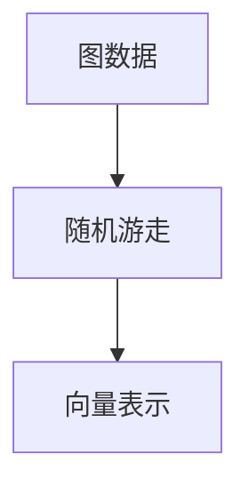
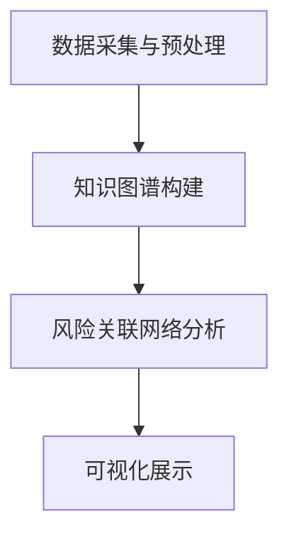
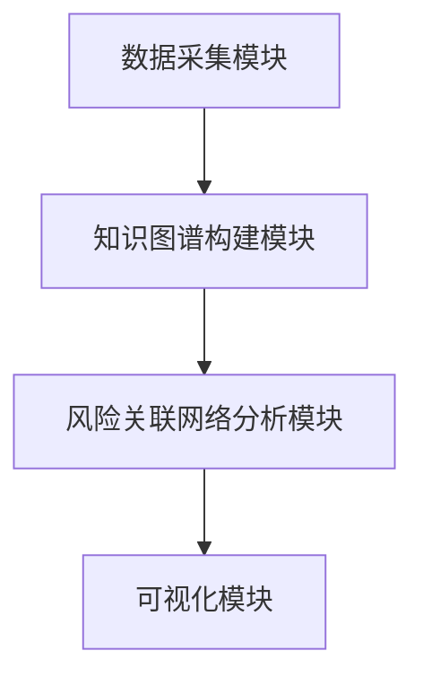

                 


# 《构建基于知识图谱的金融风险关联网络可视化系统》

---

## 关键词：
知识图谱，金融风险，关联网络，可视化系统，图嵌入，风险传播，网络分析

---

## 摘要：
本文详细探讨了如何利用知识图谱构建金融风险关联网络可视化系统。文章首先介绍了知识图谱和金融风险关联网络的基本概念，分析了两者的结合方式及其在金融风险管理中的应用价值。随后，深入讲解了知识图谱的构建原理、关联网络的分析方法以及相关的数学模型。在系统架构部分，提出了基于知识图谱的金融风险关联网络的可视化系统设计，并通过具体案例展示了系统的实现过程和实际应用场景。最后，总结了当前的研究成果，并展望了未来的发展方向。

---

## 目录：
1. [知识图谱与金融风险关联网络的背景与概念](#知识图谱与金融风险关联网络的背景与概念)
2. [知识图谱的构建原理与方法](#知识图谱的构建原理与方法)
3. [金融风险关联网络的构建与分析](#金融风险关联网络的构建与分析)
4. [知识图谱关联网络的算法原理与数学模型](#知识图谱关联网络的算法原理与数学模型)
5. [系统架构与实现方案](#系统架构与实现方案)
6. [项目实战：构建可视化系统](#项目实战：构建可视化系统)
7. [总结与展望](#总结与展望)

---

## 第一部分：知识图谱与金融风险关联网络的背景与概念

### 1.1 知识图谱的基本概念

知识图谱是一种以图结构形式表示知识的工具，其核心要素包括实体（Entity）、关系（Relation）和属性（Attribute）。实体可以是人、组织、事件等，关系描述实体之间的关联，属性则用于进一步描述实体的特征。

**图1-1 知识图谱的实体关系图**



知识图谱的特点包括：
- **语义丰富性**：通过实体和关系的组合，能够表示复杂的语义信息。
- **可扩展性**：支持多源数据的融合与动态更新。
- **结构化与非结构化数据的结合**：能够处理文本、表格等多种数据形式。

### 1.2 金融风险关联网络的定义与特点

金融风险关联网络是一种用于描述金融市场中风险主体及其关联关系的网络结构。其核心要素包括：
- **风险主体**：如企业、金融机构、个人等。
- **风险事件**：如违约、欺诈、市场波动等。
- **关联关系**：如投资关系、借贷关系、交易关系等。

**图1-2 金融风险关联网络的示意图**



金融风险关联网络的特点包括：
- **复杂性**：网络结构可能包含多个层次和社区。
- **动态性**：网络关系会随着市场环境的变化而动态调整。
- **关联性**：风险事件可能通过网络传播，形成连锁反应。

### 1.3 本章小结

本章介绍了知识图谱和金融风险关联网络的基本概念，并分析了两者的结合方式。知识图谱为金融风险关联网络的构建提供了语义丰富的知识表示方法，而金融风险关联网络则为知识图谱的应用提供了具体场景。

---

## 第二部分：知识图谱的构建原理与方法

### 2.1 知识抽取与表示

知识抽取是构建知识图谱的第一步，主要包括实体识别、关系抽取和属性抽取。

**图2-1 知识抽取流程图**



知识表示通常采用图结构，其中实体和关系可以表示为节点和边。

**图2-2 知识图谱的存储与管理**



### 2.2 知识融合与推理

知识融合是将多源数据整合到统一的知识图谱中的过程，常用方法包括：
- **实体对齐**：通过算法识别同一实体的不同表示。
- **关系合并**：将相似的关系进行归并。

知识推理是基于知识图谱进行逻辑推理的过程，常用算法包括：
- **基于规则的推理**：如使用逻辑规则进行推理。
- **基于深度学习的推理**：如使用图神经网络进行推理。

### 2.3 本章小结

本章详细介绍了知识图谱的构建过程，包括知识抽取、表示、融合与推理。这些方法为后续构建金融风险关联网络提供了基础支持。

---

## 第三部分：金融风险关联网络的构建与分析

### 3.1 金融风险关联网络的构建逻辑

金融风险关联网络的构建逻辑包括以下几个步骤：
1. **风险主体识别**：识别参与金融活动的主体，如企业、银行、个人等。
2. **关联关系建立**：通过分析金融交易、投资关系等，建立风险主体之间的关联关系。
3. **风险事件识别**：识别可能引发风险的事件，如违约、欺诈等。

**图3-1 风险关联网络的构建流程**



### 3.2 知识图谱与风险关联网络的融合

知识图谱与风险关联网络的融合可以通过以下方式实现：
- **图嵌入表示**：将知识图谱中的实体和关系表示为低维向量。
- **网络特征提取**：通过图神经网络提取网络的特征。

**图3-2 知识图谱与风险关联网络的融合示意图**



### 3.3 本章小结

本章详细介绍了金融风险关联网络的构建逻辑，并探讨了知识图谱与风险关联网络的融合方法。这些方法为后续的风险分析与可视化提供了基础。

---

## 第四部分：知识图谱关联网络的算法原理与数学模型

### 4.1 图嵌入的基本原理

图嵌入是一种将图结构数据映射到低维向量空间的方法。常用的图嵌入方法包括：
- **随机游走**：通过随机游走生成节点的表示。
- **深度学习方法**：如图卷积网络（GCN）。

**图4-1 图嵌入的基本流程**



### 4.2 网络表示学习的数学模型

图卷积网络（GCN）是一种常用的网络表示学习模型，其数学表达式如下：

$$
h_i^{(l+1)} = \sigma\left(\sum_{j \in \mathcal{N}(i)} \frac{1}{|\mathcal{N}(i)|} W h_j^{(l)}\right)
$$

其中，$\sigma$ 表示激活函数，$\mathcal{N}(i)$ 表示节点 $i$ 的邻居节点集合，$W$ 表示权重矩阵。

### 4.3 本章小结

本章详细介绍了图嵌入和网络表示学习的基本原理，并给出了具体的数学模型。这些方法为金融风险关联网络的分析提供了理论基础。

---

## 第五部分：系统架构与实现方案

### 5.1 系统功能需求分析

金融风险关联网络可视化系统的功能需求包括：
1. 数据采集与预处理：采集金融数据并进行清洗。
2. 知识图谱构建：构建金融领域的知识图谱。
3. 风险关联网络分析：分析风险关联网络的特征。
4. 可视化展示：将分析结果以可视化形式展示。

**图5-1 系统功能模块图**



### 5.2 系统架构设计

系统架构采用模块化设计，主要包括以下模块：
- **数据采集模块**：负责数据的采集与预处理。
- **知识图谱构建模块**：负责知识图谱的构建与管理。
- **风险关联网络分析模块**：负责风险关联网络的分析与计算。
- **可视化模块**：负责结果的可视化展示。

**图5-2 系统架构图**



### 5.3 本章小结

本章详细介绍了金融风险关联网络可视化系统的架构设计与实现方案，为后续的系统开发奠定了基础。

---

## 第六部分：项目实战：构建可视化系统

### 6.1 环境配置

构建系统需要以下环境：
- **编程语言**：Python 3.8+
- **框架与库**：TensorFlow/PyTorch、NetworkX、Gephi
- **数据库**：Neo4j

### 6.2 核心实现代码

以下是一个简单的图嵌入实现代码：

```python
import networkx as nx
from sklearn.manifold import TSNE

# 创建图
G = nx.Graph()
G.add_edges_from([("A", "B"), ("B", "C"), ("C", "D")])

# 图嵌入
model = TSNE(n_components=2)
emb = model.fit_transform(G.nodes())
```

### 6.3 案例分析

以某银行的风险关联网络为例，分析其风险传播路径。通过可视化工具将结果展示，帮助银行识别潜在风险点。

### 6.4 本章小结

本章通过实际案例展示了如何构建金融风险关联网络可视化系统，并详细介绍了系统的实现过程。

---

## 第七部分：总结与展望

### 7.1 总结

本文详细探讨了如何利用知识图谱构建金融风险关联网络可视化系统。通过理论分析与实践结合，提出了系统的构建方法与实现方案。

### 7.2 展望

未来的研究方向包括：
1. **实时风险监测**：基于实时数据更新风险关联网络。
2. **增强算法性能**：优化图嵌入算法，提高网络分析效率。
3. **多模态数据融合**：结合文本、图像等多种数据源，提升系统性能。

---

## 附录

### 附录A：数学公式汇总

- 图嵌入公式：$$h_i^{(l+1)} = \sigma\left(\sum_{j \in \mathcal{N}(i)} \frac{1}{|\mathcal{N}(i)|} W h_j^{(l)}\right)$$
- 风险传播模型：$$R_i = \sum_{j \in \mathcal{N}(i)} \alpha_{ij} R_j$$

### 附录B：工具与库

- 数据采集：BeautifulSoup、requests
- 图构建：NetworkX
- 可视化：Gephi、Plotly

---

以上是《构建基于知识图谱的金融风险关联网络可视化系统》的完整目录和部分核心内容。

