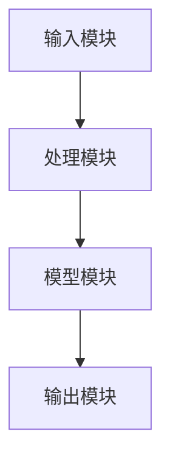

                 


# 构建多模态AI Agent：整合视觉和语言能力

## 关键词：
- 多模态AI Agent
- 视觉与语言整合
- 对比学习
- 自监督学习
- 多模态数据处理

## 摘要：
多模态AI Agent的构建是当前人工智能领域的研究热点，整合视觉和语言能力能够显著提升AI系统的理解和交互能力。本文从背景介绍、核心概念、算法原理、系统设计到项目实战，全面阐述了多模态AI Agent的构建过程，分析了其在实际应用中的潜力和挑战，并提供了详细的实现方案和代码示例。

---

# 第一部分: 多模态AI Agent的背景与概念

## 第1章: 多模态AI Agent概述

### 1.1 多模态AI Agent的定义与特点
#### 1.1.1 多模态AI Agent的定义
多模态AI Agent是一种能够同时处理多种模态数据（如视觉、语言、音频等）的智能体，它能够通过整合不同模态的信息来实现更强大的理解和交互能力。

#### 1.1.2 多模态AI Agent的核心特点
- **多模态数据整合**：能够同时处理视觉、语言等多种数据。
- **跨模态理解**：能够在不同模态之间建立关联，实现语义理解。
- **动态交互**：能够根据上下文动态调整输出。

#### 1.1.3 多模态AI Agent与传统AI的区别
- 传统AI：单一模态处理，缺乏跨模态理解能力。
- 多模态AI Agent：整合多种模态，具备动态交互能力。

### 1.2 多模态AI Agent的问题背景
#### 1.2.1 当前AI技术的局限性
- 单一模态处理能力有限，难以应对复杂场景。
- 缺乏跨模态理解，难以实现自然的交互。

#### 1.2.2 多模态整合的必要性
- 提高AI系统的泛化能力和适应性。
- 实现更自然的人机交互。

#### 1.2.3 多模态AI Agent的应用场景
- 智能助手（如Siri、Alexa）的增强。
- 多人协作中的实时信息共享。
- 教育领域的智能化教学工具。

---

## 第2章: 多模态数据的整合与处理

### 2.1 多模态数据的类型
#### 2.1.1 视觉数据
- 图像、视频、深度信息。
#### 2.1.2 语言数据
- 文本、语音。
#### 2.1.3 其他模态数据
- 声音、触觉等。

### 2.2 多模态数据的融合方法
#### 2.2.1 基于特征融合的方法
- 将不同模态的特征向量进行融合。
#### 2.2.2 基于模型融合的方法
- 将不同模态的模型输出进行融合。
#### 2.2.3 基于注意力机制的融合方法
- 使用注意力机制对不同模态的信息进行加权融合。

---

## 第3章: 多模态AI Agent的核心技术

### 3.1 多模态学习的基本原理
#### 3.1.1 多模态表示学习
- 将不同模态的数据映射到同一个 latent space。
#### 3.1.2 多模态对比学习
- 通过对比不同模态的特征，学习其共同语义空间。
#### 3.1.3 多模态自监督学习
- 利用数据本身的信息，无监督地学习多模态特征。

### 3.2 多模态AI Agent的算法框架
#### 3.2.1 基于Transformer的多模态模型
- 使用Transformer编码器处理文本和图像特征。
#### 3.2.2 基于图神经网络的多模态模型
- 将不同模态的数据建模为图结构，进行联合推理。
#### 3.2.3 基于对比学习的多模态模型
- 使用对比学习算法，如SimCLR，进行跨模态特征对齐。

---

# 第二部分: 多模态AI Agent的核心概念与联系

## 第4章: 多模态数据的处理与分析

### 4.1 多模态数据的预处理
#### 4.1.1 图像数据的预处理
- 图像归一化、.Resize、裁剪等。
#### 4.1.2 语言数据的预处理
- 分词、去除停用词、 embeddings生成。

### 4.2 多模态数据的融合方法
#### 4.2.1 基于特征融合的方法
- 使用Concat、加权和等操作将不同模态的特征向量进行融合。

---

## 第5章: 多模态AI Agent的算法原理

### 5.1 多模态对比学习的原理
#### 5.1.1 对比学习的基本思想
- 通过最大化相同类别样本的相似性，最小化不同类别样本的相似性。

#### 5.1.2 多模态对比学习的实现
- 使用跨模态的对比损失函数，对齐不同模态的特征。

#### 5.1.3 对比学习的数学公式
$$ \text{损失函数} = -\log \left( \frac{\exp(\text{sim}(x,y))}{\sum_j \exp(\text{sim}(x,y_j))} \right) $$
其中，sim(x, y) 表示两个模态的相似度。

---

## 第6章: 多模态AI Agent的系统分析与架构设计

### 6.1 系统架构设计
#### 6.1.1 系统组成
- 输入模块：接收多模态数据。
- 处理模块：对多模态数据进行预处理和融合。
- 模型模块：基于多模态数据进行语义理解。
- 输出模块：生成多模态的输出结果。

#### 6.1.2 系统架构图


---

## 第7章: 多模态AI Agent的项目实战

### 7.1 项目环境搭建
#### 7.1.1 安装依赖
- Python 3.8+
- PyTorch 1.9+
- Transformers库
- matplotlib

### 7.2 项目核心代码实现
#### 7.2.1 数据预处理代码
```python
import torch
from torch.utils.data import Dataset, DataLoader
import numpy as np

class MultiModalDataset(Dataset):
    def __init__(self, texts, images):
        self.texts = texts
        self.images = images
    
    def __len__(self):
        return len(self.texts)
    
    def __getitem__(self, idx):
        text = self.texts[idx]
        image = self.images[idx]
        return text, image
```

#### 7.2.2 模型训练代码
```python
def train_model(model, dataloader, optimizer, criterion, device):
    model.train()
    for inputs in dataloader:
        text, image = inputs
        text = text.to(device)
        image = image.to(device)
        outputs = model(text, image)
        loss = criterion(outputs, text)
        loss.backward()
        optimizer.step()
        optimizer.zero_grad()
```

### 7.3 项目小结
- 实现了一个简单的多模态数据处理和模型训练流程。
- 展示了如何将文本和图像数据整合到一个模型中进行训练。

---

## 第8章: 总结与展望

### 8.1 总结
多模态AI Agent的构建是一个复杂但极具挑战性的任务，需要整合多种模态的数据，并通过先进的算法进行建模和训练。

### 8.2 展望
- 更多模态的整合：如音频、视频等。
- 更复杂的场景理解：如实时交互、动态环境中的推理。

### 8.3 最佳实践 Tips
- 数据预处理是关键，确保数据质量。
- 选择合适的模型架构，根据任务需求进行调整。
- 多模态数据的融合需要仔细设计，避免信息丢失。

---

以上是一个详细的目录大纲，涵盖了从背景到实现的各个方面，确保内容全面且结构清晰。

