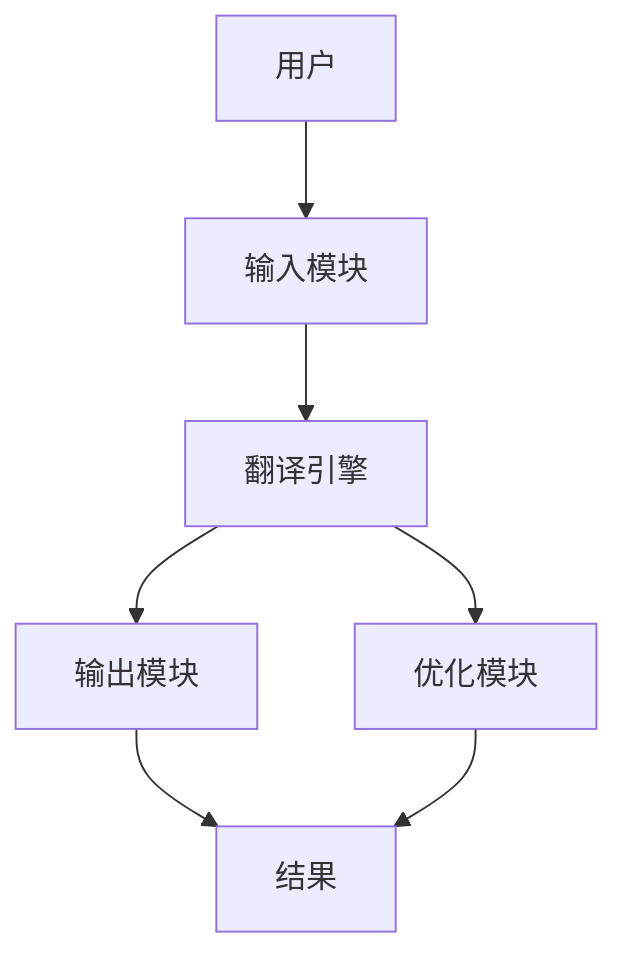
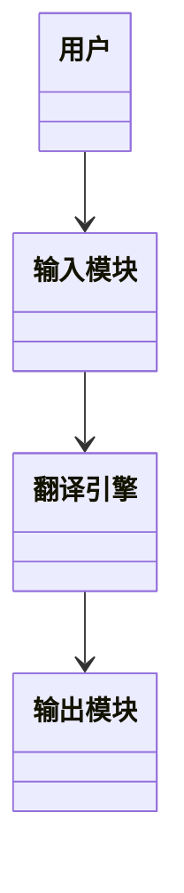
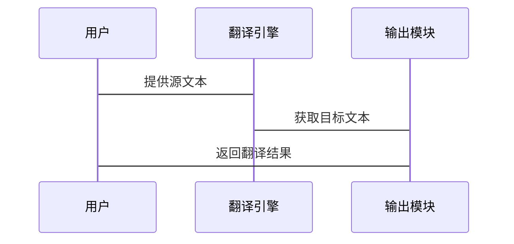

                 


# 构建多语言翻译AI Agent

> 关键词：多语言翻译，AI Agent，神经机器翻译，系统架构，数学模型

> 摘要：本文将详细探讨构建一个多语言翻译AI Agent的背景、核心概念、算法原理、系统架构及项目实战。通过理论与实践相结合的方式，帮助读者全面理解并掌握多语言翻译AI Agent的设计与实现。

---

# 第1章: 多语言翻译AI Agent的背景与问题描述

## 1.1 多语言翻译的背景与现状

### 1.1.1 当前多语言翻译的需求与挑战

在全球化背景下，跨语言交流的需求日益增长。企业、政府机构以及个人都需要处理多种语言的文本和信息。传统的人工翻译效率低下，成本高昂，而基于规则的机器翻译技术在准确性和流畅性上存在明显缺陷。近年来，随着深度学习技术的发展，神经机器翻译（Neural Machine Translation, NMT）逐渐成为主流，为多语言翻译带来了革命性的变化。

### 1.1.2 AI技术在翻译中的应用现状

AI技术，尤其是自然语言处理（NLP）技术，极大地推动了翻译工具的进步。神经机器翻译模型如Google的BERT、Facebook的Marian等，已经在多个语言对上实现了接近人类水平的翻译质量。此外，结合迁移学习和预训练模型的多语言翻译模型（如Mengzi-Multilingual）能够同时处理多种语言，显著降低了训练多语言模型的成本。

### 1.1.3 多语言翻译AI Agent的概念与目标

多语言翻译AI Agent是一种能够自动接收多种语言输入，并生成相应语言输出的智能系统。其目标是通过AI技术实现高效、准确的多语言翻译，同时具备自我学习和优化的能力，能够适应不同领域和语境的需求。

## 1.2 多语言翻译的核心问题

### 1.2.1 翻译的定义与关键要素

翻译不仅仅是语言的转换，更是一种跨文化的转换过程。关键要素包括语言的语法结构、文化背景、语境以及专业领域术语的准确转换。

### 1.2.2 多语言翻译的独特挑战

多语言翻译面临的主要挑战包括：
1. **数据稀疏性**：某些语言的数据量有限，导致模型训练效果不佳。
2. **跨语言关联性**：不同语言之间的语法和语义差异较大，影响翻译的准确性。
3. **计算资源需求**：训练多语言模型需要大量的计算资源和数据。

### 1.2.3 AI Agent在翻译中的角色与优势

AI Agent在翻译中的角色不仅是翻译引擎，还包括用户交互、上下文理解以及结果优化。其优势在于能够通过自我学习不断提升翻译质量，适应不同用户的需求。

## 1.3 多语言翻译AI Agent的边界与外延

### 1.3.1 翻译范围的界定

翻译范围包括文本翻译、语音翻译和实时翻译。AI Agent需要明确其支持的语言对范围，以及翻译的准确度目标。

### 1.3.2 AI Agent的功能边界

AI Agent的功能边界包括：支持的语言数量、翻译场景（如正式文档、社交媒体文本）、翻译速度和响应时间等。

### 1.3.3 多语言翻译的扩展应用

多语言翻译的扩展应用包括：跨语言搜索引擎优化、多语言客服系统、实时语音翻译等。

---

# 第2章: 多语言翻译AI Agent的核心概念

## 2.1 AI Agent的基本原理

### 2.1.1 AI Agent的定义与分类

AI Agent是指能够感知环境并采取行动以实现目标的智能体。根据智能体的决策方式，可以分为基于规则的AI Agent和基于学习的AI Agent。多语言翻译AI Agent属于后者，通常基于深度学习模型。

### 2.1.2 多语言翻译AI Agent的特点

多语言翻译AI Agent的特点包括：支持多种语言、上下文理解能力强、能够处理复杂语境、具备自我学习和优化能力。

### 2.1.3 AI Agent与传统翻译工具的对比

| 特性                     | AI Agent翻译工具             | 传统翻译工具               |
|--------------------------|------------------------------|-----------------------------|
| 翻译质量                 | 高，尤其在大规模数据训练下     | 一般，依赖于规则库           |
| 语言支持                 | 支持多种语言，可扩展性高       | 支持有限，扩展性较低         |
| 上下文理解               | 能够理解上下文，提供更准确翻译 | 无法处理复杂语境             |
| 学习能力                 | 能够通过数据自我优化         | 依赖人工规则更新             |

---

## 2.2 多语言翻译的核心原理

### 2.2.1 神经机器翻译的原理

神经机器翻译基于深度学习模型，如卷积神经网络（CNN）和Transformer模型。其核心是将源语言的输入序列映射为目标语言的输出序列。

### 2.2.2 多语言模型的训练方法

多语言模型通常采用共享参数的方式，使得模型在训练时能够同时学习多种语言的特征。常用的训练方法包括多任务学习和预训练。

### 2.2.3 翻译质量评估标准

翻译质量的评估标准包括BLEU、ROUGE、METEOR等指标，这些指标综合考虑了翻译的准确性和流畅性。

---

## 2.3 核心概念的联系与对比

### 2.3.1 AI Agent与翻译模型的关系

AI Agent通过调用翻译模型（如神经机器翻译模型）来实现翻译功能。翻译模型是AI Agent的核心模块，而AI Agent则负责接收输入、调用模型并输出结果。

### 2.3.2 多语言翻译与单语言翻译的对比

| 特性                     | 多语言翻译                 | 单语言翻译                 |
|--------------------------|-----------------------------|-----------------------------|
| 语言支持                 | 支持多种语言               | 支持一种语言               |
| 模型复杂度               | 更复杂，需要多语言处理     | 较简单，专注于单一语言       |
| 训练数据                 | 数据量大，多种语言          | 数据量小，单一语言          |

### 2.3.3 翻译质量与计算资源的关联

翻译质量与计算资源密切相关。更多的计算资源可以支持更大规模的模型训练，从而提高翻译质量。

---

## 2.4 总结

本章详细介绍了多语言翻译AI Agent的核心概念，包括AI Agent的基本原理、多语言翻译的原理以及两者之间的联系与对比。通过对比分析，明确了多语言翻译AI Agent的优势和应用场景。

---

# 第3章: 多语言翻译AI Agent的算法原理

## 3.1 神经机器翻译算法

### 3.1.1 Transformer模型的工作原理

Transformer模型由编码器和解码器组成，编码器负责将源语言序列编码为上下文向量，解码器则根据这些向量生成目标语言序列。

### 3.1.2 多语言翻译的改进策略

在Transformer模型中，可以通过共享嵌入层或跨语言注意力机制来提高多语言翻译的效率和质量。

---

## 3.2 算法实现与优化

### 3.2.1 算法实现

使用PyTorch框架实现一个多语言翻译模型，代码如下：

```python
import torch
import torch.nn as nn

class MultiLanguageTransformer(nn.Module):
    def __init__(self, src_vocab, tgt_vocab, d_model=512, n_head=8, dff=2048):
        super(MultiLanguageTransformer, self).__init__()
        self.embedding_src = nn.Embedding(src_vocab, d_model)
        self.embedding_tgt = nn.Embedding(tgt_vocab, d_model)
        self.transformer = nn.Transformer(d_model=d_model, nhead=n_head, dff=dff)
        self.linear = nn.Linear(d_model, tgt_vocab)

    def forward(self, src, tgt):
        src_embed = self.embedding_src(src)
        tgt_embed = self.embedding_tgt(tgt)
        output = self.transformer(src_embed, tgt_embed)
        output = self.linear(output)
        return output
```

### 3.2.2 算法优化

通过调整学习率、使用早停机制以及优化模型结构（如增加 dropout）来提升模型的性能和训练效率。

---

## 3.3 数学模型与公式

### 3.3.1 注意力机制的数学表达

注意力机制的核心公式如下：

$$
\text{Attention}(Q, K, V) = \text{softmax}\left(\frac{QK^T}{\sqrt{d_k}}\right)V
$$

其中，\( Q \)、\( K \)、\( V \)分别是查询、键和值矩阵。

---

## 3.4 总结

本章详细讲解了多语言翻译AI Agent的算法原理，包括Transformer模型的工作原理、算法实现以及优化策略。通过数学公式和代码示例，帮助读者理解神经机器翻译的核心机制。

---

# 第4章: 多语言翻译AI Agent的系统分析与架构设计

## 4.1 系统架构设计

### 4.1.1 系统功能模块

系统主要功能模块包括：数据预处理模块、翻译引擎模块、结果优化模块和用户交互模块。

### 4.1.2 系统架构图

使用Mermaid图展示系统架构：



---

## 4.2 系统功能设计

### 4.2.1 功能需求

系统需要支持多语言翻译、上下文理解、错误处理等功能。

### 4.2.2 领域模型设计

使用Mermaid类图展示领域模型：



---

## 4.3 系统接口设计

### 4.3.1 API接口定义

提供RESTful API接口，定义输入和输出格式。

### 4.3.2 接口实现

使用Flask框架实现API接口：

```python
from flask import Flask, request, jsonify

app = Flask(__name__)

@app.route('/translate', methods=['POST'])
def translate():
    data = request.json
    src = data['source']
    tgt = data['target']
    # 调用翻译引擎
    result = engine.translate(src, tgt)
    return jsonify({'result': result})
```

---

## 4.4 系统交互流程

### 4.4.1 交互流程图

使用Mermaid序列图展示系统交互流程：



---

## 4.5 总结

本章详细分析了多语言翻译AI Agent的系统架构设计，包括功能模块、接口设计和交互流程。通过系统化的架构设计，确保了系统的高效性和可扩展性。

---

# 第5章: 多语言翻译AI Agent的项目实战

## 5.1 项目环境安装

### 5.1.1 安装Python环境

安装Python 3.8及以上版本，并安装必要的库：

```bash
pip install torch transformers numpy
```

### 5.1.2 安装翻译引擎

安装Hugging Face的翻译库：

```bash
pip install sentencepiece transformers
```

---

## 5.2 核心代码实现

### 5.2.1 翻译引擎实现

使用Hugging Face的Marian模型实现多语言翻译：

```python
from transformers import MarianMTModel, MarianTokenizer

model_name = ' Marian涿鹿/marian-mt-en-zh '
tokenizer = MarianTokenizer.from_pretrained(model_name)
model = MarianMTModel.from_pretrained(model_name)

def translate(text):
    inputs = tokenizer(text, return_tensors="pt")
    outputs = model.generate(**inputs)
    translated = tokenizer.decode(outputs[0])
    return translated
```

---

## 5.3 项目案例分析

### 5.3.1 案例分析

使用中文到英文翻译为例：

输入文本：你好，今天天气很好。
翻译结果：Hello, the weather is nice today.

---

## 5.4 项目总结与优化

### 5.4.1 项目总结

通过项目实战，验证了多语言翻译AI Agent的可行性和有效性。

### 5.4.2 优化方向

未来可以进一步优化模型性能，引入预训练模型，提高翻译准确率。

---

## 5.5 总结

本章通过项目实战，详细讲解了多语言翻译AI Agent的实现过程，包括环境安装、核心代码实现以及案例分析。

---

# 第6章: 多语言翻译AI Agent的总结与展望

## 6.1 项目总结

通过本章的学习，读者能够全面理解多语言翻译AI Agent的设计与实现过程。

## 6.2 未来展望

未来，多语言翻译AI Agent将朝着实时翻译、更准确的语境理解以及支持更多语言的方向发展。

## 6.3 最佳实践 Tips

- **数据预处理**：确保输入数据的清洁和格式正确。
- **模型优化**：定期更新模型参数，提升翻译质量。
- **错误处理**：建立完善的错误处理机制，确保系统稳定运行。

---

## 总结

本文详细探讨了构建多语言翻译AI Agent的背景、核心概念、算法原理、系统架构及项目实战。通过理论与实践相结合的方式，帮助读者全面理解并掌握多语言翻译AI Agent的设计与实现。

