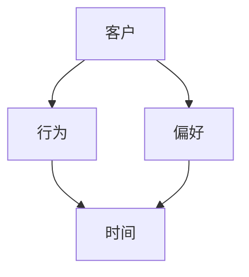
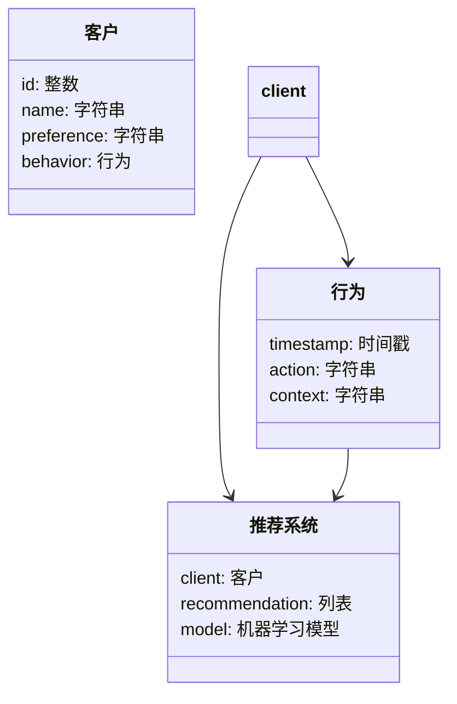
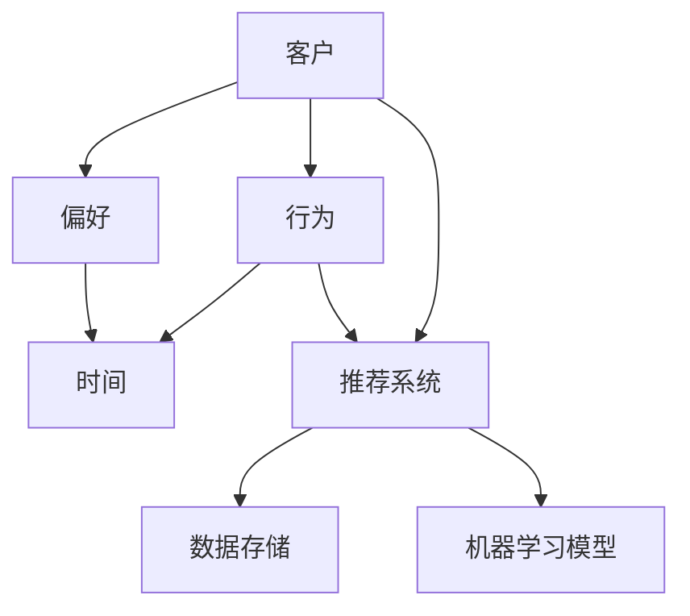

                 


# 构建客户洞察AI：深度分析与个性化服务实现

## 关键词：
客户洞察AI, 个性化推荐, 深度分析, 机器学习, 系统架构

## 摘要：
本文详细探讨了如何构建客户洞察AI系统，从背景分析到算法实现，再到系统架构设计和项目实战，全面解析客户洞察AI的核心概念、算法原理及实际应用。通过深度分析客户行为和偏好，结合机器学习技术，实现个性化服务推荐，助力企业提升客户满意度和忠诚度。

---

## 第一部分: 客户洞察AI的背景与概念

## 第1章: 客户洞察AI的背景与问题背景

### 1.1 客户洞察AI的背景介绍

#### 1.1.1 数据驱动决策的兴起
随着大数据技术的发展，企业越来越依赖数据驱动的决策。通过分析海量客户数据，企业可以更精准地理解客户需求，优化运营策略。

#### 1.1.2 人工智能在商业中的应用
人工智能技术的成熟，使得企业能够利用机器学习、自然语言处理等技术，从数据中提取有价值的信息，辅助商业决策。

#### 1.1.3 客户洞察AI的核心价值
客户洞察AI能够帮助企业深入分析客户行为和偏好，识别潜在客户，优化营销策略，提升客户满意度和忠诚度。

### 1.2 客户洞察AI的问题背景

#### 1.2.1 传统客户分析的局限性
传统客户分析方法依赖于简单的统计分析，难以捕捉客户行为的复杂性和动态变化。例如，基于单一维度的客户分群可能导致推荐结果不够精准。

#### 1.2.2 数据量爆炸与分析需求
随着电子商务和社交媒体的普及，客户数据呈指数级增长。传统的分析方法难以处理如此庞大的数据量，亟需更高效的分析工具和技术。

#### 1.2.3 个性化服务的市场需求
消费者对个性化服务的需求日益增长，企业需要通过精准的客户分析，提供个性化的推荐和定制化服务，以满足客户的多样化需求。

### 1.3 问题描述与解决路径

#### 1.3.1 客户洞察AI的目标与范围
客户洞察AI的目标是通过分析客户的交互数据、行为数据和偏好数据，构建客户画像，实现精准的客户分群和个性化推荐。其范围涵盖数据采集、特征提取、模型训练、服务部署等环节。

#### 1.3.2 问题解决的关键技术
关键技术包括数据挖掘、机器学习、自然语言处理等。通过这些技术，企业可以实现客户行为预测、需求挖掘和个性化推荐。

#### 1.3.3 解决方案的边界与外延
解决方案的边界在于客户数据的采集和分析，不涉及企业的内部管理流程。外延则包括数据可视化、客户反馈分析等扩展功能。

---

### 1.4 核心概念与联系

#### 1.4.1 核心概念解释
- **客户洞察AI**：利用人工智能技术分析客户数据，提取有价值的信息，辅助企业进行客户管理和营销决策。
- **深度分析**：通过复杂的算法模型，挖掘数据中的隐藏模式和关系。
- **个性化服务**：基于客户画像和行为分析，提供定制化的产品推荐和服务。

#### 1.4.2 核心概念对比分析
| 比较维度 | 传统数据分析 | AI驱动的客户洞察 |
|----------|--------------|------------------|
| 分析深度 | 基于统计分析，结果较为表面 | 利用机器学习，深度挖掘数据 |
| 灵活性 | 固定模式，适应性差 | 灵活调整，适应动态变化 |
| 预测能力 | 无法预测未来趋势 | 可以预测客户行为和需求 |

#### 1.4.3 实体关系图（ER图）


---

## 第2章: 客户洞察AI的核心概念与联系

### 2.1 核心概念与原理

#### 2.1.1 数据采集与特征提取
- **数据采集**：通过API接口、日志记录、用户调查等方式获取客户数据。
- **特征提取**：从原始数据中提取有用的特征，如购买频率、偏好类别、互动时间等。

#### 2.1.2 深度分析与模式识别
- **深度分析**：利用聚类、分类等算法，识别客户群体中的模式和趋势。
- **模式识别**：通过机器学习算法，发现数据中的隐藏关系和规律。

#### 2.1.3 个性化服务实现
- **个性化推荐**：基于客户画像和行为分析，推荐相关的产品或服务。
- **定制化服务**：根据客户的特定需求，提供定制化的产品或解决方案。

### 2.2 核心概念对比分析

#### 2.2.1 传统数据分析与AI分析对比
| 特性 | 传统数据分析 | AI分析 |
|------|--------------|--------|
| 数据量 | 小数据集 | 大数据集 |
| 分析深度 | 浅层分析 | 深度挖掘 |
| 算法复杂度 | 简单统计 | 复杂算法 |

#### 2.2.2 不同客户洞察方法的优劣势
- **优势**：提高客户满意度、优化营销策略、降低运营成本。
- **劣势**：需要大量数据支持，算法调优复杂，数据隐私问题。

#### 2.2.3 数据隐私与模型可解释性
- **数据隐私**：在处理客户数据时，必须遵守相关法律法规，保护客户隐私。
- **模型可解释性**：复杂的AI模型可能导致结果难以解释，需要平衡模型复杂性和可解释性。

---

## 第三部分: 客户洞察AI的算法原理

## 第3章: 深度分析算法原理

### 3.1 聚类分析

#### 3.1.1 聚类算法概述
聚类分析是一种无监督学习方法，用于将数据点分组，使得同一组内的数据点相似，不同组之间的数据点差异较大。

#### 3.1.2 K-means算法原理
- **算法步骤**：
  1. 随机选择K个初始质心。
  2. 计算每个数据点到质心的距离，将数据点分配到最近的质心组。
  3. 重新计算各组的质心。
  4. 重复步骤2和3，直到质心不再变化或达到最大迭代次数。

- **数学模型**：
  $$ \text{目标函数} = \sum_{i=1}^{K} \sum_{j=1}^{n_i} (x_{ij} - c_i)^2 $$
  其中，\( c_i \) 是第i个质心，\( x_{ij} \) 是第i组的第j个数据点。

#### 3.1.3 层次聚类算法
- **算法步骤**：
  1. 将每个数据点视为一个独立的簇。
  2. 计算每对簇之间的距离，合并距离最近的两个簇。
  3. 重复步骤2，直到所有数据点合并为一个簇。

- **距离计算**：
  常用的距离指标包括欧氏距离、曼哈顿距离和余弦相似度。

### 3.2 分类算法

#### 3.2.1 支持向量机（SVM）原理
- **算法概述**：SVM是一种监督学习算法，用于分类和回归问题。
- **数学模型**：
  $$ \text{目标函数} = \min_{w,b} \frac{1}{2}||w||^2 + C \sum_{i=1}^{n} \xi_i $$
  其中，\( \xi_i \) 是松弛变量，\( C \) 是惩罚系数。

#### 3.2.2 随机森林与梯度提升树
- **随机森林**：一种基于决策树的集成学习方法，通过随机采样构建多棵决策树，取平均结果。
- **梯度提升树**：通过不断优化损失函数，构建多个弱分类器，提升整体性能。

---

## 第4章: 个性化推荐算法

### 4.1 协同过滤推荐

#### 4.1.1 基于用户的协同过滤
- **算法步骤**：
  1. 找出与目标用户相似的用户群体。
  2. 推荐这些用户喜欢的产品或服务。

#### 4.1.2 基于物品的协同过滤
- **算法步骤**：
  1. 找出与目标用户感兴趣的产品相似的其他产品。
  2. 推荐这些相似产品给目标用户。

#### 4.1.3 混合推荐策略
- **策略**：结合基于用户的协同过滤和基于物品的协同过滤，利用两者的优势，提高推荐准确率。

### 4.2 基于深度学习的推荐系统

#### 4.2.1 基于神经网络的推荐模型
- **模型结构**：使用多层感知机（MLP）或卷积神经网络（CNN）构建推荐模型。
- **优势**：能够捕捉数据中的非线性关系，提高推荐精度。

#### 4.2.2 Transformer模型在推荐中的应用
- **注意力机制**：通过注意力机制，模型能够关注重要的客户行为特征，提高推荐效果。

#### 4.2.3 模型训练与优化
- **训练策略**：使用梯度下降优化算法，如Adam优化器，调整模型参数，降低损失函数值。
- **评估指标**：常用的评估指标包括准确率、召回率和F1分数。

---

## 第五部分: 客户洞察AI的系统分析与架构设计

## 第5章: 系统分析与架构设计

### 5.1 问题场景介绍

#### 5.1.1 系统目标
构建一个基于客户洞察AI的个性化推荐系统，通过分析客户的交互数据和行为数据，提供精准的个性化推荐服务。

#### 5.1.2 项目介绍
本项目旨在利用机器学习技术，构建客户画像，实现客户分群和个性化推荐，提升客户满意度和忠诚度。

### 5.2 系统功能设计

#### 5.2.1 领域模型（类图）


#### 5.2.2 系统架构设计


#### 5.2.3 系统接口设计
- **输入接口**：接收客户行为数据和偏好数据。
- **输出接口**：输出推荐结果和推荐理由。

#### 5.2.4 系统交互流程
```mermaid
sequenceDiagram
    客户 -> 接收行为数据
    接收行为数据 -> 推荐系统
    推荐系统 -> 训练模型
    训练模型 -> 生成推荐结果
    推荐系统 -> 输出推荐结果
```

---

## 第六部分: 客户洞察AI的项目实战

## 第6章: 项目实战

### 6.1 环境安装与配置

#### 6.1.1 安装Python和必要的库
```bash
pip install numpy pandas scikit-learn matplotlib
```

#### 6.1.2 安装机器学习框架
```bash
pip install xgboost lightgbm
```

### 6.2 系统核心实现

#### 6.2.1 数据预处理
```python
import pandas as pd

# 读取数据
data = pd.read_csv('customer_data.csv')

# 处理缺失值
data = data.dropna()

# 标准化处理
from sklearn.preprocessing import StandardScaler
scaler = StandardScaler()
data_scaled = scaler.fit_transform(data)
```

#### 6.2.2 模型训练与优化
```python
from sklearn.model_selection import train_test_split
from sklearn.svm import SVC

# 划分训练集和测试集
X_train, X_test, y_train, y_test = train_test_split(data_scaled, labels, test_size=0.2)

# 训练模型
model = SVC(C=1.0, gamma='auto')
model.fit(X_train, y_train)

# 模型评估
print("Accuracy:", model.score(X_test, y_test))
```

#### 6.2.3 个性化推荐实现
```python
from sklearn.neighbors import NearestNeighbors

# 训练邻居模型
model = NearestNeighbors(n_neighbors=5).fit(data_scaled)

# 查询相似客户
distances, indices = model.kneighbors(new_customer_vector)
```

### 6.3 项目小结

#### 6.3.1 项目成果
通过构建客户洞察AI系统，企业能够实现客户画像的精准构建和个性化推荐服务，提升客户满意度和忠诚度。

#### 6.3.2 注意事项
- 数据隐私保护
- 模型调优与优化
- 系统可扩展性设计

#### 6.3.3 拓展阅读
建议深入学习机器学习算法，了解最新的推荐系统技术和数据隐私保护法规。

---

## 第七部分: 客户洞察AI的最佳实践

## 第7章: 最佳实践与总结

### 7.1 最佳实践

#### 7.1.1 数据质量的重要性
确保数据的准确性和完整性，避免因数据质量问题导致分析结果偏差。

#### 7.1.2 模型调优与评估
通过交叉验证和网格搜索，优化模型参数，提高推荐准确率。

#### 7.1.3 系统可扩展性设计
设计模块化的系统架构，方便后续功能扩展和性能优化。

### 7.2 小结

客户洞察AI是企业提升客户满意度和忠诚度的重要工具。通过深度分析客户行为和偏好，结合机器学习技术，实现个性化的推荐服务，为企业创造更大的价值。

---

## 关键词：
客户洞察AI, 个性化推荐, 深度分析, 机器学习, 系统架构

## 摘要：
本文详细探讨了如何构建客户洞察AI系统，从背景分析到算法实现，再到系统架构设计和项目实战，全面解析客户洞察AI的核心概念、算法原理及实际应用。通过深度分析客户行为和偏好，结合机器学习技术，实现个性化服务推荐，助力企业提升客户满意度和忠诚度。

