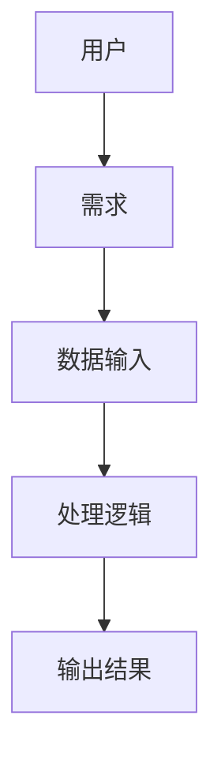
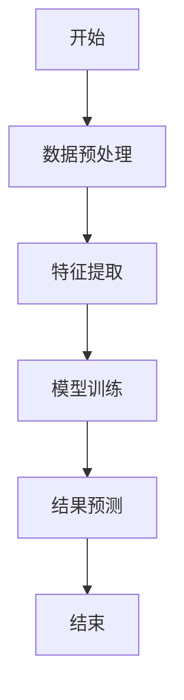

                 


# 构建投资理财智能助手的核心技术解析

> 关键词：投资理财，智能助手，人工智能，自然语言处理，机器学习，数据挖掘

> 摘要：本文将深入探讨如何利用人工智能技术构建一个高效的投资理财智能助手。通过分析核心概念、算法原理和系统架构，结合实际案例，为读者提供一个全面的技术解析。

---

## 第一部分: 投资理财智能助手的背景与需求

### 第1章: 投资理财智能助手的背景介绍

#### 1.1 投资理财的基本概念

- **1.1.1 投资理财的核心概念**  
  投资理财是指通过合理配置资金，实现资产保值、增值的过程。常见的投资形式包括股票、基金、债券、房地产等。投资者需要根据市场变化和个人风险偏好做出决策。

- **1.1.2 投资理财的主要形式**  
  - 股票投资：高风险高回报，适合风险承受能力强的投资者。  
  - 基金投资：分散风险，适合中低风险偏好的投资者。  
  - 债券投资：低风险低回报，适合保守型投资者。  
  - 其他形式：如贵金属、房地产信托等。

- **1.1.3 投资理财的常见问题与挑战**  
  - 信息过载：市场数据繁多，难以筛选和分析。  
  - 风险控制：如何在不同市场环境下规避风险。  
  - 个性化需求：每个投资者的财务状况和风险偏好不同，需要定制化的投资策略。

#### 1.2 智能助手的发展趋势

- **1.2.1 人工智能技术在金融领域的应用**  
  人工智能（AI）通过自然语言处理（NLP）、机器学习（ML）等技术，帮助金融机构和投资者更好地理解和分析市场数据。例如，AI可以用于预测股价走势、识别市场情绪等。

- **1.2.2 投资理财智能助手的市场需求**  
  随着金融科技的发展，越来越多的投资者希望借助智能工具来优化投资决策。智能助手能够提供实时市场数据、个性化投资建议和风险评估，满足用户的多样化需求。

- **1.2.3 智能助手在投资理财中的优势**  
  - 高效性：快速分析大量数据，提供实时反馈。  
  - 准确性：基于历史数据和机器学习模型，提供科学的投资建议。  
  - 个性化：根据用户需求定制投资策略，提高用户体验。

#### 1.3 投资理财智能助手的核心需求

- **1.3.1 用户需求分析**  
  - 提供实时市场数据查询功能。  
  - 提供个性化投资建议，如资产配置、风险评估等。  
  - 支持多种交互方式，如语音、文本等。

- **1.3.2 功能需求概述**  
  - 数据采集与处理：获取股票、基金等市场数据，进行清洗和预处理。  
  - 数据分析与建模：利用机器学习算法预测市场趋势。  
  - 用户交互界面：提供友好的查询和反馈界面。

- **1.3.3 性能需求与边界条件**  
  - 响应时间：用户查询需在合理时间内返回结果。  
  - 数据更新频率：实时或准实时数据更新。  
  - 安全性：确保用户数据隐私和交易安全。

### 第2章: 投资理财智能助手的核心概念与联系

#### 2.1 核心概念原理

- **2.1.1 自然语言处理（NLP）**  
  NLP技术用于理解和生成人类语言，帮助智能助手解析用户的查询内容。例如，用户输入“最近科技股走势如何”，助手需要识别关键词并提取相关数据。

- **2.1.2 机器学习（ML）**  
  ML算法用于分析历史数据，预测未来市场走势。例如，使用回归算法预测股票价格，使用分类算法识别市场趋势。

- **2.1.3 数据挖掘与分析**  
  数据挖掘技术用于从海量数据中提取有价值的信息。例如，通过聚类分析发现市场中的潜在投资机会。

#### 2.2 核心概念对比分析

| 技术 | 描述 | 优缺点 | 应用场景 |
|------|------|--------|----------|
| NLP  | 处理自然语言数据 | 高准确性，依赖数据质量 | 联系用户需求 |
| ML   | 从数据中学习模式 | 高效性，需要大量数据 | 预测与分类 |
| 数据挖掘 | 从数据中提取模式 | 依赖数据质量，结果解释性差 | 数据分析 |

#### 2.3 实体关系图（ER图）



---

## 第三部分: 投资理财智能助手的算法原理

### 第3章: 投资理财智能助手的算法原理

#### 3.1 自然语言处理（NLP）算法

- **3.1.1 分词算法**  
  分词算法用于将用户输入的文本分解成关键词。例如，用户输入“最近科技股走势如何”，分词算法会提取“科技股”和“走势”作为关键词。

- **3.1.2 语义理解**  
  语义理解技术（如BERT）用于理解用户查询的意图。例如，用户输入“我想买苹果股票”，助手需要理解用户的需求是购买苹果公司的股票。

- **3.1.3 情感分析**  
  情感分析用于识别市场评论中的情感倾向，帮助用户了解市场情绪。例如，从社交媒体上提取评论，分析整体市场情绪是正面、负面还是中性。

#### 3.2 机器学习（ML）算法

- **3.2.1 线性回归**  
  线性回归用于预测连续型变量，如股票价格。通过训练模型，可以预测未来某一时点的股票价格。

- **3.2.2 支持向量机（SVM）**  
  SVM用于分类问题，如将股票分为上涨、下跌或持平三类。适用于非线性可分的数据。

- **3.2.3 随机森林**  
  随机森林是一种基于树的集成算法，常用于分类和回归问题。适用于高维数据和噪声数据。

#### 3.3 算法流程图



#### 3.4 数学模型与公式

- **线性回归模型**  
  $$ y = \beta_0 + \beta_1x + \epsilon $$  
  其中，$y$ 是预测目标，$\beta_0$ 是截距，$\beta_1$ 是回归系数，$x$ 是自变量，$\epsilon$ 是误差项。

- **SVM分类模型**  
  SVM的目标是最小化 hinge loss，优化问题可以表示为：  
  $$ \min_{\beta, \beta_0} \frac{1}{2}||\beta||^2 + C \sum_{i=1}^n \max(0, 1 - y_i(\beta^T x_i + \beta_0)) $$

---

## 第四部分: 投资理财智能助手的系统分析与架构设计

### 第4章: 投资理财智能助手的系统分析与架构设计

#### 4.1 系统功能设计

- **领域模型**  
  ```mermaid
  classDiagram
      class 用户 {
          用户ID
          偏好
          风险承受能力
      }
      class 数据源 {
          股票数据
          基金数据
          新闻数据
      }
      class 处理逻辑 {
          数据清洗
          数据分析
          模型预测
      }
      class 输出结果 {
          预测结果
          投资建议
      }
      用户 --> 数据源
      数据源 --> 处理逻辑
      处理逻辑 --> 输出结果
  ```

- **系统架构设计**  
  ```mermaid
  architecture
      客户端 --> 中间件
      中间件 --> 数据库
      中间件 --> 分析引擎
      分析引擎 --> 数据源
  ```

- **系统接口设计**  
  - 用户输入接口：支持文本输入和语音输入。  
  - 数据接口：与第三方数据源（如Yahoo Finance）对接，获取实时数据。  
  - 输出接口：将分析结果返回给用户，支持多种格式如JSON、HTML等。

- **系统交互设计**  
  ```mermaid
  sequenceDiagram
      用户 -> 中间件: 发送查询请求
      中间件 -> 数据源: 获取数据
      数据源 -> 中间件: 返回数据
      中间件 -> 分析引擎: 请求分析
      分析引擎 -> 中间件: 返回分析结果
      中间件 -> 用户: 返回最终结果
  ```

---

## 第五部分: 投资理财智能助手的项目实战

### 第5章: 投资理财智能助手的项目实战

#### 5.1 环境安装

- **安装Python和必要的库**  
  ```bash
  pip install python
  pip install numpy
  pip install pandas
  pip install scikit-learn
  pip install transformers
  ```

#### 5.2 系统核心实现源代码

- **数据预处理代码**  
  ```python
  import pandas as pd
  # 读取数据
  df = pd.read_csv('stock_data.csv')
  # 删除缺失值
  df.dropna(inplace=True)
  # 标准化数据
  from sklearn.preprocessing import StandardScaler
  scaler = StandardScaler()
  df_scaled = scaler.fit_transform(df)
  ```

- **模型训练代码**  
  ```python
  from sklearn.linear_model import LinearRegression
  model = LinearRegression()
  model.fit(X_train, y_train)
  ```

- **结果预测代码**  
  ```python
  predictions = model.predict(X_test)
  ```

#### 5.3 案例分析

- **案例1：股票价格预测**  
  使用线性回归模型预测某股票的收盘价。  
  - 输入数据：过去一个月的股票价格和成交量。  
  - 输出结果：预测未来一周的股票价格走势。

- **案例2：基金风险评估**  
  使用随机森林模型评估某基金的风险等级。  
  - 输入数据：基金的历史收益、波动率等。  
  - 输出结果：低风险、中风险或高风险。

---

## 第六部分: 总结与展望

### 第6章: 总结与展望

#### 6.1 最佳实践 tips

- **数据质量**：确保数据的准确性和完整性，避免因数据问题导致模型错误。  
- **模型调优**：通过交叉验证和网格搜索优化模型参数，提高预测准确性。  
- **用户体验**：设计友好的交互界面，确保用户能够轻松使用智能助手。

#### 6.2 小结

本文详细介绍了构建投资理财智能助手的核心技术，包括背景分析、算法原理、系统架构和项目实战。通过这些技术的结合，可以开发出一个高效、智能的投资理财助手，帮助用户做出更科学的投资决策。

#### 6.3 注意事项

- 在实际应用中，需要考虑数据隐私和安全问题。  
- 模型的可解释性也是重要的，尤其是在金融领域，用户需要了解模型的决策依据。  
- 定期更新模型和数据，确保助手的准确性和时效性。

#### 6.4 拓展阅读

- 《Python机器学习实战》  
- 《自然语言处理入门》  
- 《数据挖掘与数据分析》  

---

通过以上内容，您可以系统地了解构建投资理财智能助手的核心技术，并将其应用于实际项目中。希望本文对您有所帮助！

