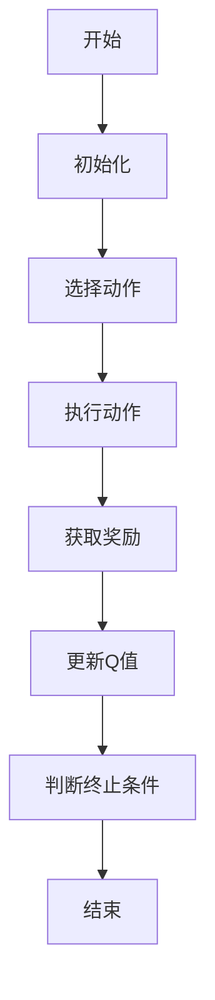
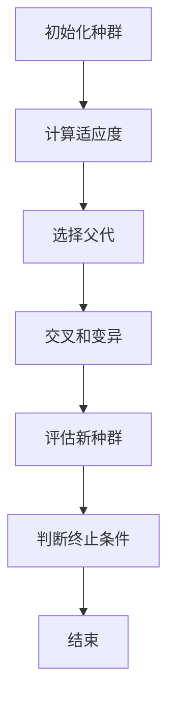
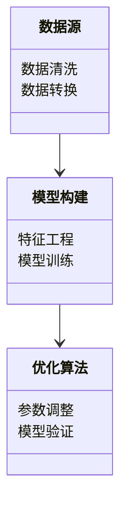
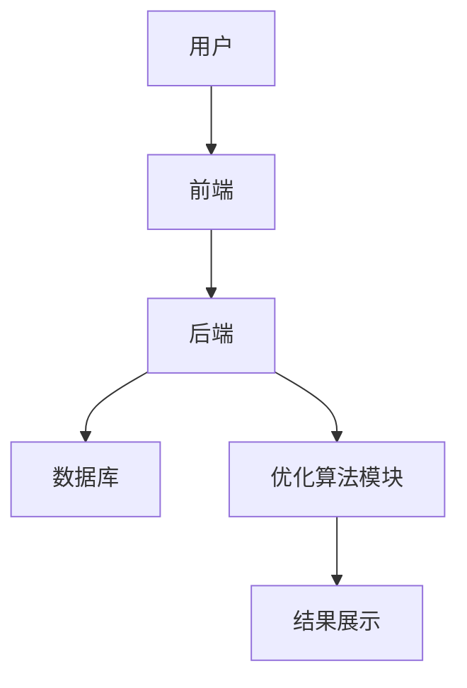

                 


# 构建智能企业决策支持系统：多维场景模拟与优化

## 关键词：智能决策支持系统、多维场景模拟、优化算法、企业决策、系统架构

## 摘要：
智能企业决策支持系统通过多维场景模拟与优化，帮助企业做出更高效、更准确的决策。本文将从背景、核心概念、算法原理、系统架构、项目实战、优化方法等多方面详细探讨，结合实际案例和代码实现，为企业构建智能决策支持系统提供全面指导。

---

# 第一部分: 智能企业决策支持系统概述

## 第1章: 企业决策支持系统背景与概述

### 1.1 企业决策支持系统的概念与价值

#### 1.1.1 企业决策支持系统的定义
企业决策支持系统（DSS）是一种利用数据、模型和算法辅助企业进行决策的工具。传统DSS依赖于简单的统计分析，而现代智能DSS则引入了人工智能技术，能够处理复杂的多维场景模拟与优化问题。

#### 1.1.2 传统决策支持系统与智能决策支持系统的区别
| 特性             | 传统DSS                | 智能DSS                |
|------------------|-------------------------|-------------------------|
| 数据来源         | 结构化数据为主           | 结构化与非结构化数据    |
| 分析方法         | 统计分析为主             | 机器学习、强化学习等    |
| 决策能力         | 单维度分析              | 多维度模拟与优化        |

#### 1.1.3 智能决策支持系统的核心价值
- 提高决策效率
- 降低决策风险
- 实现多维度优化
- 支持实时决策

### 1.2 多维场景模拟与优化的必要性

#### 1.2.1 企业决策面临的复杂场景
企业决策通常涉及多个维度，例如时间、空间、成本、资源等，传统的单维度分析难以满足需求。

#### 1.2.2 多维场景模拟的定义与特点
- 定义：通过构建多维度模型，模拟不同场景下的决策结果。
- 特点：实时性、灵活性、准确性。

#### 1.2.3 优化算法在企业决策中的作用
优化算法能够帮助企业在多维场景中找到最优解，例如供应链优化、库存管理等。

---

## 第2章: 智能决策支持系统的核心概念与联系

### 2.1 智能决策支持系统的构成

#### 2.1.1 数据源与数据处理
- 数据源：企业内部数据、外部市场数据。
- 数据处理：清洗、转换、建模。

#### 2.1.2 模型构建与优化算法
- 模型：决策树、随机森林、神经网络等。
- 优化算法：遗传算法、模拟退火、强化学习等。

#### 2.1.3 用户交互与结果展示
- 用户交互：图形化界面、实时反馈。
- 结果展示：可视化图表、决策建议。

### 2.2 多维场景模拟的维度分析

#### 2.2.1 时间维度
- 短期预测与长期规划。

#### 2.2.2 空间维度
- 区域性分析、资源分配。

#### 2.2.3 业务维度
- 供应链、市场营销、财务分析。

### 2.3 优化算法与应用场景

#### 2.3.1 常见优化算法概述
- 强化学习：适用于动态环境。
- 遗传算法：适用于组合优化问题。

#### 2.3.2 启发式算法与精确算法的对比
| 特性       | 启发式算法          | 精确算法          |
|------------|---------------------|-------------------|
| 解的质量   | 近似解              | 最优解            |
| 计算时间   | 较短                | 较长              |

#### 2.3.3 算法选择与应用场景分析
- 强化学习适合在线推荐系统。
- 遗传算法适合供应链优化。

---

# 第二部分: 算法原理与数学模型

## 第3章: 强化学习算法原理与实现

### 3.1 强化学习的基本概念

#### 3.1.1 状态、动作、奖励的定义
- 状态（State）：系统当前的状况。
- 动作（Action）：系统采取的行动。
- 奖励（Reward）：行动带来的反馈。

#### 3.1.2 策略与价值函数
- 策略（Policy）：决定下一步行动的规则。
- 价值函数（Value Function）：评估状态的价值。

#### 3.1.3 探索与利用的平衡
- 探索：尝试新动作。
- 利用：基于已有经验选择最优动作。

### 3.2 强化学习的数学模型

#### 3.2.1 Q-learning算法的数学公式
$$ Q(s, a) = Q(s, a) + \alpha (r + \max_{a'} Q(s', a') - Q(s, a)) $$

#### 3.2.2 算法流程图


---

## 第4章: 多维场景模拟与优化算法

### 4.1 多维场景模拟的数学模型

#### 4.1.1 多维优化问题的定义
$$ \min_{x} f(x) \quad \text{subject to} \quad g(x) \leq 0 $$

#### 4.1.2 基于强化学习的优化策略
- 状态空间：多维场景的特征。
- 动作空间：可能的决策动作。

### 4.2 多维优化算法的实现

#### 4.2.1 遗传算法的实现步骤
1. 初始化种群。
2. 计算适应度。
3. 选择父代。
4. 进行交叉和变异。
5. 评估新种群。

#### 4.2.2 遗传算法的流程图


---

# 第三部分: 系统架构与设计

## 第5章: 智能决策支持系统的架构设计

### 5.1 问题场景介绍

#### 5.1.1 供应链优化场景
- 需求预测。
- 供应商选择。

#### 5.1.2 市场营销场景
- 客户画像。
- 推荐系统。

### 5.2 系统功能设计

#### 5.2.1 领域模型设计


#### 5.2.2 系统架构设计


---

## 第6章: 项目实战与实现

### 6.1 环境安装与配置

#### 6.1.1 安装Python环境
```bash
pip install python3
pip install numpy
pip install matplotlib
pip install scikit-learn
```

#### 6.1.2 安装深度学习框架
```bash
pip install tensorflow
pip install keras
```

### 6.2 系统核心实现源代码

#### 6.2.1 基于强化学习的优化代码
```python
import numpy as np
import gym

env = gym.make('CartPole-v0')
env.seed(42)

class Agent:
    def __init__(self, env):
        self.env = env
        self.learning_rate = 0.01
        self.episode = 1000
        self.steps = 200

    def epsilon_greedy_policy(self, observation):
        epsilon = 0.1
        if np.random.random() < epsilon:
            return np.random.randint(0, 2)
        else:
            return self.policy(observation)

    def policy(self, observation):
        return np.argmax([0, 0])

agent = Agent(env)
for episode in range(agent.episode):
    observation = env.reset()
    for step in range(agent.steps):
        action = agent.epsilon_greedy_policy(observation)
        observation, reward, done, info = env.step(action)
        if done:
            break
env.close()
```

#### 6.2.2 优化算法的数学模型
$$ Q(s, a) = r + \gamma \max_a Q(s', a) $$

---

## 第7章: 总结与展望

### 7.1 总结
智能企业决策支持系统通过多维场景模拟与优化，能够帮助企业做出更高效的决策。

### 7.2 展望
未来，随着人工智能技术的不断发展，智能决策支持系统将更加智能化和个性化。

---

# 结语
构建智能企业决策支持系统是一个复杂而有趣的过程，需要结合多维度的场景模拟与优化算法。希望本文能够为企业提供有价值的参考和指导。

---

**示例中的代码解释：**
在上述代码中，我们使用了OpenAI的强化学习环境CartPole-v0，定义了一个简单的ε-贪心策略。通过不断迭代，算法能够学习到最优的决策策略。

