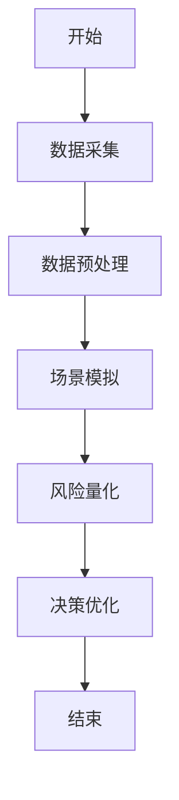
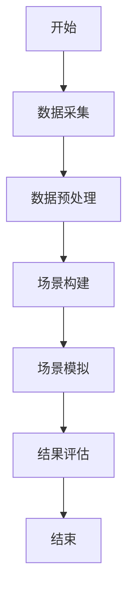
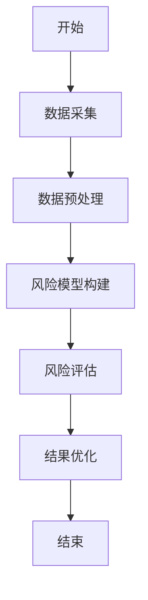
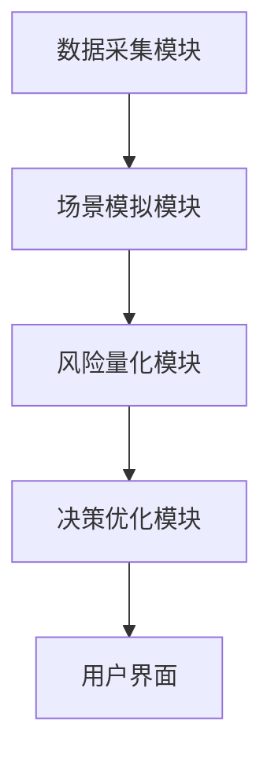
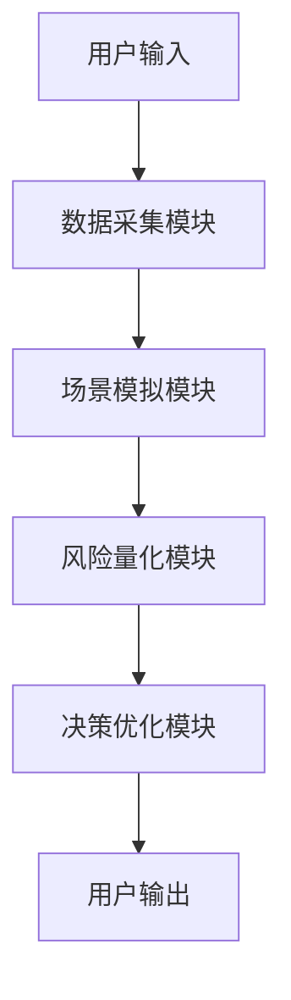

                 


# 构建智能企业决策支持系统：多维场景模拟与风险量化

**关键词**：智能决策支持系统、多维场景模拟、风险量化、企业决策、算法原理

**摘要**：  
随着企业决策的复杂性和不确定性不断增加，传统的决策支持系统已难以满足现代企业的需求。本文深入探讨了构建智能企业决策支持系统的必要性，重点分析了多维场景模拟与风险量化的核心算法及其应用场景。通过系统化的架构设计和实际案例分析，展示了如何利用先进的算法和技术构建高效、可靠的智能决策支持系统，帮助企业实现科学化、数据化的决策过程。

---

## 第1章：问题背景与目标

### 1.1 问题背景介绍  
企业在复杂的市场环境中面临着诸多决策挑战，例如市场需求波动、供应链风险、竞争策略选择等。传统的决策方式依赖于经验判断和简单数据分析，难以应对日益复杂的场景和风险。  

#### 1.1.1 企业决策面临的挑战  
- 数据量爆炸性增长，传统方法难以处理复杂场景。  
- 决策的实时性和准确性要求越来越高。  
- 风险因素的多样性和不确定性增加决策难度。  

#### 1.1.2 当前决策支持系统的局限性  
- 数据分析能力有限，难以应对多维场景。  
- 风险量化方法单一，无法覆盖复杂场景。  
- 缺乏智能化的模拟和预测能力。  

#### 1.1.3 智能化决策支持的必要性  
- 利用人工智能和大数据技术提升决策能力。  
- 实现多维场景模拟，提前预判风险。  
- 为企业提供科学化、数据化的决策支持。  

### 1.2 问题描述与目标  
智能企业决策支持系统的构建目标是通过多维场景模拟和风险量化，帮助企业做出高效、可靠的决策。  

#### 1.2.1 多维场景模拟的需求  
- 模拟不同市场、政策、技术等多维因素对决策的影响。  
- 提供多种场景下的决策方案，优化企业资源配置。  

#### 1.2.2 风险量化的核心目标  
- 量化不同场景下的风险程度，制定风险应对策略。  
- 通过数据驱动的方法，提升风险预测的准确性。  

#### 1.2.3 系统构建的边界与外延  
- 系统边界：聚焦于企业内部决策支持，不涉及外部市场干预。  
- 系统外延：可扩展至供应链、客户关系等更广泛的应用场景。  

### 1.3 核心概念与系统结构  
#### 1.3.1 智能企业决策支持系统的定义  
智能企业决策支持系统（Intelligent Enterprise Decision Support System，IEDSS）是一种基于人工智能、大数据分析和多维场景模拟的决策支持系统，旨在通过数据驱动的方法，为企业提供科学化的决策支持。  

#### 1.3.2 系统的核心要素与组成  
- 数据采集与处理模块：负责收集、清洗和预处理数据。  
- 场景模拟模块：基于多维数据进行场景模拟，生成多种决策方案。  
- 风险量化模块：对不同场景下的风险进行量化分析，提供风险评估结果。  
- 决策优化模块：根据风险评估结果，优化决策方案，输出最优决策建议。  

#### 1.3.3 系统架构的层次划分  
1. 数据层：包括数据采集、存储和管理。  
2. 计算层：包括场景模拟和风险量化的核心算法。  
3. 应用层：包括用户界面、决策报告和反馈机制。  

---

## 第2章：核心概念与联系

### 2.1 智能决策支持系统的原理  
智能决策支持系统通过数据驱动的方法，利用多维场景模拟和风险量化技术，帮助企业做出科学化的决策。  

#### 2.1.1 数据驱动的决策方法  
- 数据是决策的基础，通过数据分析提取有价值的信息。  
- 利用机器学习算法对数据进行建模和预测，为决策提供支持。  

#### 2.1.2 多维场景模拟的实现机制  
- 通过构建多维模型，模拟不同场景下的企业决策结果。  
- 利用蒙特卡洛模拟等方法，评估不同场景下的风险和收益。  

#### 2.1.3 风险量化的核心算法  
- 利用概率论和统计学方法，量化不同场景下的风险程度。  
- 通过贝叶斯网络等方法，建立风险量化模型，预测风险发生概率。  

### 2.2 核心概念对比分析  
通过对比分析，明确多维场景模拟和风险量化的核心区别与联系。  

#### 2.2.1 数据特征与模型特征对比  
| 数据特征         | 模型特征         |
|------------------|------------------|
| 数据量大         | 模型复杂度高     |
| 数据维度多样     | 模型适用性广     |
| 数据动态变化     | 模型可扩展性强   |

#### 2.2.2 不同场景模拟方法的优缺点  
| 模拟方法         | 优点             | 缺点             |
|------------------|------------------|------------------|
| 蒙特卡洛模拟     | 高度随机性，适合复杂场景 | 计算成本高       |
| 确定性模拟       | 计算成本低，结果确定 | 适用于简单场景   |

#### 2.2.3 风险量化指标的对比分析  
| 风险指标         | 计算方法         | 应用场景         |
|------------------|------------------|------------------|
| 风险值（Risk Value） | 基于概率分布计算 | 全局风险评估     |
| 风险概率（Risk Probability） | 基于历史数据统计 | 局部风险评估     |

### 2.3 实体关系图与流程图  
#### 2.3.1 系统实体关系图（ER图）  
```mermaid
erd
  企业管理层
    name: 企业管理层
    role: 决策者
    participates_in: 决策支持系统

  决策支持系统
    name: 决策支持系统
    has: 数据采集模块
    has: 场景模拟模块
    has: 风险量化模块

  数据源
    name: 数据源
    participates_in: 数据采集模块
```

#### 2.3.2 多维场景模拟流程图  


---

## 第3章：多维场景模拟算法原理

### 3.1 算法原理概述  
多维场景模拟是通过构建多维模型，模拟不同场景下的企业决策结果。  

#### 3.1.1 多维场景模拟的定义  
多维场景模拟是一种基于多维数据的场景构建方法，通过模拟不同维度的变化，评估其对企业决策的影响。  

#### 3.1.2 多维场景模拟的关键步骤  
1. 数据采集与预处理：收集多维数据，进行清洗和标准化。  
2. 场景构建：基于数据构建多维模型，模拟不同场景。  
3. 场景评估：评估每个场景下的决策结果，输出模拟报告。  

#### 3.1.3 算法的数学模型与公式  
$$ \text{场景模拟结果} = f(x_1, x_2, ..., x_n) $$  
其中，$x_i$ 表示不同维度的变量，$f$ 是场景模拟函数。  

### 3.2 算法实现细节  
#### 3.2.1 数据预处理与特征提取  
- 数据清洗：去除重复数据和异常值。  
- 特征提取：从数据中提取关键特征，用于场景模拟。  

#### 3.2.2 场景模拟的实现步骤  
1. 构建多维模型：基于特征数据构建场景模拟模型。  
2. 模拟不同场景：通过输入不同的变量值，模拟多个场景。  
3. 评估场景结果：计算每个场景下的决策结果，输出模拟报告。  

#### 3.2.3 算法优化与调优方法  
- 参数优化：通过调整模型参数，提高模拟精度。  
- 模型选择：根据数据特点选择合适的模拟方法。  

### 3.3 算法流程图  


---

## 第4章：风险量化算法原理

### 4.1 风险量化概述  
风险量化是通过数据驱动的方法，量化不同场景下的风险程度。  

#### 4.1.1 风险量化的核心目标  
- 量化不同场景下的风险程度。  
- 提供风险评估结果，支持决策优化。  

#### 4.1.2 风险量化的关键步骤  
1. 数据采集与预处理：收集相关数据，进行清洗和标准化。  
2. 风险模型构建：基于数据构建风险量化模型。  
3. 风险评估：计算每个场景下的风险值，输出风险评估报告。  

#### 4.1.3 算法的数学模型与公式  
$$ \text{风险值} = g(y_1, y_2, ..., y_m) $$  
其中，$y_i$ 表示不同维度的变量，$g$ 是风险量化函数。  

### 4.2 风险量化算法实现细节  
#### 4.2.1 数据预处理与特征提取  
- 数据清洗：去除异常值和重复数据。  
- 特征提取：从数据中提取关键特征，用于风险量化。  

#### 4.2.2 风险模型构建  
- 概率分布模型：利用贝叶斯网络等方法，建立风险量化模型。  
- 风险指标计算：根据模型输出结果，计算风险值。  

#### 4.2.3 风险评估与优化  
- 风险评估：计算每个场景下的风险值，输出风险评估报告。  
- 模型优化：通过调整模型参数，提高风险评估的准确性。  

### 4.3 算法流程图  


---

## 第5章：系统分析与架构设计

### 5.1 系统分析  
#### 5.1.1 问题场景介绍  
- 企业面临的市场波动、供应链风险等复杂场景。  
- 多维场景模拟和风险量化的需求。  

#### 5.1.2 系统功能设计  
- 数据采集与处理：负责数据的采集、清洗和预处理。  
- 场景模拟：基于多维数据进行场景模拟，生成多种决策方案。  
- 风险量化：对不同场景下的风险进行量化分析，提供风险评估结果。  
- 决策优化：根据风险评估结果，优化决策方案，输出最优决策建议。  

#### 5.1.3 系统架构设计  
1. 数据采集模块：负责数据的采集和预处理。  
2. 场景模拟模块：基于多维数据进行场景模拟。  
3. 风险量化模块：对不同场景下的风险进行量化分析。  
4. 决策优化模块：根据风险评估结果，优化决策方案。  

### 5.2 系统架构设计  
#### 5.2.1 系统架构图  


#### 5.2.2 接口设计  
- 数据接口：与数据源进行交互，采集数据。  
- 用户接口：与用户进行交互，输出决策建议。  

#### 5.2.3 交互流程图  


---

## 第6章：项目实战

### 6.1 环境安装  
#### 6.1.1 安装Python  
```bash
python --version
```

#### 6.1.2 安装相关库  
```bash
pip install numpy pandas scikit-learn
```

### 6.2 核心代码实现  
#### 6.2.1 数据处理代码  
```python
import numpy as np
import pandas as pd

# 数据加载
data = pd.read_csv('data.csv')

# 数据清洗
data.dropna(inplace=True)
data = data[~data.duplicated()]
```

#### 6.2.2 模型训练代码  
```python
from sklearn.tree import DecisionTreeRegressor

# 模型训练
model = DecisionTreeRegressor()
model.fit(X_train, y_train)
```

#### 6.2.3 风险量化代码  
```python
import numpy as np

# 风险量化函数
def calculate_risk(probabilities):
    return np.mean(probabilities)

# 计算风险值
risk = calculate_risk(probabilities)
```

### 6.3 实际案例分析  
#### 6.3.1 案例背景  
- 某企业面临市场需求波动的风险，需要通过多维场景模拟和风险量化来制定最优决策。  

#### 6.3.2 数据分析与模拟  
- 通过数据模拟，生成多个场景，评估每个场景下的风险和收益。  

#### 6.3.3 结果解读  
- 根据模拟结果，优化决策方案，输出最优决策建议。  

### 6.4 项目小结  
通过实际案例分析，验证了智能企业决策支持系统的有效性和实用性。  

---

## 第7章：最佳实践与小结

### 7.1 最佳实践  
- 数据质量是关键，确保数据的准确性和完整性。  
- 模型选择要结合实际场景，选择合适的算法。  
- 系统设计要注重模块化和可扩展性。  

### 7.2 小结  
本文详细探讨了智能企业决策支持系统的构建过程，重点分析了多维场景模拟和风险量化的核心算法及其应用场景。通过实际案例分析，展示了如何利用先进的算法和技术构建高效、可靠的智能决策支持系统，帮助企业实现科学化、数据化的决策过程。  

### 7.3 注意事项  
- 数据隐私和安全问题需高度重视。  
- 系统的可解释性和透明度需在设计阶段考虑。  

### 7.4 拓展阅读  
- 《机器学习实战》  
- 《数据驱动的决策管理》  

---

**总结**  
通过本文的系统化讲解和实际案例分析，读者可以深入了解智能企业决策支持系统的构建方法和应用场景，掌握多维场景模拟和风险量化的核心算法，为企业决策提供科学化的支持。

