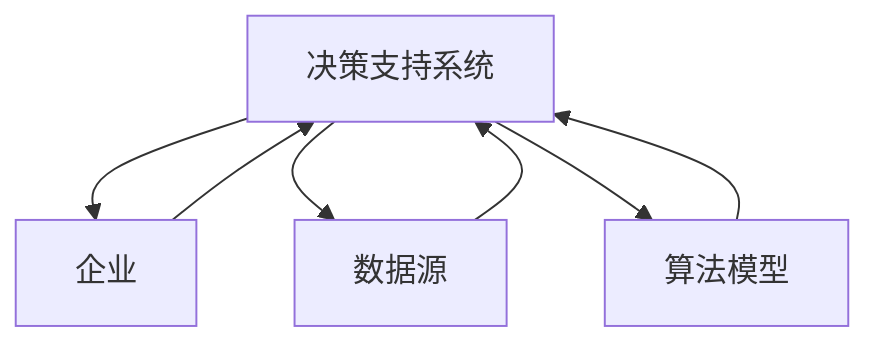
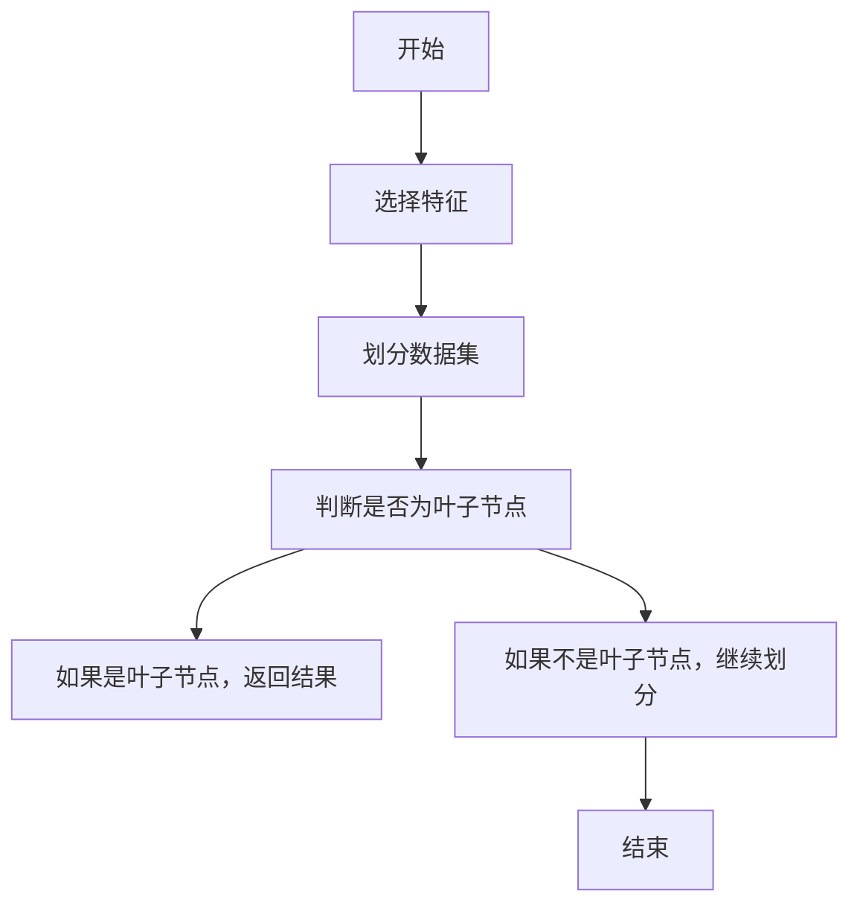
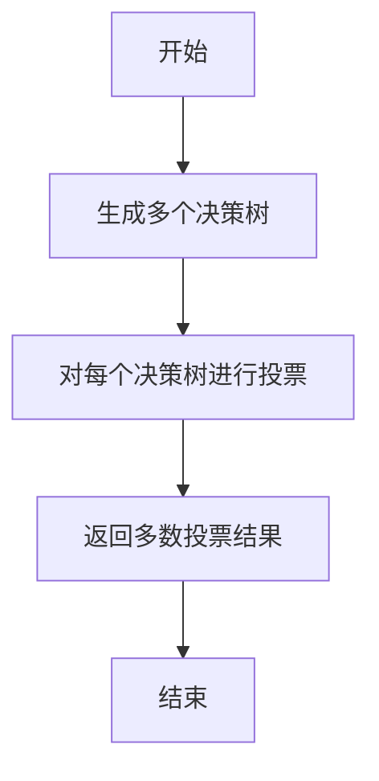
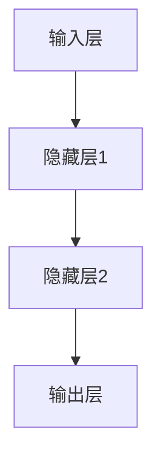
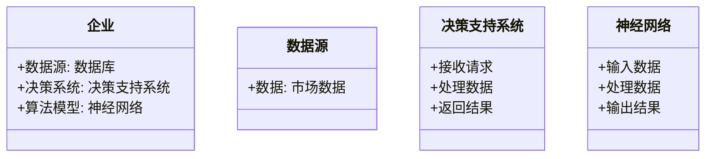
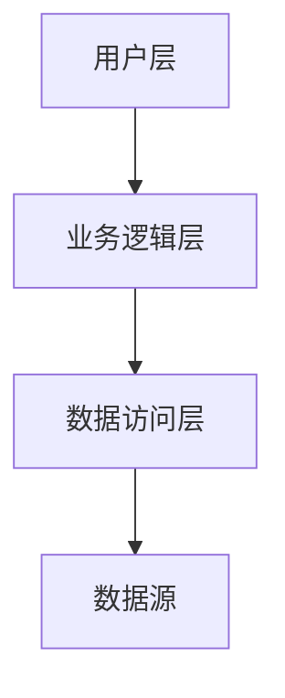
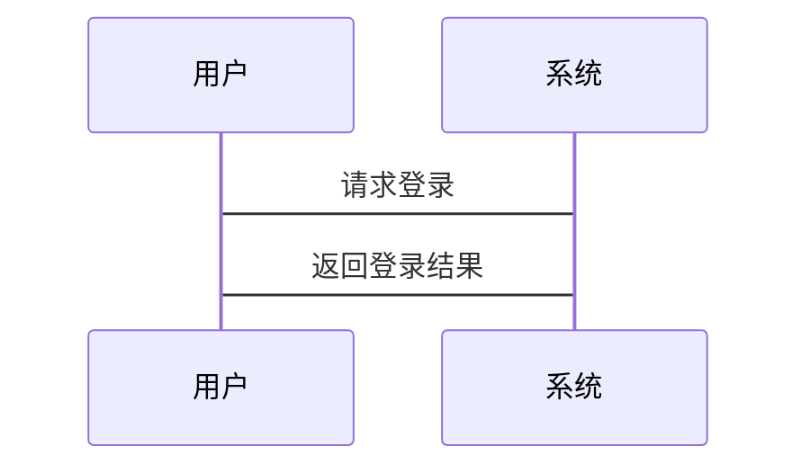

                 


# 构建智能企业决策支持系统：多维度情景模拟与风险评估

## 关键词：智能决策支持系统、情景模拟、风险评估、企业决策、人工智能

## 摘要：本文探讨如何构建智能企业决策支持系统，结合多维度情景模拟和风险评估技术，通过数据分析和人工智能算法，为企业提供科学、可靠的决策支持。文章详细分析了系统架构、核心算法及项目实现，展示了如何通过技术手段提升企业决策效率和准确性。

---

# 第1章: 智能企业决策支持系统的背景与问题描述

## 1.1 问题背景

### 1.1.1 传统企业决策的局限性
传统的决策方法依赖于经验判断和少量数据，存在主观性高、缺乏系统性和实时性的问题。企业往往难以快速响应市场变化，导致决策失误的风险增加。

### 1.1.2 智能化决策支持的需求
随着数据量的爆炸式增长和人工智能技术的发展，企业需要利用数据驱动的方法，通过智能化工具提高决策的准确性和效率。

### 1.1.3 多维度情景模拟的必要性
多维度情景模拟能够帮助企业预测不同决策方案下的各种结果，从而选择最优策略，降低风险。

## 1.2 问题描述

### 1.2.1 企业决策中的关键问题
- 数据分散，难以整合和分析。
- 缺乏实时反馈机制，决策滞后。
- 风险评估不全面，难以覆盖多种可能性。

### 1.2.2 多维度情景模拟的核心目标
- 提供多种决策方案的模拟结果。
- 分析各方案的优缺点及其潜在影响。

### 1.2.3 风险评估在决策中的作用
- 量化风险，提供决策支持。
- 帮助企业制定风险管理策略。

## 1.3 问题解决方法

### 1.3.1 数据驱动的决策支持
通过收集、处理和分析数据，为企业提供基于数据的决策依据。

### 1.3.2 情景模拟的实现路径
- 数据建模：构建数学模型模拟不同情景。
- 算法选择：使用机器学习算法预测结果。
- 可视化展示：直观呈现模拟结果。

### 1.3.3 风险评估的技术手段
- 统计分析：评估数据的分布和相关性。
- 机器学习：训练风险预测模型。
- 情景分析：模拟不同风险情况下的企业表现。

## 1.4 系统的边界与外延

### 1.4.1 系统边界定义
系统仅关注决策支持过程，不涉及具体业务操作。

### 1.4.2 系统外延与扩展
系统可以与其他企业系统（如ERP）集成，扩展数据来源和应用场景。

### 1.4.3 系统与其他模块的交互
- 与数据源交互：获取实时数据。
- 与用户交互：接收决策请求并返回结果。

---

# 第2章: 核心概念与联系

## 2.1 核心概念原理

### 2.1.1 数据驱动的决策支持
通过数据分析技术，从大量数据中提取有用信息，辅助决策。

### 2.1.2 多维度情景模拟
利用数学模型和算法，模拟不同决策方案下的各种结果。

### 2.1.3 风险评估方法
通过统计分析和机器学习，评估不同决策方案的风险程度。

## 2.2 核心概念对比

### 表2-1: 核心概念对比

| 属性           | 数据驱动决策支持       | 多维度情景模拟       | 风险评估方法       |
|----------------|-----------------------|--------------------|-------------------|
| 核心目标       | 提供数据支持           | 预测多种结果         | 评估风险           |
| 技术手段       | 数据分析、可视化       | 数学建模、算法模拟   | 统计分析、机器学习 |
| 应用场景       | 日常运营决策           | 战略规划、投资决策   | 风险管理           |
| 优势           | 提高决策透明度         | 降低决策风险         | 减少损失           |

## 2.3 实体关系图



---

# 第3章: 算法原理

## 3.1 算法原理概述

### 3.1.1 决策树算法
决策树是一种基于树状结构的分类方法，适用于多维度数据的分析。

#### 决策树流程图



#### 决策树数学模型

决策树的分类规则可以用以下公式表示：
$$
f(x) = \arg\min_{c} \sum_{i=1}^{n} (y_i - c)^2
$$

### 3.1.2 随机森林算法
随机森林是一种基于决策树的集成学习算法，通过组合多个决策树的结果来提高准确性。

#### 随机森林流程图



#### 随机森林数学模型

随机森林的预测结果可以用以下公式表示：
$$
f(x) = \arg\max_{c} \sum_{i=1}^{n} \text{投票数}(c)
$$`

### 3.1.3 神经网络算法
神经网络是一种基于人工神经元的深度学习算法，适用于复杂非线性关系的建模。

#### 神经网络流程图



#### 神经网络数学模型

神经网络的输出可以用以下公式表示：
$$
y = \sum_{i=1}^{n} w_i x_i + b
$$

## 3.2 算法实现

### 3.2.1 Python代码实现

```python
import numpy as np
from sklearn.tree import DecisionTreeClassifier
from sklearn.ensemble import RandomForestClassifier
from sklearn.neural_networks import MLPClassifier

# 决策树
dt = DecisionTreeClassifier()
dt.fit(X_train, y_train)

# 随机森林
rf = RandomForestClassifier()
rf.fit(X_train, y_train)

# 神经网络
nn = MLPClassifier()
nn.fit(X_train, y_train)
```

---

# 第4章: 系统分析与架构设计

## 4.1 系统分析

### 4.1.1 问题场景
企业需要在投资决策中考虑市场风险、政策变化等多种因素。

### 4.1.2 系统功能设计

#### 领域模型类图



## 4.2 系统架构设计

### 4.2.1 分层架构



## 4.3 接口设计

### 4.3.1 用户登录接口



---

# 第5章: 项目实战

## 5.1 环境安装

### 5.1.1 安装Python
```bash
pip install Python
```

### 5.1.2 安装库
```bash
pip install numpy pandas scikit-learn
```

## 5.2 核心代码实现

### 5.2.1 数据预处理

```python
import pandas as pd

data = pd.read_csv('data.csv')
data.dropna(inplace=True)
```

### 5.2.2 模型训练

```python
from sklearn.model_selection import train_test_split
from sklearn.ensemble import RandomForestClassifier

X_train, X_test, y_train, y_test = train_test_split(data.drop('label', axis=1), data['label'])
model = RandomForestClassifier()
model.fit(X_train, y_train)
```

### 5.2.3 结果展示

```python
import matplotlib.pyplot as plt

importances = model.feature_importances_
plt.bar(range(len(importances)), importances)
plt.show()
```

---

# 第6章: 最佳实践、小结和注意事项

## 6.1 最佳实践

### 6.1.1 数据质量管理
确保数据的准确性和完整性。

### 6.1.2 模型可解释性
选择适合业务需求的模型，避免过于复杂的模型。

## 6.2 小结
本文详细介绍了构建智能企业决策支持系统的方法，包括背景分析、算法实现和项目实战。

## 6.3 注意事项

### 6.3.1 数据隐私
注意保护企业的数据隐私。

### 6.3.2 模型维护
定期更新模型，保持其准确性。

## 6.4 拓展阅读
推荐阅读《机器学习实战》和《数据挖掘导论》。

---

# 附录: 代码汇总

```python
import numpy as np
import pandas as pd
from sklearn.tree import DecisionTreeClassifier
from sklearn.ensemble import RandomForestClassifier
from sklearn.neural_networks import MLPClassifier
from sklearn.model_selection import train_test_split
import matplotlib.pyplot as plt

# 决策树
def decision_tree(X_train, y_train):
    dt = DecisionTreeClassifier()
    dt.fit(X_train, y_train)
    return dt

# 随机森林
def random_forest(X_train, y_train):
    rf = RandomForestClassifier()
    rf.fit(X_train, y_train)
    return rf

# 神经网络
def neural_network(X_train, y_train):
    nn = MLPClassifier()
    nn.fit(X_train, y_train)
    return nn

# 数据可视化
def visualize_importances(model):
    importances = model.feature_importances_
    plt.bar(range(len(importances)), importances)
    plt.show()
```

---

通过以上步骤，我们详细构建了一个智能企业决策支持系统，涵盖了从理论到实践的各个方面，为企业的决策提供了有力的技术支持。

