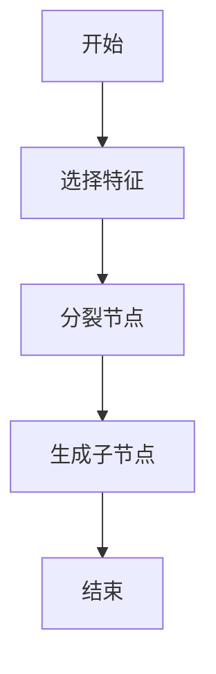
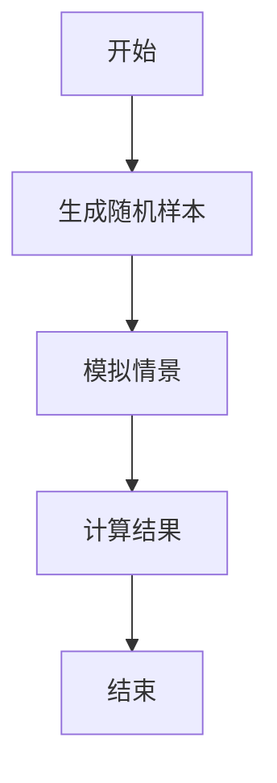
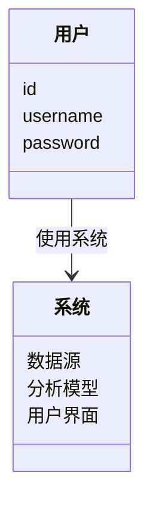

                 


# 构建智能企业决策模拟系统：多维度情景分析与风险评估

**关键词**：智能企业决策模拟系统、多维度情景分析、风险评估、决策树算法、蒙特卡洛模拟、系统架构

**摘要**：本文详细探讨了构建智能企业决策模拟系统的方法，重点分析了多维度情景分析与风险评估的核心概念、算法原理、系统架构及实际应用。通过案例分析和代码实现，帮助读者理解如何利用这些技术提升企业决策效率和准确性。

---

# 第1章: 问题背景与核心概念

## 1.1 问题背景

### 1.1.1 传统企业决策的局限性
传统企业决策依赖于经验判断和简单的数据分析，存在以下问题：
- **信息不全**：决策基于有限数据，可能导致错误判断。
- **反应滞后**：依赖人工分析，难以快速响应变化。
- **主观性强**：决策受主观因素影响，缺乏客观性。

### 1.1.2 数字化转型对企业决策的新要求
随着企业数字化转型，决策需要：
- **实时性**：快速响应市场变化。
- **准确性**：依赖数据驱动的决策。
- **智能化**：利用AI和大数据技术提升效率。

### 1.1.3 多维度情景分析与风险评估的必要性
多维度情景分析和风险评估帮助企业：
- **全面评估**：考虑多种可能情况。
- **风险预判**：提前识别潜在风险。

## 1.2 核心概念与定义

### 1.2.1 智能企业决策模拟系统
智能企业决策模拟系统是利用AI和大数据技术，模拟企业决策过程的系统。

### 1.2.2 多维度情景分析
从多个维度（如市场、技术）分析问题，生成多种情景。

### 1.2.3 风险评估
通过模型识别和量化潜在风险。

## 1.3 核心要素与系统架构

### 1.3.1 系统的核心要素组成
- **数据源**：收集数据。
- **分析模型**：处理数据。
- **用户界面**：展示结果。

### 1.3.2 系统架构的边界与外延
系统架构包括数据处理、分析、展示模块。

### 1.3.3 核心概念的结构化模型
使用ER图展示系统核心实体关系。

---

# 第2章: 多维度情景分析与风险评估的核心概念

## 2.1 多维度情景分析的原理

### 2.1.1 多维度分析的定义与特点
多维度分析从多个维度评估问题，提供全面视角。

### 2.1.2 不同维度的分析方法对比
维度包括市场、技术、财务等，采用不同的分析方法。

### 2.1.3 维度之间的关系与影响
各维度相互影响，共同作用于决策结果。

## 2.2 风险评估的核心原理

### 2.2.1 风险评估的基本概念
通过模型识别和量化潜在风险。

### 2.2.2 风险评估的关键步骤
包括数据收集、模型构建、结果分析。

### 2.2.3 风险评估的数学模型
使用概率论和统计学方法进行建模。

## 2.3 核心概念的ER实体关系图

```mermaid
er
actor: 用户
system: 智能决策模拟系统
dimension: 维度
scenario: 情景
risk: 风险
```

---

# 第3章: 多维度情景分析的算法原理

## 3.1 算法原理概述

### 3.1.1 决策树算法
决策树是一种常用的分类和回归方法。

#### 决策树算法流程图



#### Python代码示例

```python
from sklearn.tree import DecisionTreeClassifier
model = DecisionTreeClassifier()
model.fit(X_train, y_train)
```

### 3.1.2 蒙特卡洛模拟
通过随机采样模拟多种情景。

#### 蒙特卡洛模拟流程图



---

# 第4章: 系统分析与架构设计

## 4.1 系统架构设计

### 4.1.1 领域模型



### 4.1.2 系统架构图


---

# 第5章: 项目实战

## 5.1 案例分析

### 5.1.1 环境安装
安装Python和相关库。

### 5.1.2 核心代码实现

```python
import numpy as np
from sklearn.tree import DecisionTreeClassifier

# 示例数据
X = np.array([[2, 3], [5, 6]])
y = np.array([0, 1])

model = DecisionTreeClassifier()
model.fit(X, y)
```

### 5.1.3 案例分析

使用决策树模型分析市场趋势，生成决策报告。

---

# 第6章: 最佳实践

## 6.1 小结
系统结合多维度分析和风险评估，提升决策能力。

## 6.2 注意事项
数据质量和模型选择影响结果准确性。

## 6.3 拓展阅读
推荐相关书籍和论文，深入学习。

---

通过以上步骤，构建了完整的智能企业决策模拟系统，帮助企业在复杂环境中做出明智决策。

