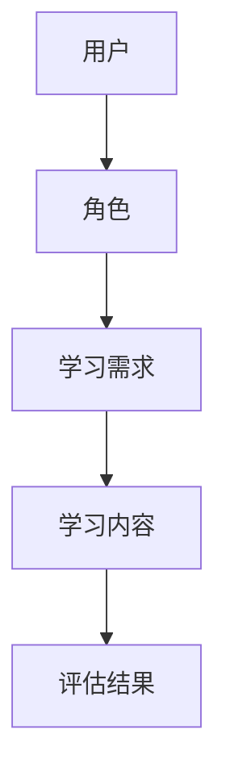
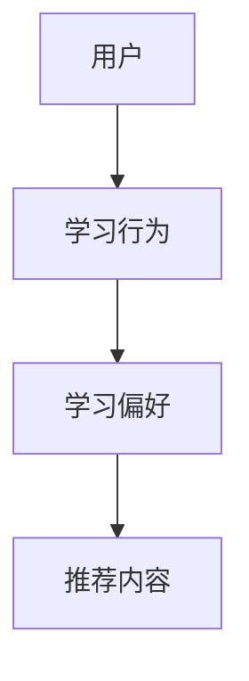
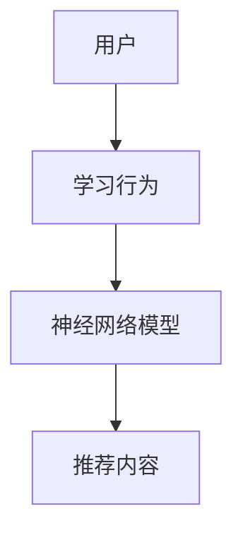

                 


# 构建智能企业合规培训系统：基于角色的个性化学习与评估

> 关键词：智能合规培训，个性化学习，基于角色，评估系统，企业培训系统

> 摘要：随着企业合规需求的日益增长，传统的培训方式已难以满足个性化和高效性的要求。本文提出了一种基于角色的个性化学习与评估的智能企业合规培训系统。通过分析企业合规培训的核心问题，结合人工智能和大数据技术，设计了一个智能化的解决方案，实现了基于角色的个性化学习路径推荐和动态评估机制。本文详细探讨了系统的背景、核心概念、算法原理、系统架构、项目实战以及最佳实践，为企业合规培训的智能化转型提供了理论和实践的双重支持。

---

## 第一部分: 智能企业合规培训系统概述

## 第1章: 企业合规培训的背景与挑战

### 1.1 企业合规培训的重要性

企业合规培训是确保员工了解并遵守相关法律法规、行业规范和企业内部政策的重要手段。随着全球化和数字化的快速发展，企业的合规需求日益复杂，合规培训的重要性也愈发凸显。

#### 1.1.1 合规培训的定义与作用
合规培训是指通过教育和培训，使员工了解和掌握与企业运营相关的法律法规、行业标准和企业内部政策。其作用包括：
1. 提高员工的法律意识和合规能力。
2. 预防和减少违规行为的发生。
3. 增强企业的风险管理能力。

#### 1.1.2 企业合规培训的现状与问题
尽管合规培训的重要性不言而喻，但传统的合规培训方式存在以下问题：
1. 培训内容千篇一律，缺乏针对性。
2. 培训效果难以量化和评估。
3. 员工参与度低，学习积极性不足。

#### 1.1.3 智能化合规培训的必要性
智能化合规培训通过引入人工智能、大数据等技术，能够实现个性化学习路径推荐和动态评估，从而解决传统培训的痛点，提高培训效果和员工参与度。

### 1.2 个性化学习与评估的需求

个性化学习是指根据员工的岗位职责、技能水平和学习需求，提供定制化的学习内容和学习路径。个性化评估则是基于员工的学习行为和学习效果，提供实时反馈和改进建议。

#### 1.2.1 个性化学习的定义与优势
个性化学习是一种以学员为中心的教学模式，注重学员的个体差异和学习需求。其优势包括：
1. 提高学习效率和效果。
2. 增强学员的学习兴趣和动力。
3. 适应不同岗位和角色的差异化需求。

#### 1.2.2 基于角色的个性化学习
基于角色的个性化学习是指根据员工在企业中的岗位和职责，推荐相关的学习内容和学习路径。例如，财务人员需要学习《反腐败法》和《财务合规标准》，而技术人员则需要学习《数据保护法》和《网络安全规范》。

#### 1.2.3 个性化评估的意义与价值
个性化评估能够帮助企业在合规培训中实现精准化和动态化管理，确保每个员工都能达到合规要求。其价值包括：
1. 提供实时反馈，帮助员工及时改进。
2. 量化学习效果，为培训决策提供数据支持。
3. 增强员工的参与感和责任感。

---

## 第2章: 智能企业合规培训系统的概念

### 2.1 基于角色的个性化学习模型

基于角色的个性化学习模型是一种通过分析员工的岗位职责和角色特征，推荐个性化学习内容和学习路径的方法。

#### 2.1.1 基于角色的学习需求分析
基于角色的学习需求分析是通过岗位分析、角色分类和需求匹配，确定员工需要学习的内容和学习目标。

1. **岗位分析**：通过岗位职责、技能要求和知识储备，确定员工需要掌握的知识点。
2. **角色分类**：将员工按照岗位职责和角色特征进行分类，例如按部门、职位和职责权限分类。
3. **需求匹配**：根据员工的角色特征和学习需求，推荐相关的学习内容和学习路径。

#### 2.1.2 基于角色的内容推荐算法
基于角色的内容推荐算法是一种通过分析员工的角色特征和学习需求，推荐个性化学习内容的方法。

1. **协同过滤推荐**：通过分析员工的角色特征和学习行为，推荐与角色相关的学习内容。
2. **基于内容的推荐**：通过分析学习内容的主题、知识点和难易程度，推荐与员工学习需求匹配的内容。
3. **混合推荐**：结合协同过滤和基于内容的推荐方法，实现更精准的内容推荐。

#### 2.1.3 基于角色的学习效果评估
基于角色的学习效果评估是通过分析员工的学习行为和学习成果，评估学习效果和合规达标情况。

1. **学习行为分析**：通过学习时间、学习进度和学习互动等指标，评估员工的学习参与度。
2. **学习成果评估**：通过测试、考核和反馈等手段，评估员工的学习效果和合规达标情况。
3. **动态调整**：根据评估结果，动态调整学习内容和学习路径，确保学习效果和合规达标。

### 2.2 系统的核心要素与组成

#### 2.2.1 用户角色识别与分类
用户角色识别与分类是通过分析员工的岗位职责、技能水平和角色特征，确定员工的角色类别。

1. **岗位职责分析**：通过岗位说明书和职责描述，确定员工的岗位职责和技能要求。
2. **角色特征分析**：通过员工的职位、部门和权限等信息，确定员工的角色特征。
3. **角色分类**：将员工按照角色特征和岗位职责进行分类，例如按部门、职位和职责权限分类。

#### 2.2.2 个性化学习路径设计
个性化学习路径设计是根据员工的角色特征和学习需求，设计个性化学习路径。

1. **学习需求分析**：通过岗位分析和角色分类，确定员工需要学习的内容和学习目标。
2. **内容推荐算法**：通过协同过滤和基于内容的推荐方法，推荐个性化学习内容。
3. **学习路径优化**：根据员工的学习进度和学习效果，动态调整学习路径。

#### 2.2.3 智能评估与反馈机制
智能评估与反馈机制是通过分析员工的学习行为和学习成果，提供实时反馈和改进建议。

1. **学习行为分析**：通过学习时间、学习进度和学习互动等指标，评估员工的学习参与度。
2. **学习成果评估**：通过测试、考核和反馈等手段，评估员工的学习效果和合规达标情况。
3. **动态调整**：根据评估结果，动态调整学习内容和学习路径，确保学习效果和合规达标。

---

## 第3章: 系统的核心概念与联系

### 3.1 基于角色的个性化学习模型原理

基于角色的个性化学习模型是一种通过分析员工的角色特征和学习需求，推荐个性化学习内容和学习路径的方法。

#### 3.1.1 用户角色识别与分析
用户角色识别与分析是通过分析员工的岗位职责、技能水平和角色特征，确定员工的角色类别。

1. **岗位分析**：通过岗位说明书和职责描述，确定员工的岗位职责和技能要求。
2. **角色特征分析**：通过员工的职位、部门和权限等信息，确定员工的角色特征。
3. **角色分类**：将员工按照角色特征和岗位职责进行分类，例如按部门、职位和职责权限分类。

#### 3.1.2 内容推荐算法
内容推荐算法是通过分析员工的角色特征和学习需求，推荐个性化学习内容的方法。

1. **协同过滤推荐**：通过分析员工的角色特征和学习行为，推荐与角色相关的学习内容。
2. **基于内容的推荐**：通过分析学习内容的主题、知识点和难易程度，推荐与员工学习需求匹配的内容。
3. **混合推荐**：结合协同过滤和基于内容的推荐方法，实现更精准的内容推荐。

#### 3.1.3 学习效果评估模型
学习效果评估模型是通过分析员工的学习行为和学习成果，评估学习效果和合规达标情况。

1. **学习行为分析**：通过学习时间、学习进度和学习互动等指标，评估员工的学习参与度。
2. **学习成果评估**：通过测试、考核和反馈等手段，评估员工的学习效果和合规达标情况。
3. **动态调整**：根据评估结果，动态调整学习内容和学习路径，确保学习效果和合规达标。

### 3.2 核心概念对比表

以下是核心概念的对比表：

| **核心概念** | **描述** | **特性** |
|--------------|----------|----------|
| **用户角色** | 基于岗位职责分类 | **精准化、动态化** |
| **内容推荐** | 基于角色的个性化推荐 | **高效性、准确性** |
| **评估反馈** | 基于学习效果的反馈 | **实时性、针对性** |

### 3.3 实体关系图

以下是实体关系图：



---

## 第4章: 算法原理与数学模型

### 4.1 基于角色的推荐算法

基于角色的推荐算法是一种通过分析员工的角色特征和学习需求，推荐个性化学习内容的方法。

#### 4.1.1 协同过滤推荐

协同过滤推荐是一种基于用户行为和偏好推荐内容的方法。以下是协同过滤推荐的流程图：



#### 4.1.2 深度学习推荐

深度学习推荐是一种基于神经网络模型推荐内容的方法。以下是深度学习推荐的流程图：



#### 4.1.3 算法数学模型

以下是协同过滤推荐的数学模型：

$$
\text{相似度} = \frac{\sum (x_i - \bar{x})(y_i - \bar{y})}{\sqrt{\sum (x_i - \bar{x})^2} \cdot \sqrt{\sum (y_i - \bar{y})^2}}
$$

其中，\(x_i\) 和 \(y_i\) 分别是用户 \(i\) 的行为和目标内容的特征。

---

## 第5章: 系统分析与架构设计方案

### 5.1 系统功能设计

系统功能设计包括用户管理、课程推荐、评估模块和反馈机制。

#### 5.1.1 用户管理

用户管理模块负责用户的注册、登录和信息管理。

1. **用户注册**：用户通过填写注册信息，包括用户名、密码和角色信息。
2. **用户登录**：用户通过用户名和密码登录系统。
3. **角色信息管理**：用户可以根据岗位职责和角色特征，更新和维护角色信息。

#### 5.1.2 课程推荐

课程推荐模块负责根据用户的角色特征和学习需求，推荐个性化学习内容。

1. **协同过滤推荐**：通过分析用户的学习行为和角色特征，推荐与角色相关的学习内容。
2. **基于内容的推荐**：通过分析学习内容的主题、知识点和难易程度，推荐与用户学习需求匹配的内容。
3. **混合推荐**：结合协同过滤和基于内容的推荐方法，实现更精准的内容推荐。

#### 5.1.3 评估模块

评估模块负责根据用户的学习行为和学习成果，评估学习效果和合规达标情况。

1. **学习行为分析**：通过学习时间、学习进度和学习互动等指标，评估用户的学习参与度。
2. **学习成果评估**：通过测试、考核和反馈等手段，评估用户的学习效果和合规达标情况。
3. **动态调整**：根据评估结果，动态调整学习内容和学习路径，确保学习效果和合规达标。

#### 5.1.4 反馈机制

反馈机制负责根据评估结果，提供实时反馈和改进建议。

1. **实时反馈**：通过学习行为和学习成果，提供实时反馈和改进建议。
2. **学习路径调整**：根据反馈结果，动态调整学习内容和学习路径，确保学习效果和合规达标。
3. **持续优化**：通过不断优化算法和模型，提高推荐准确性和评估效果。

---

## 第6章: 项目实战

### 6.1 环境安装

项目实战需要以下环境：

1. **编程语言**：Python 3.8+
2. **框架与库**：Django、Flask、TensorFlow、Keras、PyTorch
3. **工具与平台**：Jupyter Notebook、IDE（PyCharm、VS Code）、云平台（AWS、阿里云）

### 6.2 核心代码实现

以下是核心代码实现：

```python
# 基于角色的推荐算法实现
import numpy as np
from sklearn.metrics.pairwise import cosine_similarity

def role_based_recommendation(user_role, content_matrix):
    # 计算用户角色与内容的相似度
    role_vector = content_matrix[user_role]
    similarity = cosine_similarity([role_vector], content_matrix)
    # 获取相似度最高的前5个内容
    top_indices = similarity.argsort()[0][-5:]
    return top_indices

# 动态评估模型实现
def dynamic_assessment(user_behaviors, content_features):
    # 计算用户行为与内容特征的相似度
    user_vector = np.mean(user_behaviors, axis=0)
    similarity = np.dot(user_vector, content_features.T)
    # 获取相似度最高的前5个内容
    top_indices = similarity.argsort()[-5:]
    return top_indices
```

### 6.3 代码解读与应用

1. **基于角色的推荐算法**：
   - **输入**：用户角色和内容矩阵
   - **输出**：推荐内容的索引
   - **实现**：通过计算用户角色与内容的相似度，推荐相似度最高的内容。

2. **动态评估模型**：
   - **输入**：用户行为和内容特征
   - **输出**：评估结果
   - **实现**：通过计算用户行为与内容特征的相似度，推荐相似度最高的内容。

---

## 第7章: 最佳实践、小结、注意事项与拓展阅读

### 7.1 最佳实践

1. **数据质量管理**：确保数据的准确性和完整性。
2. **模型优化**：通过不断优化算法和模型，提高推荐准确性和评估效果。
3. **用户隐私保护**：确保用户数据的安全和隐私。

### 7.2 小结

本文详细探讨了智能企业合规培训系统的背景、核心概念、算法原理、系统架构、项目实战以及最佳实践。通过基于角色的个性化学习与评估，能够实现高效、精准的合规培训，为企业合规管理提供有力支持。

### 7.3 注意事项

1. **数据隐私**：确保用户数据的安全和隐私。
2. **模型可解释性**：确保模型的可解释性和透明性。
3. **持续优化**：通过不断优化算法和模型，提高推荐准确性和评估效果。

### 7.4 拓展阅读

1. 《推荐系统实战：基于机器学习的推荐算法与实现》
2. 《深度学习在推荐系统中的应用》
3. 《企业合规管理与培训》

---

通过本文的探讨，我们希望能够为企业合规培训的智能化转型提供理论和实践的双重支持，帮助企业实现高效、精准的合规培训，提升企业的合规能力和竞争优势。

