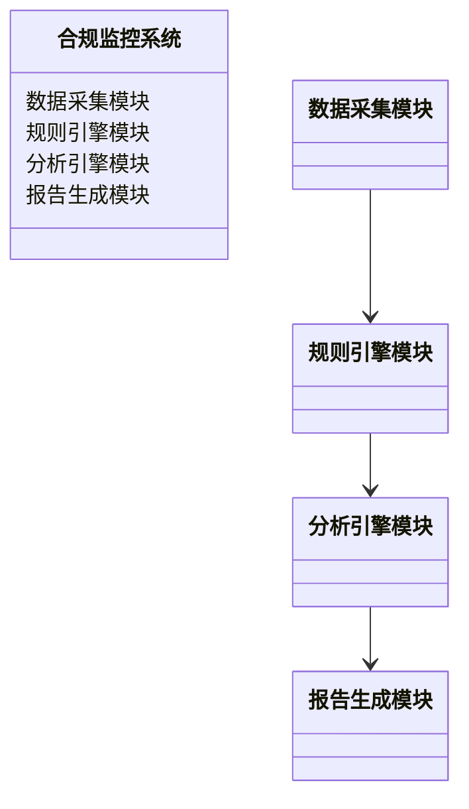
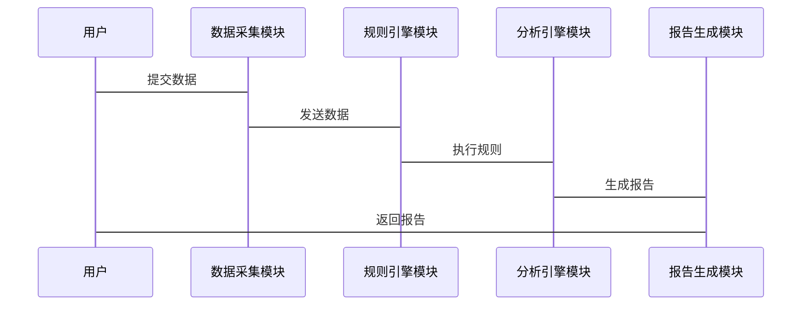

                 


# 构建智能企业合规监控系统：实时违规检测与自动报告生成

> **关键词**：企业合规监控、实时违规检测、自动报告生成、自然语言处理、机器学习、系统架构

> **摘要**：随着企业规模的扩大和合规要求的日益严格，构建一个智能的企业合规监控系统变得至关重要。本文详细探讨了如何利用实时违规检测和自动报告生成技术来构建这样的系统。通过分析系统的架构、核心技术（如自然语言处理和机器学习）以及实际案例，本文为读者提供了从理论到实践的全面指导。

---

# 引言

随着企业在全球化和数字化转型中的快速发展，合规性问题变得越来越复杂。企业需要确保其业务操作符合法律法规和行业标准，否则可能面临巨额罚款、声誉损失甚至法律纠纷。传统的合规监控方式依赖于手动检查和定期审计，效率低下且容易遗漏问题。因此，引入智能化的合规监控系统变得尤为重要。本文将详细探讨如何构建这样一个系统，从实时违规检测到自动报告生成，为企业提供高效、可靠的合规管理解决方案。

---

# 第一部分: 智能企业合规监控系统概述

## 第1章: 企业合规监控系统背景与需求

### 1.1 合规监控的定义与重要性

#### 1.1.1 企业合规监控的定义
企业合规监控是指通过技术手段实时监测企业的业务操作，确保其符合相关法律法规、行业标准和内部政策。合规监控的核心目标是识别和防止违规行为，降低企业的法律风险和财务损失。

#### 1.1.2 合规监控在企业中的重要性
合规监控不仅是企业合规管理的重要组成部分，也是企业风险管理的关键环节。通过实时监控，企业可以及时发现潜在风险，采取措施避免违规行为的发生。此外，合规监控还能提高企业的透明度和公信力，增强与合作伙伴和客户的信任关系。

#### 1.1.3 合规监控的边界与外延
合规监控的边界包括企业的内部操作、供应链管理、客户互动等方面，而外延则涉及数据隐私、反腐败、反洗钱等具体领域。合规监控的范围随着企业业务的发展而不断扩大，需要灵活调整监控策略。

---

## 第2章: 智能合规监控的核心概念

### 2.1 实时违规检测的必要性
实时违规检测能够快速识别潜在的违规行为，避免问题扩大化。例如，在金融行业，实时检测可以帮助企业及时发现和阻止洗钱行为。

### 2.2 自动报告生成的功能特点
自动报告生成能够将检测到的违规行为整理成结构化的报告，方便企业管理层和监管机构审查。报告内容包括违规行为的详细描述、涉及的人员和时间戳等信息。

### 2.3 智能合规监控系统的整体架构
智能合规监控系统通常由数据采集模块、规则引擎、分析引擎和报告生成模块组成。各模块协同工作，实现从数据采集到违规行为识别再到报告生成的完整流程。

---

## 第3章: 当前企业合规监控的挑战与机遇

### 3.1 传统合规监控的局限性
传统合规监控依赖于手动检查和定期审计，效率低下且容易遗漏问题。此外，传统方法难以应对数据量大、类型多样化的复杂场景。

### 3.2 智能化合规监控的优势
智能化合规监控利用大数据、人工智能和机器学习等技术，能够实时处理海量数据，快速识别异常行为。同时，智能系统可以通过自我学习不断优化监控策略。

### 3.3 企业合规监控的未来趋势
随着技术的进步，合规监控将更加智能化和自动化。未来的合规监控系统将能够预测潜在风险，主动采取措施，帮助企业实现预防性合规管理。

---

# 第二部分: 智能合规监控系统的核心技术

## 第4章: 数据流与规则引擎

### 4.1 数据流的处理流程

#### 4.1.1 数据采集与预处理
数据采集模块负责从企业内部系统（如ERP、CRM）和外部数据源（如社交媒体）获取数据。预处理步骤包括数据清洗、格式转换和去重。

#### 4.1.2 数据特征提取
通过自然语言处理（NLP）和模式识别技术，从文本、图像等数据中提取关键特征，例如关键词、主题标签等。

#### 4.1.3 数据存储与管理
数据存储在分布式数据库中，采用结构化存储和非结构化存储相结合的方式，便于后续分析和检索。

### 4.2 规则引擎的工作原理

#### 4.2.1 规则定义与配置
规则引擎通过预定义的规则和条件，对数据进行过滤和匹配。规则可以基于关键词、模式匹配或上下文信息。

#### 4.2.2 规则匹配与执行
规则引擎接收到数据后，根据预设的规则进行匹配。匹配成功后，触发相应的告警或拦截机制。

#### 4.2.3 规则更新与维护
规则引擎支持动态更新，管理员可以根据新的合规要求调整规则，确保系统始终符合最新的监管要求。

### 4.3 数据流与规则引擎的优化策略

#### 4.3.1 数据流驱动规则引擎的机制
通过流处理技术，规则引擎可以实时处理数据流，确保违规行为的快速识别和响应。

#### 4.3.2 规则引擎对数据流的过滤与分析
规则引擎可以对数据流进行多维度的过滤和分析，例如基于时间戳、用户身份和行为模式。

#### 4.3.3 数据流与规则引擎的优化策略
采用分布式计算和并行处理技术，提高数据流的处理效率和规则匹配的准确性。

---

## 第5章: 自然语言处理技术在合规监控中的应用

### 5.1 NLP技术的核心原理

#### 5.1.1 词嵌入与文本表示
词嵌入技术（如Word2Vec）通过将词语映射到低维向量空间，实现文本的语义表示。

#### 5.1.2 文本分类与情感分析
文本分类技术可以将文本分为合规和违规两类，情感分析可以帮助识别文本中的负面情绪。

#### 5.1.3 实体识别与关系抽取
实体识别技术可以识别文本中的关键实体（如人名、地名、组织名），关系抽取技术可以发现实体之间的关联。

### 5.2 NLP在合规监控中的具体应用

#### 5.2.1 文本相似度计算
通过余弦相似度等方法，计算文本之间的相似性，识别潜在的违规内容。

#### 5.2.2 文本聚类与主题挖掘
文本聚类技术可以将相似的文本分组，主题挖掘技术可以提取文本中的主要主题。

#### 5.2.3 基于NLP的违规内容识别
通过关键词匹配、句法分析和语义理解，识别文本中的违规行为，例如欺诈、腐败等。

### 5.3 NLP技术的优缺点与适用场景

#### 5.3.1 NLP技术的优势
- 高效性：能够快速处理大量文本数据。
- 精准性：通过语义分析提高违规行为识别的准确性。

#### 5.3.2 NLP技术的局限性
- 数据依赖：需要大量标注数据进行训练。
- 精度问题：对于复杂的语境可能无法准确识别。

#### 5.3.3 NLP技术在合规监控中的适用场景
适用于文本数据较多的场景，例如企业内部邮件、合同文本、社交媒体评论等。

---

## 第6章: 机器学习模型在违规检测中的应用

### 6.1 机器学习的基本原理

#### 6.1.1 监督学习与无监督学习
- 监督学习：基于标注数据训练模型，用于分类和回归任务。
- 无监督学习：基于未标注数据发现数据中的结构和模式。

#### 6.1.2 分类与回归算法
- 分类算法：如决策树、随机森林、支持向量机（SVM）等。
- 回归算法：如线性回归、逻辑回归等。

#### 6.1.3 聚类与异常检测
- 聚类算法：如K-means、DBSCAN等。
- 异常检测算法：如Isolation Forest、One-Class SVM等。

### 6.2 机器学习在违规检测中的具体应用

#### 6.2.1 基于分类算法的违规行为识别
通过训练分类模型，识别文本中的违规行为，例如欺诈交易、虚假宣传等。

#### 6.2.2 基于聚类算法的异常行为分析
通过聚类分析，发现异常交易模式，识别潜在的洗钱行为。

#### 6.2.3 基于异常检测的实时监控
使用无监督学习算法，实时监控交易数据，发现异常行为并触发告警。

### 6.3 机器学习模型的优化策略

#### 6.3.1 模型训练与调优
通过交叉验证和网格搜索，优化模型的参数，提高分类准确率。

#### 6.3.2 模型部署与监控
将训练好的模型部署到生产环境中，实时处理数据，并定期监控模型的性能。

---

# 第三部分: 系统架构与项目实战

## 第7章: 系统架构设计

### 7.1 系统功能设计

#### 7.1.1 领域模型设计
通过Mermaid类图展示系统的功能模块和交互关系。



### 7.2 系统架构设计

#### 7.2.1 分层架构设计
系统采用分层架构，包括数据层、业务逻辑层和表现层，便于模块化开发和维护。

#### 7.2.2 微服务架构设计
采用微服务架构，将系统功能分解为独立的服务，通过API进行通信，提高系统的可扩展性和灵活性。

### 7.3 系统接口设计

#### 7.3.1 数据采集接口
定义数据采集模块的API接口，支持多种数据源的接入。

#### 7.3.2 规则引擎接口
定义规则引擎的API接口，支持规则的动态配置和执行。

#### 7.3.3 报告生成接口
定义报告生成模块的API接口，支持生成多种格式的报告。

### 7.4 系统交互设计

#### 7.4.1 用户与系统交互流程
通过Mermaid序列图展示用户与系统之间的交互流程。



---

## 第8章: 项目实战

### 8.1 环境安装与配置

#### 8.1.1 安装开发环境
安装Python、Jupyter Notebook、数据库等开发工具，搭建本地开发环境。

#### 8.1.2 安装依赖库
安装必要的Python库，例如Pandas、Scikit-learn、NLP工具包等。

### 8.2 核心代码实现

#### 8.2.1 数据采集模块

```python
import requests

def fetch_data(api_url):
    response = requests.get(api_url)
    return response.json()
```

#### 8.2.2 规则引擎模块

```python
def apply_rules(data, rules):
    for rule in rules:
        if rule.match(data):
            return rule.action(data)
    return None
```

#### 8.2.3 分析引擎模块

```python
from sklearn.feature_extraction.text import TfidfVectorizer
from sklearn.svm import SVC

vectorizer = TfidfVectorizer()
model = SVC()
```

#### 8.2.4 报告生成模块

```python
def generate_report(results):
    report = {}
    report['summary'] = f"违规行为数量：{len(results)}"
    report['details'] = results
    return report
```

### 8.3 案例分析与解读

#### 8.3.1 实际案例分析
通过具体案例展示系统的实际应用，例如识别企业内部邮件中的欺诈行为。

#### 8.3.2 代码实现与解读
详细解读代码实现的关键部分，说明每个模块的功能和交互关系。

### 8.4 项目总结

#### 8.4.1 项目成果
总结项目的成果，例如成功实现了实时违规检测和自动报告生成功能。

#### 8.4.2 项目经验与教训
总结项目实施过程中的经验和教训，提出改进建议。

---

# 第四部分: 最佳实践与未来展望

## 第9章: 最佳实践

### 9.1 小结
总结全文的主要内容，强调智能合规监控系统的重要性和技术实现的关键点。

### 9.2 注意事项
提醒读者在实际应用中需要注意的问题，例如数据隐私保护、模型的可解释性等。

### 9.3 拓展阅读
推荐相关的技术书籍和论文，帮助读者进一步深入学习。

---

# 结语

构建智能企业合规监控系统是一项复杂的系统工程，需要结合多种技术手段和最佳实践。通过实时违规检测和自动报告生成，企业可以显著提高合规管理的效率和准确性。未来，随着人工智能和大数据技术的不断发展，智能合规监控系统将变得更加智能化和自动化，为企业提供更强大的合规管理支持。

--- 

# 结束语

以上是《构建智能企业合规监控系统：实时违规检测与自动报告生成》的完整目录和内容概览。通过详细的技术分析和实际案例，本文为读者提供了从理论到实践的全面指导，帮助企业在数字化转型中建立高效、可靠的合规监控体系。

