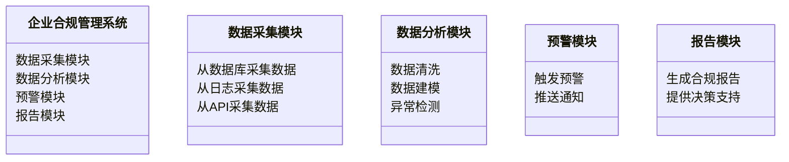

                 


# 构建智能企业合规管理系统：实时监控与预警机制设计

> 关键词：企业合规管理，实时监控，预警机制，智能系统，规则引擎，异常检测，数据处理

> 摘要：本文详细探讨了构建智能企业合规管理系统的实时监控与预警机制设计。从企业合规管理的背景与核心概念出发，分析了实时监控与预警机制的必要性与实现方式，详细讲解了系统架构设计、核心算法实现及项目实战案例。通过本文，读者可以全面理解智能企业合规管理系统的构建方法，掌握实时监控与预警机制的核心技术与最佳实践。

---

## 第一部分: 智能企业合规管理系统的背景与核心概念

### 第1章: 企业合规管理概述

#### 1.1 企业合规管理的背景与意义

企业合规管理是企业在经营过程中遵循相关法律法规、行业标准和企业内部规章制度的管理活动。随着全球化和数字化的深入，企业面临的合规风险日益复杂，涵盖数据安全、隐私保护、反腐败、反洗钱等多个领域。合规管理不仅是企业合法经营的基础，也是提升企业信誉和竞争力的重要手段。

合规管理的核心在于通过制度、流程和技术手段，确保企业在各项业务活动中符合相关法规和内部政策。传统合规管理依赖人工检查和事后补救，这种方式效率低下、覆盖面有限，难以应对现代企业面临的复杂合规挑战。因此，引入智能化技术，构建智能企业合规管理系统成为必然趋势。

#### 1.2 企业合规管理的核心要素

- **制度与流程**：企业合规管理的基础是完善的制度和标准化的流程。
- **数据与信息**：合规管理依赖于对企业运营数据的全面采集和分析。
- **技术与工具**：智能化技术（如人工智能、大数据分析）是实现高效合规管理的关键。
- **人员与组织**：合规管理需要企业内部专门的组织和人员负责实施和监督。

### 第2章: 实时监控与预警机制的必要性

#### 2.1 企业合规管理中的风险与挑战

企业在经营过程中可能面临以下合规风险：
1. **数据泄露**：企业数据被未经授权的人员访问或泄露。
2. **操作违规**：员工在业务操作中违反公司政策或法律法规。
3. **流程偏差**：业务流程执行过程中偏离既定的合规要求。
4. **外部监管**：政府或行业监管机构对企业行为的严格审查。

实时监控与预警机制能够帮助企业及时发现并应对上述风险，避免潜在的法律纠纷和经济损失。

#### 2.2 实时监控与预警机制的核心目标

- **实时性**：对企业的各项业务活动进行实时监测，确保数据的及时性和准确性。
- **准确性**：通过智能化算法，准确识别异常行为和潜在风险。
- **可操作性**：提供清晰的预警信息和应对措施，帮助企业在问题发生前采取行动。

---

## 第二部分: 智能企业合规管理系统的核心概念与联系

### 第3章: 智能企业合规管理系统的架构

#### 3.1 系统架构的组成与功能

智能企业合规管理系统通常由以下几个关键模块组成：

1. **数据采集模块**：负责从企业各个业务系统中采集相关数据。
2. **数据分析模块**：对采集的数据进行清洗、分析和建模。
3. **规则引擎模块**：根据预设的合规规则对数据进行判断和分析。
4. **预警模块**：根据分析结果生成预警信息并推送至相关人员。
5. **报告与决策支持模块**：生成合规报告并提供决策支持。

#### 3.2 关键技术与实现方式

- **数据采集技术**：包括API接口、数据库连接和日志采集等多种方式。
- **数据分析技术**：基于机器学习的异常检测、自然语言处理（NLP）等技术。
- **规则引擎技术**：通过配置化的规则引擎实现动态的合规判断。

### 第4章: 核心功能模块的设计

#### 4.1 数据采集模块

数据采集模块是系统的基础，负责从企业各个业务系统中获取数据。数据来源可能包括：
1. **数据库**：企业的ERP、CRM等系统。
2. **日志文件**：服务器日志、用户操作日志。
3. **API接口**：与其他系统的数据对接。

#### 4.2 数据分析模块

数据分析模块通过对采集的数据进行处理，识别潜在的合规风险。常用的技术包括：
1. **异常检测**：基于统计学或机器学习的方法，识别数据中的异常值。
2. **模式识别**：发现数据中的规律和趋势，帮助识别潜在风险。

#### 4.3 预警模块

预警模块根据分析结果生成预警信息，并通过邮件、短信或系统通知等方式推送至相关人员。预警信息的内容应包括：
1. **预警级别**：根据风险的严重程度划分预警级别。
2. **预警原因**：详细说明预警的具体原因。
3. **应对措施**：提供具体的应对建议。

---

## 第三部分: 实时监控与预警机制的算法原理

### 第5章: 规则引擎的设计与实现

#### 5.1 规则引擎的定义与作用

规则引擎是一种用于执行和管理业务规则的软件组件。它能够根据预设的规则对数据进行判断，并根据判断结果执行相应的操作。

#### 5.2 规则引擎的实现流程

1. **规则定义**：将业务规则转化为可执行的代码或脚本。
2. **规则执行**：将数据输入规则引擎，执行规则并生成判断结果。
3. **结果处理**：根据判断结果采取相应的行动，如触发预警或记录日志。

### 第6章: 异常检测算法的设计

#### 6.1 异常检测算法的原理

异常检测算法通过分析数据的分布情况，识别出与正常数据显著不同的异常点。常用的方法包括：
1. **基于统计的方法**：如Z-score、箱线图法。
2. **基于机器学习的方法**：如Isolation Forest、One-Class SVM。

#### 6.2 基于机器学习的异常检测

基于机器学习的异常检测方法能够自动学习数据的特征，并识别出异常模式。以下是使用Python实现的Isolation Forest算法的示例代码：

```python
from sklearn.ensemble import IsolationForest
import numpy as np

# 生成正常数据
X_normal = np.random.normal(0, 1, 1000)
# 生成异常数据
X_anomaly = np.random.uniform(-5, 5, 100)

# 合并数据
X = np.concatenate([X_normal, X_anomaly])
y = np.concatenate([np.zeros(1000), np.ones(100)])

# 训练模型
model = IsolationForest(n_estimators=100, random_state=42)
model.fit(X.reshape(-1, 1))

# 预测异常分数
scores = model.predict(X.reshape(-1, 1))
print(scores)
```

### 第7章: 实时数据处理机制

#### 7.1 实时数据处理的定义

实时数据处理是指对数据进行实时采集、分析和响应的过程。其核心在于快速处理数据并生成可操作的结论。

#### 7.2 实时数据处理的优化

为了提高实时数据处理的效率，可以采取以下优化措施：
1. **数据分区**：将数据按时间、空间等维度进行分区，便于并行处理。
2. **流式处理**：采用流式处理技术，逐条处理数据，减少存储压力。
3. **缓存机制**：利用缓存技术，减少对数据库的访问次数，提高处理速度。

---

## 第四部分: 系统分析与架构设计方案

### 第8章: 问题场景介绍

#### 8.1 项目介绍

本项目旨在构建一个智能企业合规管理系统，实现对企业各项业务活动的实时监控和预警。系统将通过数据采集、分析和处理，帮助企业在第一时间发现并应对合规风险。

#### 8.2 系统功能设计

以下是系统功能设计的领域模型图（Mermaid）：



#### 8.3 系统架构设计

以下是系统架构设计图（Mermaid）：

```mermaid
archi
    title 智能企业合规管理系统架构图
    rectangle 数据源 {
        数据库
        日志文件
        API接口
    }
    rectangle 数据处理层 {
        数据采集模块
        数据清洗模块
        数据分析模块
    }
    rectangle 业务逻辑层 {
        规则引擎模块
        异常检测模块
        预警模块
    }
    rectangle 表现层 {
        用户界面
        报告生成
    }
    数据源 --> 数据处理层
    数据处理层 --> 业务逻辑层
    业务逻辑层 --> 表现层
```

#### 8.4 系统接口设计

以下是系统接口设计图（Mermaid）：

```mermaid
sequence
    title 系统接口交互流程
    客户端 -> 数据采集模块: 发送数据采集请求
    数据采集模块 -> 数据存储模块: 存储采集数据
    数据分析模块 -> 数据存储模块: 获取数据进行分析
    数据分析模块 -> 预警模块: 发送分析结果
    预警模块 -> 客户端: 推送预警通知
```

---

## 第五部分: 项目实战

### 第9章: 环境安装与核心代码实现

#### 9.1 环境安装

为了运行本项目，您需要安装以下工具和库：
1. Python 3.8+
2. pip
3. Jupyter Notebook
4. 以下Python库：
   - `numpy`
   - `pandas`
   - `scikit-learn`
   - `pyod`

#### 9.2 核心代码实现

以下是实现异常检测的Python代码：

```python
import numpy as np
import pandas as pd
from pyod.models.if import IsolationForest
import joblib

# 加载数据
data = pd.read_csv('input.csv')

# 训练模型
model = IsolationForest(n_estimators=100, random_state=42)
model.fit(data)

# 保存模型
joblib.dump(model, 'isolation_forest_model.pkl')
```

#### 9.3 代码应用解读与分析

上述代码实现了一个基于Isolation Forest算法的异常检测模型。首先，数据通过`pd.read_csv`加载，然后使用`IsolationForest`模型进行训练，并将训练好的模型保存为`isolation_forest_model.pkl`文件。

#### 9.4 案例分析与详细讲解

假设我们有一个包含交易数据的CSV文件，通过上述代码可以训练出一个异常检测模型。当新的交易数据输入时，我们可以使用训练好的模型进行预测，识别出异常交易并触发预警。

---

## 第六部分: 最佳实践与总结

### 第10章: 最佳实践

#### 10.1 核心要点总结

- **数据质量**：确保数据的完整性和准确性。
- **模型优化**：定期更新模型，提升检测精度。
- **团队协作**：合规管理需要企业内部多部门的协作。
- **持续监控**：实时监控是确保系统有效运行的关键。

#### 10.2 小结

通过构建智能企业合规管理系统，企业能够实现对业务活动的实时监控和预警，有效降低合规风险，提升管理效率。

#### 10.3 注意事项

- **数据隐私**：在处理数据时，需注意保护数据隐私，遵守相关法律法规。
- **系统稳定性**：确保系统的稳定运行，避免因系统故障导致监控中断。
- **用户反馈**：定期收集用户反馈，优化系统功能和用户体验。

#### 10.4 拓展阅读

- 《企业合规管理：方法与实践》
- 《实时数据处理技术：从零到实战》
- 《机器学习在金融领域的应用》

---

通过本文的详细讲解，读者可以全面了解智能企业合规管理系统的构建方法，掌握实时监控与预警机制的核心技术与最佳实践。希望本文能够为企业的合规管理提供有价值的参考和指导。

