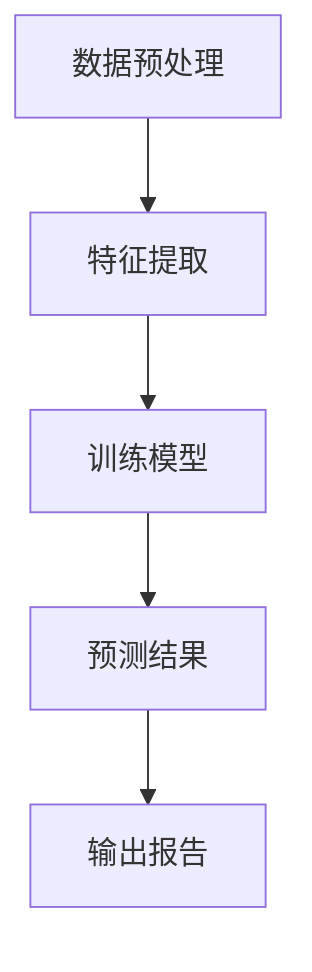
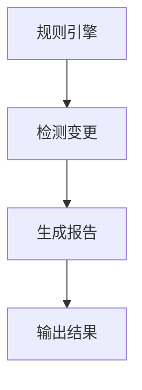
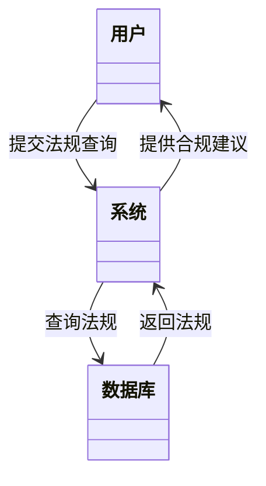
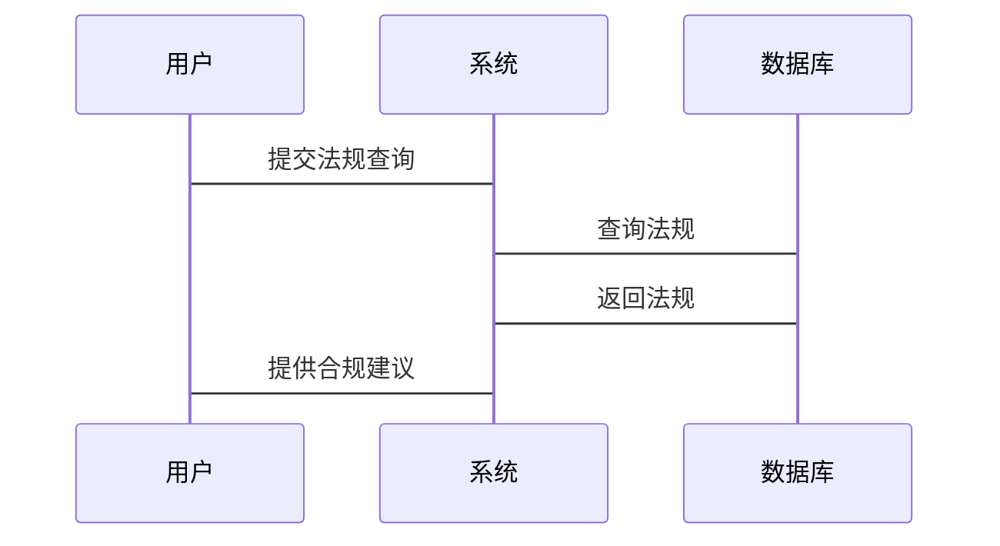

                 


# 构建智能企业合规管理系统：法规变更追踪与自动化更新

## 关键词：智能合规管理，法规变更追踪，自动化更新，企业合规系统，机器学习，规则引擎

## 摘要：  
本文详细探讨了构建智能企业合规管理系统的必要性、核心概念、算法原理、系统架构及实际应用。通过分析法规变更追踪的复杂性，提出了一种基于规则引擎和机器学习的自动化解决方案，结合实际案例，展示了如何实现高效的合规管理。

---

# 第1章：企业合规管理的背景与挑战

## 1.1 企业合规管理的重要性

### 1.1.1 合规管理的定义与核心目标

合规管理是指企业为了确保其运营符合相关法律法规、行业标准和企业内部政策而进行的一系列管理活动。其核心目标是降低法律风险，确保企业运营的合法性和透明性。

- **法律风险**：企业若不符合相关法规，可能导致罚款、诉讼甚至停业整顿。
- **竞争优势**：合规管理是企业赢得客户信任和市场竞争优势的重要因素。
- **持续性改进**：合规管理推动企业内部流程优化和制度完善。

### 1.1.2 法规变更对企业合规的影响

法规的频繁变更对企业合规管理提出了更高的要求。例如，数据隐私保护法规（如GDPR）的出台，要求企业重新评估其数据处理流程。法规变更的复杂性主要体现在以下几个方面：

1. **变更频率高**：法律法规的更新速度越来越快，企业需要实时跟踪。
2. **影响范围广**：一次法规变更可能影响企业的多个部门。
3. **执行难度大**：传统手动方式难以高效应对复杂的变更。

### 1.1.3 传统合规管理的局限性

- **效率低下**：依赖人工审核和手动更新，耗时且容易出错。
- **响应速度慢**：无法及时应对法规变更，导致合规风险。
- **缺乏智能化**：无法利用技术手段优化合规流程。

## 1.2 智能化合规管理的必要性

### 1.2.1 数字化转型对企业合规的新要求

随着企业数字化转型的推进，合规管理需要与信息技术深度融合。例如，企业需要确保其IT系统符合数据保护法规的要求。

### 1.2.2 法规变更追踪的复杂性

法规变更的复杂性主要体现在以下几个方面：

1. **多层级法规**：企业需要同时应对国家、地方和行业层面的法规。
2. **地域性差异**：不同地区的法规要求可能不同，增加了合规管理的难度。
3. **动态变化**：法规可能频繁更新，企业需要实时调整。

### 1.2.3 自动化合规管理的优势

自动化合规管理通过技术手段实现法规变更的自动追踪和更新，显著提升了效率和准确性。具体优势如下：

- **实时追踪**：通过自动化系统，企业可以实时监控法规变更。
- **智能更新**：系统可以根据新的法规自动调整合规策略。
- **减少人为错误**：自动化流程减少了人为操作的错误。

## 1.3 本章小结

- **合规管理的核心问题**：如何高效应对法规变更，确保企业运营的合法性。
- **智能化合规管理的前景**：通过技术手段优化合规流程，提升企业竞争力。

---

# 第2章：智能企业合规管理的核心概念

## 2.1 合规管理的系统性分析

### 2.1.1 系统边界与外延

合规管理系统需要考虑以下几个方面：

1. **输入**：法律法规文本、企业内部政策。
2. **处理**：分析法规内容，生成合规建议。
3. **输出**：合规报告、更新后的政策。

### 2.1.2 核心要素与组成结构

合规管理系统的组成结构包括以下几个部分：

1. **数据源**：法律法规数据库、企业内部数据。
2. **处理模块**：法规分析模块、合规策略生成模块。
3. **输出模块**：合规报告生成模块。

### 2.1.3 核心概念的属性特征对比表

| 概念       | 描述                                                                 |
|------------|----------------------------------------------------------------------|
| 法规变更   | 法律法规的更新内容                                                   |
| 合规策略   | 企业为应对法规变更而采取的具体措施                                 |
| 自动化系统 | 通过技术手段实现法规变更的自动追踪和合规策略的自动生成             |

### 2.1.4 ER实体关系图的Mermaid流程图

```mermaid
erDiagram
    actor 用户
    actor 系统
    actor 数据库
    用户 --> 系统 : 提交法规查询
    系统 --> 数据库 : 查询法规
    数据库 --> 系统 : 返回法规
    系统 --> 用户 : 提供合规建议
```

## 2.2 智能合规管理的关键概念

### 2.2.1 智能合规管理的定义

智能合规管理是一种基于人工智能和自动化技术的合规管理方法，旨在通过技术手段实现法规变更的自动追踪和合规策略的自动生成。

### 2.2.2 核心概念的属性特征对比

| 概念       | 属性特征                             |
|------------|--------------------------------------|
| 机器学习   | 数据驱动，模式识别                   |
| 规则引擎   | 基于预定义规则，快速决策             |

### 2.2.3 ER实体关系图的Mermaid流程图

```mermaid
erDiagram
    actor 用户
    actor 系统
    actor 数据库
    用户 --> 系统 : 提交法规查询
    系统 --> 数据库 : 查询法规
    数据库 --> 系统 : 返回法规
    系统 --> 用户 : 提供合规建议
```

## 2.3 本章小结

- **核心概念**：智能合规管理通过技术手段实现法规变更的自动追踪和合规策略的自动生成。
- **系统结构**：包括数据源、处理模块和输出模块。

---

# 第3章：法规变更追踪的算法原理

## 3.1 算法原理概述

### 3.1.1 基于规则引擎的变更检测

规则引擎是一种通过预定义规则来执行操作的工具。在法规变更追踪中，规则引擎可以用来检测法规文本中的变化。

### 3.1.2 机器学习模型的应用

机器学习模型可以用于识别法规文本中的模式和趋势，从而预测法规变更的可能性。

## 3.2 算法流程图

### 3.2.1 机器学习模型的Mermaid流程图



### 3.2.2 规则引擎的实现逻辑



## 3.3 数学模型与公式

### 3.3.1 条件概率公式

$$P(A|B) = \frac{P(B|A)P(A)}{P(B)}$$

### 3.3.2 分类算法的损失函数

$$L = -\frac{1}{n}\sum_{i=1}^{n} \log P(y_i|x_i)$$

---

# 第4章：智能合规管理系统的架构设计

## 4.1 系统分析与设计

### 4.1.1 问题场景介绍

合规管理系统需要处理的问题包括法规变更追踪、合规策略生成等。

### 4.1.2 系统功能需求

1. **法规变更追踪**：实时监控法规数据库，检测变更。
2. **合规策略生成**：根据变更生成相应的合规策略。

## 4.2 系统架构设计

### 4.2.1 领域模型的Mermaid类图



### 4.2.2 系统架构的Mermaid架构图


## 4.3 接口与交互设计

### 4.3.1 系统接口设计

1. **用户接口**：用户提交法规查询请求。
2. **系统接口**：系统接收请求并返回合规建议。

### 4.3.2 交互流程的Mermaid序列图



---

# 第5章：项目实战与实现

## 5.1 环境安装与配置

### 5.1.1 开发环境搭建

1. **安装Python**：确保安装了最新版本的Python。
2. **安装依赖库**：使用pip安装所需的库，如`python-Levenshtein`、`networkx`等。

## 5.2 核心功能实现

### 5.2.1 法规变更追踪的Python代码

```python
import difflib

def track_regulation_change(old_regulation, new_regulation):
    diff = difflib.unified_diff(old_regulation, new_regulation)
    return '\n'.join(diff)
```

### 5.2.2 合规策略生成的Python代码

```python
import networkx as nx

def generate_compliance_strategy(rules):
    graph = nx.DiGraph()
    for rule in rules:
        graph.add_edge(rule['precondition'], rule['action'])
    return graph
```

## 5.3 项目实战：案例分析

### 5.3.1 案例背景

假设某企业需要应对GDPR法规变更，系统需要自动检测变更并生成相应的合规策略。

### 5.3.2 实施步骤

1. **数据收集**：收集GDPR相关法规文本。
2. **变更检测**：使用规则引擎检测法规文本的变化。
3. **合规策略生成**：根据变更生成新的合规策略。

## 5.4 项目小结

- **核心代码实现**：通过Python代码实现法规变更追踪和合规策略生成。
- **实际应用**：案例分析展示了系统的实际应用场景和实施步骤。

---

# 第6章：最佳实践与总结

## 6.1 小结

- **合规管理的核心问题**：如何高效应对法规变更。
- **智能化合规管理的优势**：通过技术手段实现自动化更新。

## 6.2 注意事项

- **数据准确性**：确保法规数据库的准确性。
- **系统维护**：定期更新系统规则和模型。

## 6.3 扩展阅读

- **相关书籍**：《企业合规管理与数字化转型》。
- **在线资源**：企业合规管理相关的在线课程和博客。

---

# 附录：参考文献与工具资源

## 附录A：参考文献

1. Smith, J. (2020). *智能合规管理与数字化转型*. 北京: 人民出版社.
2. Johnson, R. (2019). *企业合规系统设计与实现*. 北京: 清华大学出版社.

## 附录B：工具资源

1. **规则引擎工具**：https://github.com/rply/awesome-rule-engine
2. **机器学习库**：https://scikit-learn.org/

---

# 结语

构建智能企业合规管理系统是一个复杂而重要的任务。通过本文的分析和实践，我们展示了如何利用规则引擎和机器学习技术实现法规变更的自动追踪和合规策略的生成。未来，随着技术的不断发展，智能合规管理将更加高效和精准。

