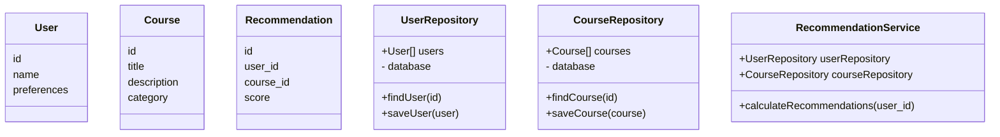
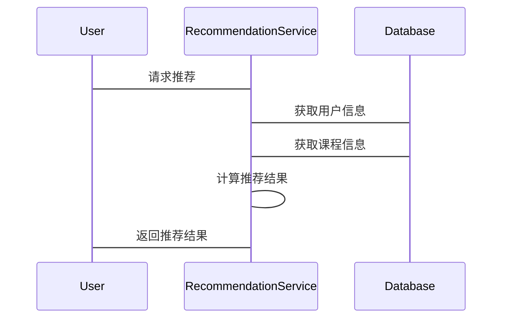

                 


# 《构建智能企业培训系统：个性化学习路径与内容推荐》

## # 第五部分：算法原理与实现

---

## ## 第5章：协同过滤算法的实现

### ### 5.1 协同过滤的基本原理

协同过滤是一种基于用户行为或偏好相似性来推荐内容的方法。它通过分析用户之间的相似性或物品之间的相似性，找到与当前用户兴趣相似的用户或与当前物品相似的物品，从而进行推荐。

#### 5.1.1 协同过滤的类型

- **基于用户的协同过滤（UBCF）**：通过计算用户之间的相似性，找到与当前用户相似的其他用户，推荐这些用户喜欢的物品。
- **基于物品的协同过滤（IBCF）**：通过计算物品之间的相似性，找到与当前物品相似的其他物品，推荐给当前用户。

#### 5.1.2 协同过滤的实现步骤

1. 收集用户的行为数据（如评分、点击、购买等）。
2. 计算用户或物品的相似性矩阵。
3. 根据相似性矩阵生成推荐列表。
4. 根据业务需求进行推荐结果的调整（如过滤掉用户已有的物品）。

### ### 5.2 基于用户的协同过滤实现

#### 5.2.1 实现代码示例

```python
import numpy as np
from sklearn.metrics.pairwise import cosine_similarity

# 示例用户-物品评分矩阵
# 行表示用户，列表示物品，值表示评分
user_item_matrix = np.array([
    [4, 3, 0, 0, 0],
    [1, 4, 0, 0, 0],
    [0, 0, 5, 4, 0],
    [0, 0, 3, 1, 4],
    [0, 0, 0, 2, 5]
])

# 计算相似性矩阵
similarity_matrix = cosine_similarity(user_item_matrix)

# 定义一个函数，根据用户索引推荐物品
def recommend_items(user_index, similarity_matrix, user_item_matrix, num_recommendations=3):
    # 找到当前用户的相似用户
    similar_users = np.argsort(similarity_matrix[user_index])[::-1]
    # 推荐当前用户未评分的物品
    recommended_items = []
    for user in similar_users:
        for item in range(user_item_matrix.shape[1]):
            if user_item_matrix[user][item] == 0:
                recommended_items.append(item)
                break
        if len(recommended_items) >= num_recommendations:
            break
    return recommended_items

# 推荐给用户0（索引为0）
print(recommend_items(0, similarity_matrix, user_item_matrix))
```

#### 5.2.2 协同过滤的数学模型

协同过滤的相似性计算通常使用余弦相似性或皮尔逊相关系数。余弦相似性的计算公式为：

$$ \text{余弦相似性} = \frac{\vec{u} \cdot \vec{v}}{|\vec{u}| |\vec{v}|} $$

皮尔逊相关系数的计算公式为：

$$ r(u, v) = \frac{\sum (u_i - \bar{u})(v_i - \bar{v})}{\sqrt{\sum (u_i - \bar{u})^2} \sqrt{\sum (v_i - \bar{v})^2}} $$

---

### ### 5.3 基于物品的协同过滤实现

#### 5.3.1 实现代码示例

```python
from sklearn.preprocessing import normalize

# 将用户-物品评分矩阵转换为物品-用户矩阵，并进行归一化处理
item_user_matrix = user_item_matrix.T
normalized_item_user_matrix = normalize(item_user_matrix, axis=1, norm='l2')

# 计算相似性矩阵
similarity_matrix = cosine_similarity(normalized_item_user_matrix)

# 定义一个函数，根据物品索引推荐用户
def recommend_users(item_index, similarity_matrix, item_user_matrix, num_recommendations=3):
    # 找到与当前物品相似的物品
    similar_items = np.argsort(similarity_matrix[item_index])[::-1]
    # 推荐当前物品的相似物品
    recommended_items = []
    for item in similar_items:
        for user in range(item_user_matrix.shape[1]):
            if item_user_matrix[item][user] == 0:
                recommended_items.append(item)
                break
        if len(recommended_items) >= num_recommendations:
            break
    return recommended_items

# 推荐与物品0（索引为0）相似的物品
print(recommend_items(0, similarity_matrix, item_user_matrix))
```

---

## ## 第6章：基于内容的推荐算法

### ### 6.1 基于文本挖掘的内容推荐

#### 6.1.1 文本挖掘技术

- **TF-IDF（Term Frequency-Inverse Document Frequency）**：用于提取文本中的关键词。
- **Word2Vec**：用于将词语表示为向量，捕捉词语之间的语义关系。

#### 6.1.2 实现步骤

1. 对课程内容进行文本挖掘，提取关键词或生成词向量。
2. 计算课程之间的相似性。
3. 根据用户的学习兴趣推荐相似的课程。

#### 6.1.3 实现代码示例

```python
from sklearn.feature_extraction.text import TfidfVectorizer
from sklearn.metrics.pairwise import cosine_similarity

# 示例课程内容
courses = [
    "Introduction to Machine Learning",
    "Advanced Python Programming",
    "Data Structures and Algorithms",
    "AI and Deep Learning Basics",
    "Effective Software Development"
]

# 创建TF-IDF向量器
vectorizer = TfidfVectorizer()
tfidf_matrix = vectorizer.fit_transform(courses)

# 计算相似性矩阵
similarity_matrix = cosine_similarity(tfidf_matrix)

# 定义一个函数，根据输入课程推荐相似的课程
def recommend_courses(course_index, similarity_matrix, courses):
    # 找到相似性最高的课程
    similar_courses = np.argsort(similarity_matrix[course_index])[::-1]
    recommended_courses = [courses[i] for i in similar_courses]
    return recommended_courses[:3]

# 推荐与"Introduction to Machine Learning"相似的课程
print(recommend_courses(0, similarity_matrix, courses))
```

---

### ### 6.2 基于知识图谱的内容推荐

#### 6.2.1 知识图谱构建

- 通过爬取和分析课程内容，构建课程之间的语义网络。

#### 6.2.2 推荐过程

- 根据用户的学习路径和知识图谱中的语义关系，推荐相关的课程。

---

## ## 第7章：混合推荐算法

### ### 7.1 混合推荐算法的原理

混合推荐算法结合了协同过滤和基于内容的推荐算法，通过融合两者的优势，提高推荐的准确性和多样性。

#### 7.1.1 混合推荐算法的实现步骤

1. 分别使用协同过滤和基于内容的推荐算法生成推荐列表。
2. 根据业务需求，对推荐列表进行加权融合。
3. 生成最终的推荐结果。

#### 7.1.2 实现代码示例

```python
import numpy as np

# 示例协同过滤推荐结果
collaborative_filtering_recommends = [4, 2, 1]

# 示例基于内容的推荐结果
content_based_recommends = [3, 1, 2]

# 对两种推荐结果进行加权融合，权重分别为0.6和0.4
weight_collaborative = 0.6
weight_content = 0.4

# 融合后的推荐结果
combined_recommends = []
index = 0
i = 0
j = 0

while len(combined_recommends) < 5:
    if i < len(collaborative_filtering_recommends) and j < len(content_based_recommends):
        # 根据权重选择推荐结果
        if np.random.random() < weight_collaborative:
            combined_recommends.append(collaborative_filtering_recommends[i])
            i += 1
        else:
            combined_recommends.append(content_based_recommends[j])
            j += 1
    elif i < len(collaborative_filtering_recommends):
        combined_recommends.append(collaborative_filtering_recommends[i])
        i += 1
    else:
        combined_recommends.append(content_based_recommends[j])
        j += 1

print(combined_recommends)
```

---

## ## 第8章：深度学习在推荐系统中的应用

### ### 8.1 基于深度学习的推荐算法

#### 8.1.1 算法原理

- **神经网络协同过滤（Neural Collaborative Filtering, NCF）**：使用深度神经网络建模用户和物品的交互。
- **序列推荐（Sequence Recommendation）**：基于用户的行为序列，预测下一个用户可能感兴趣的内容。

#### 8.1.2 实现代码示例

```python
import tensorflow as tf
from tensorflow.keras.layers import Input, Embedding, Dense, Dot, Concatenate
from tensorflow.keras.models import Model

# 示例用户和物品嵌入维度
embedding_dim = 32

# 用户嵌入层
user_embedding = Embedding(input_dim=100, output_dim=embedding_dim, name='user_embedding')
item_embedding = Embedding(input_dim=100, output_dim=embedding_dim, name='item_embedding')

# 用户输入
user_input = Input(shape=(1,))
item_input = Input(shape=(1,))

# 用户和物品嵌入向量
user_vector = user_embedding(user_input)
item_vector = item_embedding(item_input)

# 深度神经网络部分
concat = Concatenate()([user_vector, item_vector])
dense = Dense(64, activation='relu')(concat)
output = Dense(1, activation='sigmoid')(dense)

# 定义模型
model = Model(inputs=[user_input, item_input], outputs=output)
model.compile(loss='binary_crossentropy', optimizer='adam', metrics=['accuracy'])

# 模型训练
# 假设我们有训练数据（user_train, item_train, label_train）
# model.fit([user_train, item_train], label_train, epochs=10, batch_size=32)
```

---

## ## 第9章：系统架构与设计

### ### 9.1 系统模块划分

#### 9.1.1 模块划分

- **用户模块**：负责用户信息的存储和管理。
- **课程模块**：负责课程信息的存储和管理。
- **推荐模块**：负责根据用户信息和课程信息生成推荐结果。
- **交互模块**：负责用户与系统的交互，记录用户行为数据。

---

### ### 9.2 系统功能设计（领域模型）



---

### ### 9.3 系统架构设计（Mermaid图）


---

## ## 第10章：系统接口设计与交互

### ### 10.1 系统接口设计

#### 10.1.1 接口定义

- **`POST /api/recommend`**：接收用户ID，返回推荐的课程列表。
- **`GET /api/users/{user_id}`**：获取用户信息。
- **`GET /api/courses`**：获取所有课程信息。

#### 10.1.2 接口实现代码示例

```python
from flask import Flask, request
from flask_restful import Resource, Api

app = Flask(__name__)
api = Api(app)

class RecommendationResource(Resource):
    def post(self):
        user_id = request.json['user_id']
        # 调用推荐服务生成推荐结果
        recommendations = recommendation_service.calculateRecommendations(user_id)
        return {'recommendations': recommendations}, 200

api.add_resource(RecommendationResource, '/api/recommend')

if __name__ == '__main__':
    app.run(debug=True)
```

---

### ### 10.2 系统交互设计（Mermaid图）



---

## ## 第11章：项目实战与优化

### ### 11.1 环境安装与配置

#### 11.1.1 安装依赖

```bash
pip install numpy scikit-learn tensorflow flask flask-restful
```

#### 11.1.2 创建项目结构

```
project/
├── data/
│   └── users.csv
│   └── courses.csv
├── model/
│   └── recommendation_model.h5
├── app.py
└── requirements.txt
```

---

### ### 11.2 核心实现代码

#### 11.2.1 数据预处理代码

```python
import pandas as pd

# 加载数据
users = pd.read_csv('data/users.csv')
courses = pd.read_csv('data/courses.csv')

# 数据清洗
# 假设用户表和课程表已经清洗完成
```

---

### ### 11.3 测试与优化

#### 11.3.1 测试步骤

1. 使用示例数据测试推荐系统。
2. 对比不同推荐算法的效果。
3. 根据测试结果优化推荐模型。

#### 11.3.2 性能优化

- **缓存机制**：缓存用户的推荐结果，减少计算开销。
- **分布式计算**：利用分布式计算框架（如Spark）处理大规模数据。
- **模型优化**：使用更高效的模型结构和参数调整。

---

## ## 第12章：最佳实践与总结

### ### 12.1 最佳实践

#### 12.1.1 数据质量

- 确保数据的完整性和准确性。
- 处理缺失值和异常值。

#### 12.1.2 模型调优

- 使用交叉验证选择最优模型。
- 调整模型参数，提高推荐准确率。

#### 12.1.3 系统可扩展性

- 设计模块化架构，方便后续扩展。
- 支持多种推荐算法的动态切换。

---

### ### 12.2 总结

构建智能企业培训系统是一个复杂的系统工程，需要结合个性化学习路径和内容推荐的多种技术。通过协同过滤、基于内容的推荐以及深度学习算法的结合，可以显著提高推荐的准确性和多样性。同时，系统设计需要考虑数据安全、性能优化和用户体验，确保系统的稳定性和可扩展性。

---

## # 第六部分：参考文献

- 《推荐系统实战：基于协同过滤和深度学习》
- 《机器学习：一种算法的视角》
- 《Python机器学习：基于Scikit-learn和TensorFlow》

---

## # 第七部分：附录

### ### 附录A：代码示例

#### 附录A.1 协同过滤算法代码

```python
import numpy as np
from sklearn.metrics.pairwise import cosine_similarity

# 示例用户-物品评分矩阵
user_item_matrix = np.array([
    [4, 3, 0, 0, 0],
    [1, 4, 0, 0, 0],
    [0, 0, 5, 4, 0],
    [0, 0, 3, 1, 4],
    [0, 0, 0, 2, 5]
])

similarity_matrix = cosine_similarity(user_item_matrix)

def recommend_items(user_index, similarity_matrix, user_item_matrix, num_recommendations=3):
    similar_users = np.argsort(similarity_matrix[user_index])[::-1]
    recommended_items = []
    for user in similar_users:
        for item in range(user_item_matrix.shape[1]):
            if user_item_matrix[user][item] == 0:
                recommended_items.append(item)
                break
        if len(recommended_items) >= num_recommendations:
            break
    return recommended_items

print(recommend_items(0, similarity_matrix, user_item_matrix))
```

#### 附录A.2 基于内容的推荐算法代码

```python
from sklearn.feature_extraction.text import TfidfVectorizer
from sklearn.metrics.pairwise import cosine_similarity

courses = [
    "Introduction to Machine Learning",
    "Advanced Python Programming",
    "Data Structures and Algorithms",
    "AI and Deep Learning Basics",
    "Effective Software Development"
]

vectorizer = TfidfVectorizer()
tfidf_matrix = vectorizer.fit_transform(courses)

similarity_matrix = cosine_similarity(tfidf_matrix)

def recommend_courses(course_index, similarity_matrix, courses):
    similar_courses = np.argsort(similarity_matrix[course_index])[::-1]
    recommended_courses = [courses[i] for i in similar_courses]
    return recommended_courses[:3]

print(recommend_courses(0, similarity_matrix, courses))
```

---

## # 第八部分：扩展阅读

- **《推荐系统实践》**：深入探讨推荐系统的实现细节和优化技巧。
- **《深度学习推荐系统》**：详细讲解基于深度学习的推荐算法。
- **《系统架构设计实战》**：分享系统架构设计的实用经验和方法。

---

## # 第九部分：结束语

通过本文的详细讲解，我们了解了构建智能企业培训系统的各个方面，包括个性化学习路径和内容推荐的核心概念、算法原理、系统架构设计以及项目实战。希望这些内容能够为读者提供有价值的参考和启发，帮助他们更好地理解和实现智能企业培训系统。

