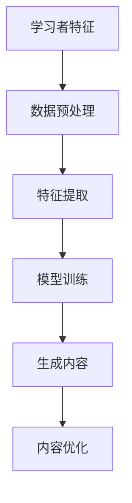
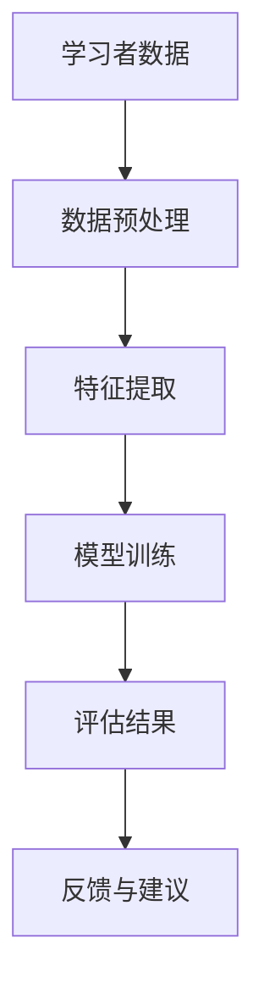
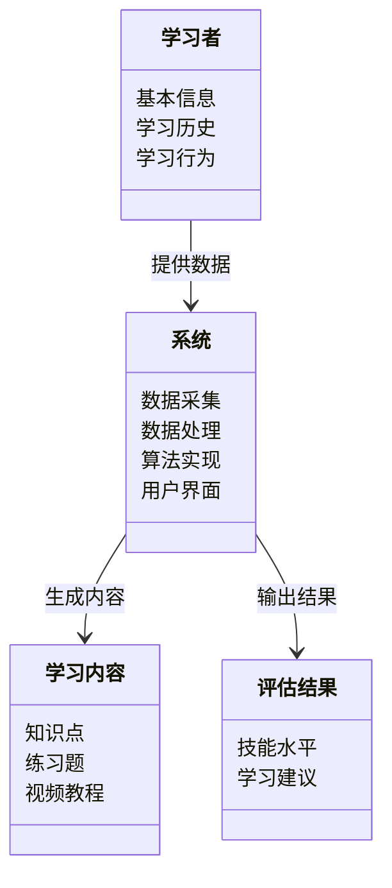
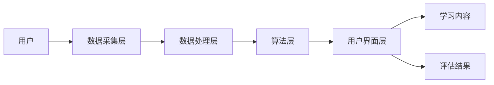
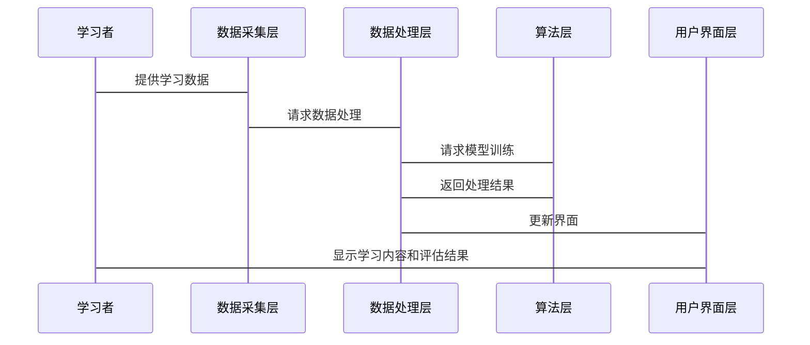

                 


# 构建智能企业培训系统：自适应学习内容生成与技能评估

## 关键词：智能企业培训系统、自适应学习、技能评估、机器学习、深度学习、系统架构、数据挖掘

## 摘要：
在企业培训领域，智能化是当前发展的主要方向。自适应学习和技能评估是构建智能企业培训系统的核心技术。通过分析学习者的行为数据和特征，利用机器学习算法生成个性化学习内容，并通过多维度的技能评估模型，为企业提供高效、精准的培训解决方案。本文详细探讨了自适应学习内容生成和技能评估的实现方法，分析了系统架构设计，并通过实际案例展示了系统的应用效果。本文旨在为企业的智能化培训系统建设提供理论和实践指导。

---

# 第1章 智能企业培训系统概述

## 1.1 企业培训系统的背景与重要性

### 1.1.1 传统企业培训的局限性
传统的企业培训系统通常采用固定课程和统一的培训方式，难以满足不同员工的学习需求。具体表现为：
- **学习者特征多样性**：员工的背景、知识水平和学习能力差异较大，固定课程难以适应个体需求。
- **内容更新滞后**：课程内容难以及时更新，无法跟上技术和市场需求的变化。
- **学习效果评估单一**：评估方式多为考试或问卷，难以全面反映学习者的实际能力。

### 1.1.2 智能化培训的必要性
随着人工智能技术的快速发展，智能化培训成为提升企业竞争力的重要手段。智能化培训能够：
- **个性化学习体验**：根据学习者的特点推荐个性化学习内容。
- **动态调整学习路径**：根据学习者的实时表现优化学习计划。
- **精准评估学习效果**：通过多维度数据评估学习者的技能水平。

### 1.1.3 自适应学习与技能评估的核心价值
自适应学习和技能评估是智能化培训的核心技术：
- **自适应学习**：通过算法动态生成适合学习者的学习内容，提升学习效率。
- **技能评估**：通过多维度数据评估学习者的技能水平，为企业提供精准的培训效果反馈。

---

## 1.2 自适应学习与技能评估的概念

### 1.2.1 自适应学习的定义与特点
自适应学习是一种基于学习者特征和行为数据，动态调整学习内容和路径的教学方法。其特点包括：
- **个性化**：根据学习者的特点提供定制化学习方案。
- **实时性**：根据学习者的行为实时调整学习内容。
- **数据驱动**：依赖于学习者数据进行决策。

### 1.2.2 技能评估的定义与方法
技能评估是通过多维度数据对学习者的能力进行评价的过程。常用方法包括：
- **知识测试**：通过考试评估学习者对知识的掌握程度。
- **行为分析**：通过学习行为数据评估学习者的学习能力。
- **项目评估**：通过实际任务完成情况评估学习者的实践能力。

### 1.2.3 自适应学习与技能评估的结合
自适应学习和技能评估相辅相成：
- **学习内容生成**：根据技能评估结果动态调整学习内容。
- **评估反馈**：通过技能评估结果优化学习路径。

---

## 1.3 智能企业培训系统的架构

### 1.3.1 系统的整体架构
智能企业培训系统的整体架构包括：
- **数据采集层**：负责采集学习者的行为数据和特征数据。
- **数据处理层**：对数据进行清洗、特征提取和建模。
- **算法层**：基于机器学习算法生成自适应学习内容并进行技能评估。
- **用户界面层**：提供直观的用户界面，展示学习内容和评估结果。

### 1.3.2 核心功能模块
- **学习者画像**：基于学习者数据生成个性化画像。
- **自适应学习内容生成**：根据学习者画像生成个性化学习内容。
- **技能评估**：通过多维度数据评估学习者的技能水平。
- **学习效果反馈**：根据评估结果优化学习计划。

### 1.3.3 系统的灵活性与可扩展性
- **灵活性**：支持多种学习场景和培训需求。
- **可扩展性**：能够方便地扩展新的功能模块。

---

## 1.4 本章小结
本章介绍了智能企业培训系统的重要性和核心概念，包括自适应学习和技能评估的基本定义、特点以及它们在企业培训中的应用价值。通过分析系统架构，为后续章节的技术实现奠定了基础。

---

# 第2章 自适应学习内容生成的核心技术

## 2.1 数据采集与分析

### 2.1.1 学员特征数据的采集
学员特征数据包括：
- **基本信息**：年龄、性别、学历等。
- **学习历史**：以往的学习经历和成绩。
- **职业特征**：所在岗位、工作年限等。

### 2.1.2 学习行为数据的分析
学习行为数据包括：
- **学习时间**：每次学习的时长和频率。
- **学习路径**：学习内容的顺序和进度。
- **互动行为**：提问、讨论等互动行为。

### 2.1.3 内容需求的挖掘
通过数据分析挖掘学习者的内容需求，包括：
- **高频需求**：学习者普遍关注的知识点。
- **个性化需求**：特定学习者的需求。

---

## 2.2 内容生成算法

### 2.2.1 基于机器学习的内容生成模型
常用的机器学习算法包括：
- **聚类算法**：用于将学习者分成不同的群体。
- **推荐算法**：用于推荐个性化学习内容。

### 2.2.2 内容生成的规则引擎
规则引擎基于预设的规则生成学习内容，例如：
- **优先级规则**：优先推荐高难度知识点。
- **关联规则**：推荐相关知识点。

### 2.2.3 混合生成方法
结合机器学习算法和规则引擎，采用混合方法生成学习内容，以提高生成效率和准确性。

---

## 2.3 内容生成的实现步骤

### 2.3.1 数据预处理
- **数据清洗**：去除无效数据和异常值。
- **特征提取**：提取学习者特征和行为数据。

### 2.3.2 模型训练
- **训练数据集**：使用历史数据训练机器学习模型。
- **模型优化**：通过交叉验证优化模型参数。

### 2.3.3 内容生成与优化
- **生成内容**：根据模型预测结果生成学习内容。
- **优化内容**：根据学习者反馈优化内容。

---

## 2.4 本章小结
本章详细介绍了自适应学习内容生成的核心技术，包括数据采集与分析、内容生成算法以及实现步骤。通过这些技术，能够为学习者提供个性化的学习内容。

---

# 第3章 技能评估系统的设计与实现

## 3.1 技能评估数据的采集

### 3.1.1 学员技能数据的获取
学员技能数据包括：
- **知识掌握度**：通过测试评估学习者对知识点的掌握情况。
- **实践能力**：通过实际任务完成情况评估。

### 3.1.2 学习效果数据的收集
- **学习时间**：学习者在每个知识点上花费的时间。
- **错误率**：学习者在测试中的错误率。

### 3.1.3 行为数据的分析
- **互动频率**：学习者与系统或其他学习者的互动频率。
- **任务完成情况**：学习者完成任务的速度和质量。

---

## 3.2 技能评估模型的构建

### 3.2.1 基于机器学习的评估模型
常用的机器学习算法包括：
- **回归算法**：预测学习者的技能水平。
- **分类算法**：将学习者分为不同的技能等级。

### 3.2.2 基于规则的评估方法
- **规则引擎**：根据预设规则评估学习者的技能。
- **混合方法**：结合机器学习和规则引擎进行评估。

### 3.2.3 混合评估策略
结合机器学习模型和规则引擎，采用混合策略进行评估，以提高评估的准确性和全面性。

---

## 3.3 技能评估的实现步骤

### 3.3.1 数据清洗与特征提取
- **数据清洗**：去除无效数据和异常值。
- **特征提取**：提取与技能评估相关的特征。

### 3.3.2 模型训练与优化
- **训练数据集**：使用历史数据训练模型。
- **模型优化**：通过交叉验证优化模型参数。

### 3.3.3 评估结果的可视化
- **可视化展示**：将评估结果以图表形式展示。
- **反馈与建议**：根据评估结果提供个性化的反馈和建议。

---

## 3.4 本章小结
本章详细介绍了技能评估系统的设计与实现，包括数据采集、模型构建以及实现步骤。通过这些技术，能够精准评估学习者的技能水平。

---

# 第4章 机器学习算法在智能培训系统中的应用

## 4.1 机器学习算法概述

### 4.1.1 常见机器学习算法介绍
- **监督学习**：用于分类和回归问题。
- **无监督学习**：用于聚类和降维问题。
- **强化学习**：用于动态决策问题。

### 4.1.2 机器学习算法的优缺点
- **监督学习**：需要大量标注数据，适合明确的分类任务。
- **无监督学习**：适合数据量大且标签未知的场景。
- **强化学习**：适合需要动态决策的任务。

### 4.1.3 算法选择的策略
- **任务类型**：根据任务类型选择合适的算法。
- **数据规模**：根据数据规模选择适合的算法。
- **计算资源**：考虑计算资源的限制。

---

## 4.2 自适应学习生成算法的实现

### 4.2.1 算法流程图


### 4.2.2 算法的数学模型
$$
\text{预测内容} = f(\text{学习者特征}, \text{学习行为})
$$
其中，$f$ 是机器学习模型。

### 4.2.3 举例说明
假设学习者A在数学方面需要加强，系统根据其学习历史和行为数据，生成相关的练习题和视频教程。

---

## 4.3 技能评估算法的实现

### 4.3.1 算法流程图


### 4.3.2 算法的数学模型
$$
\text{评估结果} = g(\text{学习者特征}, \text{学习行为})
$$
其中，$g$ 是机器学习模型。

### 4.3.3 举例说明
假设学习者B在编程能力方面表现优异，系统根据其评估结果，推荐高级课程。

---

## 4.4 本章小结
本章详细介绍了机器学习算法在智能培训系统中的应用，包括算法选择、模型训练以及算法实现的具体步骤。

---

# 第5章 系统架构设计与实现

## 5.1 系统功能设计

### 5.1.1 领域模型


### 5.1.2 系统架构


### 5.1.3 接口设计
- **数据接口**：负责数据的输入和输出。
- **算法接口**：负责调用机器学习算法。
- **用户接口**：负责与用户交互。

### 5.1.4 系统交互


---

## 5.2 系统实现

### 5.2.1 环境搭建
- **编程语言**：Python
- **框架**：TensorFlow、PyTorch
- **数据存储**：MySQL、MongoDB

### 5.2.2 核心代码实现
```python
import numpy as np
from sklearn import datasets
from sklearn.model_selection import train_test_split
from sklearn.linear_model import LinearRegression

# 示例数据
X, y = datasets.load_iris(return_X_y=True)
X_train, X_test, y_train, y_test = train_test_split(X, y, test_size=0.2)

# 训练模型
model = LinearRegression()
model.fit(X_train, y_train)

# 预测结果
y_pred = model.predict(X_test)
print(y_pred)
```

### 5.2.3 系统测试
- **单元测试**：测试每个功能模块。
- **集成测试**：测试系统整体流程。
- **性能测试**：测试系统的处理能力。

---

## 5.3 项目实战

### 5.3.1 实际案例分析
假设企业需要培训员工的编程能力，系统可以根据员工的学习历史和行为数据，生成个性化的学习内容，并通过测试和任务评估员工的技能水平。

### 5.3.2 案例分析与实现
```python
# 示例代码：生成个性化学习内容
def generate_learning_content(user_id):
    # 获取用户数据
    user_data = get_user_data(user_id)
    # 提取特征
    features = extract_features(user_data)
    # 生成内容
    content = generate_content(features)
    return content

# 示例代码：技能评估
def assess_skills(user_id):
    # 获取用户数据
    user_data = get_user_data(user_id)
    # 提取特征
    features = extract_features(user_data)
    # 评估技能
    skills = assess(features)
    return skills
```

---

## 5.4 本章小结
本章详细介绍了智能企业培训系统的架构设计与实现，包括系统功能设计、架构设计、接口设计以及系统实现的具体步骤。

---

# 第6章 总结与展望

## 6.1 本章总结
本文详细探讨了智能企业培训系统的核心技术，包括自适应学习内容生成和技能评估的实现方法。通过机器学习算法和系统架构设计，为企业提供高效的培训解决方案。

## 6.2 未来展望
未来，智能企业培训系统将朝着以下几个方向发展：
- **智能化**：进一步提升系统的智能化水平。
- **个性化**：提供更加个性化的学习体验。
- **实时性**：实现更加实时的学习内容生成和技能评估。

---

# 结语
智能企业培训系统的建设是企业提升竞争力的重要手段。通过自适应学习内容生成和技能评估技术，能够为企业提供高效、精准的培训解决方案。未来，随着人工智能技术的不断发展，智能企业培训系统将发挥更大的作用，为企业和学习者创造更大的价值。

