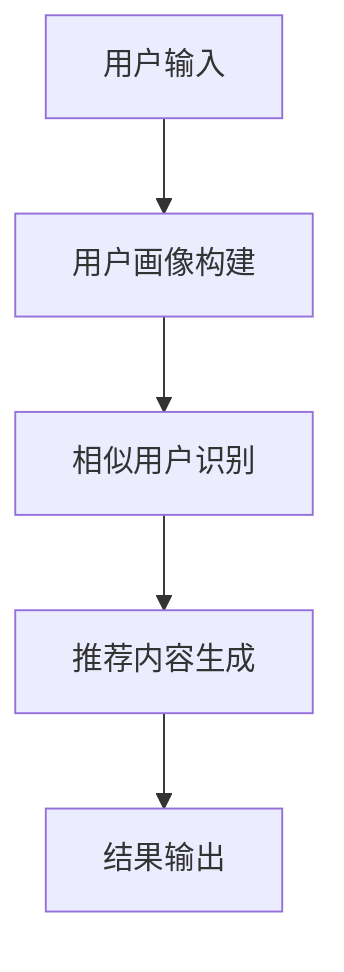

                 


# 构建智能企业培训系统：自适应学习路径与内容动态生成

## 关键词：
智能企业培训系统，自适应学习路径，内容动态生成，推荐算法，知识图谱

## 摘要：
智能企业培训系统通过自适应学习路径和内容动态生成技术，为企业员工提供个性化的学习体验。本文详细探讨了系统的核心概念、算法原理、系统架构及项目实战，旨在为企业培训师和技术开发者提供理论与实践的双重指导。

---

# 第一部分: 智能企业培训系统背景与核心概念

## 第1章: 智能企业培训系统概述

### 1.1 问题背景与挑战
传统的企业培训系统存在以下痛点：
- **学习需求多样性**：员工背景、技能水平和职业目标差异大，统一的教学方案难以满足个体需求。
- **资源浪费**：固定课程可能导致部分员工学习兴趣不高，资源利用率低。
- **反馈延迟**：传统培训难以实时捕捉学员的学习状态和反馈，影响学习效果。

### 1.2 自适应学习路径与内容动态生成
- **自适应学习路径**：根据学员的学习进度、兴趣和能力，动态调整学习路径。
- **内容动态生成**：基于学习者的需求，实时生成个性化学习内容。

### 1.3 系统边界与外延
- **边界**：系统仅关注员工学习过程，不涉及企业日常管理。
- **外延**：可扩展至知识管理系统、学习效果评估系统。

## 第2章: 核心概念与联系

### 2.1 自适应学习路径的核心原理
- **用户画像**：通过数据分析，构建学员的技能水平、学习风格和兴趣偏好。
- **路径动态调整**：基于用户画像，实时优化学习路径。

### 2.2 内容动态生成的实现方式
- **基于规则的生成**：通过预设规则生成标准化内容。
- **基于机器学习的生成**：利用自然语言处理生成个性化内容。
- **基于知识图谱的生成**：通过知识图谱构建内容的逻辑关系。

### 2.3 核心概念对比分析
| 对比维度 | 自适应学习路径 | 内容动态生成 |
|----------|----------------|--------------|
| 核心目标 | 优化学习路径 | 生成个性化内容 |
| 数据驱动 | 用户行为数据 | 内容需求数据 |
| 技术实现 | 机器学习算法 | NLP技术 |

### 2.4 ER实体关系图
```mermaid
er
  %%{init: { 'title': '系统实体关系图' }}
  %%{title: '智能企业培训系统 ER 图'}
  %%{width: 800}
  %%{height: 600}
  entity 用户 {
    id 用户ID
    姓名
    职位
    学历
    兴趣领域
    学习目标
  }
  entity 课程 {
    id 课程ID
    课程名称
    课程类型
    课程难度
    课程内容
  }
  entity 学习路径 {
    id 路径ID
    路径名称
    路径目标
    路径内容
  }
  entity 学习内容 {
    id 内容ID
    内容类型
    内容来源
    内容标签
  }
  relation 用户-学习路径 {
    关系：用户订阅学习路径
    外键：用户ID，路径ID
  }
  relation 学习路径-学习内容 {
    关系：路径包含内容
    外键：路径ID，内容ID
  }
  relation 内容-课程 {
    关系：内容来源于课程
    外键：内容ID，课程ID
  }
```

---

# 第二部分: 算法原理与数学模型

## 第3章: 自适应推荐算法原理

### 3.1 基于协同过滤的推荐算法
#### 3.1.1 算法流程


#### 3.1.2 数学模型
- **相似度计算**：
  $$ \text{相似度} = \frac{\sum (x_i - \bar{x})(y_i - \bar{y})}{\sqrt{\sum (x_i - \bar{x})^2} \cdot \sqrt{\sum (y_i - \bar{y})^2}} $$
  
- **推荐评分预测**：
  $$ \hat{r}_{u,i} = \bar{r} + \sum_{k} w_{u,k} \cdot (r_{k,i} - \bar{r}) $$

#### 3.1.3 代码实现
```python
def collaborative_filtering(user_item_matrix, user_id):
    user_mean = np.mean(user_item_matrix[user_id])
    similar_users = find_similar_users(user_id, user_item_matrix)
    recommended_items = []
    for user in similar_users:
        for item in user_item_matrix[user]:
            if item not in user_item_matrix[user_id]:
                recommended_items.append(item)
    return recommended_items
```

---

## 第4章: 内容生成模型的数学基础

### 4.1 语言模型的数学表达
- **概率分布**：
  $$ P(\text{sequence}) = \prod_{t=1}^{T} P(w_t | w_{t-1}) $$
  
- **损失函数**：
  $$ \text{loss} = -\sum_{t=1}^{T} \log P(w_t | w_{t-1}) $$

### 4.2 知识图谱构建
- **节点表示**：
  $$ e_i = f(\text{节点特征}) $$
  
- **边关系**：
  $$ r_{ij} = g(e_i, e_j) $$

---

# 第三部分: 系统分析与架构设计

## 第5章: 系统架构设计

### 5.1 问题场景介绍
- **目标**：构建一个支持自适应学习路径和内容动态生成的系统。
- **用户角色**：企业员工、培训管理者。

### 5.2 系统功能设计
- **用户模块**：用户注册、登录、学习记录管理。
- **学习路径模块**：学习路径生成、调整、评估。
- **内容生成模块**：内容推荐、内容生成、内容管理。

### 5.3 系统架构图


---

# 第四部分: 项目实战

## 第6章: 项目实战

### 6.1 环境安装
- **工具**：Python 3.8+，TensorFlow，Keras，Scikit-learn。
- **框架**：Flask或Django。

### 6.2 核心代码实现
```python
def generate_learning_path(user_profile, knowledge_graph):
    # 用户画像分析
    user_interests = user_profile['interests']
    user_level = user_profile['level']
    
    # 知识图谱遍历
    path = []
    current_node = user_interests[0]
    while current_node not in visited:
        path.append(current_node)
        visited.add(current_node)
        next_nodes = get_neighbors(current_node, knowledge_graph)
        next_node = select_next_node(next_nodes, user_level)
        current_node = next_node
    return path
```

### 6.3 实际案例分析
- **案例**：某公司员工小张，技能水平为初级，兴趣领域为数据分析。
- **学习路径生成**：概率论基础 → 数据可视化 → 数据分析工具 → 统计推断。

---

# 第五部分: 总结与展望

## 第7章: 总结与展望

### 7.1 本章小结
智能企业培训系统的构建需要结合自适应学习路径和内容动态生成技术，通过机器学习和知识图谱实现个性化学习。

### 7.2 未来展望
- **技术改进**：引入强化学习优化推荐算法。
- **应用扩展**：结合AR/VR技术提升学习体验。

---

## 最佳实践 Tips
1. 在实际项目中，建议先构建用户画像模块，再逐步实现内容生成和学习路径生成。
2. 确保数据质量和多样性，以提高推荐算法的效果。
3. 定期更新知识图谱，保持内容的时效性和准确性。

---

以上是《构建智能企业培训系统：自适应学习路径与内容动态生成》的完整目录和内容概要，涵盖了从理论到实践的各个方面，适合企业培训师、技术开发者和教育技术研究者阅读。

