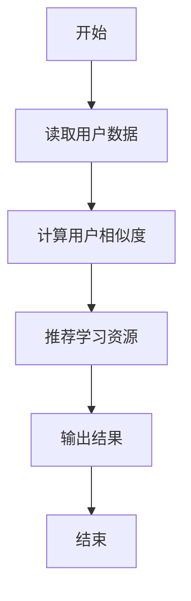
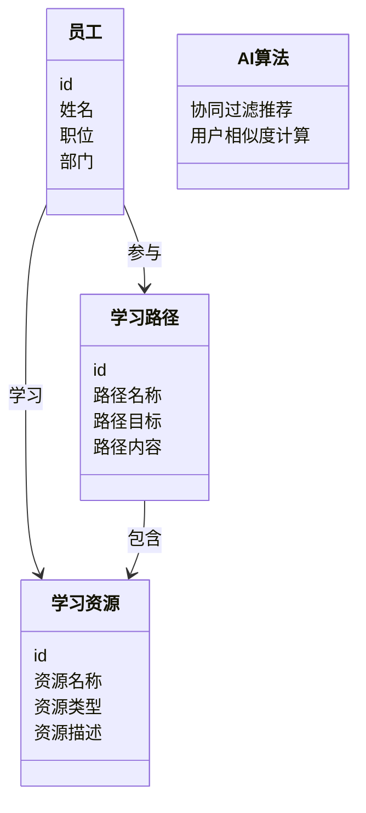
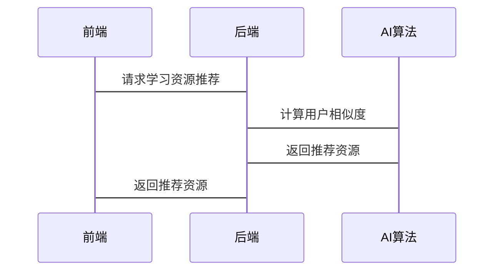

                 


# 《构建智能企业学习管理系统：个性化技能发展路径规划》

## 关键词：智能企业学习管理、个性化技能发展路径、AI技术、协同过滤推荐算法、系统架构设计

## 摘要：本文详细探讨了构建智能企业学习管理系统的必要性及其在个性化技能发展路径规划中的应用。通过分析AI技术在教育领域的潜力，提出了基于协同过滤推荐算法的学习管理系统设计方法，并结合系统架构设计和项目实战，展示了如何实现一个高效、个性化的学习管理系统。

---

# 第1章: 背景介绍

## 1.1 问题背景

### 1.1.1 传统企业学习管理的局限性
传统企业学习管理系统通常依赖固定的课程安排和统一的培训计划，难以满足员工个性化学习需求。员工的学习进度和兴趣差异较大，导致学习效果不佳。

### 1.1.2 个性化学习需求的兴起
随着企业对员工技能要求的提高，员工希望获得个性化的学习路径，以满足自身职业发展的需求。个性化学习能够提升员工的学习积极性和效果。

### 1.1.3 AI技术在教育领域的潜力
AI技术可以通过数据分析和机器学习算法，帮助系统自动识别员工的学习需求，并推荐适合的学习资源，从而实现个性化学习管理。

## 1.2 问题描述

### 1.2.1 企业学习资源分散与不匹配
企业内部的学习资源通常分散在不同的平台或部门中，员工难以方便地获取适合自己的学习资源。

### 1.2.2 员工技能发展路径不清晰
员工缺乏清晰的技能发展路径，难以制定有效的学习计划，导致学习目标不明确。

### 1.2.3 学习效果难以量化与反馈
传统学习管理系统难以量化学习效果，并提供及时的反馈，导致学习效果无法得到有效评估。

## 1.3 问题解决

### 1.3.1 引入AI技术实现个性化学习
通过AI技术，系统可以根据员工的学习历史和技能水平，推荐适合的学习资源和路径。

### 1.3.2 构建智能学习管理系统
构建一个基于AI的智能学习管理系统，能够实时分析员工的学习需求，并动态调整学习计划。

### 1.3.3 提供动态技能发展路径规划
系统可以根据员工的学习进度和反馈，动态调整技能发展路径，确保员工能够高效地提升技能。

## 1.4 边界与外延

### 1.4.1 系统功能边界
系统主要关注个性化学习和技能发展路径规划，不包括企业内部的其他管理系统功能。

### 1.4.2 与其他系统的接口关系
系统需要与企业的人力资源管理系统、知识管理系统等进行接口对接，确保数据的共享和流通。

### 1.4.3 系统的可扩展性与灵活性
系统设计时需要考虑可扩展性，以便在未来可以根据新的需求和技术发展进行功能扩展。

## 1.5 核心概念与核心要素

### 1.5.1 个性化学习
个性化学习是指根据员工的个人特点、兴趣和学习目标，提供定制化的学习内容和路径。

### 1.5.2 技能发展路径
技能发展路径是指根据员工的当前技能水平和职业发展目标，制定一系列的学习计划和目标。

### 1.5.3 AI驱动的学习管理系统
AI驱动的学习管理系统是一种基于人工智能技术，能够自动分析学习数据、推荐学习资源和调整学习路径的系统。

---

# 第2章: 核心概念与联系

## 2.1 核心概念原理

### 2.1.1 个性化学习的定义与实现
个性化学习是指根据员工的个性化需求，提供定制化的学习内容和路径。其实现需要依赖AI技术，通过分析员工的学习数据，推荐适合的学习资源。

### 2.1.2 技能发展路径的构建方法
技能发展路径的构建需要结合员工的职业发展目标和当前技能水平，通过数据分析和机器学习算法，制定个性化的学习计划。

### 2.1.3 AI在学习管理系统中的作用
AI技术在学习管理系统中的作用主要体现在数据分析、资源推荐和学习路径优化等方面。通过AI技术，系统可以实时分析员工的学习数据，推荐适合的学习资源，并动态调整学习路径。

## 2.2 核心概念对比

### 2.2.1 个性化学习与传统学习对比
个性化学习注重员工的个性化需求，而传统学习则是统一的课程安排。个性化学习能够提高员工的学习积极性和效果，而传统学习则难以满足员工的个性化需求。

### 2.2.2 技能发展路径与简单培训计划对比
技能发展路径注重员工的长期职业发展，而简单培训计划则是短期的技能提升。技能发展路径能够帮助员工实现职业目标，而简单培训计划则难以满足员工的长期需求。

### 2.2.3 AI驱动与非AI驱动学习管理系统的对比
AI驱动的学习管理系统能够通过数据分析和机器学习算法，实现个性化学习和动态调整学习路径，而非AI驱动的学习管理系统则缺乏这些功能，无法满足员工的个性化需求。

## 2.3 ER实体关系图

```mermaid
er
    entity 员工 {
        id
        姓名
        职位
        部门
    }
    entity 学习资源 {
        id
        资源名称
        资源类型
        资源描述
    }
    entity 学习路径 {
        id
        路径名称
        路径目标
        路径内容
    }
    relationship 学习资源关联 {
        员工 --> 学习资源: 学习
        员工 --> 学习路径: 参与
        学习路径 --> 学习资源: 包含
    }
```

---

# 第3章: 算法原理讲解

## 3.1 协同过滤推荐算法

### 3.1.1 算法原理
协同过滤推荐算法是一种基于用户行为和偏好推荐学习资源的算法。通过分析用户的学习历史和行为数据，系统可以找到与用户兴趣相似的其他用户，并推荐他们喜欢的学习资源。

### 3.1.2 算法流程图



### 3.1.3 Python实现代码

```python
def collaborative_filtering(user_id, user_data):
    # 计算用户相似度
    user_similarities = {}
    for user in user_data:
        if user != user_id:
            similarity = cosine_similarity(user_data[user], user_data[user_id])
            user_similarities[user] = similarity
    # 根据相似度排序
    sorted_users = sorted(user_similarities.items(), key=lambda x: x[1], reverse=True)
    # 返回推荐资源
    recommendations = []
    for user in sorted_users[:5]:
        recommendations.extend(user_data[user]['学习资源'])
    return recommendations
```

### 3.1.4 数学模型和公式

#### 余弦相似度公式
$$ \text{余弦相似度} = \frac{\sum_{i=1}^{n} w_i \cdot w'_i}{\sqrt{\sum_{i=1}^{n} w_i^2} \cdot \sqrt{\sum_{i=1}^{n} w'_i^2}} $$

#### 协同过滤推荐公式
$$ \text{推荐资源} = \argmax_{r \in R} \sum_{u \in U} \text{相似度}(u, r) \cdot \text{评分}(u, r) $$

---

# 第4章: 系统分析与架构设计方案

## 4.1 问题场景介绍

### 4.1.1 员工学习需求分析
员工需要根据自身的职业发展目标，选择适合的学习资源和路径。

### 4.1.2 学习资源管理
系统需要对各种类型的学习资源进行分类、存储和管理。

## 4.2 系统功能设计

### 4.2.1 领域模型


### 4.2.2 系统架构设计


### 4.2.3 系统接口设计
系统需要提供API接口，用于前端和后端的数据交互，以及与其他系统的接口对接。

### 4.2.4 系统交互流程图


---

# 第5章: 项目实战

## 5.1 环境安装

### 5.1.1 安装Python和相关库
```bash
pip install numpy pandas scikit-learn
```

### 5.1.2 安装前端框架
```bash
npm install vuejs
```

## 5.2 系统核心实现源代码

### 5.2.1 后端代码

```python
import numpy as np
from sklearn.metrics.pairwise import cosine_similarity

def calculate_similarity(user_data):
    # 将用户数据转换为矩阵
    user_matrix = np.array([user_data[user] for user in user_data])
    # 计算余弦相似度
    similarity_matrix = cosine_similarity(user_matrix)
    return similarity_matrix
```

### 5.2.2 前端代码

```javascript
<template>
    <div>
        <h1>个性化学习管理系统</h1>
        <ul>
            <li v-for="resource in recommendations"> {{resource}} </li>
        </ul>
    </div>
</template>
```

## 5.3 代码解读与分析

### 5.3.1 后端代码解读
后端代码主要实现了用户数据的相似度计算，使用了scikit-learn库的cosine_similarity函数。

### 5.3.2 前端代码解读
前端代码使用Vue.js框架，展示推荐的学习资源。

## 5.4 案例分析与详细讲解

### 5.4.1 案例分析
假设有一个员工A，系统会根据他的学习历史和职业目标，推荐相关的学习资源和路径。

### 5.4.2 详细讲解
详细讲解系统实现的每一步，包括数据收集、相似度计算、资源推荐等过程。

## 5.5 项目小结

### 5.5.1 项目实现的关键点
- 数据收集与处理
- 协同过滤算法的实现
- 系统的前后端交互设计

### 5.5.2 项目中的问题与解决方案
- 问题：数据量大，计算时间长
- 解决：优化算法，使用分布式计算

---

# 第6章: 最佳实践、小结、注意事项和拓展阅读

## 6.1 最佳实践

### 6.1.1 系统设计
- 确保系统的可扩展性和灵活性
- 定期更新学习资源和路径

### 6.1.2 算法优化
- 使用更高效的算法，如基于深度学习的推荐算法

## 6.2 小结

本文详细介绍了构建智能企业学习管理系统的必要性和实现方法。通过AI技术，系统能够实现个性化学习和动态调整学习路径，帮助员工高效地提升技能。

## 6.3 注意事项

### 6.3.1 数据隐私
确保员工数据的安全和隐私。

### 6.3.2 系统稳定性
确保系统的稳定运行，避免数据丢失和系统崩溃。

## 6.4 拓展阅读

### 6.4.1 推荐算法
- 基于深度学习的推荐算法
- 基于图的推荐算法

### 6.4.2 系统架构
- 微服务架构设计
- 分布式系统设计

---

# 结语

构建智能企业学习管理系统是一个复杂的系统工程，需要结合AI技术、系统架构设计和项目实战等多种因素。通过本文的详细讲解，读者可以深入了解系统的设计和实现方法，并能够实际操作，构建一个高效的智能企业学习管理系统。

