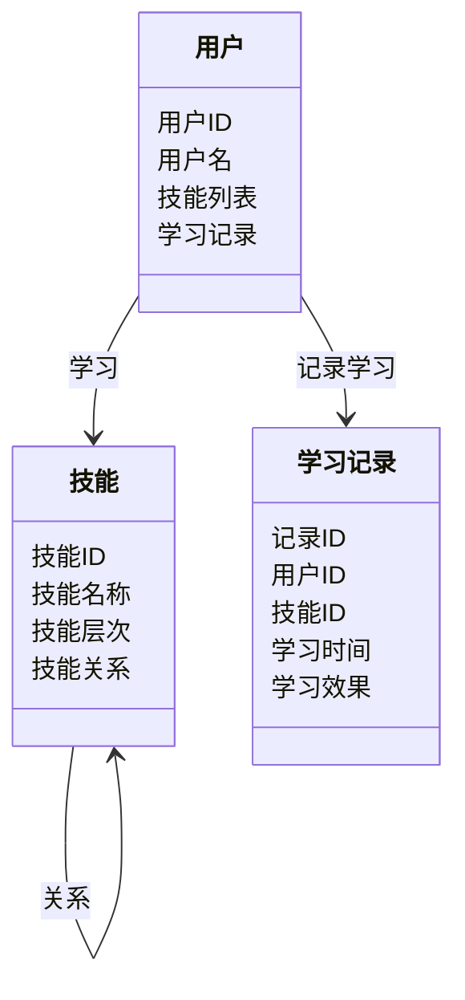
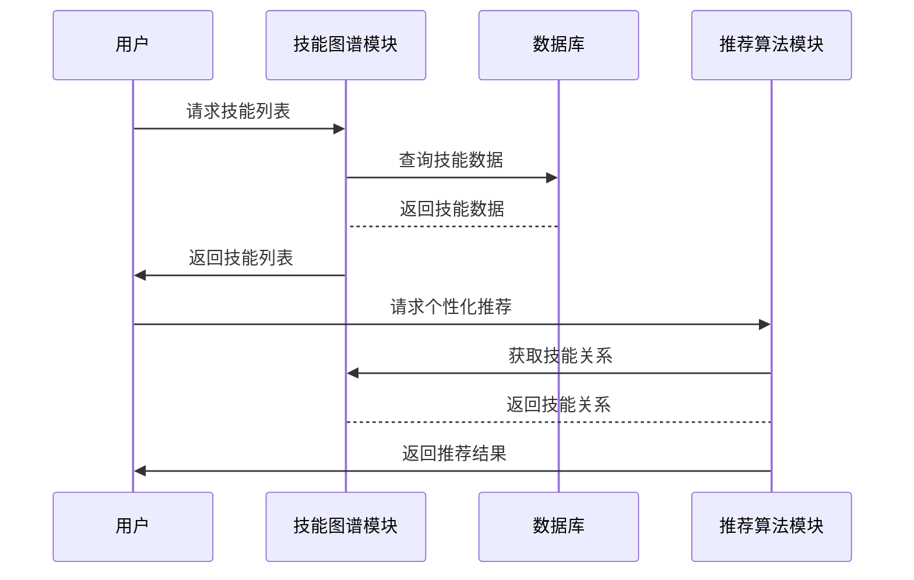

                 


# 构建智能企业学习管理系统：技能图谱与个性化发展规划

> 关键词：智能企业学习管理系统、技能图谱、个性化学习、推荐算法、系统架构设计

> 摘要：本文旨在探讨如何构建一个基于人工智能的智能企业学习管理系统，通过构建技能图谱和个性化学习发展规划，解决传统企业学习管理系统中的不足。文章详细阐述了技能图谱的构建方法、个性化学习的推荐算法，以及系统的架构设计，并通过实际案例分析展示了系统的实现与应用。

---

# 第一部分: 智能企业学习管理系统概述

## 第1章: 智能企业学习管理系统的背景与需求

### 1.1 传统企业学习管理系统的局限性

#### 1.1.1 传统学习管理系统的核心问题

传统的企业学习管理系统（LMS）主要依赖于固定的学习路径和课程推荐，这种方式难以满足员工个性化学习的需求。具体问题如下：

- **缺乏个性化推荐**：传统系统通常基于固定的课程分类或简单的规则进行推荐，无法根据员工的具体能力和需求提供个性化的学习计划。
- **数据孤岛问题**：系统之间数据孤立，难以整合企业内部的知识和技能数据，导致资源浪费。
- **反馈机制不足**：传统系统缺乏实时反馈机制，无法根据学习效果动态调整学习计划。

#### 1.1.2 现有系统的主要不足

- **技能匹配度低**：传统系统难以准确识别员工的技能水平和需求，导致推荐的课程与实际需求脱节。
- **学习体验不佳**：学习内容缺乏针对性，员工学习积极性不高，学习效果有限。
- **管理效率低下**：企业难以通过传统系统高效管理大规模员工的学习路径和进度。

#### 1.1.3 企业学习管理系统的未来发展趋势

- **智能化推荐**：通过人工智能技术实现个性化推荐，提升学习体验。
- **数据驱动决策**：利用大数据分析员工技能和学习行为，优化学习计划。
- **知识图谱构建**：通过构建企业技能图谱，实现知识的结构化和共享。

### 1.2 智能化学习管理系统的必要性

#### 1.2.1 人工智能技术对企业学习管理的推动作用

人工智能技术，特别是自然语言处理和机器学习，能够帮助企业构建技能图谱，实现精准的个性化推荐。例如，通过分析员工的学习历史和技能水平，系统可以自动生成个性化学习路径。

#### 1.2.2 技能图谱与个性化学习的市场需求

企业越来越重视员工的技能提升，技能图谱能够清晰地展示员工技能之间的关系，帮助企业制定更有针对性的培训计划。个性化学习则能够提高员工的学习积极性和效率。

#### 1.2.3 企业学习管理系统智能化的实现路径

- **数据采集与处理**：收集员工的学习数据、技能数据和行为数据。
- **技能图谱构建**：通过自然语言处理和知识图谱技术，构建企业的技能图谱。
- **个性化推荐算法**：基于技能图谱和学习数据，实现个性化推荐。

### 1.3 本书的核心目标与内容框架

#### 1.3.1 本书的核心目标

本文旨在通过构建技能图谱和个性化学习推荐系统，解决传统企业学习管理系统中的问题，提升企业学习管理的效率和效果。

#### 1.3.2 本书的主要内容框架

- **技能图谱的构建与分析**：详细讲解技能图谱的构建方法和应用场景。
- **个性化学习推荐算法**：介绍协同过滤、深度学习等推荐算法及其在个性化学习中的应用。
- **系统架构设计**：展示系统的整体架构，包括功能模块、数据流和接口设计。
- **项目实战**：通过实际案例分析，展示如何实现智能企业学习管理系统。

#### 1.3.3 本书的适用读者群体

- 企业IT管理人员
- 人工智能工程师
- 企业培训师
- 对个性化学习感兴趣的研究人员

### 1.4 本章小结

本章介绍了传统企业学习管理系统的局限性，提出了智能化学习管理系统的必要性，并详细阐述了本书的核心目标和内容框架。接下来的章节将从技能图谱和个性化推荐算法两个方面展开，详细讲解智能企业学习管理系统的实现方法。

---

# 第二部分: 技能图谱与个性化学习的核心概念

## 第2章: 技能图谱的构建与分析

### 2.1 技能图谱的基本概念

#### 2.1.1 技能图谱的定义与特点

**技能图谱**是一种将企业中的各种技能及其关系以图谱形式表示的知识结构。它能够清晰地展示技能之间的关系，帮助企业更好地理解和管理员工的技能。

**特点：**
- **结构化**：技能以节点形式存在，技能之间的关系以边表示。
- **动态更新**：技能图谱可以根据企业需求和员工学习情况动态更新。
- **可扩展性**：技能图谱可以随着企业的发展不断扩展。

#### 2.1.2 技能图谱的核心要素与组成

| 核心要素 | 描述 |
|----------|------|
| 技能节点 | 表示具体的技能，例如“Python编程”、“项目管理”。 |
| 技能关系 | 表示技能之间的关系，例如“属于”、“依赖”。 |
| 技能层次 | 表示技能的层次结构，例如初级、中级、高级。 |

#### 2.1.3 技能图谱与知识图谱的对比分析

| 对比维度 | 技能图谱 | 知识图谱 |
|----------|---------|----------|
| 核心目标 | 管理和提升员工技能 | 管理和组织知识 |
| 数据来源 | 企业技能数据 | 多源异构数据 |
| 应用场景 | 个性化学习推荐 | 知识问答、信息检索 |

### 2.2 技能图谱的构建方法

#### 2.2.1 数据采集与清洗

- **数据来源**：企业内部文档、员工简历、岗位要求。
- **数据清洗**：去除重复数据、填补缺失值、标注异常值。

#### 2.2.2 技能节点的抽取与识别

- **文本挖掘**：使用自然语言处理技术从文本中提取技能节点。
- **实体识别**：通过命名实体识别技术提取技能名称。

#### 2.2.3 技能关系的挖掘与建模

- **关系挖掘**：通过统计分析或语义分析挖掘技能之间的关系。
- **关系建模**：使用图论方法构建技能关系图。

#### 2.2.4 技能图谱的可视化与展示

- **可视化工具**：使用Gephi、Neo4j等工具进行图谱展示。
- **展示形式**：节点和边的布局优化，颜色和大小的调整。

### 2.3 技能图谱的分析与应用

#### 2.3.1 技能图谱的分析方法

- **节点分析**：分析技能节点的度数、中心性等指标，识别核心技能。
- **路径分析**：通过最短路径算法，找到技能之间的最短路径。

#### 2.3.2 技能图谱在个性化学习中的应用

- **技能推荐**：根据员工当前技能和技能图谱，推荐相关技能。
- **学习路径规划**：基于技能图谱，为员工规划最优学习路径。

#### 2.3.3 技能图谱对企业培训体系的优化作用

- **培训计划优化**：根据技能图谱分析结果，制定更有针对性的培训计划。
- **培训效果评估**：通过技能图谱动态评估培训效果。

### 2.4 技能图谱构建的挑战与解决方案

#### 2.4.1 数据质量与多样性问题

- **解决方案**：引入多源数据，使用数据清洗技术提升数据质量。

#### 2.4.2 技能关系的复杂性与不确定性

- **解决方案**：使用图嵌入技术（如Word2Vec）对技能关系进行建模。

#### 2.4.3 技能图谱的动态更新与维护

- **解决方案**：建立动态更新机制，定期更新技能图谱。

### 2.5 本章小结

本章详细讲解了技能图谱的基本概念、构建方法和分析应用。通过技能图谱，企业可以更好地管理和利用员工技能，为个性化学习推荐提供基础支持。接下来的章节将重点介绍个性化学习推荐算法及其实现方法。

---

## 第3章: 个性化学习规划的核心算法

### 3.1 基于协同过滤的推荐算法

#### 3.1.1 协同过滤的基本原理

协同过滤是一种基于用户相似性或物品相似性进行推荐的算法。其核心思想是：如果两个用户在历史行为上相似，那么他们对未接触过的物品也会有相似的偏好。

#### 3.1.2 基于用户的协同过滤算法

- **步骤**：
  1. 计算用户之间的相似度（如余弦相似度）。
  2. 根据相似用户的评分，预测目标用户的评分。
  3. 推荐评分最高的物品。

- **优缺点**：
  - 优点：简单易实现。
  - 缺点：计算复杂度高，难以处理大规模数据。

#### 3.1.3 基于物品的协同过滤算法

- **步骤**：
  1. 计算物品之间的相似度。
  2. 根据目标用户的历史评分，推荐相似物品。

- **优缺点**：
  - 优点：计算复杂度低。
  - 缺点：推荐结果可能不够精准。

#### 3.1.4 协同过滤算法的优缺点分析

- **优点**：能够利用用户历史行为数据，推荐结果具有较高的相关性。
- **缺点**：难以处理冷启动问题（新用户或新物品的推荐）。

### 3.2 基于深度学习的推荐算法

#### 3.2.1 基于神经网络的推荐模型

- **模型结构**：
  - 输入层：用户特征和物品特征。
  - 隐藏层：通过神经网络提取特征。
  - 输出层：预测评分或推荐结果。

- **优缺点**：
  - 优点：能够处理高维数据，捕捉复杂的特征关系。
  - 缺点：模型复杂，计算资源需求高。

#### 3.2.2 基于注意力机制的推荐算法

- **原理**：
  - 在神经网络中引入注意力机制，关注重要的特征。
  - 通过自注意力机制捕捉序列数据中的长程依赖关系。

- **应用场景**：
  - 时间序列数据（如用户点击流）。

#### 3.2.3 基于生成对抗网络的推荐方法

- **原理**：
  - 使用生成器和判别器，生成多样化的推荐结果。
  - 判别器通过区分真实数据和生成数据，提升生成器的推荐能力。

- **优点**：
  - 能够生成多样化的推荐结果。

### 3.3 个性化学习规划的混合推荐算法

#### 3.3.1 混合推荐算法的基本概念

- **混合推荐**：将协同过滤和深度学习两种算法结合，取长补短。

#### 3.3.2 协同过滤与深度学习的混合推荐模型

- **实现步骤**：
  1. 使用协同过滤算法进行初步推荐。
  2. 使用深度学习模型对推荐结果进行优化。

- **优缺点**：
  - 优点：结合了两种算法的优势。
  - 缺点：模型复杂度增加，实现难度较高。

### 3.4 算法实现的数学模型与公式

#### 3.4.1 协同过滤算法的数学公式

- **余弦相似度**：
  $$\text{sim}(u, v) = \frac{\sum u_i v_i}{\sqrt{\sum u_i^2} \sqrt{\sum v_i^2}}$$

- **预测评分**：
  $$\hat{r}_{u,i} = \frac{\sum_{u'} \text{sim}(u, u') \cdot r_{u',i}}{\sum_{u'} \text{sim}(u, u')}$$

#### 3.4.2 深度学习推荐模型的数学表达

- **输入层**：
  - 用户特征向量：$$\mathbf{u} \in \mathbb{R}^d$$
  - 物品特征向量：$$\mathbf{i} \in \mathbb{R}^d$$

- **隐藏层**：
  - 矩阵乘法：$$\mathbf{W} \in \mathbb{R}^{d \times m}$$
  - 激活函数：$$\mathbf{h} = \text{ReLU}(\mathbf{W}[\mathbf{u}, \mathbf{i}])$$

- **输出层**：
  - 推荐评分：$$\hat{y} = \text{sigmoid}(\mathbf{h}^T \mathbf{w})$$

#### 3.4.3 混合推荐算法的数学模型

- **协同过滤部分**：
  $$\hat{r}_{u,i} = \mu + u_u + i_i$$

- **深度学习部分**：
  $$\hat{y}_{u,i} = \text{NN}(\mathbf{u}, \mathbf{i})$$

- **最终评分**：
  $$r_{u,i} = \alpha \hat{r}_{u,i} + (1 - \alpha) \hat{y}_{u,i}$$

### 3.5 本章小结

本章详细介绍了协同过滤、深度学习以及混合推荐算法的原理和实现方法。这些算法为企业实现个性化学习推荐提供了理论基础和技术支持。接下来的章节将重点介绍系统的架构设计和实际实现。

---

## 第4章: 智能企业学习管理系统架构设计

### 4.1 系统需求分析

#### 4.1.1 问题场景介绍

- **目标**：为员工提供个性化学习推荐。
- **约束条件**：
  - 系统需要支持大规模用户和技能数据。
  - 系统需要具备动态更新能力。

#### 4.1.2 项目介绍

- **项目目标**：构建一个基于技能图谱的智能企业学习管理系统。
- **项目范围**：包括技能图谱构建、个性化推荐算法实现、系统界面设计。

### 4.2 系统功能设计

#### 4.2.1 领域模型（Mermaid 类图）



#### 4.2.2 系统架构设计（Mermaid 架构图）


### 4.3 系统接口设计与交互流程

#### 4.3.1 系统接口设计（Mermaid 接口图）

```mermaid
api Diagram

    用户
    |------------------|
    |  GET /skills    |
    |  POST /recommend|
    |------------------|
    | 技能图谱模块    |
    |                 |
    | 推荐算法模块    |
```

#### 4.3.2 系统交互流程（Mermaid 序列图）



### 4.4 本章小结

本章详细讲解了系统的架构设计，包括功能模块、数据流和接口设计。通过合理的架构设计，系统能够高效地实现技能图谱构建和个性化推荐功能。接下来的章节将重点介绍系统的实际实现和优化方法。

---

## 第5章: 项目实战

### 5.1 搭建开发环境

- **工具安装**：
  - Python 3.8+
  - PyTorch 1.9+
  -Neo4j 4.0+

### 5.2 系统核心实现

#### 5.2.1 技能图谱构建代码

```python
import neo4j
from neo4j import GraphDatabase

# 连接到 Neo4j 数据库
driver = GraphDatabase.driver("bolt://localhost:7687", auth=("neo4j", "password"))

# 创建技能节点
def create_skill_nodes(driver, skills):
    with driver.session() as session:
        for skill in skills:
            session.run("CREATE (:Skill {name: $name})", name=skill)

# 创建技能关系
def create_skill_relationships(driver, relationships):
    with driver.session() as session:
        for rel in relationships:
            session.run("MATCH (a:Skill {name: $a}), (b:Skill {name: $b}) CREATE (a)-[r:RELATED_TO {weight: $weight}]->(b)",
                        a=rel['a'], b=rel['b'], weight=rel['weight'])

# 示例数据
skills = ["Python编程", "数据处理", "机器学习"]
relationships = [
    {"a": "Python编程", "b": "数据处理", "weight": 0.8},
    {"a": "数据处理", "b": "机器学习", "weight": 0.7}
]

create_skill_nodes(driver, skills)
create_skill_relationships(driver, relationships)
```

#### 5.2.2 个性化推荐算法实现

```python
import numpy as np

# 协同过滤算法
class CollaborativeFiltering:
    def __init__(self, ratings):
        self.ratings = ratings
        self.user_mean = {}
        self.item_mean = {}

    def compute_mean_ratings(self):
        for user in self.ratings:
            self.user_mean[user] = np.mean(self.ratings[user])
        for item in set([rating[1] for ratings in self.ratings.values()]):
            self.item_mean[item] = np.mean([self.ratings[user][item] for user in self.ratings if item in self.ratings[user]])

    def predict(self, user, item):
        if user not in self.user_mean or item not in self.item_mean:
            return 0.0
        return self.user_mean[user] + self.item_mean[item]

# 示例数据
ratings = {
    'user1': {'item1': 4, 'item2': 3},
    'user2': {'item1': 3, 'item3': 5},
    'user3': {'item2': 4, 'item3': 4}
}

cf = CollaborativeFiltering(ratings)
cf.compute_mean_ratings()
print(cf.predict('user1', 'item3'))  # 输出预测评分
```

### 5.3 项目优化与测试

- **性能优化**：
  - 使用分布式计算优化推荐算法。
  - 优化技能图谱的查询效率。

- **测试与验证**：
  - 单元测试：测试技能图谱构建和推荐算法的准确性。
  - 性能测试：测试系统在大规模数据下的响应时间。

### 5.4 本章小结

本章通过实际案例展示了如何搭建开发环境、实现系统核心功能以及进行项目优化与测试。通过这些实战，读者可以更好地理解智能企业学习管理系统的实现过程。

---

## 第6章: 总结与展望

### 6.1 本书总结

- **核心内容**：构建智能企业学习管理系统，重点在于技能图谱的构建和个性化推荐算法的实现。
- **主要方法**：通过协同过滤和深度学习算法实现个性化推荐，构建技能图谱优化学习路径。

### 6.2 项目经验总结

- **成功经验**：
  - 技能图谱的构建能够显著提升学习推荐的准确性。
  - 混合推荐算法能够提高推荐的多样性和准确性。

- **教训与改进**：
  - 数据质量对推荐结果影响较大，需要引入更多高质量数据。
  - 系统性能优化需要进一步研究。

### 6.3 未来展望

- **技术发展**：
  - 推荐算法的进一步优化，如引入强化学习。
  - 技能图谱的动态更新和自适应优化。

- **应用场景扩展**：
  - 技能图谱在企业培训、人才招聘中的应用。
  - 个性化学习在教育领域的拓展。

### 6.4 本章小结

本章总结了全文的主要内容和项目经验，展望了未来的发展方向。通过本书的学习，读者可以掌握构建智能企业学习管理系统的相关技术和方法。

---

**附录**

- **技能图谱构建工具**：Neo4j、Neo4j Browser
- **推荐算法库**：PyTorch、Scikit-learn
- **开发框架**：Django、Flask

---

通过以上详细的内容，希望为读者提供一个清晰、全面的智能企业学习管理系统构建指南。从理论到实践，从概念到代码，帮助读者逐步掌握相关技术和方法。

