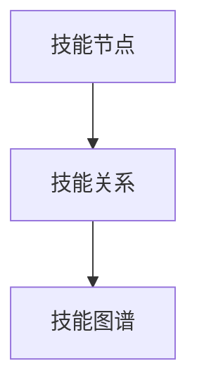
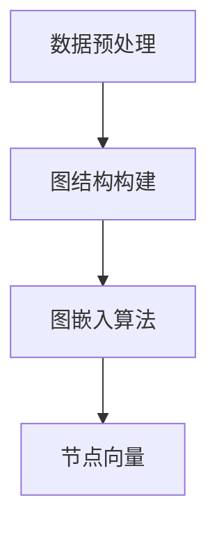
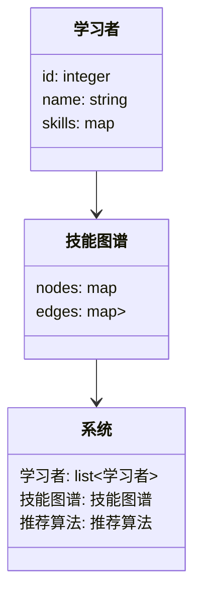

                 


# 构建智能企业学习管理系统：技能图谱与个性化发展规划的融合

---

## 关键词：
智能企业学习管理系统、技能图谱、个性化学习发展、人工智能、知识图谱、学习路径规划

---

## 摘要：
随着企业对员工技能要求的不断提高，构建一个智能企业学习管理系统显得尤为重要。本文将探讨如何通过技能图谱和个性化发展规划的融合，提升企业学习管理系统的智能化水平。通过分析技能图谱的构建方法和个性化学习规划的推荐算法，结合系统的架构设计和项目实战，本文将为企业提供一套高效、个性化的学习管理系统解决方案。

---

## 第一章: 背景与概述

### 1.1 智能企业学习管理系统的背景

#### 1.1.1 企业学习管理的发展历程
企业学习管理从最初的纸质记录到基于规则的系统，逐步发展为智能化的个性化学习平台。近年来，随着人工智能和大数据技术的进步，企业学习管理系统变得更加智能和个性化。

#### 1.1.2 当前企业学习管理的痛点
传统的企业学习管理系统存在以下问题：
- **学习资源分散**：员工难以找到适合自己的学习资源。
- **学习路径单一**：缺乏个性化的学习路径推荐。
- **技能评估不精准**：难以准确评估员工技能水平。
- **反馈机制缺失**：学习效果无法有效反馈到学习计划中。

#### 1.1.3 技能图谱与个性化发展的融合意义
技能图谱通过构建技能之间的关系网络，帮助系统更好地理解技能之间的关联性。个性化发展则根据员工的特点和需求，制定个性化的学习计划。两者的融合能够提升企业学习管理系统的智能化水平，实现精准的学习资源推荐和个性化的学习路径设计。

---

### 1.2 技能图谱与个性化发展的核心概念

#### 1.2.1 技能图谱的定义与特点
技能图谱是一种通过图结构表示技能及其关系的知识图谱。它能够清晰地展示技能之间的依赖关系和关联性，帮助系统更好地理解和推荐学习资源。

#### 1.2.2 个性化学习规划的定义与特点
个性化学习规划是指根据员工的特点、目标和当前技能水平，制定个性化的学习计划。它能够最大化员工的学习效率，并满足企业的用人需求。

#### 1.2.3 技能图谱与个性化发展的关联性
技能图谱为个性化学习规划提供了丰富的技能信息和关联关系，而个性化学习规划则根据员工的需求和特点，优化技能图谱的应用。

---

## 第二章: 技能图谱与个性化发展的核心概念

### 2.1 技能图谱的构建原理

#### 2.1.1 技能节点与关系的定义
技能节点是技能图谱的基本单位，表示具体的技能或知识点。节点之间的关系表示技能之间的依赖或关联。

#### 2.1.2 技能图谱的构建流程
1. 数据收集：从企业的知识库、课程资料和员工技能评估中收集技能数据。
2. 数据预处理：去除重复和冗余的技能节点，清洗数据。
3. 图结构构建：根据技能之间的关系，构建图结构。
4. 图嵌入：使用图嵌入算法（如Word2Vec、GraphSAGE）生成节点的向量表示。

#### 2.1.3 技能图谱的核心属性对比表

| 属性 | 技能节点 | 技能关系 |
|------|---------|---------|
| 定义 | 表示具体的技能或知识点 | 表示技能之间的依赖或关联 |
| 示例 | Python编程、项目管理 | 需要Python编程才能掌握数据处理 |

#### 2.1.4 技能图谱的概念结构图


---

### 2.2 个性化学习规划的原理

#### 2.2.1 学习者画像的构建
学习者画像是通过分析员工的学习历史、技能水平和职业目标，构建的个性化学习模型。它包括员工的兴趣、学习风格和技能缺口等信息。

#### 2.2.2 学习目标的分解
根据员工的职业目标，将整体目标分解为具体的技能目标。例如，将“成为数据分析师”分解为“掌握Python编程、数据可视化、统计分析”等具体技能。

#### 2.2.3 学习路径的推荐算法
推荐算法基于技能图谱和学习者画像，计算出最适合员工的学习路径。常用算法包括协同过滤和基于内容的推荐算法。

---

### 2.3 技能图谱与个性化发展的关联性

#### 2.3.1 技能图谱在个性化学习中的应用
技能图谱为个性化学习提供了丰富的技能关系和推荐依据。通过分析技能之间的关系，系统可以推荐相关联的技能，帮助员工构建完整的技能体系。

#### 2.3.2 个性化学习规划对技能图谱的反哺作用
个性化学习规划能够根据员工的学习效果和反馈，优化技能图谱中的技能关系和权重。这使得技能图谱更加动态和精准。

#### 2.3.3 两者的协同优化机制
通过技能图谱和个性化学习规划的协同优化，系统能够实现技能的精准推荐和学习路径的动态调整。这种协同优化机制能够显著提升企业学习管理系统的效率和效果。

---

## 第三章: 技能图谱构建的算法与数学模型

### 3.1 图嵌入算法

#### 3.1.1 Word2Vec在技能图谱中的应用
Word2Vec是一种常用的文本嵌入算法，可以用于技能图谱中的节点嵌入。通过将技能节点映射为向量，系统可以计算技能之间的相似性和关联性。

#### 3.1.2 GraphSAGE算法的原理与实现
GraphSAGE是一种基于归纳式图神经网络的算法，适用于大规模图数据的嵌入学习。它通过聚合邻居节点的信息，生成节点的嵌入表示。

#### 3.1.3 图嵌入算法的比较与选择
以下表格展示了Word2Vec和GraphSAGE在技能图谱构建中的对比：

| 参数 | Word2Vec | GraphSAGE |
|------|----------|-----------|
| 数据规模 | 适用于小规模数据 | 适用于大规模数据 |
| 是否需要标签 | 不需要 | 可以利用标签信息 |
| 复杂度 | 较低 | 较高 |

#### 3.1.4 技能图谱构建的流程图


### 3.2 技能图谱构建的数学模型

#### 3.2.1 图结构表示的数学公式
技能图谱可以用图论中的图表示，包含节点和边。节点表示技能，边表示技能之间的关系。

$$
G = (V, E)
$$

其中，$V$ 是节点的集合，$E$ 是边的集合。

#### 3.2.2 节点嵌入的计算公式
使用Word2Vec算法，节点嵌入的计算公式为：

$$
v_i = \text{skip-gram}(i)
$$

其中，$v_i$ 表示节点$i$的嵌入向量。

#### 3.2.3 边权重计算的数学模型
边权重可以通过余弦相似度计算：

$$
w_{ij} = \cos(\theta_i, \theta_j)
$$

其中，$\theta_i$ 和 $\theta_j$ 分别是节点$i$和节点$j$的嵌入向量。

---

## 第四章: 个性化学习规划的算法与模型

### 4.1 个性化学习规划的推荐算法

#### 4.1.1 基于协同过滤的推荐算法
协同过滤算法通过分析用户的相似性，推荐相似用户的技能。公式为：

$$
\text{相似度}(u, v) = \frac{\sum_{i \in I_u \cap I_v} (r_i - \bar{r}_u)(r_i - \bar{r}_v)}{\sqrt{\sum_{i \in I_u} (r_i - \bar{r}_u)^2} \sqrt{\sum_{i \in I_v} (r_i - \bar{r}_v)^2}}
$$

其中，$u$ 和 $v$ 分别是用户，$I_u$ 和 $I_v$ 是用户$u$和$v$的交互项集合，$\bar{r}_u$ 是用户$u$的平均评分。

#### 4.1.2 基于内容的推荐算法
内容-based推荐算法通过分析技能的属性和特征，推荐与当前技能相关的技能。公式为：

$$
\text{相似度}(s_i, s_j) = \sum_{k=1}^n w_k \cdot f_k(s_i, s_j)
$$

其中，$w_k$ 是特征$k$的权重，$f_k(s_i, s_j)$ 是特征$k$在技能$s_i$和$s_j$中的值。

---

## 第五章: 系统分析与架构设计

### 5.1 系统功能设计

#### 5.1.1 领域模型
系统功能设计的领域模型如图所示：



---

## 第六章: 项目实战

### 6.1 环境搭建

#### 6.1.1 安装依赖
需要安装以下Python库：
- networkx
- numpy
- scikit-learn
- matplotlib

---

### 6.2 核心代码实现

#### 6.2.1 技能图谱构建
```python
import networkx as nx

def build_skill_graph(skills):
    G = nx.Graph()
    for skill in skills:
        G.add_node(skill)
    # 添加边（关系）
    for i in range(len(skills)-1):
        G.add_edge(skills[i], skills[i+1])
    return G
```

#### 6.2.2 图嵌入算法实现
```python
from sklearn.feature_extraction.text import TfidfVectorizer

def word_to_vec(words):
    vectorizer = TfidfVectorizer()
    X = vectorizer.fit_transform(words)
    return X
```

---

## 第七章: 总结与展望

### 7.1 总结
本文详细探讨了技能图谱和个性化发展规划的融合，提出了构建智能企业学习管理系统的解决方案。通过技能图谱和个性化学习规划的协同优化，能够显著提升企业学习管理的效率和效果。

### 7.2 展望
未来，随着人工智能和大数据技术的进一步发展，企业学习管理系统将更加智能化和个性化。技能图谱和个性化发展规划的融合将为企业学习管理提供更加精准和高效的解决方案。

---

以上就是《构建智能企业学习管理系统：技能图谱与个性化发展规划的融合》的完整内容。

