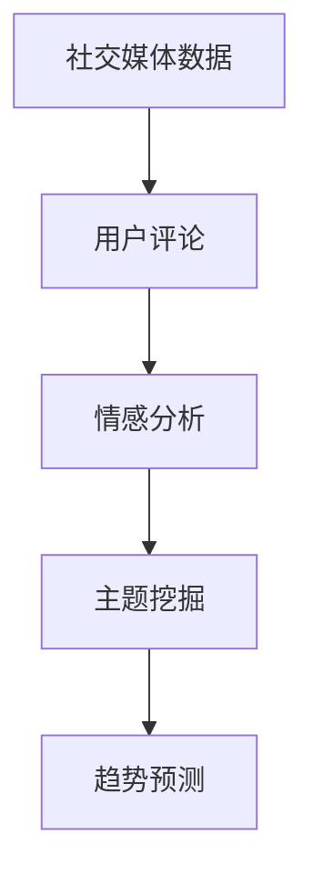

                 


# 构建智能企业市场调研系统：社交媒体情感分析与趋势预测

## 关键词：社交媒体，情感分析，市场调研，趋势预测，大数据，NLP，深度学习

## 摘要：
在数字化时代，社交媒体已成为企业市场调研的重要来源。本文将探讨如何利用社交媒体数据，通过情感分析和趋势预测构建智能市场调研系统，帮助企业及时捕捉市场动态，提升竞争力。

---

## 第一部分：背景与概述

### 第1章：问题背景与目标

#### 1.1 问题背景介绍
- **社交媒体的兴起**：社交媒体平台如Twitter、Facebook和LinkedIn为企业提供了海量用户反馈数据，成为市场调研的重要来源。
- **传统调研方法的局限性**：传统方法依赖问卷调查和焦点小组，耗时且成本高，且难以捕捉实时市场动态。
- **企业需求**：企业需要快速、高效地分析社交媒体数据，提取情感和趋势，以支持决策。

#### 1.2 系统目标与架构
- **目标**：构建一个智能系统，自动从社交媒体数据中提取情感和趋势，提供实时市场洞察。
- **架构**：模块化设计，包括数据采集、预处理、情感分析、主题挖掘、趋势预测和结果可视化。

---

## 第二部分：核心概念与联系

### 第2章：核心概念与联系

#### 2.1 核心概念原理
- **情感分析**：识别文本中的情感倾向，分为正面、负面和中性。
- **主题挖掘**：发现文本中的主题，如产品功能或竞争对手。
- **趋势预测**：基于历史数据预测未来市场趋势。

#### 2.2 核心概念对比表
| 概念        | 情感分析 | 主题挖掘 | 趋势预测 |
|-------------|----------|----------|----------|
| 目标        | 情感倾向 | 主题识别 | 趋势预测 |
| 方法        | 词袋模型 | LDA      | ARIMA    |
| 数据类型    | 文本      | 文本      | 时间序列 |

#### 2.3 实体关系图


---

## 第三部分：算法原理讲解

### 第3章：情感分析算法

#### 3.1 基于TF-IDF的情感分析
- **流程图**：
  ```mermaid
  graph TD
      A[文本预处理] --> B[计算TF-IDF]
      B --> C[计算余弦相似度]
  ```
- **Python代码**：
  ```python
  from sklearn.feature_extraction.text import TfidfVectorizer

  vectorizer = TfidfVectorizer()
  tfidf = vectorizer.fit_transform(texts)
  cosine_sim = (tfidf * tfidf.T).A
  ```
- **数学模型**：
  $$\text{余弦相似度} = \frac{\vec{A} \cdot \vec{B}}{|\vec{A}| |\vec{B}|}$$

---

### 第4章：主题挖掘算法

#### 4.1 基于LDA的主题挖掘
- **流程图**：
  ```mermaid
  graph TD
      A[文本预处理] --> B[构建词袋] --> C[应用LDA]
  ```
- **Python代码**：
  ```python
  from gensim import corpora, models

  dictionary = corpora.Dictionary(texts)
  corpus = [dictionary.doc2bow(text) for text in texts]
  lda = models.LdaModel(corpus, num_topics=5)
  ```
- **数学模型**：
  $$\text{LDA模型} = \text{主题} \times \text{词语分布}$$

---

### 第5章：趋势预测算法

#### 5.1 基于ARIMA的预测模型
- **流程图**：
  ```mermaid
  graph TD
      A[数据预处理] --> B[训练ARIMA模型] --> C[生成预测]
  ```
- **Python代码**：
  ```python
  from statsmodels.tsa.arima_model import ARIMA

  model = ARIMA(history, order=(5,1,0))
  model_fit = model.fit(disp=0)
  forecast = model_fit.forecast(steps=10)
  ```
- **数学模型**：
  $$\text{ARIMA}(p, d, q) = \text{自回归} + \text{差分} + \text{移动平均}$$

---

## 第四部分：系统分析与架构设计

### 第6章：系统分析与架构设计

#### 6.1 系统功能设计
- **模块化设计**：数据采集、预处理、情感分析、主题挖掘、趋势预测和可视化。
- **领域模型**：
  ```mermaid
  classDiagram
      class 数据采集 {
          获取数据
      }
      class 预处理 {
          清洗数据
      }
      数据采集 --> 预处理
  ```

#### 6.2 系统架构设计
- **架构图**：
  ```mermaid
  graph TD
      A[数据源] --> B[数据采集模块]
      B --> C[预处理模块]
      C --> D[分析模块]
      D --> E[可视化模块]
  ```

#### 6.3 系统接口设计
- **API接口**：RESTful API，提供数据输入和结果输出接口。

#### 6.4 系统交互流程
- **交互流程图**：
  ```mermaid
  graph TD
      A[用户输入数据] --> B[数据采集模块]
      B --> C[预处理模块]
      C --> D[分析模块]
      D --> E[用户输出结果]
  ```

---

## 第五部分：项目实战

### 第7章：项目实战

#### 7.1 环境安装
- **工具**：Python、Jupyter Notebook、相关库（如NLTK、Gensim、Scikit-learn）。

#### 7.2 核心实现
- **情感分析代码**：
  ```python
  from textblob import TextBlob

  blob = TextBlob("I love this product")
  print(blob.sentiment.polarity)
  ```

#### 7.3 案例分析
- **案例**：分析某产品的社交媒体评论，提取情感和主题，预测未来销售趋势。

#### 7.4 分析与总结
- **结果分析**：展示情感分布和主题词云，预测趋势图表。
- **经验总结**：算法选择、数据质量对结果的影响。

---

## 第六部分：总结与最佳实践

### 第8章：总结与最佳实践

#### 8.1 小结
- 系统整合了情感分析和趋势预测，为企业提供智能化市场调研工具。

#### 8.2 最佳实践
- 数据预处理：清洗和标注数据，确保准确性。
- 模型优化：选择合适算法，调整参数，提升性能。
- 定期更新：根据市场变化，持续优化模型。

#### 8.3 注意事项
- 数据隐私：遵守相关法规，保护用户隐私。
- 模型局限：了解算法局限，避免过度依赖。

#### 8.4 拓展阅读
- 推荐书籍和论文，深入学习NLP和时间序列分析。

---

## 结语
通过本文，读者将了解如何利用社交媒体数据构建智能市场调研系统，掌握关键算法和系统设计方法，为企业在数字化时代提供有力支持。

