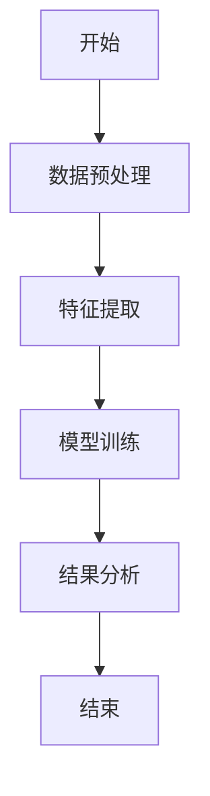
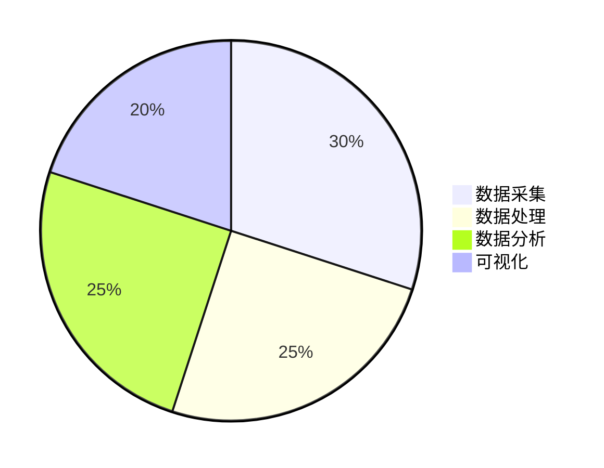

                 


# 构建智能企业市场调研系统：社交媒体聆听与趋势分析

## 关键词：智能企业，市场调研系统，社交媒体聆听，趋势分析，数据挖掘，机器学习，自然语言处理

## 摘要：  
随着企业竞争的加剧，市场调研的重要性日益凸显。传统的市场调研方法依赖于问卷调查和面对面访谈，耗时长、成本高且难以捕捉实时市场动态。在数字化时代，社交媒体作为信息的主要来源之一，为企业提供了海量的用户反馈数据。本文将详细介绍如何利用社交媒体数据构建智能企业市场调研系统，通过数据挖掘、自然语言处理和机器学习等技术，实现对市场趋势的实时监测和精准分析。文章将从系统背景、核心概念、算法原理、系统架构设计、项目实战等多个维度展开，为读者提供一套完整的解决方案。

---

# 第一部分: 智能企业市场调研系统概述

## 第1章: 背景与核心概念

### 1.1 市场调研的重要性  
市场调研是企业制定战略决策的重要依据。通过分析市场需求、竞争态势和消费者行为，企业可以更好地把握市场动向，优化产品设计，制定有效的营销策略。然而，传统的市场调研方法存在以下问题：  
- 数据来源单一，难以覆盖全网信息。  
- 数据处理耗时长，难以实时响应市场变化。  
- 数据分析依赖人工经验，难以实现自动化和精准化。  

---

### 1.2 社交媒体聆听与趋势分析的背景  
社交媒体作为信息传播的主要平台，每天产生海量的用户评论、点赞、分享等数据。这些数据蕴含着丰富的市场信息，包括消费者对产品的看法、品牌声誉、行业趋势等。通过实时监测和分析这些数据，企业可以快速捕捉市场动态，做出敏捷的决策。  

#### 核心概念  
- **社交媒体聆听**：通过收集和分析社交媒体上的用户评论、帖子、点赞等数据，提取有价值的信息。  
- **趋势分析**：基于时间序列数据，识别市场趋势的变化，预测未来的发展方向。  

---

### 1.3 问题背景与描述  
企业在市场调研中面临以下问题：  
- 数据来源分散，难以高效整合。  
- 数据量大且复杂，难以快速处理。  
- 数据分析依赖人工经验，难以实现自动化和精准化。  

#### 解决方案  
通过构建智能企业市场调研系统，利用自然语言处理（NLP）、机器学习和数据挖掘技术，实现对社交媒体数据的自动化处理和分析。系统将实时监测市场动态，提取关键指标，为企业提供数据支持。

---

## 第2章: 核心概念与联系

### 2.1 核心概念的原理  
- **社交媒体聆听**：通过爬虫技术从社交媒体平台获取用户数据，包括评论、点赞、转发等。  
- **趋势分析**：基于时间序列数据，使用统计学和机器学习方法，识别趋势的变化。  

### 2.2 概念属性特征对比  
以下是核心概念的对比表格：  

| 概念       | 数据来源 | 数据类型 | 分析方法 | 输出结果 |
|------------|----------|----------|----------|----------|
| 社交媒体聆听 | 社交平台 | 文本、点赞 | NLP、统计分析 | 用户情绪、品牌声誉 |
| 趋势分析    | 市场动态 | 时间序列 | 机器学习 | 市场趋势预测 |

### 2.3 ER实体关系图架构  
以下是系统的核心实体关系图：  

```mermaid
erd
    title 实体关系图
    系统
        id: SystemID
        名称: SystemName
    用户
        id: UserID
        名称: UserName
    数据
        id: DataID
        类型: DataType
    分析结果
        id: ResultID
        类型: ResultType
    系统 --> 用户
    系统 --> 数据
    系统 --> 分析结果
    用户 --> 数据
```

---

## 第3章: 算法原理讲解

### 3.1 算法原理概述  
- **自然语言处理（NLP）**：用于处理社交媒体上的文本数据，提取关键词、情感倾向等信息。  
- **机器学习**：用于训练分类模型，识别用户评论的情感极性（正面、负面、中性）。  

#### 算法流程图  
以下是算法的流程图：  



### 3.2 数学模型与公式  
以下是一个情感分类的简单模型：  

$$ P(\text{正面}| \text{评论} = x) = \frac{\sum_{i=1}^{n} w_i x_i + b}{1 + e^{-\sum_{i=1}^{n} w_i x_i - b}} $$  

其中，$w_i$ 是特征权重，$x_i$ 是特征值，$b$ 是偏置项。  

---

## 第4章: 系统架构设计

### 4.1 系统模块设计  
系统主要包括以下模块：  
1. 数据采集模块：负责从社交媒体平台获取数据。  
2. 数据处理模块：对数据进行清洗和预处理。  
3. 数据分析模块：使用NLP和机器学习算法进行分析。  
4. 可视化模块：生成图表和报告。  

#### 系统架构图  
以下是系统的架构图：  



---

## 第5章: 项目实战

### 5.1 环境安装  
需要安装以下工具：  
- Python  
- 数据库（如MySQL）  
- 机器学习库（如Scikit-learn）  

### 5.2 核心代码实现  

```python
import pandas as pd
from sklearn.model_selection import train_test_split
from sklearn.naive_bayes import MultinomialNB
from sklearn.feature_extraction.text import TfidfVectorizer

# 数据加载
data = pd.read_csv('comments.csv')

# 数据预处理
X = data['评论'].values
y = data['情感'].values

# 特征提取
vectorizer = TfidfVectorizer()
X_features = vectorizer.fit_transform(X)

# 模型训练
X_train, X_test, y_train, y_test = train_test_split(X_features, y, test_size=0.2)
model = MultinomialNB()
model.fit(X_train, y_train)

# 结果分析
print("准确率：", model.score(X_test, y_test))
```

### 5.3 案例分析  
以一家电商平台为例，系统可以实时监测用户对产品的评论，分析出用户的满意度，并预测未来的销售趋势。  

---

## 第6章: 最佳实践与总结

### 6.1 最佳实践  
- 数据采集时要注意隐私保护。  
- 模型训练时要选择合适的算法和参数。  
- 系统上线后要定期更新数据和模型。  

### 6.2 总结  
本文详细介绍了如何构建智能企业市场调研系统，通过社交媒体聆听和趋势分析，帮助企业实时监测市场动态，优化决策。系统的核心在于数据的处理和分析能力，未来可以进一步优化算法，提升系统的智能化水平。

---

## 扩展阅读  
- 《数据挖掘导论》  
- 《机器学习实战》  
- 《自然语言处理入门》

