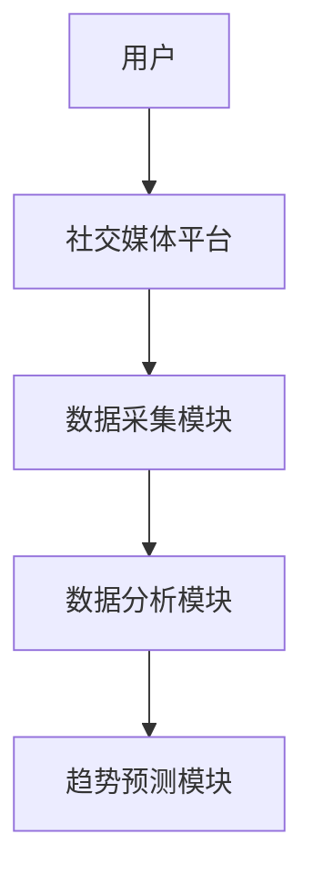
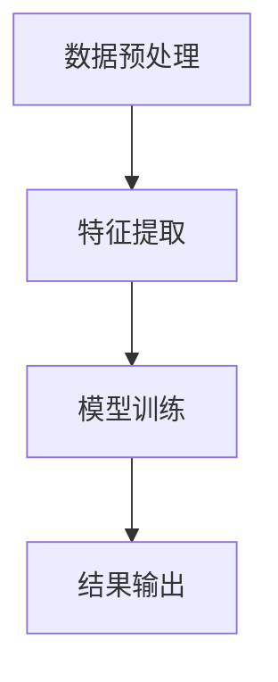
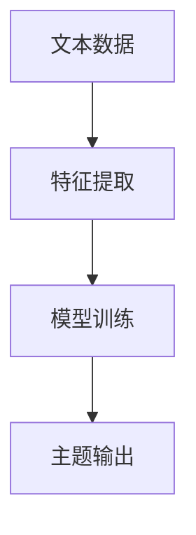
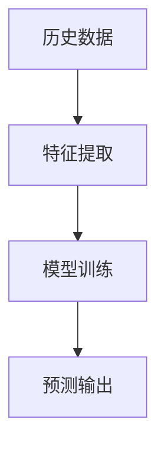
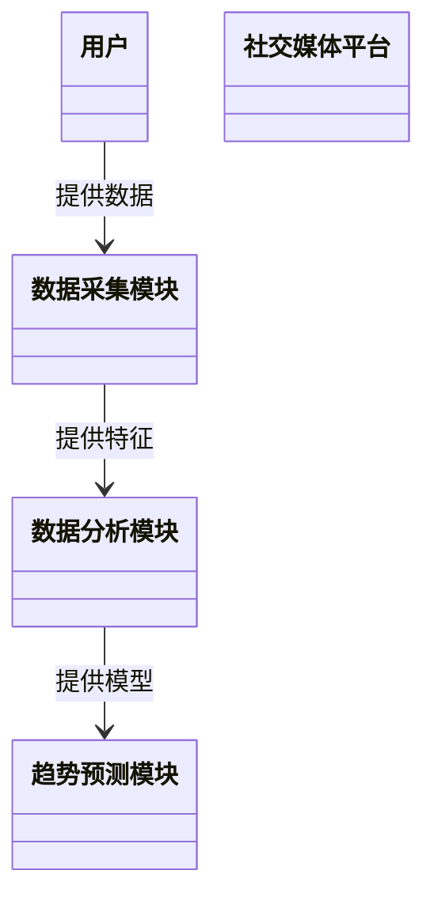
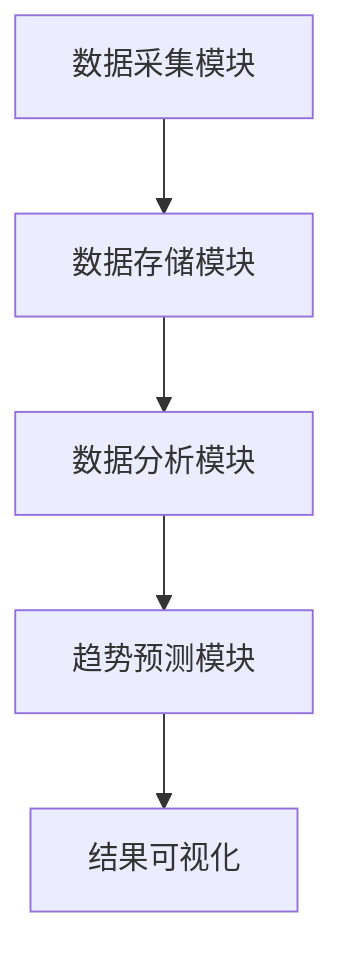

                 


# 构建智能企业市场调研系统：社交媒体聆听与趋势预测的AI驱动

> 关键词：智能企业市场调研系统，社交媒体聆听，趋势预测，人工智能，数据挖掘，机器学习

> 摘要：本文详细探讨了如何利用人工智能技术构建智能企业市场调研系统，特别是通过社交媒体数据进行市场聆听和趋势预测。文章从背景介绍、核心概念、算法原理、系统设计、项目实战等多个方面展开，结合实际案例，深入分析了系统的构建过程和应用场景。通过本文，读者将能够掌握如何利用AI技术实现市场调研的智能化，为企业决策提供有力支持。

---

# 第一部分：背景介绍

## 第1章：背景介绍

### 1.1 问题背景

#### 1.1.1 传统市场调研的局限性
传统市场调研方法依赖于问卷调查、深度访谈等手段，存在效率低、成本高、覆盖面有限等问题。此外，市场数据的实时性和动态性也难以满足现代企业的需求。

#### 1.1.2 社交媒体数据的价值
社交媒体平台积累了海量的用户评论、点赞、分享等数据，这些数据反映了用户的偏好和市场趋势。通过分析这些数据，企业可以实时了解市场动态，捕捉消费者情绪。

#### 1.1.3 AI驱动市场调研的优势
人工智能技术的快速发展为市场调研提供了新的工具。通过自然语言处理（NLP）、机器学习等技术，企业可以高效地从社交媒体数据中提取有价值的信息，实现智能化的市场调研。

### 1.2 问题描述

#### 1.2.1 企业市场调研的核心问题
企业需要快速、准确地获取市场信息，了解竞争对手动态，识别消费者需求变化，从而制定有效的市场策略。

#### 1.2.2 社交媒体数据的复杂性
社交媒体数据具有多样化、异构性和高噪声的特点，如何高效地处理这些数据是市场调研系统的核心挑战。

#### 1.2.3 趋势预测的挑战
市场趋势的变化往往受到多种因素的影响，如何建立准确的预测模型是企业面临的难题。

### 1.3 问题解决思路

#### 1.3.1 数据采集与处理
通过爬虫技术从社交媒体平台获取数据，并进行清洗和预处理，提取有用的信息。

#### 1.3.2 数据分析与建模
利用自然语言处理技术对文本数据进行情感分析和主题建模，提取关键词和主题。

#### 1.3.3 趋势预测与可视化
基于时间序列分析和机器学习算法，建立预测模型，并将结果可视化，为企业提供决策支持。

### 1.4 系统边界与外延

#### 1.4.1 系统功能边界
系统主要功能包括数据采集、数据处理、趋势预测和结果可视化。

#### 1.4.2 外部接口定义
系统需要与社交媒体API接口、数据存储系统等外部系统进行交互。

#### 1.4.3 系统扩展性
系统设计应具有良好的扩展性，能够适应数据量和功能需求的变化。

### 1.5 核心概念与组成

#### 1.5.1 核心概念
- 数据采集：从社交媒体平台获取原始数据。
- 数据处理：对数据进行清洗、标注和转换。
- 趋势预测：基于历史数据建立预测模型。

#### 1.5.2 系统架构
- 数据采集模块：负责数据的获取和初步处理。
- 数据分析模块：对数据进行深度分析，提取特征。
- 趋势预测模块：基于机器学习算法进行预测。

#### 1.5.3 关键技术
- 自然语言处理（NLP）：用于情感分析和主题建模。
- 机器学习：用于趋势预测和分类任务。

---

# 第二部分：核心概念与联系

## 第2章：核心概念与联系

### 2.1 核心概念原理

#### 2.1.1 社交媒体聆听
社交媒体聆听是指通过分析社交媒体上的用户评论，了解用户对品牌、产品或服务的评价。这种分析可以揭示用户的满意度、情感倾向以及潜在的需求。

#### 2.1.2 趋势预测
趋势预测是指通过分析历史数据，预测未来的市场趋势。这可以通过时间序列分析、机器学习等方法实现。

#### 2.1.3 数据预处理
数据预处理是将原始数据转化为适合建模的形式。这包括数据清洗、去重、特征提取等步骤。

### 2.2 概念属性对比表

| 概念       | 属性1（数据来源） | 属性2（数据类型） | 属性3（处理方式） |
|------------|-------------------|-------------------|-------------------|
| 社交媒体聆听 | 社交平台数据       | 文本数据           | 情感分析、主题建模 |
| 趋势预测     | 历史销售数据       | 时间序列数据       | 机器学习模型       |
| 数据预处理   | 原始数据           | 文本、数值数据       | 清洗、转换、特征提取 |

### 2.3 实体关系图



---

# 第三部分：算法原理

## 第3章：算法原理

### 3.1 情感分析

#### 3.1.1 情感分析流程



#### 3.1.2 情感分析实现代码

```python
import numpy as np
from sklearn.feature_extraction.text import TfidfVectorizer
from sklearn.svm import SVC

# 数据预处理
texts = ["This product is great!", "I hate this service!", "Okay, it's fine."]
labels = [1, 0, 0]

# 特征提取
vectorizer = TfidfVectorizer()
X = vectorizer.fit_transform(texts)

# 模型训练
model = SVC()
model.fit(X, labels)

# 预测
new_text = "This product is terrible!"
new_X = vectorizer.transform([new_text])
print(model.predict(new_X))
```

#### 3.1.3 情感分析数学模型
情感分析的分类问题可以表示为：
$$ y = f(x) $$
其中，$x$ 是输入文本的特征向量，$y$ 是情感标签。

### 3.2 主题建模

#### 3.2.1 主题建模流程



#### 3.2.2 主题建模实现代码

```python
from sklearn.decomposition import LatentDirichletAllocation
import pandas as pd

# 数据加载
df = pd.read_csv("data.csv")

# 特征提取
X = df["text"].values

# 模型训练
lda = LatentDirichletAllocation(n_components=5)
lda.fit(X)

# 主题输出
print(lda.components_)
```

#### 3.2.3 主题建模数学模型
主题建模可以通过概率分布来表示：
$$ P(word|topic) = \frac{\alpha + \text{count}(word, topic)}{\sum_{word} (\alpha + \text{count}(word, topic))} $$

### 3.3 时间序列预测

#### 3.3.1 时间序列预测流程



#### 3.3.2 时间序列预测实现代码

```python
import pandas as pd
from statsmodels.tsa.arima_model import ARIMA

# 数据加载
df = pd.read_csv("sales.csv")

# 模型训练
model = ARIMA(df['sales'], order=(5,1,0))
model_fit = model.fit()

# 预测
forecast = model_fit.forecast(steps=5)
print(forecast)
```

#### 3.3.3 时间序列预测数学模型
时间序列预测可以表示为：
$$ y_t = \phi_1 y_{t-1} + \phi_2 y_{t-2} + \epsilon_t $$

---

# 第四部分：系统分析与架构设计

## 第4章：系统分析与架构设计

### 4.1 问题场景介绍

#### 4.1.1 问题描述
企业需要实时监控市场动态，快速响应消费者需求变化。

#### 4.1.2 业务目标
建立一个智能市场调研系统，实现数据采集、分析和预测功能。

### 4.2 项目介绍

#### 4.2.1 项目目标
开发一个基于AI的市场调研系统，支持社交媒体数据的采集、分析和趋势预测。

#### 4.2.2 项目范围
系统包括数据采集模块、数据分析模块和趋势预测模块。

### 4.3 系统功能设计

#### 4.3.1 领域模型



#### 4.3.2 系统架构



#### 4.3.3 接口设计
系统需要与社交媒体API接口、数据存储系统等外部系统进行交互。

#### 4.3.4 交互设计
用户通过Web界面提交查询，系统返回预测结果。

### 4.4 小结

---

# 第五部分：项目实战

## 第5章：项目实战

### 5.1 环境安装

#### 5.1.1 安装Python
```bash
python --version
pip install --upgrade pip
```

#### 5.1.2 安装依赖
```bash
pip install numpy scikit-learn pandas mermaid
```

### 5.2 系统核心实现

#### 5.2.1 数据采集模块实现

```python
import requests
from bs4 import BeautifulSoup

# 爬虫代码
def fetch_data(url):
    response = requests.get(url)
    soup = BeautifulSoup(response.text, 'html.parser')
    return soup.text
```

#### 5.2.2 数据分析模块实现

```python
from sklearn.naive_bayes import MultinomialNB

# 情感分析代码
def sentiment_analysis(data):
    vectorizer = TfidfVectorizer()
    X = vectorizer.fit_transform(data)
    model = MultinomialNB()
    model.fit(X, labels)
    return model.predict(X)
```

#### 5.2.3 趋势预测模块实现

```python
from statsmodels.tsa.arima_model import ARIMA

# 时间序列预测代码
def forecast_sales(data):
    model = ARIMA(data, order=(5,1,0))
    model_fit = model.fit()
    return model_fit.forecast(steps=5)
```

### 5.3 实际案例分析

#### 5.3.1 案例背景
假设某企业需要预测未来三个月的销售趋势。

#### 5.3.2 数据准备
加载历史销售数据，进行清洗和预处理。

#### 5.3.3 模型训练
训练ARIMA模型，评估模型性能。

#### 5.3.4 结果分析
输出预测结果，并与实际数据进行对比。

### 5.4 小结

---

# 第六部分：总结与展望

## 第6章：总结与展望

### 6.1 最佳实践

#### 6.1.1 数据处理
在数据预处理阶段，建议使用正则表达式去除噪声数据。

#### 6.1.2 模型选择
在模型训练阶段，建议进行交叉验证，选择最优模型。

### 6.2 小结
本文详细介绍了如何利用人工智能技术构建智能企业市场调研系统，从数据采集到趋势预测，全面覆盖了系统的构建过程。

### 6.3 注意事项

#### 6.3.1 数据隐私
在处理用户数据时，必须遵守数据隐私保护法规。

#### 6.3.2 模型优化
在模型训练阶段，建议使用网格搜索优化超参数。

### 6.4 拓展阅读
推荐读者阅读《机器学习实战》和《自然语言处理入门》等书籍，深入了解相关技术。

---

通过本文的学习，读者可以掌握如何利用AI技术构建智能企业市场调研系统，为企业决策提供有力支持。

