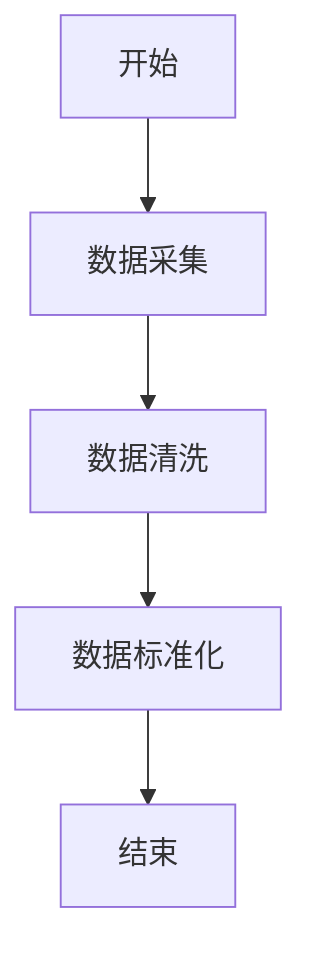
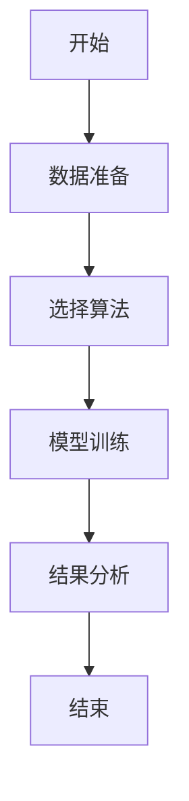
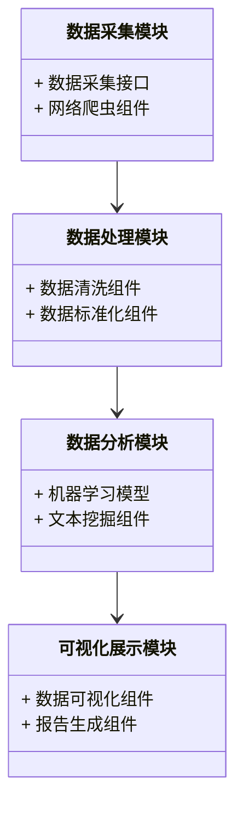

                 


# 构建智能企业市场调研系统：自动化数据收集与分析

> **关键词**：智能企业，市场调研系统，自动化数据收集，数据分析，文本挖掘，机器学习

> **摘要**：  
> 随着企业对数据驱动决策的需求不断增加，传统市场调研方法逐渐暴露出效率低、成本高、分析复杂等问题。为了解决这些问题，智能企业市场调研系统应运而生，通过自动化数据收集与分析，帮助企业快速获取市场洞察，提升决策效率。本文将从系统背景、核心概念、算法原理、系统架构设计到项目实战，全面解析智能企业市场调研系统的构建过程。

---

# 第一部分：背景与核心概念

## 第1章：智能企业市场调研系统的背景与需求

### 1.1 市场调研的定义与重要性

#### 1.1.1 市场调研的基本概念
市场调研是通过收集、分析和解释市场数据，帮助企业了解市场趋势、消费者行为和竞争环境的过程。它是企业制定战略决策的重要依据。

#### 1.1.2 市场调研在企业中的作用
市场调研可以帮助企业发现市场机会、评估风险、优化产品策略、制定营销计划等。

#### 1.1.3 数据驱动决策的时代背景
在大数据时代，企业需要快速、准确地获取市场信息，以应对快速变化的市场环境。

### 1.2 传统市场调研的局限性

#### 1.2.1 数据收集效率低
传统市场调研依赖人工问卷调查，耗时长且成本高。

#### 1.2.2 数据分析的复杂性
传统分析方法依赖人工整理和统计，难以处理大规模数据。

#### 1.2.3 人工干预的不足
人工分析容易受到主观因素影响，且难以发现隐藏的模式和趋势。

### 1.3 智能市场调研系统的必要性

#### 1.3.1 提高数据收集效率
通过自动化爬取和传感器数据，快速获取大量市场数据。

#### 1.3.2 实现自动化数据分析
利用机器学习算法，自动识别数据中的模式和趋势。

#### 1.3.3 降低企业调研成本
自动化系统可以减少人工干预，降低时间和资金成本。

### 1.4 本章小结
本章介绍了市场调研的重要性和传统方法的局限性，强调了构建智能市场调研系统的需求和必要性。

---

## 第2章：智能企业市场调研系统的核心概念

### 2.1 智能市场调研系统的定义

#### 2.1.1 系统的基本定义
智能市场调研系统是一种基于人工智能和大数据技术的自动化数据收集与分析系统，能够帮助企业快速获取市场洞察。

#### 2.1.2 系统的核心功能
- 自动化数据采集
- 数据清洗与预处理
- 数据分析与挖掘
- 可视化展示

### 2.2 系统的组成部分

#### 2.2.1 数据采集模块
负责从互联网、传感器等渠道自动采集市场数据。

#### 2.2.2 数据处理模块
对采集到的原始数据进行清洗、标准化和去重。

#### 2.2.3 数据分析模块
利用机器学习算法对数据进行建模和预测。

#### 2.2.4 可视化展示模块
将分析结果以图表形式展示，方便用户理解。

### 2.3 系统的工作流程

#### 2.3.1 数据采集阶段
系统通过网络爬虫或API接口自动采集数据。

#### 2.3.2 数据处理阶段
对采集到的数据进行清洗和预处理，确保数据质量。

#### 2.3.3 数据分析阶段
利用机器学习算法对数据进行分析，提取有价值的信息。

#### 2.3.4 结果展示阶段
将分析结果以可视化形式展示给用户。

### 2.4 系统与传统调研的区别

#### 2.4.1 数据收集方式的对比
智能系统通过自动化手段采集数据，传统方法依赖人工调查。

#### 2.4.2 数据分析效率的对比
智能系统能够快速处理大规模数据，传统方法效率较低。

#### 2.4.3 成本与时间的对比
智能系统大幅降低了调研成本和时间。

### 2.5 本章小结
本章详细介绍了智能市场调研系统的核心概念、组成部分和工作流程，突出了其与传统方法的区别。

---

## 第3章：数据采集与处理算法原理

### 3.1 数据采集算法

#### 3.1.1 网络爬虫算法
网络爬虫通过模拟浏览器行为，从网页中提取数据。常用的爬虫算法包括广度优先搜索（BFS）和深度优先搜索（DFS）。

#### 3.1.2 数据抽取算法
数据抽取是从非结构化数据中提取有用信息的过程，常用的技术包括正则表达式和自然语言处理（NLP）。

#### 3.1.3 数据清洗算法
数据清洗包括去除重复数据、处理缺失值和纠正异常值。常用算法有基于统计的方法和基于规则的方法。

### 3.2 数据处理流程

#### 3.2.1 数据预处理
数据预处理包括数据转换、归一化和分块处理。

#### 3.2.2 数据标准化
数据标准化是为了消除数据量纲差异，常用的方法有最小-最大归一化和z-score标准化。

#### 3.2.3 数据去重
数据去重可以通过哈希表和聚类算法实现。

### 3.3 算法流程图


### 3.4 本章小结
本章详细讲解了数据采集和处理的算法原理，包括网络爬虫、数据抽取和数据清洗等关键技术。

---

## 第4章：数据分析与挖掘算法

### 4.1 文本挖掘算法

#### 4.1.1 分词算法
分词算法将文本分割成单词或短语，常用算法有基于规则的分词和基于统计的分词。

#### 4.1.2 关键词提取算法
关键词提取算法用于从文本中提取最重要的词汇，常用方法有TF-IDF和基于主题模型的方法。

#### 4.1.3 情感分析算法
情感分析算法用于判断文本的情感倾向，常用方法有基于词典的方法和基于机器学习的方法。

### 4.2 机器学习算法

#### 4.2.1 分类算法
分类算法用于将数据分为不同的类别，常用算法有决策树、随机森林和朴素贝叶斯。

#### 4.2.2 聚类算法
聚类算法用于将相似的数据点分组，常用算法有K-means和层次聚类。

#### 4.2.3 回归算法
回归算法用于预测连续型变量，常用算法有线性回归和逻辑回归。

### 4.3 算法流程图


### 4.4 本章小结
本章详细讲解了文本挖掘和机器学习算法在市场调研中的应用，包括分词、关键词提取和情感分析等关键技术。

---

## 第5章：系统架构设计与实现

### 5.1 系统架构设计

#### 5.1.1 系统模块划分
智能市场调研系统主要包括数据采集模块、数据处理模块、数据分析模块和可视化展示模块。

#### 5.1.2 系统架构图


### 5.2 系统实现

#### 5.2.1 环境搭建
需要安装Python、TensorFlow、Pandas和Matplotlib等工具。

#### 5.2.2 核心代码实现
```python
import pandas as pd
from sklearn.preprocessing import StandardScaler

# 数据预处理
def preprocess_data(data):
    # 去除重复数据
    data = data.drop_duplicates()
    # 处理缺失值
    data = data.dropna()
    # 标准化处理
    scaler = StandardScaler()
    scaled_data = scaler.fit_transform(data)
    return scaled_data

# 机器学习模型训练
from sklearn.ensemble import RandomForestClassifier

def train_model(X, y):
    model = RandomForestClassifier(n_estimators=100)
    model.fit(X, y)
    return model
```

### 5.3 系统接口设计

#### 5.3.1 数据接口
系统提供RESTful API接口，用于接收外部数据源。

#### 5.3.2 分析接口
系统提供API接口，用于外部系统调用分析结果。

### 5.4 本章小结
本章详细讲解了系统架构设计与实现，包括模块划分、系统架构图和核心代码实现。

---

## 第6章：项目实战与案例分析

### 6.1 项目背景

#### 6.1.1 项目目标
构建一个智能市场调研系统，用于分析电商行业的市场趋势。

#### 6.1.2 数据来源
数据来自公开的电商评论、社交媒体和行业报告。

### 6.2 系统实现

#### 6.2.1 数据采集
通过网络爬虫采集电商评论数据。

#### 6.2.2 数据处理
对采集到的数据进行清洗和标准化处理。

#### 6.2.3 数据分析
利用随机森林算法进行情感分析和市场趋势预测。

#### 6.2.4 结果展示
将分析结果以图表形式展示，生成市场分析报告。

### 6.3 项目小结
本章通过具体案例展示了智能市场调研系统的实现过程，包括数据采集、处理、分析和结果展示。

---

## 第7章：总结与展望

### 7.1 本章总结
智能企业市场调研系统通过自动化数据收集与分析，显著提升了市场调研的效率和准确性。

### 7.2 未来展望
随着人工智能和大数据技术的不断发展，智能市场调研系统将更加智能化和个性化。

---

## 附录：最佳实践与注意事项

### 附录A：数据隐私与安全
在数据采集和处理过程中，需注意保护用户隐私和数据安全。

### 附录B：系统优化建议
建议定期更新算法模型，优化系统性能。

### 附录C：拓展阅读
推荐相关书籍和论文，供读者深入学习。

---

通过以上目录结构，我们可以全面了解智能企业市场调研系统的构建过程，从理论到实践，帮助企业实现高效、智能的市场调研。

