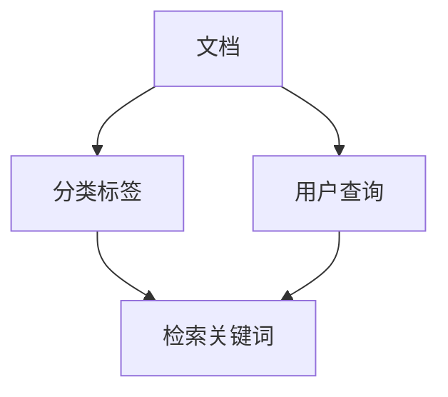
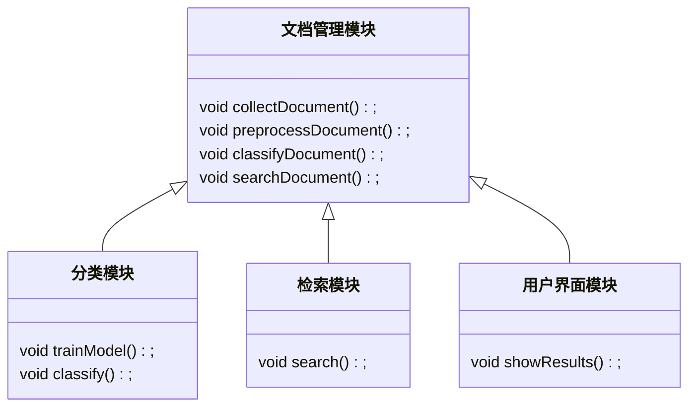
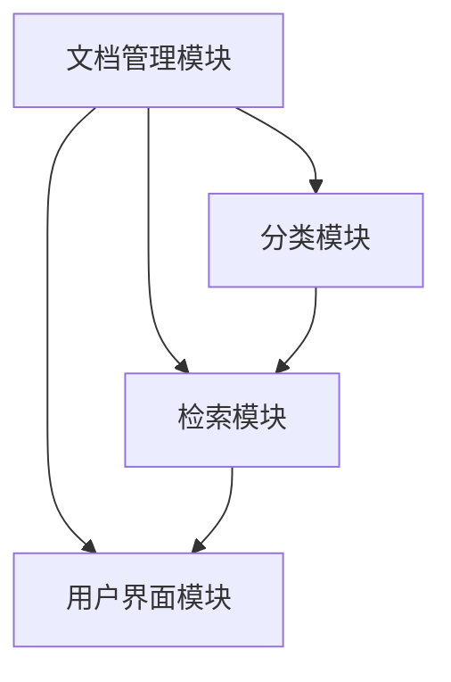
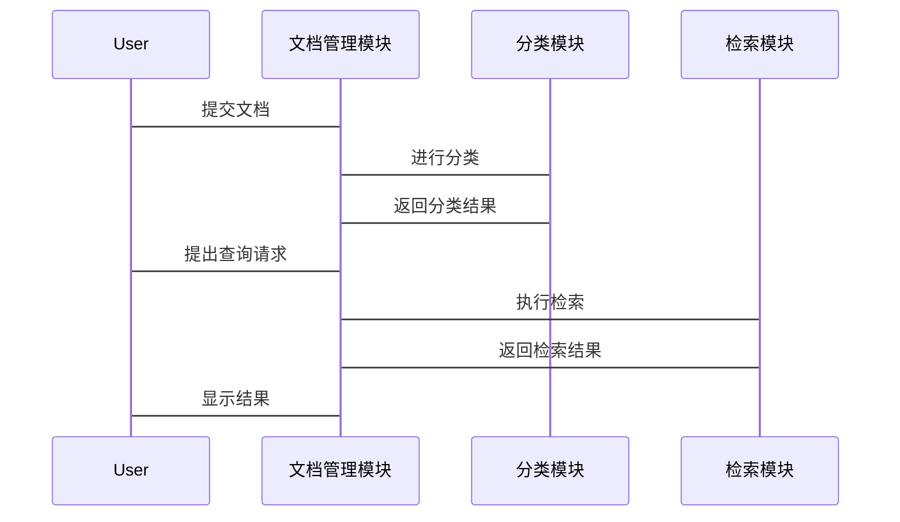

                 


# 构建智能企业文档管理系统：AI辅助分类与检索

> **关键词**：智能文档管理系统，AI辅助分类，文档检索，支持向量机，深度学习，BERT模型，系统架构设计

> **摘要**：本文详细探讨了如何利用人工智能技术构建智能企业文档管理系统，重点介绍了AI辅助文档分类与检索的核心概念、算法原理、系统架构设计及实际项目案例。通过理论与实践相结合的方式，帮助读者全面理解并掌握智能文档管理系统的构建方法。

---

# 第一部分: 智能企业文档管理系统的背景与概述

## 第1章: 问题背景与系统架构

### 1.1 问题背景

#### 1.1.1 传统文档管理系统的局限性

传统文档管理系统通常依赖人工分类和关键字检索，存在以下问题：
- **分类效率低**：人工分类耗时耗力，且容易出错。
- **检索精度低**：基于关键字的检索方法无法理解文档语义，导致检索结果不准确。
- **可扩展性差**：面对海量文档时，系统性能下降明显，无法满足企业需求。

#### 1.1.2 AI技术在文档管理中的应用潜力

AI技术，特别是自然语言处理（NLP）和机器学习技术，为文档管理带来了革命性的变化：
- **智能分类**：利用机器学习算法自动分类文档，提高分类效率和准确性。
- **语义检索**：基于文档语义进行检索，提升检索结果的相关性。
- **自我优化**：AI系统可以通过反馈不断优化分类和检索模型，适应企业需求。

#### 1.1.3 企业文档管理的痛点与需求

企业文档管理的核心痛点包括：
- **文档数量庞大**：企业每天产生的文档数量快速增长，人工管理成本高昂。
- **文档分散**：文档分散在不同的系统中，难以统一管理。
- **文档安全**：文档泄露或篡改的风险增加，需加强文档安全管理。
- **文档利用率低**：无法快速找到所需文档，影响工作效率。

企业的核心需求：
- **高效分类**：快速、准确地对文档进行分类。
- **智能检索**：基于语义快速检索文档。
- **可扩展性**：支持海量文档的管理需求。
- **安全性**：确保文档安全，防止数据泄露。

### 1.2 系统架构与核心目标

#### 1.2.1 系统整体架构概述

智能企业文档管理系统的整体架构包括以下几个部分：
1. **文档采集模块**：负责接收和处理各种格式的文档。
2. **预处理模块**：对文档进行清洗、分词等预处理操作。
3. **分类模块**：利用机器学习算法对文档进行分类。
4. **检索模块**：基于语义进行文档检索。
5. **用户界面模块**：提供友好的操作界面，方便用户使用。

#### 1.2.2 核心目标与功能模块划分

系统的核心目标是实现文档的智能化分类和检索。功能模块划分如下：
1. **文档采集模块**：支持多种格式的文档输入。
2. **预处理模块**：对文档进行清洗、分词、去停用词等处理。
3. **分类模块**：利用支持向量机（SVM）或深度学习模型对文档进行分类。
4. **检索模块**：基于用户查询，利用预训练的BERT模型进行语义检索。
5. **用户界面模块**：提供分类结果展示和检索结果浏览功能。

#### 1.2.3 系统边界与外延

系统边界：
- 输入：各种格式的文档、用户查询。
- 输出：分类结果、检索结果。

系统外延：
- **扩展性**：支持更多文档类型和分类标准。
- **可配置性**：允许用户自定义分类标签和检索规则。
- **安全性**：具备文档权限管理和访问控制功能。

---

## 第2章: 核心概念与技术原理

### 2.1 AI辅助文档分类与检索的核心概念

#### 2.1.1 文档分类与检索的基本原理

文档分类是将文档按照一定的标准进行分类的过程，通常使用监督学习算法。文档检索是根据用户查询返回相关文档的过程，通常使用基于关键词或语义的方法。

#### 2.1.2 基于AI的特征提取与语义分析

AI技术通过以下方式实现文档分类与检索：
- **特征提取**：利用词袋模型或TF-IDF提取文档特征。
- **语义分析**：利用深度学习模型（如BERT）进行语义理解。

#### 2.1.3 系统的核心要素与组成

系统的核心要素包括：
1. **文档库**：存储所有文档的地方。
2. **分类模型**：对文档进行分类的机器学习模型。
3. **检索模型**：根据用户查询返回相关文档的模型。
4. **用户界面**：供用户操作的界面。

### 2.2 核心概念的ER实体关系图



### 2.3 核心概念的属性特征对比表

| 特性 | 文档 | 分类标签 | 检索关键词 |
|------|------|----------|------------|
| 输入 | 文档内容 | 分类结果 | 查询词 |
| 输出 | 分类结果 | 检索结果 | 分类标签 |

---

## 第3章: 分类算法与检索模型

### 3.1 支持向量机（SVM）分类算法

#### 3.1.1 SVM算法的基本原理

支持向量机是一种监督学习算法，主要用于分类和回归。其基本思想是找到一个超平面，使得不同类别的样本被这个超平面分开。

#### 3.1.2 SVM的数学模型

SVM的目标函数为：
$$ \text{目标函数: } \min_{\mathbf{w}, b, \xi} \frac{1}{2}\|\mathbf{w}\|^2 + C\sum_{i=1}^n \xi_i $$
约束条件：
$$ y_i(\mathbf{w} \cdot \mathbf{x}_i + b) \geq 1 - \xi_i $$
$$ \xi_i \geq 0 $$

#### 3.1.3 SVM算法的实现代码

```python
from sklearn.svm import SVC
from sklearn.datasets import make_classification
from sklearn.model_selection import train_test_split
from sklearn.metrics import accuracy_score

# 生成数据
X, y = make_classification(n_samples=100, n_features=2, n_classes=2, random_state=42)
X_train, X_test, y_train, y_test = train_test_split(X, y, test_size=0.2, random_state=42)

# 训练SVM模型
model = SVC(kernel='linear')
model.fit(X_train, y_train)

# 预测
y_pred = model.predict(X_test)

# 计算准确率
print(f'Accuracy: {accuracy_score(y_test, y_pred)}')
```

---

### 3.2 基于BERT的文档检索模型

#### 3.2.1 BERT模型的基本原理

BERT（Bidirectional Encoder Representations from Transformers）是一种预训练的深度学习模型，能够对文本进行语义理解。其核心思想是通过双向Transformer结构来捕捉上下文信息。

#### 3.2.2 BERT模型的数学模型

BERT的输入嵌入层将输入文本转换为向量表示：
$$ \text{Input: } x_1, x_2, ..., x_n $$
$$ \text{嵌入向量: } e_1, e_2, ..., e_n $$

---

#### 3.2.3 基于BERT的检索流程

1. **预处理**：将文档和查询输入BERT模型进行编码。
2. **计算相似度**：利用余弦相似度计算查询与文档的相似度。
3. **排序与返回**：根据相似度对文档进行排序，返回 top-k 结果。

---

## 第4章: 系统架构设计

### 4.1 系统功能设计

#### 4.1.1 领域模型（类图）



### 4.2 系统架构设计



### 4.3 接口设计与交互流程



---

## 第5章: 项目实战

### 5.1 环境安装与配置

```bash
pip install scikit-learn transformers torch
```

### 5.2 核心代码实现

```python
from transformers import BertTokenizer, BertModel
import torch

# 加载预训练的BERT模型和分词器
tokenizer = BertTokenizer.from_pretrained('bert-base-uncased')
model = BertModel.from_pretrained('bert-base-uncased')

# 文档编码
def encode_document(documents):
    encoded = tokenizer(documents, padding=True, truncation=True, return_tensors='pt')
    with torch.no_grad():
        outputs = model(**encoded)
    return outputs.last_hidden_state[:, 0, :]

# 检索函数
def semantic_search(query, documents, k=3):
    query_vec = encode_document([query])
    doc_vecs = torch.stack([encode_document([doc])[0] for doc in documents])
    scores = torch.mm(query_vec, doc_vecs.T).squeeze()
    top_indices = scores.argsort()[-k:][::-1]
    return [documents[i] for i in top_indices]
```

---

## 第6章: 总结与展望

### 6.1 总结

本文详细探讨了AI辅助文档分类与检索的核心概念、算法原理及系统架构设计。通过结合实际案例，展示了如何利用支持向量机和BERT模型构建智能文档管理系统。

---

### 6.2 展望

未来，随着NLP技术的不断发展，智能文档管理系统将更加智能化和高效化。以下是几个可能的发展方向：
1. **多模态文档管理**：结合图像识别技术，实现对图像型文档的智能分类和检索。
2. **实时更新与自适应**：系统能够实时更新模型参数，自适应用户需求。
3. **分布式文档管理**：支持分布式存储和计算，提升系统的扩展性和性能。

---

### 6.3 注意事项

- **数据隐私**：在实际应用中，需注意文档数据的隐私保护，确保符合相关法律法规。
- **模型调优**：不同场景下，需对模型进行适当的调优，以达到最佳性能。
- **性能优化**：对于大规模文档，需优化算法和系统架构，确保系统的高效运行。

---

### 6.4 拓展阅读

- **《Deep Learning》—— Ian Goodfellow**
- **《Natural Language Processing with PyTorch》—— Dipanjan Sarkar**
- **《机器学习实战》—— 周志华**

---

以上就是《构建智能企业文档管理系统：AI辅助分类与检索》的完整目录和内容大纲，希望对您有所帮助！

