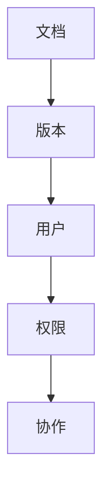
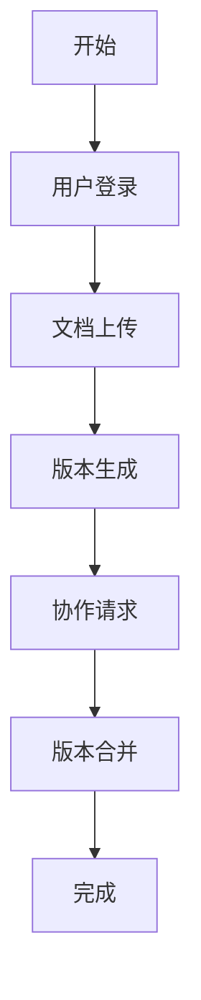
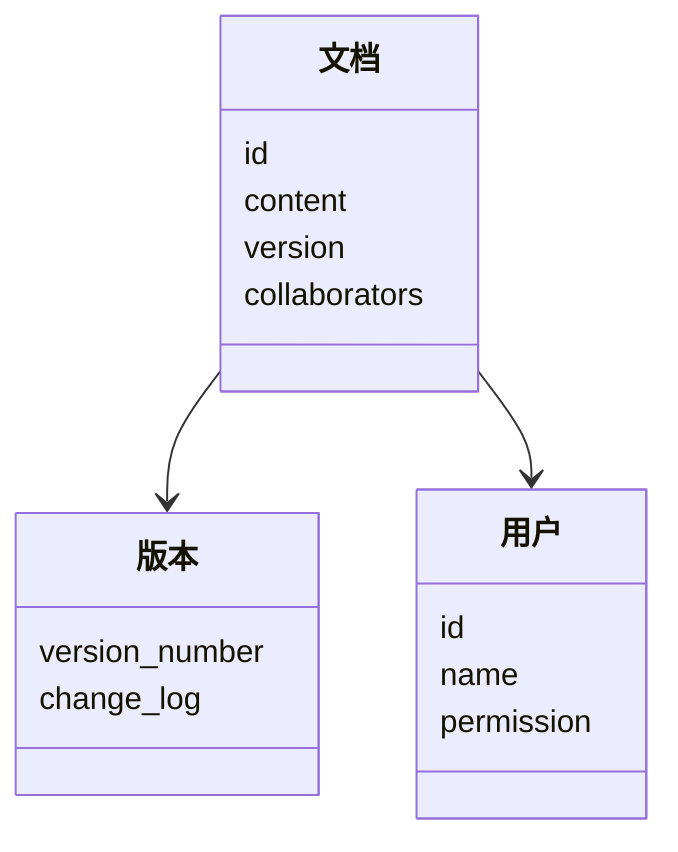
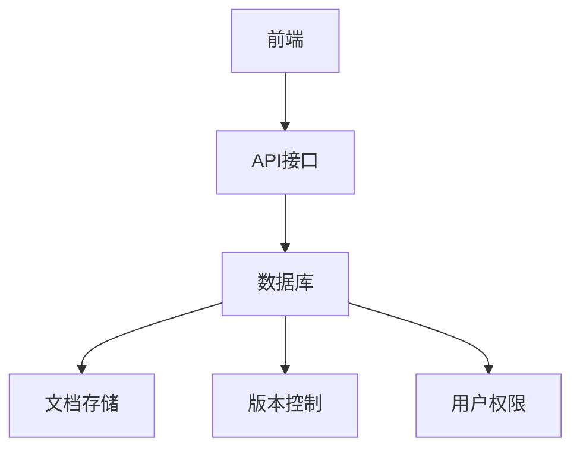
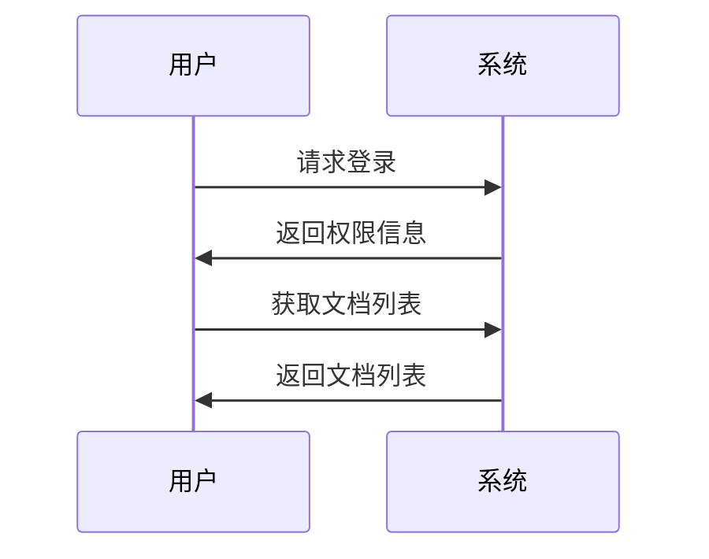

                 


# 构建智能企业文档管理系统：版本控制与协作优化

## 关键词：企业文档管理，版本控制，协作优化，智能文档系统，版本控制工具，文档协作，AI技术

## 摘要：本文详细探讨了构建智能企业文档管理系统的关键技术和优化策略，重点分析了版本控制和协作优化两大核心问题。通过引入AI技术，提出了一套智能化的文档管理系统解决方案，从核心概念、算法原理、系统架构到项目实战，全面阐述了如何实现高效的文档管理与协作，为企业文档管理提供了一个创新的思路和实践指南。

---

## 第一部分：背景与核心概念

### 第1章：问题背景与解决方案

#### 1.1 问题背景

- **传统文档管理系统的局限性**  
  - 版本控制复杂，难以追溯变更历史。  
  - 协作效率低下，多人同时编辑容易引发冲突。  
  - 权限管理不足，文档安全风险高。  

- **智能化文档管理的需求与趋势**  
  - AI技术的应用提升了文档理解和自动化处理能力。  
  - 企业对高效协作和智能检索的需求日益增加。  

#### 1.2 问题描述

- **文档版本控制的挑战**  
  - 多人协作时，版本冲突难以协调。  
  - 版本历史记录难以有效利用。  

- **协作效率低下问题**  
  - 缺乏实时反馈和自动化协作工具。  
  - 协作流程不透明，责任不清。  

- **文档安全与权限管理问题**  
  - 权限设置复杂，难以灵活调整。  
  - 文档泄露风险高。  

#### 1.3 问题解决

- **引入AI技术的必要性**  
  - AI可以自动识别文档内容，辅助版本控制。  
  - 通过自然语言处理优化协作流程。  

- **智能化文档管理系统的解决方案**  
  - 利用AI进行智能分类、自动标注和版本推荐。  
  - 提供实时协作反馈和权限动态调整功能。  

- **技术实现路径与目标**  
  - 采用分布式版本控制系统，结合AI算法实现协作优化。  
  - 目标是打造一个高效、安全、智能的企业文档管理系统。  

#### 1.4 边界与外延

- **系统边界与功能范围**  
  - 文档存储、版本控制、协作功能为核心功能。  
  - 不包括外部系统的集成，如ERP或其他业务系统。  

- **相关概念的外延与扩展**  
  - 智能化文档管理可以扩展至知识图谱构建和智能检索。  
  - 协作优化可以延伸至团队协作效率的整体提升。  

- **与其他系统的接口与集成**  
  - 与企业现有的协作工具（如Teams、Slack）集成。  
  - 与云存储服务（如AWS S3、阿里云OSS）对接。  

#### 1.5 核心概念

- **文档管理系统的定义**  
  - 文档管理系统是指用于存储、管理和检索文档的系统，支持版本控制和协作功能。  

- **版本控制的核心要素**  
  - 版本号、变更日志、分支管理、合并策略。  

- **协作优化的关键点**  
  - 实时协作、权限管理、冲突解决、反馈机制。  

- **智能化文档管理的实现方式**  
  - 基于AI的文档分类、自动标注、智能推荐。  

---

### 第2章：核心概念与联系

#### 2.1 核心概念原理

- **文档版本控制的原理**  
  - 每次修改生成新的版本，记录变更日志。  
  - 支持分支开发和合并，避免多人协作的冲突。  

- **协作优化的实现机制**  
  - 实时同步、权限控制、自动保存、版本回滚。  

- **智能化文档管理的算法基础**  
  - 基于自然语言处理的文档理解与分类。  
  - 基于机器学习的版本推荐和智能检索。  

#### 2.2 核心概念属性特征对比

| 概念       | 版本控制 | 协作优化 | 智能化文档管理 |
|------------|----------|----------|---------------|
| 核心目标   | 记录变更 | 提升效率 | 提供智能支持    |
| 实现方式   | 分支与合并 | 实时协作与权限管理 | AI算法驱动    |
| 适用场景   | 多人协作 | 团队协作 | 企业级文档管理  |

#### 2.3 ER实体关系图架构



---

### 第3章：算法原理讲解

#### 3.1 算法原理

- **版本控制算法**  
  - 分支与合并算法：支持多人协作，避免冲突。  
  - 变更日志记录：记录每次修改的详细信息。  

- **协作优化算法**  
  - 实时同步算法：确保所有协作用户同步最新版本。  
  - 权限控制算法：基于角色的访问控制（RBAC）。  

- **智能化推荐算法**  
  - 基于余弦相似度的文档相似度计算：  
    $$ \cos(\theta) = \frac{\vec{A} \cdot \vec{B}}{|\vec{A}| |\vec{B}|} $$  
  - 基于TF-IDF的关键词提取：提取文档中的重要关键词，用于智能推荐。  

#### 3.2 算法流程图



#### 3.3 算法实现代码

```python
def version_control(user, document):
    if user.permission >= 1:
        document.create_branch()
        document.start_collaboration()
        while True:
            if document.conflict:
                document.resolve_conflict()
            else:
                document.save_version()
                break
        document.end_collaboration()
        return document.version_number
    else:
        raise PermissionError("权限不足")
```

---

### 第4章：系统分析与架构设计

#### 4.1 问题场景介绍

- **场景描述**  
  - 多人协作编辑一份重要报告，需要实时同步和版本控制。  
  - 文档需要严格的权限管理，确保敏感信息的安全。  

#### 4.2 系统功能设计

- **功能模块**  
  - 文档存储：支持多种格式文档的上传和存储。  
  - 版本管理：记录每个版本的变更日志，支持版本回滚。  
  - 协作功能：实时协作、权限管理、冲突解决。  

- **领域模型类图**



#### 4.3 系统架构设计

- **分层架构**  
  - 前端：用户界面，支持文档编辑和协作。  
  - 后端：API接口，处理版本控制和权限管理。  
  - 数据库：存储文档内容、版本信息和用户权限。  

- **架构图**



#### 4.4 接口设计与交互流程

- **用户登录流程**



---

### 第5章：项目实战

#### 5.1 环境安装与配置

- **工具安装**  
  - 安装Git：用于版本控制。  
  - 安装Python：用于开发和测试。  

- **依赖安装**  
  - 安装Flask框架：用于构建API接口。  
  - 安装MongoDB：用于存储文档和版本信息。  

#### 5.2 核心代码实现

- **版本控制实现**

```python
from flask import Flask, jsonify
from pymongo import MongoClient

app = Flask(__name__)
client = MongoClient('mongodb://localhost:27017/')

@app.route('/api/create_version', methods=['POST'])
def create_version():
    # 获取文档ID和用户信息
    data = request.json
    db = client['document_management']
    collection = db['versions']
    # 生成新版本
    new_version = {
        'document_id': data['document_id'],
        'version_number': data['version_number'],
        'change_log': data['change_log']
    }
    collection.insert_one(new_version)
    return jsonify({'status': 'success'})

if __name__ == '__main__':
    app.run(debug=True)
```

- **协作功能实现**

```python
def resolve_conflict(document_id):
    db = client['document_management']
    collection = db['versions']
    latest_version = collection.find({'document_id': document_id}).sort('version_number', -1).limit(1)
    # 解决冲突逻辑
    pass
```

#### 5.3 案例分析与实际应用

- **案例分析**  
  - 一家企业使用本系统进行年度报告的协作编写。  
  - 使用Git进行版本控制，AI算法辅助分类和推荐。  

- **实际应用效果**  
  - 提高了协作效率，减少了版本冲突。  
  - 文档安全性和权限管理更加精细。  

---

### 第6章：最佳实践与总结

#### 6.1 最佳实践

- **版本控制最佳实践**  
  - 定期提交，避免大块修改。  
  - 使用分支管理，避免主分支混乱。  

- **协作优化最佳实践**  
  - 明确角色和权限，减少冲突。  
  - 定期同步，保持团队协作一致。  

- **AI技术应用建议**  
  - 结合具体业务需求，选择合适的AI算法。  
  - 定期更新模型，提升推荐准确性。  

#### 6.2 小结

- 本文详细介绍了构建智能企业文档管理系统的背景、核心概念、算法原理、系统架构和项目实战。  
- 通过引入AI技术和智能化的版本控制与协作优化，为企业文档管理提供了创新的解决方案。  

#### 6.3 注意事项

- **数据安全**  
  - 确保文档存储和传输的安全性，防止数据泄露。  
- **性能优化**  
  - 对大规模文档进行分片存储和分布式处理。  
- **用户体验**  
  - 提供友好的用户界面和便捷的操作流程。  

#### 6.4 拓展阅读

- 推荐阅读《版本控制系统 Git 的精髓与绝活》和《企业级协作工具的设计与实现》。  
- 关注AI与企业协作的最新动态，了解前沿技术应用。  

---

通过以上章节的详细讲解，读者可以系统地掌握构建智能企业文档管理系统的知识，从理论到实践，全面优化企业的文档管理和协作效率。

