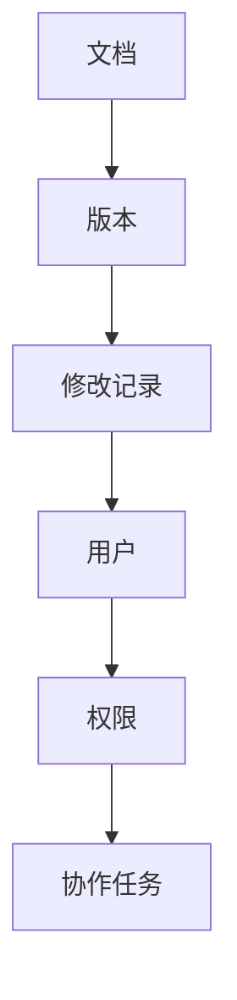

                 

# 构建智能企业文档管理系统：版本控制与协作优化的AI增强

> 关键词：智能文档管理，版本控制，协作优化，AI增强，企业文档系统，文档管理系统，协作工具

> 摘要：本文详细探讨了如何构建一个基于AI增强的企业文档管理系统，重点分析了版本控制与协作优化的核心技术。通过结合AI技术，该系统能够实现智能化的文档管理和协作，显著提升企业文档管理的效率和准确性。本文从问题背景、核心概念、算法原理、系统架构设计、项目实战等多个方面展开，详细阐述了构建该系统的各个方面，为读者提供了一套完整的解决方案。

---

# 第1章: 智能企业文档管理系统的背景与挑战

## 1.1 问题背景

### 1.1.1 传统文档管理系统的局限性

传统的文档管理系统在企业中的应用广泛，但其功能相对单一，主要集中在文档的存储、检索和基本的版本控制上。这些系统难以应对以下问题：

- **版本控制复杂性**：在多人协作的场景下，文档的版本控制容易出现冲突和混乱，难以追踪修改历史。
- **协作效率低下**：传统的文档管理系统缺乏智能化的协作工具，无法自动分配任务或提供实时反馈。
- **文档安全与合规性**：文档的安全性和合规性管理往往依赖于人工操作，容易出现疏漏。

### 1.1.2 企业文档管理中的主要问题

企业在文档管理中面临的主要问题包括：

- **文档分散**：企业中的文档往往分散在不同的存储位置，难以统一管理和检索。
- **权限管理复杂**：不同部门和角色的权限管理需要精细的控制，传统系统难以满足。
- **缺乏智能化**：文档的分类、检索和推荐缺乏智能算法支持，用户体验较差。

### 1.1.3 AI增强的必要性与优势

引入AI技术可以显著提升文档管理系统的功能和性能，主要优势包括：

- **智能化文档分类与检索**：通过自然语言处理技术，可以实现智能分类和精准检索。
- **自动化的版本控制**：AI可以协助自动识别文档的修改点，并推荐合适的版本。
- **实时协作优化**：通过AI分析协作过程，可以提供实时的反馈和建议，提升协作效率。

## 1.2 问题描述

### 1.2.1 文档版本控制的复杂性

在多人协作的场景下，文档的版本控制是一个复杂的任务。传统系统需要手动标记版本，容易出现冲突和混乱。例如，当多个用户同时修改同一份文档时，系统需要能够自动跟踪每个用户的修改，并提供清晰的版本历史。

### 1.2.2 协作效率的低下

传统的协作工具缺乏智能化的支持，用户需要手动分配任务和协调进度。此外，文档的实时更新和同步机制不够完善，容易导致信息滞后和重复劳动。

### 1.2.3 文档安全与合规性问题

文档的安全性和合规性管理是企业文档管理中的重要环节。传统的系统往往依赖人工检查，容易出现疏漏。例如，敏感信息的泄露或未经授权的访问可能导致严重的合规问题。

## 1.3 问题解决

### 1.3.1 引入AI技术的核心目标

引入AI技术的核心目标是实现文档管理的智能化，提升系统的功能和性能。具体目标包括：

- **智能化文档分类与检索**：通过机器学习算法，实现文档的自动分类和精准检索。
- **自动化的版本控制**：利用自然语言处理技术，自动识别文档的修改点，并推荐合适的版本。
- **实时协作优化**：通过AI分析协作过程，提供实时的反馈和建议，提升协作效率。

### 1.3.2 AI增强的功能模块

AI增强的功能模块包括：

- **智能分类与检索模块**：基于自然语言处理技术，实现文档的智能分类和精准检索。
- **自动化版本控制模块**：通过AI算法，自动识别文档的修改点，并推荐合适的版本。
- **实时协作优化模块**：通过AI分析协作过程，提供实时的反馈和建议，提升协作效率。

### 1.3.3 解决方案的可行性分析

解决方案的可行性分析包括以下几个方面：

- **技术可行性**：当前AI技术已经成熟，可以支持文档分类、检索和版本控制的智能化需求。
- **经济可行性**：引入AI技术的成本相对较高，但可以显著提升企业的文档管理效率，具有较高的投资回报率。
- **操作可行性**：AI增强的文档管理系统需要用户进行一定的培训，但操作相对简单，易于上手。

## 1.4 系统的边界与外延

### 1.4.1 系统边界定义

系统的边界定义为文档的全生命周期管理，包括文档的创建、编辑、存储、检索和删除。系统不包括文档的内容创作过程，但可以与内容创作工具集成。

### 1.4.2 系统外延与扩展性

系统的外延包括与企业其他模块的集成，例如与ERP系统的集成，实现文档的协同管理。系统的扩展性包括支持多种文档格式、多语言支持和多平台访问。

### 1.4.3 系统与企业其他模块的交互

系统与企业其他模块的交互包括：

- **与ERP系统的集成**：实现文档的协同管理。
- **与协作工具的集成**：实现文档的实时协作和版本控制。
- **与安全系统的集成**：实现文档的安全存储和访问控制。

## 1.5 核心概念与组成

### 1.5.1 核心概念

- **文档**：文档是系统的基本单位，包括文本、图片、表格等多种形式。
- **版本**：文档的版本是文档的不同状态，每个版本都有唯一的标识符。
- **协作任务**：协作任务是多人协作过程中需要完成的具体任务，包括文档的编辑、审核和发布。

### 1.5.2 系统组成部分

- **文档存储模块**：负责文档的存储和管理，支持多种文档格式。
- **版本控制模块**：负责文档的版本控制，包括版本的创建、管理和回滚。
- **协作优化模块**：负责协作任务的分配和管理，提供实时的反馈和建议。
- **AI增强模块**：负责文档的智能分类和检索，以及版本推荐。

### 1.5.3 概念结构与核心要素组成

通过ER图可以清晰地展示系统的核心概念及其关系。

---

## 1.6 本章小结

本章详细介绍了智能企业文档管理系统的背景与挑战，分析了传统文档管理系统的局限性，提出了引入AI技术的核心目标和优势，并从系统的边界、核心概念和组成部分等方面进行了详细阐述。通过本章的学习，读者可以清晰地理解构建智能企业文档管理系统的必要性和技术路线。

---

接下来的内容将围绕AI增强的算法原理、系统架构设计、项目实战等方面展开，为读者提供一个完整的解决方案。

