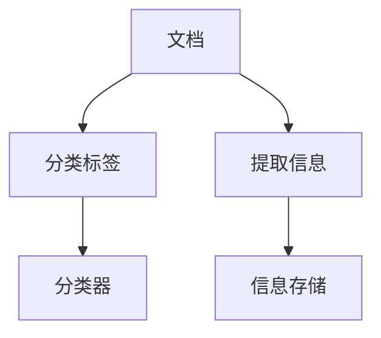
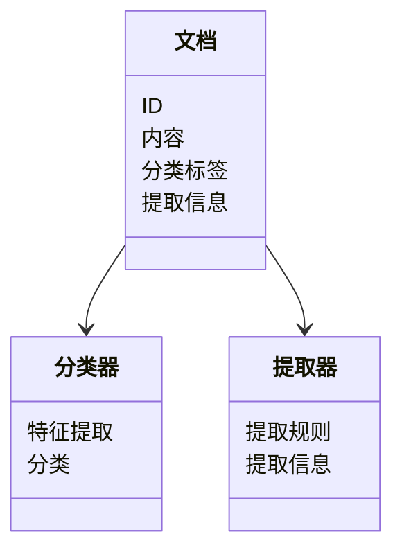
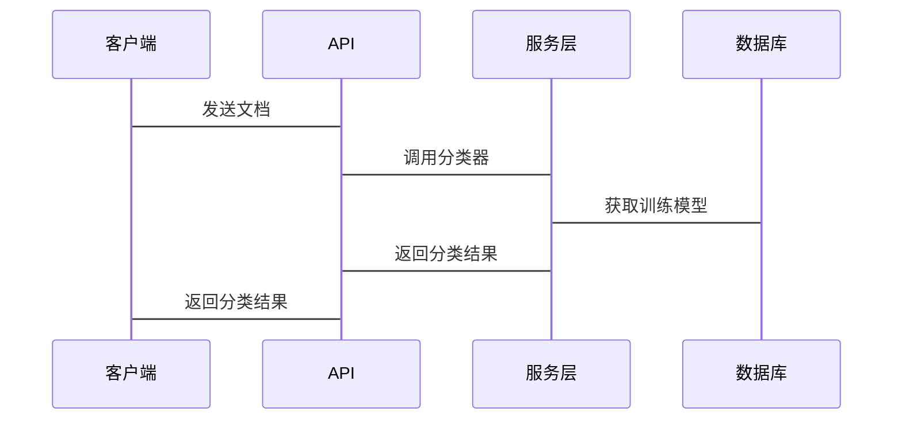

                 


# 构建智能企业文档管理系统：自动分类与信息提取

> 关键词：企业文档管理系统、自动分类、信息提取、机器学习、自然语言处理、系统架构

> 摘要：本文将详细介绍如何构建一个智能企业文档管理系统，重点探讨自动分类与信息提取的核心技术与实现方法。通过分析企业文档管理中的痛点，提出基于机器学习和自然语言处理的解决方案，并结合实际案例，详细阐述系统的架构设计、算法原理及实现步骤。

---

# 第一部分: 智能企业文档管理系统的背景与核心概念

## 第1章: 企业文档管理系统的智能化需求

### 1.1 问题背景与挑战

#### 1.1.1 传统文档管理系统的局限性
传统的文档管理系统通常依赖人工录入和分类，这种方式效率低下，容易出错。企业文档数量庞大，种类繁多，人工处理不仅耗时，还容易遗漏重要信息。此外，传统系统难以对文档内容进行深度分析，无法满足现代企业对智能化管理的需求。

#### 1.1.2 企业文档管理中的主要问题
企业在文档管理过程中面临以下问题：
- **文档分类不统一**：不同部门或人员对文档的分类标准不一致，导致文档难以检索和管理。
- **信息提取效率低**：需要从大量文档中提取关键信息，人工操作效率低下。
- **数据孤岛问题**：文档分散在不同的系统中，难以实现统一管理。
- **数据安全与隐私**：文档涉及企业机密，如何确保数据安全是重要挑战。

#### 1.1.3 智能化文档管理的必要性
智能化文档管理可以通过自动化技术解决上述问题，提高文档管理的效率和准确性。通过引入机器学习和自然语言处理技术，系统能够自动对文档进行分类、提取信息，并提供智能检索功能，帮助企业更好地利用文档数据。

---

### 1.2 问题描述与目标

#### 1.2.1 文档分类与信息提取的核心问题
文档分类和信息提取是智能化文档管理的两大核心任务：
- **文档分类**：根据文档的内容或属性，将其归类到特定的类别中。
- **信息提取**：从文档中提取特定的信息，如日期、名称、金额等。

#### 1.2.2 企业文档管理系统的功能目标
企业文档管理系统的功能目标包括：
- 自动化文档分类与信息提取。
- 提供高效的文档检索功能。
- 支持文档的版本控制和权限管理。
- 提供数据分析功能，帮助企业利用文档数据。

#### 1.2.3 自动分类与信息提取的具体需求
为实现自动分类与信息提取，系统需要满足以下需求：
- 支持多种文档格式（如PDF、Word、Excel等）。
- 支持多语言处理。
- 提供可定制的分类规则。
- 支持增量学习，不断优化分类和提取效果。

---

### 1.3 解决方案与实现路径

#### 1.3.1 智能文档管理系统的总体架构
智能文档管理系统的总体架构包括以下几个部分：
1. **文档预处理**：对文档进行清洗、分词等预处理。
2. **文档分类**：使用机器学习算法对文档进行分类。
3. **信息提取**：从分类后的文档中提取特定信息。
4. **存储与检索**：将提取的信息存储，并提供高效的检索功能。

#### 1.3.2 自动分类与信息提取的技术选型
- **分类算法**：常用的算法包括朴素贝叶斯、支持向量机（SVM）、随机森林等。
- **信息提取技术**：基于规则的提取、统计模型提取、深度学习模型提取。

#### 1.3.3 系统实现的关键步骤
1. 文档预处理：清洗、分词、去停用词。
2. 特征提取：将文档转换为数值特征，如TF-IDF向量。
3. 模型训练：使用训练数据训练分类模型。
4. 文档分类：对未标注文档进行分类。
5. 信息提取：从分类后的文档中提取关键信息。
6. 系统集成：将各个模块集成到一个统一的系统中。

---

### 1.4 系统边界与外延

#### 1.4.1 系统的功能边界
系统的核心功能包括文档分类、信息提取、文档存储与检索。不包括文档生成和内容编辑功能。

#### 1.4.2 与企业其他系统的交互关系
系统需要与企业其他系统（如ERP、CRM）进行数据交互，确保文档数据的统一管理和应用。

#### 1.4.3 系统的可扩展性与灵活性
系统设计应具有良好的扩展性，支持新增分类规则和提取任务。

---

### 1.5 核心概念与组成

#### 1.5.1 文档管理系统的组成要素
- 文档预处理模块：负责文档清洗和分词。
- 分类模块：负责文档分类。
- 提取模块：负责信息提取。
- 存储模块：负责文档和提取信息的存储。
- 检索模块：负责文档的高效检索。

#### 1.5.2 自动分类的核心概念
- **分类器**：负责对文档进行分类的模型。
- **特征向量**：文档的表示形式，用于分类器的输入。
- **标签**：文档的分类结果。

#### 1.5.3 信息提取的关键要素
- **提取规则**：定义提取的信息类型和位置。
- **抽取模型**：基于机器学习或规则的模型，用于提取信息。
- **存储格式**：提取信息的存储方式，如结构化数据。

---

### 1.6 本章小结

本章从企业文档管理的智能化需求出发，分析了传统文档管理系统的局限性，提出了智能化文档管理的目标和实现路径。通过明确系统的核心概念和组成，为后续的算法实现和系统设计奠定了基础。

---

# 第2章: 自动分类与信息提取的核心概念

## 2.1 核心概念原理

### 2.1.1 文档分类的基本原理
文档分类是基于文档的内容或属性，将其归类到特定类别中的过程。常用的分类算法包括朴素贝叶斯、SVM、随机森林等。

### 2.1.2 信息提取的实现机制
信息提取是从文档中提取特定信息的过程，常用的技术包括基于规则的提取、统计模型提取和深度学习模型提取。

---

## 2.2 核心概念对比分析

### 2.2.1 文档分类与信息提取的对比
| 对比维度 | 文档分类 | 信息提取 |
|----------|----------|----------|
| 目标     | 将文档归类到特定类别 | 提取文档中的特定信息 |
| 输入     | 文档内容 | 文档内容 |
| 输出     | 分类标签 | 提取的信息 |

### 2.2.2 不同分类算法的优缺点
| 算法      | 优点                           | 缺点                           |
|-----------|--------------------------------|--------------------------------|
| 朴素贝叶斯 | 实现简单，计算效率高            | 对特征独立性假设较强，分类效果可能受限 |
| SVM       | 分类效果好，适用于小规模数据    | 对大规模数据训练时间较长       |
| 随机森林  | 抗过拟合能力强，分类效果好      | 对特征工程要求较高             |

### 2.2.3 信息提取的特征分析
信息提取的关键在于特征的选择和提取规则的设计。常用的特征包括文本长度、关键词出现频率等。

---

## 2.3 实体关系图（ER图）



---

## 2.4 本章小结

本章详细讲解了文档分类和信息提取的核心概念及其实现机制，分析了不同算法的优缺点，并通过对比分析明确了两者的区别与联系。

---

# 第3章: 算法原理与实现

## 3.1 文档分类算法原理

### 3.1.1 朴素贝叶斯分类器

#### 3.1.1.1 算法流程


#### 3.1.1.2 代码实现
```python
from sklearn.naive_bayes import MultinomialNB
from sklearn.feature_extraction.text import TfidfVectorizer

# 训练分类器
vectorizer = TfidfVectorizer()
X_train = vectorizer.fit_transform(train_texts)
clf = MultinomialNB().fit(X_train, train_labels)
```

#### 3.1.1.3 数学模型
贝叶斯定理的公式为：
$$ P(y|x) = \frac{P(x|y)P(y)}{P(x)} $$

---

## 3.2 信息提取算法原理

### 3.2.1 基于规则的提取方法
- **规则定义**：根据特定的规则或模式从文档中提取信息。
- **代码实现**：
```python
import re

# 提取日期
date_pattern = r'\b\d{4}-\d{2}-\d{2}\b'
date = re.search(date_pattern, text).group()
```

### 3.2.2 基于统计的提取方法
- **统计模型**：通过统计关键词出现的频率来提取信息。
- **代码实现**：
```python
from sklearn.feature_extraction.text import CountVectorizer

vectorizer = CountVectorizer()
X = vectorizer.fit_transform(documents)
```

### 3.2.3 基于深度学习的提取方法
- **模型选择**：常用CRF（条件随机场）模型。
- **代码实现**：
```python
from sklearn_crfsuite import CRF

crf = CRF()
crf.fit(X_train, y_train)
```

---

## 3.3 算法实现代码示例

### 3.3.1 分类器实现
```python
from sklearn.metrics import accuracy_score

# 预测标签
X_test = vectorizer.transform(test_texts)
predicted_labels = clf.predict(X_test)
# 计算准确率
accuracy = accuracy_score(test_labels, predicted_labels)
print(f'Accuracy: {accuracy}')
```

### 3.3.2 信息提取实现
```python
# 使用CRF进行命名实体识别
from sklearn_crfsuite import metrics

# 预测结果
predicted = crf.predict(X_test)
# 计算F1分数
f1 = metrics.flat_f1_score(y_test, predicted, average='weighted')
print(f'F1 Score: {f1}')
```

---

## 3.4 本章小结

本章详细讲解了文档分类和信息提取的算法原理，通过代码示例展示了如何实现分类器和提取器。通过分析不同算法的优缺点，为后续的系统设计提供了理论基础。

---

# 第4章: 系统分析与架构设计

## 4.1 问题场景介绍

### 4.1.1 问题场景描述
企业在文档管理中面临文档分类和信息提取的痛点，需要一个智能化的解决方案。

### 4.1.2 项目介绍
本项目旨在构建一个智能企业文档管理系统，实现文档的自动分类与信息提取。

---

## 4.2 系统功能设计

### 4.2.1 领域模型


---

## 4.3 系统架构设计

### 4.3.1 系统架构图


---

## 4.4 系统接口设计

### 4.4.1 接口描述
- **分类接口**：`POST /classify`
- **提取接口**：`POST /extract`

---

## 4.5 系统交互流程

### 4.5.1 文档分类流程


---

## 4.6 本章小结

本章通过问题场景分析和系统功能设计，明确了智能文档管理系统的架构和接口设计，为后续的实现奠定了基础。

---

# 第5章: 项目实战

## 5.1 环境安装

### 5.1.1 安装Python环境
安装Python 3.8及以上版本，并安装以下库：
```bash
pip install scikit-learn sklearn-crfsuite
```

---

## 5.2 系统核心实现

### 5.2.1 分类器实现
```python
from sklearn.naive_bayes import MultinomialNB
from sklearn.feature_extraction.text import TfidfVectorizer

# 训练分类器
vectorizer = TfidfVectorizer()
X_train = vectorizer.fit_transform(train_texts)
clf = MultinomialNB().fit(X_train, train_labels)
```

### 5.2.2 提取器实现
```python
from sklearn_crfsuite import CRF

# 训练CRF模型
crf = CRF()
crf.fit(X_train, y_train)
```

---

## 5.3 代码应用解读与分析

### 5.3.1 分类器应用
```python
# 文档预处理
def preprocess(text):
    return text.lower()

# 分类器应用
def classify_document(text):
    processed_text = preprocess(text)
    X = vectorizer.transform([processed_text])
    return clf.predict(X)[0]
```

---

## 5.4 实际案例分析

### 5.4.1 案例描述
假设我们有一个包含合同文档的数据集，需要分类到不同的合同类型（如销售合同、采购合同等）。

### 5.4.2 分析过程
1. 文档预处理：将文档内容转换为小写。
2. 特征提取：使用TF-IDF提取特征向量。
3. 文档分类：使用朴素贝叶斯分类器进行分类。

---

## 5.5 本章小结

本章通过实际案例分析，展示了如何将理论应用于实践，详细解读了系统的实现过程。

---

# 第6章: 最佳实践与总结

## 6.1 最佳实践

### 6.1.1 数据预处理
- 清洗数据，去除无关信息。
- 统一文档格式，确保模型输入一致。

### 6.1.2 模型调优
- 调整模型参数，优化分类效果。
- 使用交叉验证评估模型性能。

---

## 6.2 小结

通过本文的详细讲解，读者可以了解到智能企业文档管理系统的构建过程，掌握自动分类与信息提取的核心技术。

---

## 6.3 注意事项

- 数据安全：确保文档数据的安全性和隐私性。
- 模型更新：定期更新模型，保持分类和提取的准确性。
- 系统维护：定期维护系统，确保其稳定运行。

---

## 6.4 拓展阅读

- 《机器学习实战》
- 《自然语言处理入门》
- 《系统架构设计》

---

# 附录

## 附录A: 代码示例

### 附录A.1 分类器代码
```python
from sklearn.naive_bayes import MultinomialNB
from sklearn.feature_extraction.text import TfidfVectorizer

# 训练分类器
vectorizer = TfidfVectorizer()
X_train = vectorizer.fit_transform(train_texts)
clf = MultinomialNB().fit(X_train, train_labels)
```

### 附录A.2 提取器代码
```python
from sklearn_crfsuite import CRF

# 训练CRF模型
crf = CRF()
crf.fit(X_train, y_train)
```

---

## 附录B: 模型评估

### 附录B.1 分类器评估
```python
from sklearn.metrics import accuracy_score

predicted_labels = clf.predict(X_test)
accuracy = accuracy_score(test_labels, predicted_labels)
print(f'Accuracy: {accuracy}')
```

### 附录B.2 提取器评估
```python
from sklearn_crfsuite import metrics

f1 = metrics.flat_f1_score(y_test, predicted, average='weighted')
print(f'F1 Score: {f1}')
```

---

## 附录C: 系统架构图


---

# 结语

通过本文的详细讲解，读者可以全面了解智能企业文档管理系统的构建过程，掌握自动分类与信息提取的核心技术。希望本文能为企业的智能化文档管理提供有价值的参考和指导。

--- 

（完）

