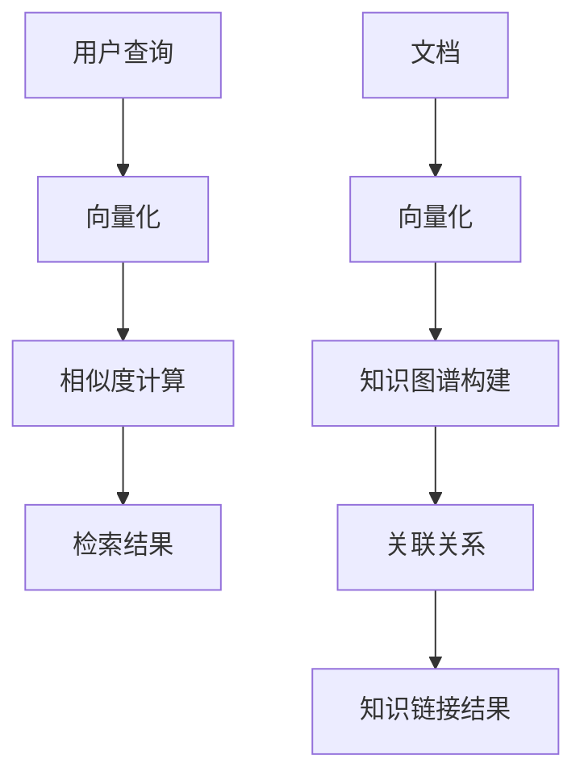
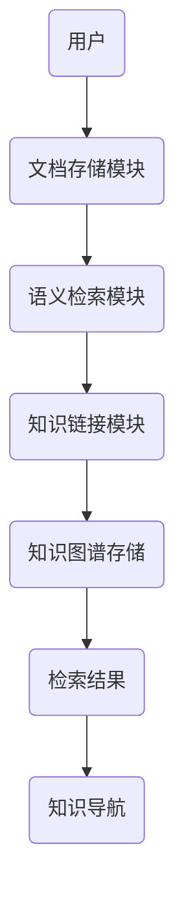

                 


# {{构建智能企业文档管理系统：语义检索与知识链接}}

> 关键词：智能文档管理，语义检索，知识链接，知识图谱，深度学习，自然语言处理

> 摘要：随着企业文档管理需求的日益增长，传统的文档管理系统已经难以满足智能化、高效化的要求。本文深入探讨了智能企业文档管理系统的构建方法，重点分析了语义检索与知识链接的核心技术与实现方式。通过对语义检索算法的原理解析、知识图谱的构建与应用，结合实际案例分析，详细阐述了如何将这些技术应用于企业文档管理中，以提升文档管理和知识共享的效率与质量。文章还提供了系统架构设计、项目实战代码及最佳实践建议，为企业构建智能文档管理系统提供全面的技术指导。

---

# 第1章: 企业文档管理的智能化需求

## 1.1 问题背景
企业文档管理是现代企业运营的核心环节之一。随着企业规模的不断扩大，文档数量急剧增加，传统的文档管理系统往往依赖关键词匹配进行检索，导致检索效率低下、准确性差。此外，文档之间的关联性未能有效挖掘，难以支持知识共享与复用。

## 1.2 问题描述
传统的文档管理系统存在以下主要问题：
1. **检索效率低**：基于关键词匹配的检索方式容易出现误检和漏检。
2. **知识孤岛**：文档之间的关联性未被有效利用，难以形成知识网络。
3. **用户体验差**：用户难以快速找到所需信息，影响工作效率。

## 1.3 解决方案
引入语义检索和知识链接技术，通过自然语言处理和深度学习算法，实现文档内容的语义理解与智能关联。这种方法能够提升检索效率，挖掘文档之间的隐含关系，从而优化知识共享与复用。

## 1.4 边界与外延
智能企业文档管理系统主要关注文档的存储、检索与关联，其边界包括文档的结构化存储、语义检索算法的实现以及知识图谱的构建与应用。外延则涉及文档的安全管理、版本控制以及多终端支持。

## 1.5 核心要素组成
1. **文档存储**：支持结构化与非结构化文档的存储。
2. **语义检索**：基于深度学习的语义理解技术。
3. **知识链接**：基于知识图谱的文档关联。
4. **用户界面**：提供直观的文档检索与知识导航界面。

---

# 第2章: 语义检索与知识链接的核心概念

## 2.1 语义检索的定义与作用
语义检索是一种基于语义理解的检索技术，旨在通过分析文档内容的语义信息，实现更精准的检索结果。其作用包括提升检索准确率、减少误检率以及提高用户体验。

## 2.2 知识图谱的构建与应用
知识图谱是一种结构化的知识表示形式，通过实体与关系的建模，能够有效表示文档中的知识关联。其构建过程包括数据抽取、实体识别与关系抽取，最终应用于文档的智能关联与知识导航。

## 2.3 语义检索与知识链接的关联
语义检索通过理解文档内容，为知识图谱的构建提供语义信息；而知识链接则利用知识图谱中的关联关系，增强语义检索的准确性与深度。

## 2.4 核心概念对比表
| 概念 | 定义 | 特性 | 应用 |
|------|------|------|------|
| 语义检索 | 基于语义理解的检索技术 | 高度准确、智能 | 文档管理、信息检索 |
| 知识链接 | 基于知识图谱的链接技术 | 结构化、关联性 | 知识管理、信息整合 |

## 2.5 ER实体关系图
```mermaid
er
actor: 用户
model: 文档管理系统
base: 文档库
r1: 用户 -> 文档管理系统 (使用系统)
r2: 文档管理系统 -> 文档库 (存储文档)
r3: 文档库 <-[通过]-> 文档 (存储)
```

---

# 第3章: 语义检索与知识链接的算法原理

## 3.1 语义检索的算法原理
语义检索的核心是通过深度学习模型（如BERT）对文档内容进行语义向量化，然后基于向量的相似度计算进行检索。

### 3.1.1 基于向量的语义检索
- **向量化**：使用BERT等预训练模型对文档进行编码，生成语义向量。
- **相似度计算**：通过余弦相似度或欧氏距离计算向量之间的相似度。

### 3.1.2 基于深度学习的语义检索
- **模型训练**：使用大规模语料库进行微调，提升模型对特定领域文档的理解能力。
- **检索过程**：将查询内容向量化，与文档向量进行匹配，返回相似度最高的结果。

### 3.1.3 常见的语义检索算法
- **BM25**：基于概率的语言模型，常用于信息检索。
- **DSSM**：深度语义相似度模型，基于深度学习的语义理解。

## 3.2 知识图谱的构建算法
知识图谱的构建包括数据抽取、实体识别与关系抽取。

### 3.2.1 数据抽取
- **分词**：使用jieba等工具对文本进行分词。
- **实体识别**：基于CRF或BERT进行命名实体识别。

### 3.2.2 关系抽取
- **依赖句法分析**：使用斯坦福句法分析器提取句子结构。
- **关系抽取**：基于模式匹配或深度学习模型识别实体间的关系。

## 3.3 算法流程图


## 3.4 Python核心代码实现
```python
import numpy as np
from sentence_transformers import SentenceTransformer

model = SentenceTransformer('bert-base-nli-mean-tokens')
query_embedding = model.encode("What is the meaning of life?")
document_embeddings = model.encode(["The meaning of life is to find happiness.", 
                                   "Life is about learning and growing."])

# 计算余弦相似度
similarity = np.dot(query_embedding, document_embeddings) / (np.linalg.norm(query_embedding) * np.linalg.norm(document_embeddings))
```

---

# 第4章: 系统架构设计

## 4.1 系统功能设计
系统主要包括文档存储、语义检索、知识链接与知识图谱管理四大功能模块。

### 4.1.1 文档存储模块
- **功能**：支持多种格式文档的上传与存储。
- **实现**：使用MongoDB进行非结构化文档存储。

### 4.1.2 语义检索模块
- **功能**：基于语义理解实现智能检索。
- **实现**：集成BERT模型进行语义向量化。

### 4.1.3 知识链接模块
- **功能**：通过知识图谱实现文档间的关联。
- **实现**：使用Neo4j进行知识图谱的存储与查询。

## 4.2 系统架构图


---

# 第5章: 项目实战

## 5.1 环境搭建
- **工具安装**：安装Python、MongoDB、Neo4j。
- **依赖安装**：安装Sentence-BERT、networkx等库。

## 5.2 核心代码实现
```python
from sentence_transformers import SentenceTransformer
import networkx as nx

# 初始化模型
model = SentenceTransformer('bert-base-nli-mean-tokens')

# 文档存储
db = MongoClient('mongodb://localhost:27017')['documentDB']
db['documents'].insert({'content': 'The meaning of life is to find happiness.'})

# 语义检索
query_embedding = model.encode("What is the meaning of life?")
results = db['documents'].find()

# 知识图谱构建
G = nx.Graph()
G.add_edge("life", "happiness")
nx.draw(G)
```

## 5.3 案例分析
通过实际案例分析，展示了如何利用语义检索与知识链接技术提升文档管理效率。

## 5.4 项目总结
总结项目实现的关键点，分析可能的优化方向。

---

# 第6章: 最佳实践与小结

## 6.1 最佳实践
- **数据质量管理**：确保数据的准确性和完整性。
- **模型调优**：通过微调模型提升语义理解能力。
- **系统性能优化**：优化查询速度与响应时间。

## 6.2 小结
本文详细介绍了智能企业文档管理系统的构建方法，重点分析了语义检索与知识链接的核心技术与实现方式。通过理论分析与实践案例，展示了如何将这些技术应用于实际的企业文档管理中。

## 6.3 注意事项
- 确保数据安全与隐私保护。
- 定期更新知识图谱，保持其准确性。

## 6.4 拓展阅读
推荐相关领域的优秀书籍与论文，供读者深入学习。

---

通过以上目录和内容的详细规划，我们能够系统地构建一个智能企业文档管理系统，结合语义检索与知识链接技术，为企业文档管理的智能化与高效化提供有力支持。

