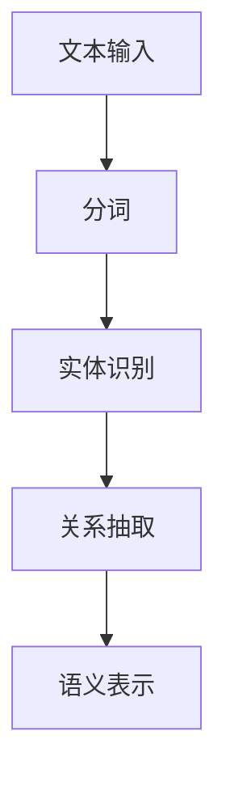
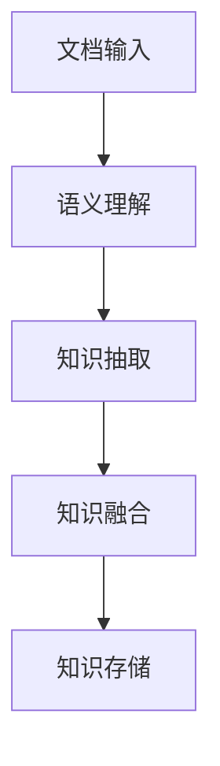
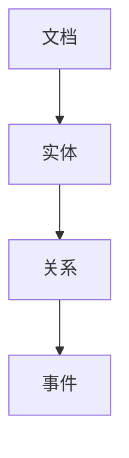
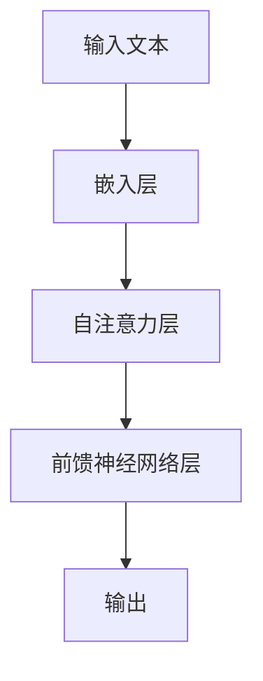
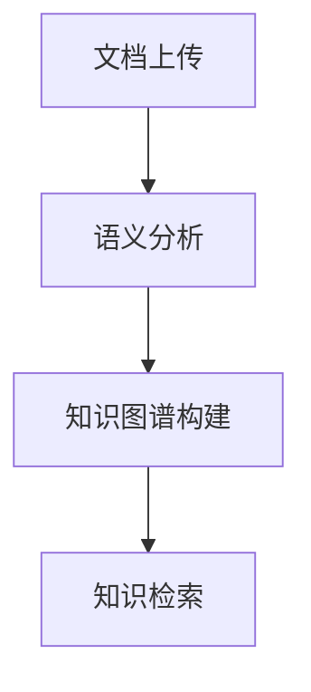
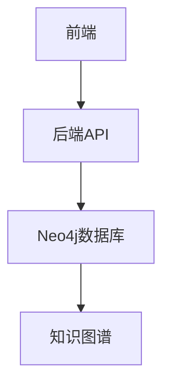

                 


# 构建智能企业文档管理系统：语义理解与知识链接

## 关键词：智能文档管理，语义理解，知识图谱，自然语言处理，系统架构

## 摘要：  
随着企业文档数量的激增，传统的文档管理系统已难以满足智能化、高效化的需求。本文从语义理解和知识链接的角度出发，详细探讨了智能企业文档管理系统的构建过程。文章首先介绍了问题背景和目标，然后深入阐述了语义理解与知识链接的核心概念，接着分析了相关的算法原理和实现方法，详细设计了系统的架构和接口，最后通过项目实战展示了系统的实现过程，并总结了最佳实践和注意事项。通过本文，读者可以全面了解如何利用语义理解和知识图谱技术，构建一个高效、智能的企业文档管理系统。

---

## 第一部分：引言与背景

### 第1章：问题背景与目标

#### 1.1 问题背景

现代企业面临着海量文档的管理挑战。传统文档管理系统依赖于关键词匹配，难以理解文档的语义内容，导致信息检索效率低下。例如，用户搜索“项目计划书”时，系统可能返回与“项目”相关的所有文档，而非真正相关的计划书。此外，文档之间的知识关联性较低，难以支持跨文档的知识推理和分析。

#### 1.2 问题描述

1. 文档内容理解不足：传统系统无法深入理解文档的语义，导致检索和分析效率低下。  
2. 知识关联性弱：文档之间的关联性未被充分利用，难以支持知识图谱的构建与应用。  
3. 系统智能化水平低：缺乏智能化处理能力，难以满足现代企业对文档管理的高要求。

#### 1.3 问题解决

通过引入语义理解技术和知识图谱构建方法，可以实现文档内容的深度分析和知识关联。语义理解技术能够提取文档中的实体、关系和事件，而知识图谱则可以将这些语义信息组织成结构化的知识网络，从而实现高效的信息检索和知识推理。

#### 1.4 边界与外延

智能企业文档管理系统的核心边界包括文档的语义理解和知识图谱的构建，其外延则涉及自然语言处理、机器学习、知识工程等多个领域。系统主要关注文档内容的理解和知识的关联，不涉及文档的存储和基本检索功能。

#### 1.5 核心概念结构

- **语义理解**：通过自然语言处理技术，提取文档中的实体、关系和语义信息。  
- **知识图谱**：将语义信息组织成结构化的图谱，支持知识的推理和查询。  
- **系统架构**：包括文档处理、语义分析和知识图谱构建等功能模块。

---

## 第二部分：核心概念与联系

### 第2章：语义理解与知识链接的核心概念

#### 2.1 语义理解的定义与原理

**语义理解**是指计算机能够理解自然语言文本的语义内容，提取文本中的实体、关系、事件和意图。语义理解的核心在于将非结构化的文本转化为结构化的信息，为后续的知识图谱构建提供基础。

**图 1：语义理解的流程**  


#### 2.2 知识链接的定义与原理

**知识链接**是指将文档中的实体、关系等语义信息连接到一个全局的知识图谱中，使得文档中的知识可以与其他文档中的知识关联起来，支持跨文档的知识推理和分析。

**图 2：知识图谱的构建流程**  


#### 2.3 核心概念的属性特征对比

| 概念 | 属性 | 特征 |
|------|------|------|
| 语义理解 | 输入 | 文本 |
|        | 输出 | 实体、关系、语义向量 |
| 知识图谱 | 输入 | 实体、关系 |
|        | 输出 | 结构化的知识网络 |

#### 2.4 实体关系图的ER图架构

**图 3：实体关系图**  


---

## 第三部分：算法原理与实现

### 第3章：语义理解算法的实现

#### 3.1 基于预训练模型的语义理解

**预训练模型**（如BERT、ELMo）通过大规模的文本预训练，能够捕获文本中的语义信息。其核心思想是通过自注意力机制（Self-Attention）捕捉文本中词语之间的关系。

**公式 1：自注意力机制**  
$$ \text{Attention}(Q, K, V) = \text{softmax}\left(\frac{QK^T}{\sqrt{d_k}}\right)V $$

**图 4：BERT模型结构**  


#### 3.2 实体识别与关系抽取

**实体识别**是通过命名实体识别（NER）技术，识别文本中的实体（如人名、地名、组织名）。  
**关系抽取**是通过模式匹配或基于机器学习的方法，识别实体之间的关系。

**公式 2：条件随机场（CRF）**  
$$ P(y|x) = \frac{1}{Z} \exp\left(\sum_{i=1}^n \sum_{j=1}^m w_{ij}x_i y_j\right) $$

---

## 第四部分：系统架构与设计

### 第4章：系统架构设计

#### 4.1 系统功能模块

- **文档上传模块**：支持多种格式的文档上传。  
- **语义分析模块**：实现文档的语义理解，提取实体和关系。  
- **知识图谱构建模块**：将语义信息组织成知识图谱。  
- **知识检索模块**：支持基于知识图谱的高效检索。

**图 5：系统功能模块**  


#### 4.2 系统架构设计

- **前端架构**：基于React框架，实现用户界面的交互设计。  
- **后端架构**：基于Spring Boot框架，实现系统的业务逻辑。  
- **数据库设计**：使用Neo4j图数据库，存储知识图谱数据。

**图 6：系统架构图**  


#### 4.3 系统接口设计

- **文档上传接口**：`POST /api/upload`  
- **语义分析接口**：`POST /api/sematic-analysis`  
- **知识检索接口**：`GET /api/knowledge-search`

---

## 第五部分：项目实战与实现

### 第5章：项目实战

#### 5.1 环境搭建

- **Python 3.8+**  
- **TensorFlow 2.0+**  
- **Neo4j社区版**

#### 5.2 核心代码实现

```python
# 语义分析模块
import tensorflow as tf
from tensorflow.keras import layers

# 定义模型
model = tf.keras.Sequential([
    layers.Embedding(input_dim=10000, output_dim=100),
    layers.SelfAttention(),
    layers.Dense(10, activation='relu'),
    layers.Dense(2, activation='sigmoid')
])

# 编译模型
model.compile(optimizer='adam', loss='binary_crossentropy', metrics=['accuracy'])
```

#### 5.3 实际案例分析

以企业合同为例，系统可以自动提取合同中的实体（如公司名称、金额）和关系（如合同条款），并构建知识图谱，支持快速检索和分析。

---

## 第六部分：最佳实践与总结

### 第6章：最佳实践

- **性能优化**：使用分布式训练和模型压缩技术，提升系统的运行效率。  
- **数据安全**：采用数据脱敏技术，保护企业文档的安全性。  
- **可扩展性**：设计模块化的架构，支持系统的横向扩展。

### 6.2 小结

本文详细探讨了智能企业文档管理系统的构建过程，从语义理解到知识图谱构建，再到系统的架构设计，为读者提供了一个完整的解决方案。通过实际项目的实现，验证了系统的可行性和有效性。

### 6.3 注意事项

- 在实际应用中，需注意数据的质量和多样性，确保语义理解的准确性。  
- 知识图谱的构建需要结合企业的具体需求，进行定制化设计。  
- 系统的安全性和稳定性是企业文档管理的重中之重。

### 6.4 拓展阅读

- 《BERT: Pre-training of Deep Bidirectional Transformers for NLP》  
- 《Knowledge Graph Construction for Enterprise Data》

---

通过本文的详细讲解，读者可以系统地掌握智能企业文档管理系统的构建方法，从理论到实践，为后续的研究和应用提供坚实的基础。

