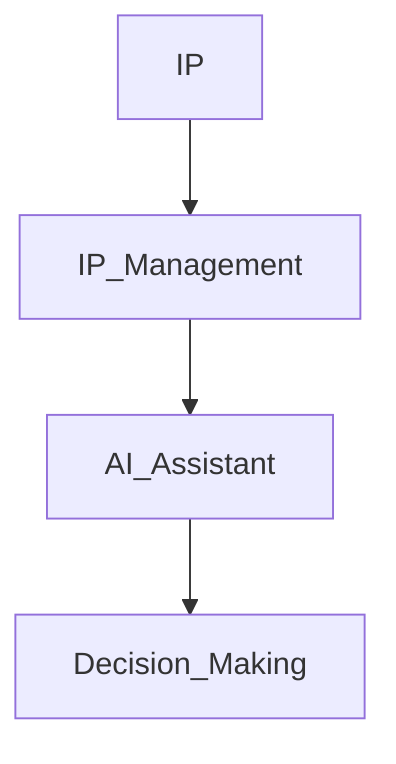

                 

# 构建智能企业知识产权运营平台：AI辅助决策

> 关键词：知识产权管理，人工智能，决策支持，系统架构，机器学习

> 摘要：随着企业知识产权的重要性日益凸显，如何利用人工智能技术优化知识产权管理成为企业关注的焦点。本文详细探讨了构建智能企业知识产权运营平台的技术路径，从背景分析、核心概念、算法原理到系统架构设计，再到项目实战和最佳实践，为企业提供全面的解决方案，助力企业在知识产权管理中实现高效决策和价值提升。

---

# 第一部分：背景介绍

## 第1章：知识产权与AI辅助决策的背景

### 1.1 问题背景
#### 1.1.1 企业知识产权管理的现状与挑战
企业在知识产权管理中面临数据分散、检索效率低、侵权风险高等问题，传统的管理方式难以应对日益复杂的知识产权环境。

#### 1.1.2 知识产权在企业运营中的重要性
知识产权是企业的核心资产，直接影响企业的市场竞争力和创新能力。

#### 1.1.3 AI技术在知识产权管理中的应用潜力
人工智能技术可以通过数据分析、模式识别和自然语言处理，提升知识产权管理的效率和准确性。

### 1.2 问题描述
#### 1.2.1 知识产权管理中的痛点
- 数据分散，难以统一管理
- 检索效率低下，影响决策速度
- 侵权风险高，难以及时预警

#### 1.2.2 传统知识产权管理的局限性
- 依赖人工审核，效率低下
- 数据分析能力有限，难以提供深度洞察
- 知识产权布局不够优化

#### 1.2.3 需求与供给的不平衡问题
企业对知识产权管理的需求日益增长，但传统方法难以满足高效、精准的需求。

### 1.3 问题解决
#### 1.3.1 引入AI技术的必要性
人工智能技术能够高效处理大量数据，提供智能化的决策支持。

#### 1.3.2 AI辅助决策在知识产权管理中的具体应用
- 智能检索与分析
- 知识产权风险预警
- 知识产权布局优化

#### 1.3.3 解决方案的可行性分析
基于现有的AI技术，构建智能企业知识产权运营平台是可行的，能够显著提升企业的管理效率。

### 1.4 边界与外延
#### 1.4.1 平台的功能边界
平台主要专注于知识产权管理，包括检索、分析、预警和布局优化等功能，不涉及其他业务领域。

#### 1.4.2 AI辅助决策的适用范围
适用于专利、商标、版权等知识产权的管理与决策支持。

#### 1.4.3 知识产权管理的扩展领域
未来可能扩展到知识产权保护、交易和国际化布局等方面。

### 1.5 核心概念与要素
#### 1.5.1 智能企业知识产权运营平台的定义
整合AI技术，提供智能化的知识产权管理与决策支持的平台。

#### 1.5.2 AI辅助决策的核心要素
- 数据采集与处理
- 智能分析与预测
- 决策支持与反馈

#### 1.5.3 平台与决策的关系
平台通过AI技术辅助决策，实现知识产权管理的智能化和高效化。

---

# 第二部分：核心概念与联系

## 第2章：知识产权与AI辅助决策的核心概念

### 2.1 知识产权管理的原理
#### 2.1.1 知识产权的基本原理
知识产权是法律赋予的权利，包括专利权、商标权、版权等。

#### 2.1.2 知识产权的分类与特点
- 专利权：技术领域的保护
- 商标权：品牌识别
- 版权：创作作品的保护

#### 2.1.3 知识产权管理的流程
包括数据采集、分析、检索、预警和布局优化等步骤。

### 2.2 AI辅助决策的原理
#### 2.2.1 人工智能的基本原理
AI通过数据训练，模拟人类学习和决策的过程。

#### 2.2.2 机器学习在决策中的应用
- 监督学习：基于标注数据进行预测
- 非监督学习：发现数据中的模式
- 强化学习：通过试错优化决策

#### 2.2.3 自然语言处理在知识产权管理中的作用
NLP技术用于文本分析，帮助识别关键词和潜在风险。

### 2.3 核心概念的对比分析
#### 2.3.1 知识产权与AI技术的对比
- 知识产权：法律性质，注重保护
- AI技术：技术手段，注重效率

#### 2.3.2 AI辅助决策与其他决策方式的对比
AI辅助决策速度快、覆盖面广，但依赖数据质量和算法模型。

#### 2.3.3 知识产权管理中的关键指标分析
- 知识产权数量
- 布局的合理性
- 侵权风险的可控性

### 2.4 ER实体关系图

---

接下来的章节将详细讲解算法原理、系统架构设计、项目实战和最佳实践，确保全面覆盖构建智能企业知识产权运营平台所需的技术细节和实际应用。

