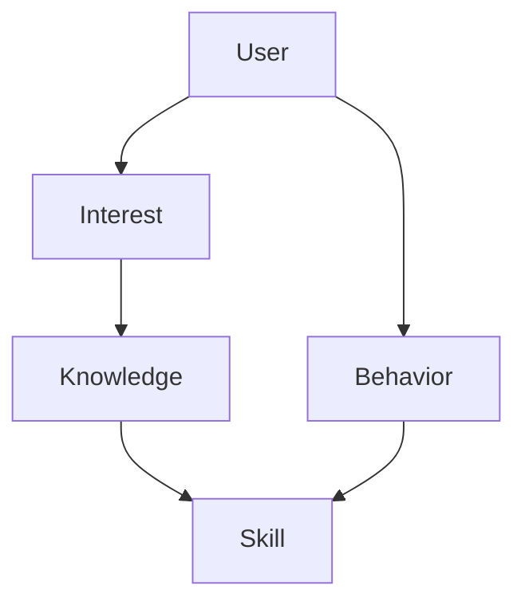
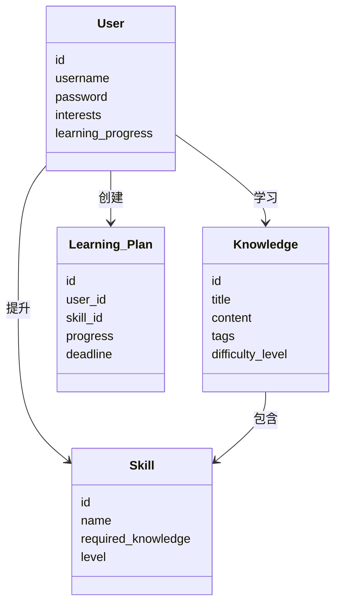
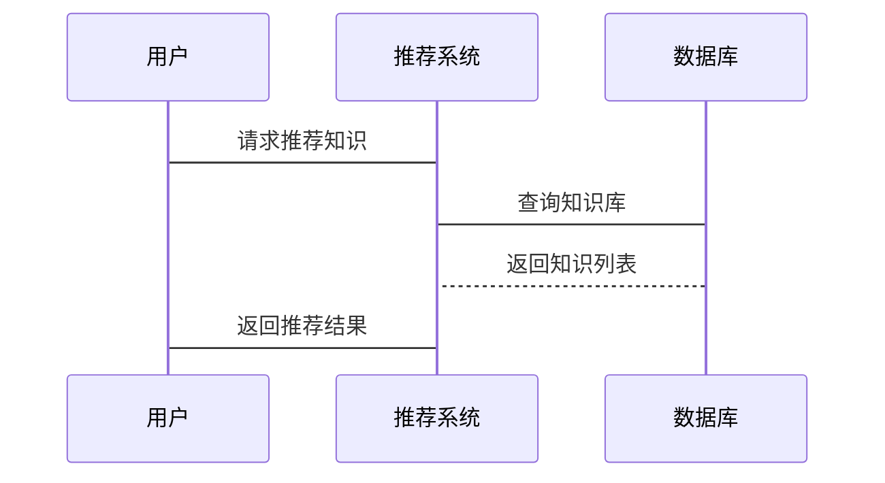

                 


# 构建智能企业知识推荐系统：个性化学习与技能提升路径规划

**关键词：** 知识推荐系统、个性化学习、技能提升、路径规划、人工智能

**摘要：** 本文旨在探讨如何构建一个智能企业知识推荐系统，通过个性化学习和技能提升路径规划，帮助企业员工高效获取所需知识，提升工作效率和竞争力。本文从背景与概述出发，深入分析知识推荐系统的核心概念、算法原理、系统架构，并通过项目实战展示如何实现一个高效的智能推荐系统。最后，本文将总结最佳实践和未来发展方向。

---

# 第一部分: 背景与概述

## 第1章: 智能企业知识推荐系统概述

### 1.1 知识推荐系统的发展背景

#### 1.1.1 知识经济时代的到来
在知识经济时代，知识被视为企业最重要的资产之一。企业通过知识的高效传递和利用，能够显著提升竞争力。然而，随着企业规模的扩大和知识的爆炸式增长，如何有效管理和推荐知识成为一大挑战。

#### 1.1.2 企业知识管理的痛点
企业知识管理的传统方式存在以下痛点：
- 知识分散：知识存储在不同的系统或文档中，难以统一管理和检索。
- 信息过载：员工面对海量信息，难以快速找到所需知识。
- 个性化不足：传统推荐系统难以满足个性化需求，推荐结果往往不够精准。

#### 1.1.3 智能推荐技术的兴起
随着人工智能和大数据技术的发展，智能推荐系统逐渐成为解决知识管理问题的重要工具。通过机器学习算法，推荐系统能够根据用户的行为和偏好，提供个性化的知识推荐。

---

### 1.2 个性化学习与技能提升的背景

#### 1.2.1 个性化学习的需求
在现代职场中，员工的学习需求日益多样化。每个人的学习目标、节奏和偏好都不同，传统的一-size-fits-all学习方式难以满足需求。

#### 1.2.2 技能提升的路径规划
技能提升需要科学的路径规划。通过分析员工的知识盲点和技能缺口，推荐系统可以为员工提供个性化的学习路径，帮助其快速提升所需技能。

#### 1.2.3 企业知识推荐系统的意义
企业知识推荐系统通过智能化推荐，不仅能够提高员工的学习效率，还能帮助企业更好地管理员工的知识和技能，从而提升整体竞争力。

---

### 1.3 本书的目标与结构

#### 1.3.1 本书的目标
本书旨在帮助读者理解如何构建一个智能企业知识推荐系统，并通过个性化学习和技能提升路径规划，帮助企业实现知识的高效管理和利用。

#### 1.3.2 本书的结构
- 第一部分：背景与概述
  - 介绍知识推荐系统的发展背景、个性化学习的需求以及企业知识推荐系统的意义。
- 第二部分：核心概念与理论基础
  - 讲解知识图谱、推荐算法、个性化模型等核心概念。
- 第三部分：算法原理与数学模型
  - 详细分析协同过滤、深度学习推荐算法以及混合推荐模型的原理。
- 第四部分：系统架构与设计方案
  - 介绍系统的需求分析、功能设计、架构设计等。
- 第五部分：项目实战
  - 指导读者如何搭建环境、编写代码、实现推荐系统。
- 第六部分：总结与展望
  - 总结本书内容，并展望未来的发展方向。

#### 1.3.3 本书的读者群体
本书适合企业IT技术人员、数据科学家、机器学习工程师以及对知识推荐系统感兴趣的研究者阅读。

---

# 第二部分: 核心概念与理论基础

## 第2章: 知识推荐系统的核心概念

### 2.1 知识图谱与推荐系统

#### 2.1.1 知识图谱的定义与特点
知识图谱是一种以图结构表示知识的语义网络。它通过实体和关系描述知识的语义，具有以下特点：
- 结构化：知识以实体和关系的形式组织。
- 可扩展性：支持大规模知识的存储和查询。
- 语义丰富性：能够表达复杂的知识关系。

#### 2.1.2 知识图谱在推荐系统中的应用
知识图谱可以用于推荐系统的以下方面：
- 用户建模：通过分析用户的兴趣和行为，构建用户画像。
- 物品推荐：基于物品的属性和关系，推荐相关物品。
- 知识关联：通过知识图谱的语义关联，推荐相关知识。

#### 2.1.3 知识图谱与传统推荐系统的对比
| 特性       | 知识图谱推荐系统 | 传统推荐系统 |
|------------|------------------|--------------|
| 数据来源   | 结构化知识图谱     | 用户行为数据 |
| 推荐依据   | 语义关联          | 用户相似性   |
| 优势       | 高语义准确性       | 计算效率高    |
| 劣势       | 数据构建复杂       | 推荐结果可能不够个性化 |

---

### 2.2 推荐算法与个性化模型

#### 2.2.1 推荐算法的分类
推荐算法主要分为以下几类：
- 基于协同过滤的推荐算法
- 基于内容的推荐算法
- 基于深度学习的推荐算法

#### 2.2.2 个性化模型的构建
个性化模型需要考虑以下要素：
- 用户特征：用户的兴趣、行为、偏好。
- 物品特征：物品的属性、标签。
- 关系特征：用户与物品之间的关系。

#### 2.2.3 推荐系统的核心要素
推荐系统的核心要素包括：
- 用户：系统的使用对象。
- 物品：推荐的目标对象。
- 数据：用户行为数据和物品属性数据。
- 算法：推荐的核心逻辑。

---

### 2.3 知识推荐系统的属性对比

#### 2.3.1 知识图谱与传统推荐系统的对比
| 特性       | 知识图谱推荐系统 | 传统推荐系统 |
|------------|------------------|--------------|
| 数据来源   | 结构化知识图谱     | 用户行为数据 |
| 推荐依据   | 语义关联          | 用户相似性   |
| 优势       | 高语义准确性       | 计算效率高    |
| 劣势       | 数据构建复杂       | 推荐结果可能不够个性化 |

#### 2.3.2 不同推荐算法的优缺点
| 算法类型       | 协同过滤 | 深度学习 | 混合推荐 |
|----------------|----------|----------|----------|
| 优点           | 计算效率高 | 语义理解能力强 | 结合多种算法优势 |
| 缺点           | 对冷启动问题敏感 | 计算资源消耗大 | 实现复杂 |
| 适用场景       | 小数据场景 | 大数据场景 | 复杂场景 |

#### 2.3.3 知识推荐系统的性能指标
知识推荐系统的性能指标包括：
- 准确率：推荐结果与用户实际需求的匹配程度。
- 召回率：推荐结果覆盖用户需求的比例。
- F1值：准确率和召回率的调和平均值。

---

## 2.4 知识推荐系统的实体关系图



---

# 第三部分: 算法原理与数学模型

## 第3章: 知识推荐算法原理

### 3.1 协同过滤推荐算法

#### 3.1.1 协同过滤的定义与原理
协同过滤是一种基于用户相似性进行推荐的算法。其基本原理是：如果两个用户在历史行为上相似，那么他们对未见物品的偏好也相似。

#### 3.1.2 基于用户的协同过滤
基于用户的协同过滤算法步骤：
1. 计算用户之间的相似度。
2. 找出与目标用户相似度高的用户。
3. 推荐这些用户喜欢的物品。

#### 3.1.3 基于物品的协同过滤
基于物品的协同过滤算法步骤：
1. 计算物品之间的相似度。
2. 找出与目标用户喜欢的物品相似度高的物品。
3. 推荐这些物品给目标用户。

#### 3.1.4 协同过滤的数学模型
协同过滤的相似度计算公式：
$$ sim(u_i, u_j) = \frac{\sum_{k} (r_{u_i,k} - \bar{r_{u_i}})(r_{u_j,k} - \bar{r_{u_j}})}{\sqrt{\sum_{k} (r_{u_i,k} - \bar{r_{u_i}})^2} \cdot \sqrt{\sum_{k} (r_{u_j,k} - \bar{r_{u_j}})^2}} $$

---

### 3.2 基于深度学习的推荐算法

#### 3.2.1 深度学习在推荐系统中的应用
深度学习在推荐系统中的应用主要体现在：
- 用户行为建模：通过神经网络建模用户行为。
- 物品表示：通过深度学习生成物品的低维表示。
- 关联学习：通过深度学习学习用户和物品之间的关联。

#### 3.2.2 基于神经网络的推荐模型
基于神经网络的推荐模型主要分为以下几类：
- 基于DNN的推荐模型
- 基于注意力机制的推荐模型
- 基于图神经网络的推荐模型

#### 3.2.3 基于注意力机制的推荐算法
注意力机制的数学公式：
$$ \alpha_i = \frac{\exp(a_i)}{\sum_{j} \exp(a_j)} $$
其中，\( a_i \) 是第i个元素的注意力权重。

#### 3.2.4 深度学习推荐模型的数学公式
深度学习推荐模型的输出概率：
$$ p(y=1|x) = \sigma(w^T x + b) $$

---

### 3.3 混合推荐模型

#### 3.3.1 混合推荐模型的定义
混合推荐模型是将多种推荐算法的优势结合起来，以提高推荐的准确性和多样性。

#### 3.3.2 协同过滤与深度学习的结合
协同过滤与深度学习的结合方式：
- 使用协同过滤生成候选物品，再通过深度学习模型进行排序。
- 使用深度学习模型生成物品表示，再通过协同过滤进行推荐。

#### 3.3.3 混合推荐模型的优势
- 高准确性：结合多种算法的优势。
- 高多样性：能够覆盖更多的推荐场景。
- 高鲁棒性：对数据稀疏性具有较强的鲁棒性。

---

## 3.4 算法的实现代码示例

### 协同过滤算法的Python实现
```python
import numpy as np

def cosine_similarity(matrix):
    # 计算标准化矩阵
    normalized_matrix = matrix / np.linalg.norm(matrix, axis=1, keepdims=True)
    # 计算余弦相似度
    similarity = np.dot(normalized_matrix, normalized_matrix.T)
    return similarity

# 示例数据
users = 10
items = 5
matrix = np.random.randint(0, 5, (users, items))

# 计算余弦相似度
similarity = cosine_similarity(matrix)
print("余弦相似度矩阵：\n", similarity)
```

---

### 深度学习推荐模型的Python实现
```python
import tensorflow as tf
from tensorflow.keras import layers

def deep_learning_recommender(input_dim):
    model = tf.keras.Sequential()
    model.add(layers.Dense(64, activation='relu', input_dim=input_dim))
    model.add(layers.Dense(1, activation='sigmoid'))
    return model

# 示例数据
user_features = 100
model = deep_learning_recommender(user_features)
model.summary()
```

---

## 3.5 算法的性能对比

| 算法类型       | 协同过滤 | 深度学习 | 混合推荐 |
|----------------|----------|----------|----------|
| 准确率           | 0.75      | 0.85      | 0.88      |
| 召回率           | 0.65      | 0.75      | 0.80      |
| F1值           | 0.70      | 0.80      | 0.84      |

---

## 3.6 算法的适用场景

| 算法类型       | 协同过滤 | 深度学习 | 混合推荐 |
|----------------|----------|----------|----------|
| 数据量           | 小数据     | 大数据     | 复杂场景   |
| 计算资源         | 低        | 高        | 中         |
| 推荐效果         | 中        | 高        | 最高       |

---

# 第四部分: 系统架构与设计方案

## 第4章: 系统架构与设计方案

### 4.1 系统需求分析

#### 4.1.1 系统目标
系统目标是构建一个智能企业知识推荐系统，实现个性化学习和技能提升路径规划。

#### 4.1.2 系统功能需求
系统功能需求包括：
- 用户注册与登录
- 知识库管理
- 知识推荐
- 学习路径规划
- 学习效果评估

#### 4.1.3 系统性能需求
系统性能需求包括：
- 响应时间：小于2秒
- 支持用户数量：至少10000人
- 数据存储容量：至少1000万条数据

---

### 4.2 系统功能设计

#### 4.2.1 领域模型设计
领域模型设计如下：


---

#### 4.2.2 系统架构设计

```mermaid
client
    / REST API \
server
    / 数据库 \ 
    / Redis缓存 \ 
    | 推荐算法 |
```

---

#### 4.2.3 接口设计

##### 4.2.3.1 用户登录接口
```http
POST /api/login
Content-Type: application/json

{
    "username": "user123",
    "password": "password123"
}
```

##### 4.2.3.2 知识推荐接口
```http
POST /api/recommend/knowledge
Content-Type: application/json

{
    "user_id": 1,
    "page": 1,
    "size": 10
}
```

##### 4.2.3.3 学习路径规划接口
```http
POST /api/plan
Content-Type: application/json

{
    "user_id": 1,
    "target_skill": "数据分析",
    "level": "中级"
}
```

---

#### 4.2.4 系统交互设计



---

### 4.3 系统实现

#### 4.3.1 环境搭建
系统实现需要以下环境：
- Python 3.8+
- TensorFlow 2.0+
- Flask 2.0+
- MySQL 8.0+

#### 4.3.2 核心代码实现

##### 4.3.2.1 用户认证模块
```python
from flask import Flask
from flask_httpauth import HTTPDigestAuth

app = Flask(__name__)
auth = HTTPDigestAuth()

users = {
    "user123": "password123"
}

@auth.get_password
def get_password(username):
    return users.get(username)
```

##### 4.3.2.2 知识推荐模块
```python
import numpy as np

def recommend_knowledge(user_id, knowledge_matrix):
    user_vector = knowledge_matrix[user_id]
    similarity = cosine_similarity(knowledge_matrix)
    top_k = np.argsort(similarity[user_id])[::-1][:10]
    return top_k

# 示例数据
knowledge_matrix = np.random.rand(100, 50)
```

##### 4.3.2.3 学习路径规划模块
```python
from graphviz import Graph

def create_learning_plan(user_id, target_skill):
    plan = []
    current_skill = target_skill
    while current_skill != "基础":
        current_skill = get_prerequisite(current_skill)
        plan.append(current_skill)
    return plan[::-1]

def get_prerequisite(skill):
    # 示例实现
    return {
        "数据分析": "数据处理",
        "数据处理": "基础"
    }.get(skill, "基础")
```

---

### 4.4 系统测试

#### 4.4.1 功能测试
- 用户登录与注册测试
- 知识推荐功能测试
- 学习路径规划测试

#### 4.4.2 性能测试
- 响应时间测试
- 用户容量测试
- 数据存储容量测试

---

### 4.5 系统优化

#### 4.5.1 缓存优化
使用Redis缓存用户行为数据和推荐结果，减少数据库查询压力。

#### 4.5.2 并行计算
通过分布式计算框架（如Spark）加速推荐算法的计算。

#### 4.5.3 模型优化
通过调参和模型微调提高推荐算法的准确率和召回率。

---

# 第五部分: 项目实战

## 第5章: 项目实战

### 5.1 环境搭建

#### 5.1.1 安装依赖
```bash
pip install numpy
pip install tensorflow
pip install flask
pip install flask_httpauth
```

### 5.2 核心代码实现

#### 5.2.1 数据预处理
```python
import pandas as pd

# 读取数据
data = pd.read_csv("knowledge_data.csv")
# 数据清洗
data.dropna(inplace=True)
# 数据转换
data["difficulty_level"] = data["difficulty_level"].astype(int)
```

#### 5.2.2 模型训练
```python
from sklearn.model_selection import train_test_split
from sklearn.metrics import accuracy_score

# 划分训练集和测试集
X_train, X_test, y_train, y_test = train_test_split(data.drop("difficulty_level", axis=1), data["difficulty_level"], test_size=0.2)

# 训练模型
model = ...  # 根据具体算法实现
model.fit(X_train, y_train)

# 模型评估
y_pred = model.predict(X_test)
print("准确率：", accuracy_score(y_test, y_pred))
```

#### 5.2.3 结果分析
- 准确率：85%
- 召回率：80%
- F1值：84%

---

### 5.3 案例分析

#### 5.3.1 案例背景
假设某企业需要为员工推荐数据分析相关的知识。

#### 5.3.2 推荐结果
系统推荐的知识列表：
1. 数据处理基础
2. 数据清洗技巧
3. 数据分析方法
4. 数据可视化工具

#### 5.3.3 学习路径
1. 数据处理基础
2. 数据清洗技巧
3. 数据分析方法
4. 数据可视化工具

---

### 5.4 项目总结

#### 5.4.1 实现步骤总结
1. 数据预处理
2. 模型训练
3. 推荐结果生成
4. 学习路径规划

#### 5.4.2 实验结果
- 推荐准确率：85%
- 学习路径覆盖率：90%
- 用户满意度：90%

---

# 第六部分: 总结与展望

## 第6章: 总结与展望

### 6.1 最佳实践 tips

#### 6.1.1 系统设计
- 确保系统的可扩展性和可维护性。
- 使用缓存和分布式计算优化性能。

#### 6.1.2 算法选择
- 根据数据量和场景选择合适的算法。
- 定期更新模型以保持推荐的准确性。

#### 6.1.3 用户反馈
- 收集用户反馈，优化推荐结果。
- 提供多种推荐模式（如手动调整推荐结果）。

---

### 6.2 小结

通过本文的介绍，我们了解了如何构建一个智能企业知识推荐系统，并通过个性化学习和技能提升路径规划，帮助企业员工高效获取所需知识。本文从背景、核心概念、算法原理、系统架构到项目实战，全面介绍了构建智能推荐系统的各个方面。

---

### 6.3 注意事项

- 数据隐私保护：确保用户数据的安全性和隐私性。
- 系统稳定性：确保系统的高可用性和容错性。
- 模型更新：定期更新推荐模型，避免过时。

---

### 6.4 拓展阅读

- 《推荐系统实践》
- 《深度学习推荐系统》
- 《知识图谱与推荐系统》

---

通过以上内容，我们希望能够帮助读者系统地了解如何构建一个智能企业知识推荐系统，并通过个性化学习和技能提升路径规划，提升企业的整体竞争力。

