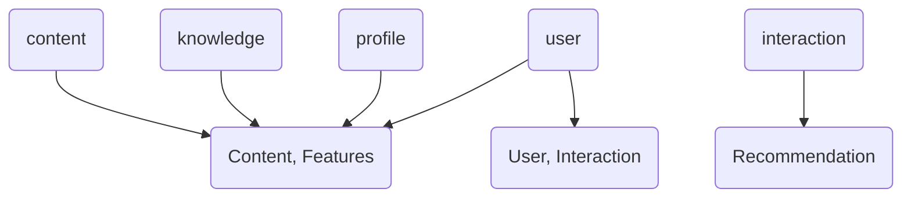
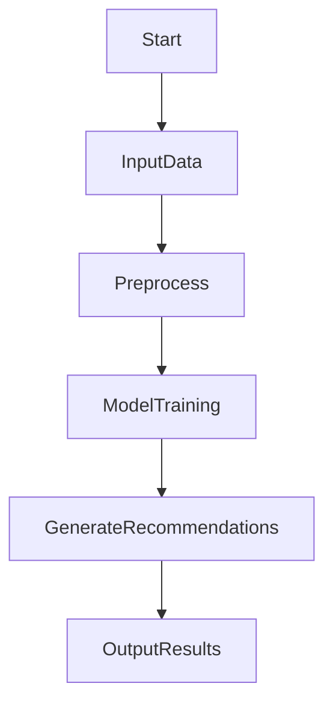
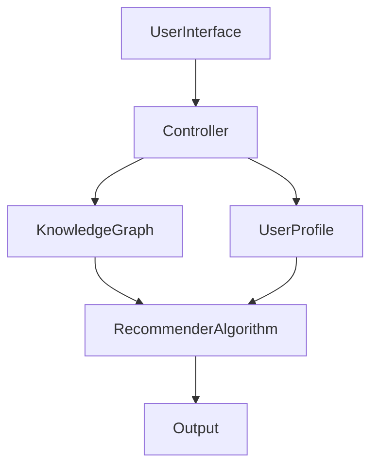
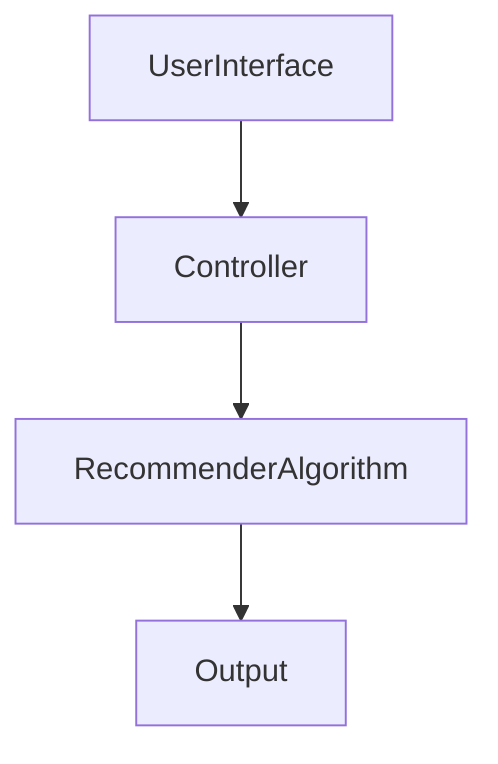

                 


# 构建智能企业知识推荐系统：个性化学习路径与资源推荐

## 关键词：智能推荐系统、知识图谱、个性化学习、用户画像、机器学习

## 摘要：  
本文详细探讨了构建智能企业知识推荐系统的核心方法，重点介绍了如何利用知识图谱、用户画像和机器学习算法来实现个性化学习路径和资源推荐。文章从背景、核心概念、算法原理、系统设计到项目实战，全面解析了智能推荐系统的构建过程，旨在为企业提供高效的知识管理解决方案。

---

# 第1章: 背景与核心概念

## 1.1 问题背景与需求分析

### 1.1.1 知识推荐系统的定义与目标
知识推荐系统是一种基于人工智能技术的智能推荐系统，旨在为企业员工提供个性化的学习路径和资源推荐。其目标是通过分析用户的兴趣、行为和学习需求，精准匹配相关知识资源，从而提升学习效率和员工能力。

### 1.1.2 个性化学习路径的重要性
在企业环境中，员工的学习需求千差万别，传统的一-size-fits-all方法难以满足个性化需求。通过智能推荐系统，企业可以为每个员工定制专属的学习路径，帮助其快速掌握所需技能，提升整体竞争力。

### 1.1.3 企业知识资源管理的挑战
企业通常拥有大量的知识资源，包括文档、视频、课程等，但如何高效地将这些资源与员工的需求匹配起来，是知识管理中的核心挑战。智能推荐系统通过自动化处理，解决了资源冗余和匹配效率低的问题。

## 1.2 知识推荐系统的概念结构

### 1.2.1 系统的核心要素与组成
知识推荐系统由以下几个核心要素组成：
- **知识库**：存储企业的各类知识资源，包括文档、视频、课程等。
- **用户画像**：基于用户的行为和偏好，构建用户画像，用于个性化推荐。
- **推荐算法**：通过机器学习算法，分析用户需求和知识内容，生成推荐结果。
- **知识图谱**：构建知识之间的关联关系，用于内容理解和推荐。

### 1.2.2 知识推荐系统的边界与外延
知识推荐系统的边界包括：
- 输入：用户信息、知识资源、用户行为数据。
- 输出：个性化推荐结果、学习路径建议。

系统的外延包括：
- 知识库的扩展与更新。
- 用户反馈的收集与分析。

### 1.2.3 系统的输入、输出与功能模块
- **输入**：用户需求、知识资源、用户行为数据。
- **输出**：个性化推荐列表、学习路径建议。
- **功能模块**：
  - 知识抽取与表示。
  - 用户画像构建。
  - 推荐算法实现。
  - 系统交互与反馈。

## 1.3 核心概念与联系

### 1.3.1 知识图谱与推荐系统的关系
知识图谱通过构建知识之间的关联关系，帮助推荐系统更好地理解内容语义。例如，通过知识图谱，推荐系统可以识别“机器学习”与“人工智能”之间的关系，从而为用户推荐相关的学习资源。

### 1.3.2 用户画像与内容特征的关联
用户画像是推荐系统的重要输入，通过分析用户的兴趣、行为和学习需求，构建用户画像，从而实现精准推荐。内容特征则是知识资源的描述，通过提取内容特征，推荐系统可以更好地匹配用户需求。

### 1.3.3 推荐算法与知识表示的结合
推荐算法通过分析用户和内容的特征，生成推荐结果。知识表示则通过构建知识图谱，帮助推荐算法更好地理解内容语义，提升推荐的准确性和相关性。

## 1.4 本章小结
本章介绍了知识推荐系统的背景、核心概念和组成部分，强调了个性化推荐在企业知识管理中的重要性。下一章将详细讲解推荐系统的核心算法和实现原理。

---

# 第2章: 个性化推荐的核心概念

## 2.1 推荐系统的类型与特点

### 2.1.1 基于协同过滤的推荐
协同过滤是一种经典的推荐算法，通过分析用户的行为和偏好，找到相似的用户群体，推荐相似的资源。例如，如果用户A和用户B的兴趣相似，且用户A推荐了一门机器学习课程，那么用户B也可能会对这门课程感兴趣。

### 2.1.2 基于内容的推荐
基于内容的推荐通过分析知识资源的内容特征，找到与用户需求最匹配的资源。例如，如果用户搜索“自然语言处理”，推荐系统会匹配相关的内容特征，如“NLP基础”、“文本分类”等。

### 2.1.3 混合推荐模型的优势
混合推荐模型结合了协同过滤和内容推荐的优点，既考虑了用户的偏好，又考虑了内容的语义，能够提供更精准的推荐结果。例如，结合用户行为和内容特征，推荐系统可以为用户推荐既符合其兴趣又相关的知识资源。

## 2.2 知识推荐的关键属性

### 2.2.1 知识的表示与特征提取
知识的表示是推荐系统的核心，通过构建知识图谱，可以将知识资源表示为图中的节点和边，从而更好地理解内容语义。特征提取则是将知识资源转换为可计算的特征向量，用于推荐算法的输入。

### 2.2.2 用户行为分析与建模
用户行为分析是构建用户画像的重要步骤，通过分析用户的点击、浏览、收藏等行为，可以提取用户的兴趣偏好和学习需求。建模则是将用户行为转化为用户画像，用于推荐系统的输入。

### 2.2.3 推荐结果的可解释性
推荐结果的可解释性是用户信任的重要因素。通过构建知识图谱和用户画像，推荐系统可以提供可解释的推荐理由，帮助用户理解推荐结果的依据。

## 2.3 核心概念的ER实体关系图



## 2.4 本章小结
本章详细介绍了个性化推荐的核心概念，包括推荐系统的类型、知识表示与特征提取、用户行为分析与建模等内容。下一章将重点讲解推荐算法的原理和实现。

---

# 第3章: 知识推荐算法原理

## 3.1 协同过滤算法

### 3.1.1 基于用户的协同过滤
基于用户的协同过滤是一种经典的推荐算法，通过找到与目标用户兴趣相似的用户群体，推荐相似的资源。例如，通过计算用户之间的相似度，推荐系统可以找到与目标用户最相似的用户，并推荐其喜欢的资源。

### 3.1.2 基于物品的协同过滤
基于物品的协同过滤则是通过分析资源之间的相似性，推荐与目标用户已感兴趣资源相似的资源。例如，如果用户喜欢一门机器学习课程，推荐系统会找到其他与之相似的课程，如“深度学习基础”等。

### 3.1.3 混合协同过滤的实现
混合协同过滤结合了基于用户和基于物品的协同过滤，通过融合两种方法的优点，提升推荐的准确性和多样性。例如，通过加权融合用户相似度和资源相似度，推荐系统可以提供更精准的推荐结果。

## 3.2 深度学习推荐模型

### 3.2.1 基于神经网络的推荐系统
基于神经网络的推荐系统通过构建深度学习模型，学习用户和资源的特征表示，从而实现精准推荐。例如，通过构建双向注意力网络，模型可以同时关注用户和资源的特征，提升推荐的准确性。

### 3.2.2 基于BERT的知识表示模型
基于BERT的知识表示模型通过预训练语言模型，提取知识资源的内容特征，提升推荐的语义理解能力。例如，通过将课程内容输入BERT模型，提取其语义向量，用于推荐系统的输入。

### 3.2.3 多任务学习在推荐中的应用
多任务学习通过同时学习多个相关任务，提升推荐系统的泛化能力和推荐效果。例如，通过同时学习用户画像和内容推荐，模型可以更好地理解用户需求，提升推荐的准确性。

## 3.3 算法流程图



## 3.4 本章小结
本章详细讲解了协同过滤和深度学习推荐模型的原理和实现，重点介绍了基于神经网络和BERT的知识表示模型。下一章将重点讲解推荐系统的系统设计与实现。

---

# 第4章: 系统架构设计

## 4.1 系统功能设计

### 4.1.1 知识抽取与表示
知识抽取是构建知识图谱的第一步，通过自然语言处理技术，从知识资源中提取实体和关系。例如，从课程内容中提取“机器学习”、“深度学习”等实体，并构建其之间的关系。

### 4.1.2 用户画像构建
用户画像是推荐系统的重要输入，通过分析用户的行为和偏好，构建用户的兴趣模型。例如，通过分析用户的点击行为，提取用户的兴趣主题，如“人工智能”、“编程基础”等。

### 4.1.3 推荐算法实现
推荐算法是系统的核心模块，通过结合用户画像和知识图谱，生成推荐结果。例如，通过计算用户与资源的相似度，推荐系统可以生成个性化推荐列表。

## 4.2 系统架构图



## 4.3 系统接口设计

### 4.3.1 用户接口
用户接口是推荐系统的前端，用于接收用户的输入和显示推荐结果。例如，用户可以通过搜索框输入学习主题，系统会显示相关的推荐资源。

### 4.3.2 接口交互流程
用户发起请求后，系统会通过接口将请求传递到后端，进行推荐算法的计算，最终返回推荐结果。

## 4.4 系统交互流程图



## 4.5 本章小结
本章详细描述了推荐系统的架构设计，包括功能模块、系统架构图和接口设计。下一章将通过实际项目案例，详细讲解推荐系统的实现过程。

---

# 第5章: 项目实战

## 5.1 环境安装与配置

### 5.1.1 安装Python环境
推荐使用Python 3.8及以上版本，安装anaconda或virtualenv管理环境。

### 5.1.2 安装依赖库
安装所需的机器学习库，如scikit-learn、tensorflow、transformers等。

## 5.2 核心代码实现

### 5.2.1 知识图谱构建
```python
from transformers import AutoTokenizer, AutoModel
import torch

model = AutoModel.from_pretrained('bert-base-uncased')
tokenizer = AutoTokenizer.from_pretrained('bert-base-uncased')
```

### 5.2.2 用户画像构建
```python
def build_user_profile(user_id):
    # 获取用户行为数据
    interactions = get_user_interactions(user_id)
    # 构建用户画像
    profile = {}
    for item in interactions:
        profile[item['content_id']] = item['score']
    return profile
```

### 5.2.3 推荐算法实现
```python
def collaborative_filtering(recommendation_system):
    # 基于用户的协同过滤
    user_id = 123
    similar_users = find_similar_users(user_id)
    recommendations = []
    for user in similar_users:
        recommendations.extend(get_recommendations(user))
    return recommendations
```

## 5.3 项目总结

### 5.3.1 项目实现的关键点
- 知识图谱的构建与应用。
- 用户画像的构建与优化。
- 推荐算法的实现与调优。

### 5.3.2 项目中的问题与解决方案
- 数据稀疏性问题：通过混合推荐模型提升推荐效果。
- 算法效率问题：通过优化算法实现提升推荐速度。

## 5.4 本章小结
本章通过实际项目案例，详细讲解了推荐系统的实现过程，包括环境安装、代码实现和项目总结。下一章将总结全文，并展望未来的研究方向。

---

# 第6章: 总结与展望

## 6.1 全文总结
本文详细介绍了智能企业知识推荐系统的构建方法，重点讲解了知识图谱、用户画像和推荐算法的核心原理和实现。通过实际项目案例，展示了推荐系统的应用价值和实现过程。

## 6.2 研究热点与未来趋势
当前，推荐系统的研究热点包括：
- **实时推荐**：通过实时处理用户行为数据，提升推荐的实时性。
- **多模态推荐**：结合文本、图像、视频等多种数据类型，提升推荐的准确性和多样性。
- **可解释性推荐**：通过提供可解释的推荐理由，增强用户的信任感。

## 6.3 展望
未来，推荐系统将更加智能化和个性化，通过结合知识图谱、多模态数据和强化学习等技术，推荐系统将为企业知识管理提供更高效、更精准的解决方案。

---

# 结语

智能企业知识推荐系统的构建是一个复杂而有趣的过程，它不仅需要扎实的技术基础，还需要对用户需求和知识资源有深刻的理解。通过本文的学习，读者可以掌握推荐系统的核心原理和实现方法，为企业知识管理提供有力支持。

