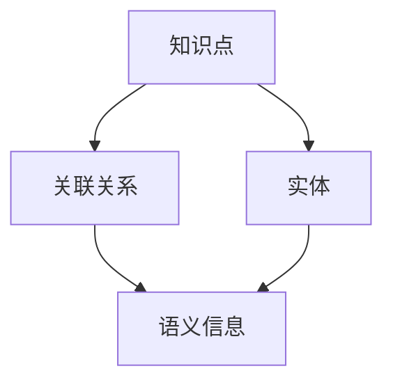
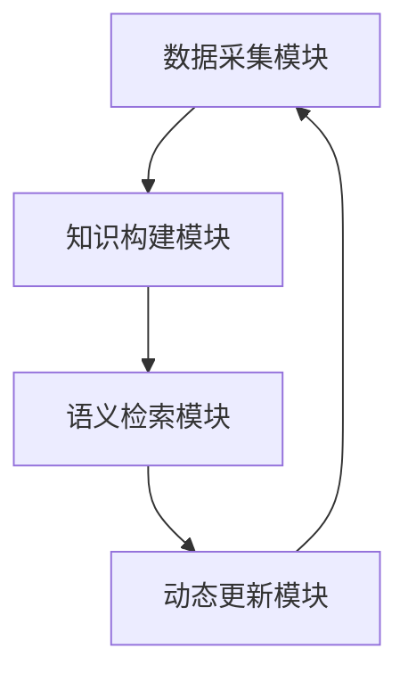
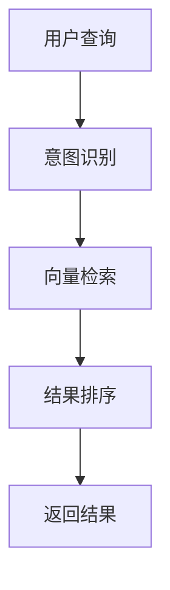

                 


# 《构建智能企业知识管理平台：动态知识图谱与语义检索》

> **关键词**：智能企业知识管理平台、动态知识图谱、语义检索、知识管理、自然语言处理

> **摘要**：本文将详细介绍如何构建智能企业知识管理平台，重点探讨动态知识图谱与语义检索的核心技术。通过分析知识管理的背景与挑战，结合动态知识图谱的构建方法与语义检索技术，提供一个完整的系统架构与实现方案。本文内容涵盖知识图谱的构建流程、语义检索的算法原理、系统架构设计以及实际项目实战，为读者提供全面的技术指导。

---

# 第一部分：智能企业知识管理平台概述

## 第1章：知识管理平台的背景与概念

### 1.1 问题背景

#### 1.1.1 企业知识管理的挑战
企业在知识管理过程中面临的主要挑战包括：
- **知识孤岛**：信息分散在不同的系统或部门中，难以共享和复用。
- **信息碎片化**：数据分散且格式不统一，难以进行系统化的管理和分析。
- **知识更新延迟**：动态变化的业务需求要求知识管理系统能够实时更新和响应。

#### 1.1.2 知识孤岛与信息碎片化问题
- 知识孤岛：不同部门或系统之间缺乏有效的信息共享机制，导致资源浪费和效率低下。
- 信息碎片化：数据以非结构化的形式存在，难以通过自动化手段进行处理和分析。

#### 1.1.3 传统知识管理的局限性
- 传统知识管理系统通常依赖静态数据结构，难以应对动态变化的业务需求。
- 缺乏智能化的检索和推荐机制，用户难以快速获取所需的知识。

### 1.2 问题描述

#### 1.2.1 知识管理的定义与目标
知识管理（KM，Knowledge Management）是指通过系统化的方法，对企业内外部知识进行采集、整理、存储、分析和应用的过程，其目标是提高知识的可用性和价值。

#### 1.2.2 智能化知识管理的需求
- **智能化检索**：通过自然语言处理和语义理解技术，实现对非结构化数据的智能检索。
- **动态更新**：能够实时感知业务变化，并动态更新知识库中的信息。
- **知识关联**：建立知识之间的关联关系，形成语义网络，提高知识的复用性。

#### 1.2.3 动态知识图谱与语义检索的核心问题
- 动态知识图谱的构建与更新：如何高效地采集、处理和存储动态变化的知识。
- 语义检索的准确性与效率：如何在大规模数据中快速找到语义相关的知识。

### 1.3 问题解决

#### 1.3.1 动态知识图谱的构建方法
- 数据采集与预处理：通过爬虫、API等方式获取多源异构数据，并进行清洗和标准化处理。
- 知识抽取与建模：利用自然语言处理技术从文本中提取实体、关系和属性，并构建知识图谱的本体模型。
- 动态更新与维护：通过订阅机制和事件驱动的方式，实时更新知识图谱中的信息。

#### 1.3.2 语义检索技术的应用场景
- **企业内部知识库**：帮助员工快速检索内部文档、政策和流程。
- **客户支持系统**：通过语义检索快速匹配客户问题，提供准确的解决方案。
- **业务数据分析**：利用语义检索技术对海量数据进行深度分析，挖掘潜在的业务洞察。

#### 1.3.3 智能知识管理平台的实现路径
- **数据集成**：整合企业内外部数据源，构建统一的知识库。
- **知识建模**：设计合理的知识表示模型，支持动态更新和扩展。
- **智能检索**：基于语义理解技术，实现高效的语义检索功能。

### 1.4 边界与外延

#### 1.4.1 动态知识图谱的边界
- **数据范围**：动态知识图谱主要处理结构化和半结构化的数据，暂不支持完全非结构化的数据。
- **更新频率**：动态知识图谱支持实时或准实时的更新，具体频率取决于业务需求。

#### 1.4.2 语义检索的适用范围
- **文本数据**：适用于对文本数据进行语义检索，支持多种语言和领域。
- **非文本数据**：语义检索技术目前主要针对文本数据，对图像、视频等其他类型数据的支持有限。

#### 1.4.3 智能知识管理平台的扩展性
- **模块扩展**：平台支持新增功能模块，例如新增知识源或扩展检索功能。
- **性能扩展**：通过分布式计算和负载均衡技术，提升系统的处理能力和响应速度。

### 1.5 核心概念与联系

#### 1.5.1 核心概念原理
- **知识图谱**：一种以图结构表示知识的语义网络，包含实体、关系和属性。
- **语义检索**：基于语义理解技术，实现对知识图谱中实体、关系的智能检索。

#### 1.5.2 核心概念属性特征对比表格

| **概念**       | **属性**           | **特征**                     |
|----------------|-------------------|------------------------------|
| 知识图谱       | 数据结构           | 图结构，支持实体关联         |
| 语义检索       | 检索方式           | 基于语义理解，支持模糊检索     |
| 动态更新       | 更新机制           | 实时感知变化，支持自动更新     |

#### 1.5.3 ER实体关系图架构的 Mermaid 流程图



---

## 第2章：动态知识图谱的构建

### 2.1 动态知识图谱的定义与特点

#### 2.1.1 动态知识图谱的定义
动态知识图谱是一种能够实时感知和反映现实世界动态变化的知识表示模型，其核心在于支持知识的动态更新和演化。

#### 2.1.2 动态知识图谱的核心特点
- **动态性**：能够实时更新知识库中的信息，适应业务变化。
- **关联性**：通过实体和关系的关联，构建语义网络，支持知识的复用。
- **扩展性**：支持新增知识点，适应不同领域的知识管理需求。

#### 2.1.3 动态知识图谱与静态知识图谱的区别
- **静态知识图谱**：知识内容固定，无法实时更新。
- **动态知识图谱**：支持实时更新，能够适应变化的业务需求。

### 2.2 动态知识图谱的构建流程

#### 2.2.1 数据采集与预处理
- **数据源**：包括企业内部文档、外部数据库、网络爬取等多种来源。
- **数据清洗**：对采集到的数据进行去重、格式化处理，确保数据质量。
- **数据标准化**：将数据转换为统一的格式，便于后续处理和存储。

#### 2.2.2 知识抽取与建模
- **实体识别**：通过自然语言处理技术，从文本中提取实体信息。
- **关系抽取**：识别实体之间的关系，构建知识图谱的边。
- **本体建模**：设计知识图谱的本体模型，定义实体和关系的属性。

#### 2.2.3 动态更新与维护
- **变化检测**：通过订阅机制或事件驱动的方式，实时感知业务变化。
- **知识更新**：根据变化信息，动态更新知识图谱中的相关内容。
- **版本控制**：记录每次更新的操作，支持回滚和历史版本查询。

### 2.3 知识抽取与建模

#### 2.3.1 实体识别与关系抽取
- **实体识别**：利用命名实体识别（NER）技术，从文本中提取出人名、地名、组织名等实体。
- **关系抽取**：基于依存句法分析和语义角色标注，识别实体之间的关系。
- **知识表示**：将实体和关系存储为图结构，构建知识图谱。

#### 2.3.2 知识图谱的本体建模
- **本体建模方法**：使用本体建模语言（如OWL）定义实体和关系的属性、约束。
- **知识图谱的存储**：采用图数据库（如Neo4j）存储知识图谱，支持高效的查询和更新操作。

#### 2.3.3 动态知识更新的机制
- **订阅机制**：通过订阅特定的事件或数据源，实时获取变化信息。
- **事件驱动**：当业务数据发生变化时，触发知识图谱的自动更新。

---

## 第3章：语义检索技术

### 3.1 语义检索的定义与特点

#### 3.1.1 语义检索的定义
语义检索是一种基于语义理解的检索技术，旨在通过理解用户查询的语义意图，检索出与之相关的知识实体。

#### 3.1.2 语义检索的核心技术
- **向量检索**：将文本表示为高维向量，通过计算向量的相似度进行检索。
- **语义分析**：利用自然语言处理技术，理解查询的语义意图。
- **排序算法**：根据相关性对检索结果进行排序，提高检索效率。

#### 3.1.3 语义检索与传统检索的区别
- **传统检索**：基于关键词匹配，无法理解查询的语义意图。
- **语义检索**：基于语义理解，能够准确匹配语义相关的知识实体。

### 3.2 语义检索的实现流程

#### 3.2.1 向量检索
- **向量表示**：将文本转换为向量表示，常用的模型包括Word2Vec、BERT等。
- **相似度计算**：通过计算向量的相似度（如余弦相似度），检索出与查询最相关的文本。
- **检索效率优化**：通过索引优化和分桶技术，提升向量检索的效率。

#### 3.2.2 相似度计算
- **余弦相似度**：
  $$ \text{余弦相似度} = \frac{\vec{a} \cdot \vec{b}}{|\vec{a}| \cdot |\vec{b}|} $$
- **欧氏距离**：
  $$ \text{欧氏距离} = \sqrt{(a_1 - b_1)^2 + (a_2 - b_2)^2 + \cdots + (a_n - b_n)^2} $$

#### 3.2.3 排序算法
- **BM25算法**：基于概率论的检索算法，常用于文本检索。
- **DPR（Dense Passage Retrieval）**：基于向量检索的排序算法，适用于大规模知识库的检索。

### 3.3 语义检索的应用场景

#### 3.3.1 企业内部知识库
- 帮助员工快速检索内部文档、政策和流程。

#### 3.3.2 客户支持系统
- 通过语义检索快速匹配客户问题，提供准确的解决方案。

#### 3.3.3 业务数据分析
- 利用语义检索技术对海量数据进行深度分析，挖掘潜在的业务洞察。

### 3.4 语义检索的优化策略

#### 3.4.1 索引优化
- **分桶索引**：将向量按一定规则分桶存储，提升检索效率。
- **倒排索引**：通过倒排索引实现高效的文本检索。

#### 3.4.2 查询优化
- **意图识别**：通过自然语言处理技术，准确识别用户的查询意图。
- **结果排序**：根据相关性和用户需求，对检索结果进行排序。

#### 3.4.3 系统性能优化
- **分布式检索**：通过分布式计算和负载均衡技术，提升系统的处理能力。
- **缓存机制**：通过缓存技术减少重复查询，提升系统性能。

---

## 第4章：系统架构与设计

### 4.1 系统架构设计

#### 4.1.1 模块划分
- **数据采集模块**：负责数据的采集和预处理。
- **知识构建模块**：负责知识抽取与本体建模。
- **语义检索模块**：负责用户的查询处理和结果返回。
- **动态更新模块**：负责知识图谱的实时更新和维护。

#### 4.1.2 功能设计
- **数据管理功能**：支持数据的采集、存储和管理。
- **知识构建功能**：支持知识的抽取、建模和动态更新。
- **检索功能**：支持语义检索、结果排序和可视化展示。
- **用户界面功能**：提供友好的用户界面，方便用户操作。

#### 4.1.3 系统架构图



### 4.2 系统实现细节

#### 4.2.1 数据采集模块

- **数据源**：支持多种数据源，包括数据库、API接口、文件等多种形式。
- **数据预处理**：对采集到的数据进行清洗、标准化处理，确保数据质量。

#### 4.2.2 知识构建模块

- **实体识别**：使用NER技术识别文本中的实体信息。
- **关系抽取**：基于依存句法分析，识别实体之间的关系。
- **本体建模**：设计知识图谱的本体模型，定义实体和关系的属性。

#### 4.2.3 语义检索模块

- **意图识别**：通过自然语言处理技术，理解用户的查询意图。
- **向量检索**：将查询转换为向量表示，检索与之相关的知识实体。
- **结果排序**：根据相关性和用户需求，对检索结果进行排序。

#### 4.2.4 动态更新模块

- **变化检测**：通过订阅机制或事件驱动的方式，实时感知业务变化。
- **知识更新**：根据变化信息，动态更新知识图谱中的相关内容。
- **版本控制**：记录每次更新的操作，支持回滚和历史版本查询。

### 4.3 接口设计

#### 4.3.1 API接口设计
- **数据采集接口**：提供数据采集的API，支持多种数据源。
- **知识构建接口**：提供知识构建的API，支持实体识别和关系抽取。
- **语义检索接口**：提供语义检索的API，支持向量检索和结果排序。

#### 4.3.2 交互流程



---

## 第5章：项目实战

### 5.1 环境搭建

#### 5.1.1 开发环境
- **操作系统**：建议使用Linux或MacOS。
- **开发工具**：推荐使用PyCharm、VS Code等IDE。
- **依赖库安装**：安装必要的Python库，如`numpy`、`pandas`、`spacy`、`neo4j`等。

#### 5.1.2 数据准备
- **数据集**：选择适合的测试数据集，例如企业内部文档、公开的知识库等。

### 5.2 核心代码实现

#### 5.2.1 数据采集模块

```python
import requests

def fetch_data(url):
    response = requests.get(url)
    if response.status_code == 200:
        return response.text
    return None
```

#### 5.2.2 知识构建模块

```python
from spacy.lang.zh import Chinese

nlp = Chinese()
doc = nlp("北京是中国的首都。")
for ent in doc.ents:
    print(ent.text, ent.label_)
```

#### 5.2.3 语义检索模块

```python
from sentence_transformers import SentenceTransformer

model = SentenceTransformer('bert-base-nli-maxpool')
embedding = model.encode("这是一个测试句子。")
```

#### 5.2.4 动态更新模块

```python
import neo4j

driver = neo4j.Driver("bolt://localhost:7687")
def update_knowledge_graph(tx, entity, relation, target):
    tx.run("MATCH (a {name: $entity}) CREATE (a)-[r:$relation]->(b {name: $target})", 
            entity=entity, relation=relation, target=target)
```

### 5.3 案例分析

#### 5.3.1 企业内部知识库建设
- **需求分析**：企业需要构建一个内部知识库，支持员工快速检索相关政策和流程。
- **实现步骤**：
  1. 数据采集：从企业内部文档中提取知识。
  2. 知识构建：通过实体识别和关系抽取，构建知识图谱。
  3. 语义检索：实现语义检索功能，支持模糊查询。
- **效果评估**：通过用户反馈和性能测试，评估系统的实用性和效率。

#### 5.3.2 业务数据分析
- **需求分析**：企业希望通过语义检索技术对海量数据进行深度分析，挖掘潜在的业务洞察。
- **实现步骤**：
  1. 数据准备：收集和整理相关业务数据。
  2. 知识构建：构建业务数据的知识图谱。
  3. 语义检索：实现语义检索功能，支持复杂查询。
- **效果评估**：通过数据分析和业务指标，评估系统的价值和效果。

### 5.4 项目总结

#### 5.4.1 项目成果
- 成功构建了一个智能企业知识管理平台，支持动态知识图谱的构建和语义检索功能。

#### 5.4.2 经验与教训
- **经验**：数据质量对系统性能影响较大，需要加强数据预处理和清洗工作。
- **教训**：知识图谱的动态更新需要考虑业务变化的实时性，这对系统的性能和稳定性提出了更高的要求。

---

## 第6章：最佳实践与扩展阅读

### 6.1 最佳实践

#### 6.1.1 数据管理
- **数据质量**：确保数据的准确性和完整性，避免信息碎片化。
- **数据安全**：加强数据安全保护，防止数据泄露和滥用。

#### 6.1.2 系统优化
- **性能优化**：通过分布式计算和缓存技术，提升系统的处理能力和响应速度。
- **可扩展性**：设计模块化的系统架构，支持功能的扩展和升级。

### 6.2 小结

本文详细介绍了智能企业知识管理平台的构建过程，包括动态知识图谱的构建、语义检索技术的应用、系统架构与设计以及项目实战。通过理论与实践相结合的方式，为读者提供了一套完整的解决方案。

### 6.3 注意事项

- **数据隐私**：在处理企业内部数据时，需严格遵守数据隐私保护的相关法律法规。
- **系统稳定性**：动态知识图谱的构建和更新需要考虑系统的稳定性和可靠性，避免因数据错误导致的系统崩溃。

### 6.4 拓展阅读

- **知识图谱**：推荐阅读《知识图谱：概念、方法与应用》。
- **语义检索**：推荐阅读《语义检索技术及其应用》。
- **图数据库**：推荐阅读《图数据库：原理与实践》。

---

通过本文的学习，读者可以掌握构建智能企业知识管理平台的核心技术与方法，为企业的知识管理与数字化转型提供有力支持。

