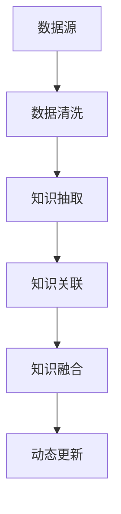
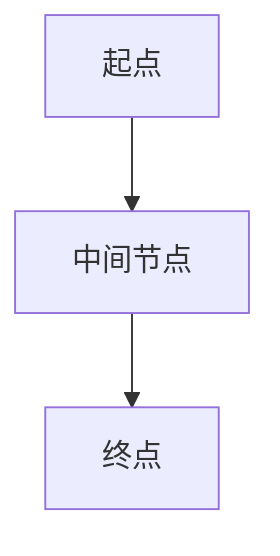
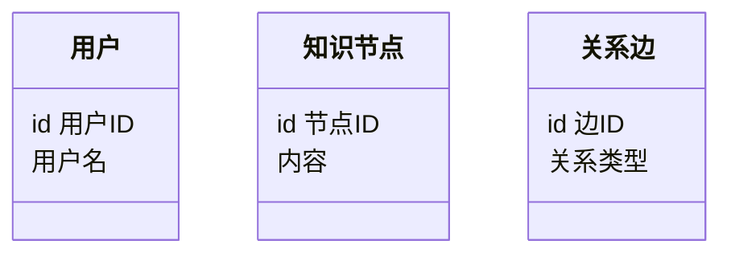
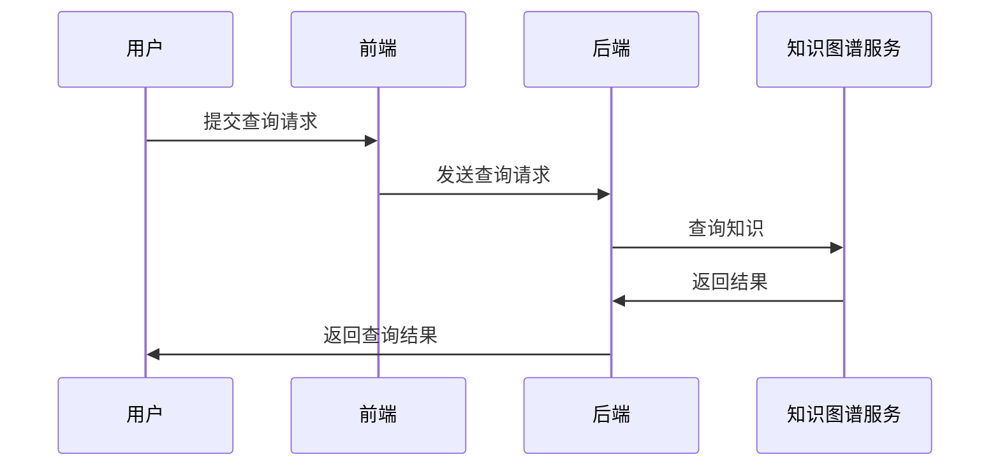

                 


# 构建智能企业知识管理平台：动态知识图谱与语义检索系统

---

## 关键词：
智能知识管理、动态知识图谱、语义检索系统、企业知识管理、知识图谱构建

---

## 摘要：
随着企业数字化转型的深入推进，知识管理的重要性日益凸显。传统的知识管理方式面临知识分散、检索效率低、更新维护困难等挑战。本文提出构建智能企业知识管理平台，利用动态知识图谱和语义检索系统，实现对企业知识的高效组织、管理和检索。通过图嵌入算法和知识关联规则挖掘，构建动态知识图谱；结合向量相似度计算和基于图的最短路径搜索，实现语义检索。本文详细阐述了动态知识图谱的构建算法、语义检索系统的实现原理，以及系统架构设计，并通过实际案例展示平台的应用价值。

---

## 第1章：智能企业知识管理平台的背景与挑战

### 1.1 问题背景
#### 1.1.1 传统知识管理的局限性
- 知识分散：企业中的知识通常分散在不同的部门、系统和文档中，难以统一管理和利用。
- 孤岛现象：各部门之间的知识无法有效共享，导致资源浪费和重复劳动。
- 维护困难：知识更新和维护需要大量人工操作，效率低下。

#### 1.1.2 数字化转型对企业知识管理的需求
- 数据爆炸：企业每天产生海量数据，如何高效利用这些数据成为关键。
- 智能化需求：通过智能化技术，提升知识检索和应用的效率。
- 实时更新：企业业务动态变化，知识管理系统需要支持实时更新。

#### 1.1.3 动态知识图谱的提出与意义
- 动态知识图谱是一种能够实时更新和扩展的知识表示方式，适用于企业知识管理的动态需求。
- 通过动态知识图谱，企业可以构建一个灵活、可扩展的知识管理系统。

### 1.2 问题描述
#### 1.2.1 知识分散与孤岛问题
- 知识分散在不同的系统和部门中，难以形成统一的知识体系。
- 孤岛现象导致知识无法有效共享和利用。

#### 1.2.2 知识检索效率低下
- 传统的检索系统基于关键词匹配，无法理解语义，导致检索结果不准确。
- 高维数据检索效率低，难以满足实时需求。

#### 1.2.3 知识更新与维护的困难
- 知识更新需要人工操作，效率低下。
- 知识体系的动态变化难以被传统系统支持。

### 1.3 问题解决：智能知识管理平台
#### 1.3.1 智能知识管理的核心目标
- 统一知识管理：将分散的知识整合到一个统一的平台中。
- 高效检索：通过语义检索技术提升知识检索效率。
- 实时更新：支持知识的动态更新和扩展。

#### 1.3.2 动态知识图谱与语义检索的作用
- 动态知识图谱：构建企业知识的语义网络，支持动态更新。
- 语义检索：基于语义理解，提供更准确的知识检索结果。

#### 1.3.3 平台的预期价值与应用场景
- 预期价值：提升企业知识利用率，降低管理成本。
- 应用场景：企业内部知识共享、业务决策支持、客户服务等。

### 1.4 本章小结
本章分析了传统知识管理的局限性，提出了智能知识管理平台的必要性，并详细阐述了动态知识图谱和语义检索系统的作用和价值。

---

## 第2章：动态知识图谱与语义检索系统的核心概念

### 2.1 核心概念与定义
#### 2.1.1 知识图谱的定义与特点
- 知识图谱：一种以图结构形式表示知识的语义网络。
- 特点：结构化、语义化、可扩展性。

#### 2.1.2 动态知识图谱的特性
- 动态性：能够实时更新和扩展。
- 灵活性：适应企业业务的变化。

#### 2.1.3 语义检索的定义与优势
- 语义检索：基于语义理解进行知识检索。
- 优势：提升检索准确率，支持复杂查询。

### 2.2 核心概念的联系与对比
#### 2.2.1 知识图谱与传统数据库的对比
| 对比维度 | 知识图谱 | 传统数据库 |
|----------|----------|------------|
| 数据结构 | 图结构    | 行列结构    |
| 查询效率 | 语义查询  | 关键字查询  |
| 扩展性   | 高        | 低          |

#### 2.2.2 动态知识图谱与静态知识图谱的对比
| 对比维度 | 动态知识图谱 | 静态知识图谱 |
|----------|--------------|--------------|
| 数据更新 | 实时更新     | 定期更新     |
| 灵活性   | 高            | 低            |

### 2.3 实体关系图的构建
#### 2.3.1 实体关系图的ER模型设计
```mermaid
erd
  entity 用户 {
    id 用户ID
    属性 用户名
    关系 归属 部门
  }
  entity 部门 {
    id 部门ID
    属性 部门名称
  }
```

#### 2.3.2 动态知识图谱的构建流程


### 2.4 本章小结
本章详细介绍了动态知识图谱和语义检索系统的核心概念，通过对比分析和流程图展示，明确了其特点和优势。

---

## 第3章：动态知识图谱的构建算法与原理

### 3.1 知识图谱构建算法
#### 3.1.1 图嵌入算法（Node2Vec）
- Node2Vec是一种基于随机游走的图嵌入算法。
- 通过训练模型，将图中的节点表示为低维向量。

#### 3.1.2 知识抽取与关联规则挖掘
- 知识抽取：从文本中提取实体和关系。
- 关联规则挖掘：发现实体之间的关联规则。

#### 3.1.3 知识融合与冲突处理
- 知识融合：将多个来源的知识进行整合。
- 冲突处理：解决知识冲突，确保一致性。

### 3.2 算法原理与数学模型
#### 3.2.1 图嵌入算法的数学模型
$$
P(w_i, w_j) = \frac{e^{θ_i^T θ_j}}{\sum_{k} e^{θ_i^T θ_k}}
$$

#### 3.2.2 知识关联规则的计算公式
| 关系类型 | 关联度计算公式 |
|----------|----------------|
| 相似性   | $similarity = \frac{count}{total}$ |
| 关联性   | $关联度 = \frac{lift}{expected}$ |

### 3.3 算法实现与代码示例
#### 3.3.1 Node2Vec算法的Python实现
```python
import numpy as np
from sklearn.manifold import TSNE

def node2vec_embedding(graph):
    # 实现Node2Vec算法，返回节点嵌入
    pass
```

#### 3.3.2 知识图谱构建的步骤与代码片段
```python
# 数据清洗
def clean_data(data):
    # 实现数据清洗逻辑
    pass

# 知识抽取
def extract_entities(text):
    # 实现实体抽取逻辑
    pass
```

### 3.4 本章小结
本章详细介绍了动态知识图谱的构建算法，包括图嵌入、知识抽取和关联规则挖掘等，并通过代码示例展示了实现过程。

---

## 第4章：语义检索系统的算法与实现

### 4.1 语义检索的核心算法
#### 4.1.1 基于向量的相似度计算
- 使用向量空间模型，计算文本或节点的相似度。

#### 4.1.2 基于图的最短路径搜索
- 在知识图谱中找到最短路径，用于语义检索。

#### 4.1.3 增量式检索算法
- 支持动态更新的知识图谱，提升检索效率。

### 4.2 算法原理与数学模型
#### 4.2.1 向量相似度计算公式
$$
similarity = \frac{\vec{a} \cdot \vec{b}}{||\vec{a}|| \cdot ||\vec{b}||}
$$

#### 4.2.2 基于图的最短路径搜索


### 4.3 算法实现与代码示例
#### 4.3.1 向量相似度计算
```python
def compute_similarity(vector_a, vector_b):
    return np.dot(vector_a, vector_b) / (np.linalg.norm(vector_a) * np.linalg.norm(vector_b))
```

#### 4.3.2 最短路径搜索
```python
def find_shortest_path(graph, start, end):
    # 实现最短路径搜索算法
    pass
```

### 4.4 本章小结
本章详细介绍了语义检索系统的算法，包括向量相似度计算和基于图的最短路径搜索，并展示了实现过程。

---

## 第5章：系统分析与架构设计

### 5.1 问题场景介绍
- 知识分散：企业知识分布在不同的系统中。
- 高效检索：需要快速找到所需知识。
- 动态更新：支持知识的实时更新。

### 5.2 系统功能设计
#### 5.2.1 领域模型设计


#### 5.2.2 系统架构设计


#### 5.2.3 接口设计
- API接口：提供RESTful API，支持知识查询、插入、删除等操作。

#### 5.2.4 交互流程


### 5.3 本章小结
本章详细分析了系统的需求和功能，设计了系统的架构和交互流程，为后续实现提供了基础。

---

## 第6章：项目实战

### 6.1 环境安装与配置
- 安装Python、Jupyter Notebook、TensorFlow、NetworkX等工具。

### 6.2 系统核心实现
#### 6.2.1 知识图谱构建
```python
def build_knowledge_graph(data):
    # 实现知识图谱构建逻辑
    pass
```

#### 6.2.2 语义检索实现
```python
def semantic_search(graph, query):
    # 实现语义检索逻辑
    pass
```

### 6.3 实际案例分析
- 案例背景：某企业知识管理系统。
- 数据准备：收集企业知识数据，清洗和预处理。
- 系统实现：构建知识图谱，实现语义检索功能。
- 结果分析：对比传统检索和语义检索的效果。

### 6.4 本章小结
本章通过实际案例展示了智能企业知识管理平台的实现过程，验证了系统的可行性和有效性。

---

## 第7章：最佳实践与总结

### 7.1 最佳实践
- 数据质量管理：确保数据的准确性和完整性。
- 系统维护：定期更新知识图谱，优化检索算法。
- 安全管理：保护企业知识的安全性。

### 7.2 小结
智能企业知识管理平台通过动态知识图谱和语义检索系统，解决了传统知识管理的痛点，为企业提供了高效的知识管理和应用方式。

### 7.3 注意事项
- 知识图谱的构建需要大量的人工参与和数据清洗。
- 系统的实时更新和维护需要投入足够的资源。

### 7.4 拓展阅读
- 推荐相关书籍和论文，进一步深入学习动态知识图谱和语义检索技术。

---

## 附录：代码与资源链接
- 提供完整代码仓库的链接，方便读者下载和学习。

---

通过以上目录结构和技术博客内容，您可以逐步展开每个部分的详细内容，构建一篇完整且有深度的智能企业知识管理平台的技术博客文章。

