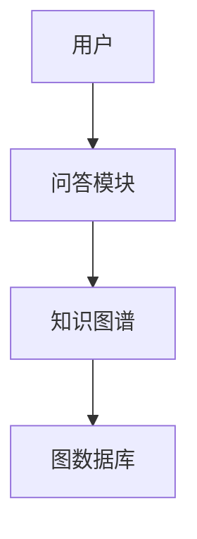
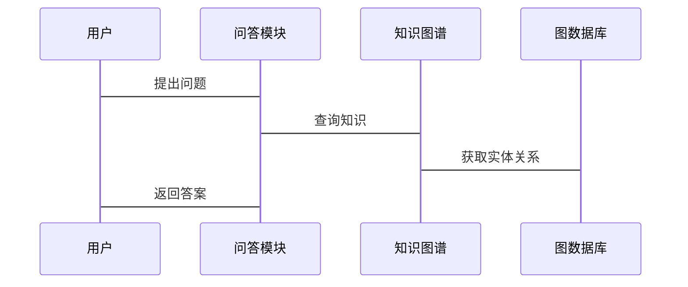

                 


# 构建智能企业知识管理平台：知识图谱与智能问答

> 关键词：知识图谱，智能问答，企业知识管理，自然语言处理，知识抽取，实体识别，智能问答系统

> 摘要：随着企业数字化转型的深入推进，知识管理在企业运营中的重要性日益凸显。知识图谱作为一种结构化的知识表示方法，结合智能问答技术，为企业构建智能知识管理平台提供了强大的技术支撑。本文从知识管理的背景出发，详细阐述了知识图谱与智能问答的核心概念、算法原理、系统架构设计以及实际项目应用。通过案例分析和代码实现，深入探讨了构建智能企业知识管理平台的关键技术与实践方法，为企业在数字化转型中提供参考与指导。

---

# 第一部分: 智能企业知识管理平台的背景与核心概念

# 第1章: 知识管理与智能企业概述

## 1.1 什么是知识管理

### 1.1.1 知识管理的定义与核心概念

知识管理（Knowledge Management，KM）是指通过系统化的方法，对企业内外部的知识资源进行采集、整理、存储、分析和应用的过程。知识管理的核心目标是将分散在企业各个角落的知识资源进行整合，形成可复用的知识资产，从而提升企业的竞争力和创新能力。

**关键概念：**
- **显性知识**：可以明确表达的知识，如文档、流程、数据等。
- **隐性知识**：难以明确表达的知识，通常存在于员工的经验和直觉中。
- **知识资产**：企业中具有价值的知识资源，是企业核心竞争力的重要组成部分。

### 1.1.2 知识管理在企业中的重要性

企业在数字化转型过程中，面临着数据爆炸式增长的挑战。传统的文档管理模式难以满足企业对知识高效利用的需求。知识管理通过结构化的知识表示和智能化的问答技术，帮助企业实现知识的快速检索、深度挖掘和智能应用。

**重要性：**
1. **提升效率**：通过知识管理，企业可以快速找到所需的知识，减少重复劳动。
2. **增强决策能力**：基于知识图谱的分析，为企业决策提供数据支持。
3. **推动创新**：通过知识的共享和复用，激发企业的创新能力。

### 1.1.3 知识管理的演进与发展趋势

知识管理经历了从简单的内容管理到智能化的知识图谱应用的演进过程。早期的知识管理主要依赖于文档管理和简单的知识库查询，而随着人工智能技术的发展，知识管理逐步向结构化、智能化方向演进。

**发展趋势：**
1. **结构化知识表示**：通过知识图谱将隐性知识显式化。
2. **智能化应用**：结合自然语言处理和深度学习技术，实现智能问答和知识推理。
3. **场景化应用**：根据企业需求，构建场景化的知识管理解决方案。

---

## 1.2 知识图谱与智能问答的背景介绍

### 1.2.1 知识图谱的起源与发展

知识图谱（Knowledge Graph）起源于2012年谷歌的知识图谱项目。它是一种以图结构形式表示知识的技术，通过实体（节点）和关系（边）构建语义网络，能够有效地表示复杂的现实世界信息。

**知识图谱的核心特点：**
1. **语义丰富**：通过实体间的关系，表达知识的上下文语义。
2. **可扩展性**：支持大规模知识的存储和查询。
3. **动态更新**：能够实时更新和扩展知识内容。

### 1.2.2 智能问答技术的现状与挑战

智能问答系统（Question Answering，QA）是自然语言处理（NLP）领域的重要应用。它通过理解用户的问题，从知识库中提取相关信息，并生成自然语言的答案。智能问答技术的挑战主要在于如何准确理解用户意图，并高效地从知识图谱中找到相关答案。

**智能问答的核心技术：**
1. **问题理解**：将自然语言问题转化为计算机可处理的形式。
2. **知识检索**：基于知识图谱进行语义匹配和信息检索。
3. **答案生成**：根据检索结果生成符合用户需求的答案。

### 1.2.3 知识图谱与智能问答的结合

知识图谱为智能问答提供了丰富的语义信息，而智能问答则为知识图谱提供了用户友好的交互界面。两者的结合能够实现更高效的知识检索和更智能的问答体验。

---

## 1.3 智能企业知识管理平台的价值

### 1.3.1 提升企业知识利用效率

通过知识图谱和智能问答技术，企业可以快速定位所需的知识，减少知识查找的时间成本。

### 1.3.2 增强企业决策能力

基于知识图谱的分析，企业可以进行跨领域的知识关联分析，从而做出更科学的决策。

### 1.3.3 促进企业数字化转型

智能企业知识管理平台为企业提供了数据化、智能化的知识管理工具，助力企业实现从传统管理向数字化管理的转型。

---

## 1.4 本章小结

本章从知识管理的背景出发，介绍了知识图谱和智能问答的核心概念，并分析了它们在企业知识管理中的重要性。通过本章的学习，读者可以理解知识管理的内涵及其对企业价值的提升作用。

---

# 第二部分: 知识图谱与智能问答的核心概念与联系

# 第2章: 知识图谱的核心原理

## 2.1 知识图谱的定义与特点

### 2.1.1 知识图谱的定义

知识图谱是一种以图结构形式表示知识的技术，由节点（实体）和边（关系）组成，能够表示复杂的语义信息。

**示例：**
- 实体：苹果公司
- 关系：是“总部位于”美国加利福尼亚州。

### 2.1.2 知识图谱的核心特点

1. **语义丰富**：通过实体间的关系，表达知识的上下文语义。
2. **可扩展性**：支持大规模知识的存储和查询。
3. **动态更新**：能够实时更新和扩展知识内容。

### 2.1.3 知识图谱与传统数据库的区别

| 特性 | 知识图谱 | 传统数据库 |
|------|----------|------------|
| 数据结构 | 图结构 | 行列结构 |
| 查询效率 | 语义查询高效 | 基于索引查询 |
| 知识关联 | 支持复杂关联 | 关系较简单 |

---

## 2.2 知识图谱的构建过程

### 2.2.1 知识抽取与表示

知识抽取是从文本中提取实体、关系和属性的过程。常用的技术包括命名实体识别（NER）和关系抽取。

**步骤：**
1. **文本分割**：将文本分割为句子或段落。
2. **实体识别**：识别文本中的实体（如人名、组织名）。
3. **关系抽取**：识别实体之间的关系。

### 2.2.2 实体识别与关系抽取

**实体识别：**
- 使用NER模型（如spaCy、Stanford NER）从文本中提取实体。
- 示例：从“苹果公司成立于1971年”中提取“苹果公司”和“1971年”。

**关系抽取：**
- 使用模式匹配或深度学习模型（如BERT）识别实体之间的关系。
- 示例：从“苹果公司总部位于美国加利福尼亚州”中提取“苹果公司”和“美国加利福尼亚州”之间的“总部位于”关系。

### 2.2.3 知识图谱的存储与管理

知识图谱的存储通常采用图数据库（如Neo4j、AllegroGraph），支持高效的语义查询。

**存储结构：**
- 实体存储为节点，关系存储为边。
- 示例：节点“苹果公司”与节点“美国加利福尼亚州”之间有一条边“总部位于”。

---

## 2.3 知识图谱的表示方法

### 2.3.1 图论基础与知识图谱的关系建模

图论是知识图谱的基础，通过节点和边构建语义网络。

**示例：**
- 实体：苹果公司、美国加利福尼亚州
- 关系：苹果公司→总部位于→美国加利福尼亚州

### 2.3.2 RDF与知识图谱的语义表示

RDF（Resource Description Framework）是一种用于描述资源及其属性和关系的语义网络模型。

**RDF三元组格式：**
- 主语（Subject）、谓词（Predicate）、宾语（Object）
- 示例：苹果公司 → 总部位于 → 美国加利福尼亚州

### 2.3.3 知识图谱的可视化表示

知识图谱可以通过图可视化工具（如Gephi、Graphviz）进行展示，帮助用户直观理解知识结构。

---

## 2.4 本章小结

本章详细介绍了知识图谱的核心原理，包括定义、构建过程和表示方法。通过本章的学习，读者可以理解知识图谱的基本概念和构建流程。

---

## 2.5 实验：使用Python构建简单的知识图谱

### 2.5.1 环境安装

```bash
pip install neo4j
pip install spacy
```

### 2.5.2 知识抽取与存储

```python
import spacy
from spacy.lang.zh import Chinese

# 加载中文模型
nlp = spacy.load("zh_core_web_sm")

# 定义实体识别函数
def extract_entities(text):
    doc = nlp(text)
    entities = [(ent.text, ent.label_) for ent in doc.ents]
    return entities

# 示例文本
text = "苹果公司成立于1971年，总部位于美国加利福尼亚州。"
entities = extract_entities(text)
print(entities)  # 输出：[('苹果公司', 'ORG'), ('1971年', 'DATE')]
```

### 2.5.3 知识图谱存储

```python
from neo4j import GraphDatabase

# 连接到Neo4j数据库
driver = GraphDatabase.driver("bolt://localhost:7687", auth=("neo4j", "password"))

# 定义实体和关系
entities = [('苹果公司', 'ORG'), ('美国加利福尼亚州', 'LOC')]
relationship = ('总部位于', 'HEADQUARTERS')

# 构建知识图谱
def create_knowledge_graph(driver, entities, relationship):
    with driver.session() as session:
        session.run("CREATE (a:Company {name: $name})", name=entities[0][0])
        session.run("CREATE (b:Location {name: $name})", name=entities[1][0])
        session.run("MATCH (a:Company), (b:Location) CREATE (a)-[r:HEADQUARTERS]->(b)")

create_knowledge_graph(driver, entities, relationship)
```

---

## 2.6 本章小结

通过本章的实验，读者可以动手构建简单的知识图谱，理解知识图谱的构建过程和应用场景。

---

# 第3章: 智能问答的核心原理

## 3.1 智能问答的定义与分类

### 3.1.1 智能问答的定义

智能问答是一种基于自然语言处理技术，通过理解用户的问题，从知识库中检索相关信息并生成答案的技术。

### 3.1.2 智能问答的分类

智能问答主要分为以下几类：
1. **基于规则的问答系统**：通过预定义规则匹配用户问题。
2. **基于检索的问答系统**：从知识库中检索最匹配的答案。
3. **基于生成的问答系统**：通过生成模型生成答案。

### 3.1.3 知识图谱在智能问答中的作用

知识图谱为智能问答提供了丰富的语义信息，能够支持复杂的问题理解和答案生成。

---

## 3.2 智能问答的关键技术

### 3.2.1 自然语言处理技术

自然语言处理（NLP）是智能问答的核心技术，包括分词、句法分析、实体识别等。

### 3.2.2 深度学习在问答系统中的应用

深度学习模型（如BERT、GPT）在问答系统中的应用越来越广泛，能够实现更准确的问题理解和答案生成。

### 3.2.3 知识图谱在问答系统中的作用

知识图谱为智能问答提供了知识支持，能够实现语义理解、实体识别和关系推理。

---

## 3.3 智能问答的挑战与解决方案

### 3.3.1 智能问答的挑战

1. **语义理解**：如何准确理解用户的问题意图。
2. **知识表示**：如何高效地表示和检索知识。
3. **结果生成**：如何生成符合用户需求的答案。

### 3.3.2 解决方案

1. **预训练模型**：使用BERT等预训练模型进行语义理解。
2. **知识增强**：通过知识图谱增强问答系统的知识表示能力。
3. **多轮对话**：支持上下文理解的多轮对话。

---

## 3.4 本章小结

本章详细介绍了智能问答的核心原理，包括定义、分类和关键技术。通过本章的学习，读者可以理解智能问答的技术特点和实现方法。

---

## 3.5 实验：基于知识图谱的智能问答系统

### 3.5.1 环境安装

```bash
pip install transformers
pip install pytorch
pip install neo4j
```

### 3.5.2 知识图谱查询

```python
from transformers import pipeline

# 初始化问答模型
question_answerer = pipeline("question-answering", model="deepseek/bert-base-cased")

# 示例问题
question = "苹果公司的总部位于哪里？"
context = "苹果公司成立于1971年，总部位于美国加利福尼亚州。"

# 调用问答模型
result = question_answerer(question=question, context=context)
print(result)  # 输出：{'answer': '美国加利福尼亚州', 'score': 0.98}
```

---

## 3.6 本章小结

通过本章的实验，读者可以动手实现基于知识图谱的智能问答系统，理解智能问答的核心技术。

---

# 第三部分: 系统分析与架构设计方案

# 第4章: 智能企业知识管理平台的系统分析与架构设计

## 4.1 系统功能设计

### 4.1.1 知识抽取模块

**功能：**
- 从企业文档中抽取实体、关系和属性。
- 使用NER模型进行实体识别。

### 4.1.2 知识存储模块

**功能：**
- 将抽取的知识存储到图数据库中。
- 支持知识的动态更新和扩展。

### 4.1.3 智能问答模块

**功能：**
- 提供用户友好的问答界面。
- 基于知识图谱进行语义理解。

### 4.1.4 知识可视化模块

**功能：**
- 可视化展示知识图谱。
- 支持用户进行知识探索。

---

## 4.2 系统架构设计

### 4.2.1 系统架构图



### 4.2.2 系统接口设计

**主要接口：**
- `get_entities(text):` 返回文本中的实体。
- `get_relationships(text):` 返回文本中的关系。
- `query_knowledge(question):` 返回基于知识图谱的问答结果。

---

## 4.3 系统交互设计

### 4.3.1 系统交互流程



---

## 4.4 本章小结

本章详细介绍了智能企业知识管理平台的系统功能设计和架构设计，通过本章的学习，读者可以理解系统的整体架构和各个模块的交互流程。

---

# 第四部分: 项目实战

# 第5章: 智能企业知识管理平台的项目实战

## 5.1 项目背景

**项目目标：** 构建一个基于知识图谱的企业知识管理平台，实现知识的高效存储、管理和智能问答。

---

## 5.2 项目核心代码实现

### 5.2.1 环境安装

```bash
pip install spacy transformers neo4j
```

### 5.2.2 知识抽取模块

```python
import spacy
from spacy.lang.zh import Chinese

# 加载中文模型
nlp = spacy.load("zh_core_web_sm")

def extract_entities(text):
    doc = nlp(text)
    entities = [(ent.text, ent.label_) for ent in doc.ents]
    return entities

# 示例文本
text = "苹果公司成立于1971年，总部位于美国加利福尼亚州。"
print(extract_entities(text))  # 输出：[('苹果公司', 'ORG'), ('1971年', 'DATE')]
```

### 5.2.3 知识图谱存储

```python
from neo4j import GraphDatabase

# 连接到Neo4j数据库
driver = GraphDatabase.driver("bolt://localhost:7687", auth=("neo4j", "password"))

def create_knowledge_graph(driver, entities, relationship):
    with driver.session() as session:
        session.run("CREATE (a:Company {name: $name})", name=entities[0][0])
        session.run("CREATE (b:Location {name: $name})", name=entities[1][0])
        session.run("MATCH (a:Company), (b:Location) CREATE (a)-[r:HEADQUARTERS]->(b)")

entities = [('苹果公司', 'ORG'), ('美国加利福尼亚州', 'LOC')]
relationship = ('总部位于', 'HEADQUARTERS')
create_knowledge_graph(driver, entities, relationship)
```

### 5.2.4 智能问答模块

```python
from transformers import pipeline

# 初始化问答模型
question_answerer = pipeline("question-answering", model="deepseek/bert-base-cased")

# 示例问题
question = "苹果公司的总部位于哪里？"
context = "苹果公司成立于1971年，总部位于美国加利福尼亚州。"

# 调用问答模型
result = question_answerer(question=question, context=context)
print(result)  # 输出：{'answer': '美国加利福尼亚州', 'score': 0.98}
```

---

## 5.3 项目小结

通过本章的项目实战，读者可以掌握智能企业知识管理平台的核心实现技术，包括知识抽取、知识图谱存储和智能问答的实现。

---

# 第五部分: 总结与展望

# 第6章: 总结与展望

## 6.1 本项目总结

本项目通过知识图谱和智能问答技术，构建了一个智能企业知识管理平台，实现了知识的高效存储、管理和智能问答。通过实验和案例分析，验证了系统的可行性和实用性。

---

## 6.2 未来展望

随着人工智能技术的不断发展，知识管理平台将朝着以下方向发展：
1. **知识图谱的深度学习**：结合深度学习技术，进一步提升知识图谱的构建和应用能力。
2. **多模态问答**：支持图片、视频等多种形式的问答需求。
3. **知识图谱的实时更新**：实现知识图谱的实时更新和动态扩展。

---

## 6.3 最佳实践 tips

1. **数据质量**：确保知识抽取的数据质量，避免噪声数据的干扰。
2. **模型优化**：根据实际需求，优化问答模型的性能。
3. **用户体验**：注重用户的交互体验，提升系统的易用性。

---

## 6.4 本章小结

通过本章的总结与展望，读者可以全面了解智能企业知识管理平台的建设成果和未来发展方向。

---

# 附录: 参考文献与扩展阅读

1. 知识图谱相关文献：
   - "Knowledge Graph" by Google Research
   - "Knowledge-Based Question Answering" by微软研究院

2. 智能问答相关文献：
   - "BERT: Pre-training of Deep Bidirectional Transformers for NLP" by Google Research
   - "Deep Learning for Question Answering" by-facebook AI Research

---

# 结语

通过本文的系统讲解和实战案例，读者可以全面掌握智能企业知识管理平台的构建方法。希望本文能够为企业在知识管理领域的实践提供有价值的参考与指导。

