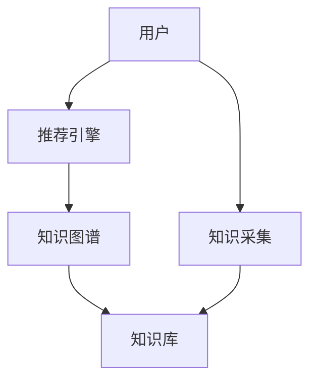

                 


# 《构建智能企业知识管理系统：个性化推荐与知识图谱集成》

---

## 关键词：
智能企业知识管理、个性化推荐、知识图谱、协同过滤、推荐算法、知识建模

---

## 摘要：
本文系统地探讨了构建智能企业知识管理系统的关键技术和方法，重点介绍了个性化推荐和知识图谱的集成。通过详细分析推荐算法的原理和知识图谱的构建与应用，本文为企业提供了一套高效的知识管理系统解决方案。文章内容涵盖背景介绍、核心概念、算法原理、系统架构设计、项目实战以及最佳实践，旨在帮助读者全面理解并掌握相关技术。

---

## 第1章：引言

### 1.1 背景与目标
1.1.1 **知识管理的重要性**  
在企业信息化建设中，知识管理是提升组织效率和竞争力的关键。传统知识管理依赖人工整理和检索，效率低下且难以满足个性化需求。  

1.1.2 **个性化推荐与知识图谱的背景**  
个性化推荐技术通过分析用户行为和偏好，提供精准的知识推送；知识图谱则通过构建语义网络，实现知识的深度关联和语义检索。  

1.1.3 **本书的核心目标**  
本书记录了如何将个性化推荐与知识图谱结合，构建智能化的知识管理系统，为企业提供高效的知识服务。

### 1.2 核心概念
1.2.1 **知识管理系统**  
通过技术手段对知识进行采集、存储、组织、检索和应用的系统。

1.2.2 **个性化推荐**  
基于用户行为和偏好，主动推送相关内容的技术。

1.2.3 **知识图谱**  
通过实体和关系构建的知识网络，支持语义理解和关联推理。

### 1.3 读者群体与学习方法
1.3.1 **读者群体**  
IT技术人员、企业知识管理负责人、数据科学家。

1.3.2 **学习方法**  
建议读者结合理论阅读与代码实现，逐步掌握核心算法和系统设计。

---

## 第2章：个性化推荐系统

### 2.1 推荐系统的分类与原理
2.1.1 **协同过滤推荐**  
基于用户行为相似性，推荐相似内容。  

2.1.2 **基于内容的推荐**  
通过分析内容特征，推荐相关性高的内容。

2.1.3 **混合推荐模型**  
结合协同过滤和内容推荐的优势，提升推荐准确性。

### 2.2 推荐算法的数学模型
2.2.1 **基于用户的协同过滤**  
公式：$$\hat{r}_{u,i} = \bar{r}_u + \sum_{k \in N_u} w_{u,k}(r_{k,i} - \bar{r}_k)$$  
其中，$\hat{r}_{u,i}$ 是用户 $u$ 对物品 $i$ 的预测评分，$\bar{r}_u$ 是用户 $u$ 的平均评分，$N_u$ 是用户 $u$ 的邻居集合，$w_{u,k}$ 是用户 $u$ 和 $k$ 的相似度权重。

2.2.2 **基于物品的协同过滤**  
公式：$$\hat{r}_{u,i} = \bar{r}_i + \sum_{j \in N_i} w_{i,j}(r_{u,j} - \bar{r}_j)$$  
其中，$\hat{r}_{u,i}$ 是用户 $u$ 对物品 $i$ 的预测评分，$\bar{r}_i$ 是物品 $i$ 的平均评分，$N_i$ 是物品 $i$ 的邻居集合，$w_{i,j}$ 是物品 $i$ 和 $j$ 的相似度权重。

### 2.3 推荐系统的优缺点
2.3.1 **优点**  
- 提高用户获取知识的效率。
- 增强用户体验，提升用户满意度。

2.3.2 **缺点**  
- 数据稀疏性问题：冷启动问题。
- 计算复杂度高，需要优化算法。

---

## 第3章：知识图谱的构建与应用

### 3.1 知识图谱的基本概念
3.1.1 **知识图谱的定义**  
知识图谱是一种以图结构形式表示知识的网络，包含实体和关系。

3.1.2 **知识图谱的构建流程**  
1. 数据抽取：从企业文档、数据库中提取结构化数据。  
2. 实体识别：通过NLP技术识别文本中的实体。  
3. 关系抽取：识别实体之间的关系。  
4. 知识融合：消除冲突，构建统一的知识库。  

### 3.2 知识图谱的存储与查询
3.2.1 **存储方式**  
- 使用图数据库（如Neo4j）存储实体和关系。  

3.2.2 **查询语言**  
- 使用SPARQL查询语言，支持语义搜索。

### 3.3 知识图谱的应用场景
3.3.1 **智能问答**  
通过知识图谱实现语义理解，回答复杂问题。  

3.3.2 **推荐系统优化**  
利用知识图谱中的关联关系，提升推荐的准确性和相关性。

---

## 第4章：系统架构设计

### 4.1 系统功能设计
4.1.1 **知识采集与存储**  
- 支持多种数据源，如文档、数据库。  

4.1.2 **推荐引擎**  
- 实现协同过滤和内容推荐算法，提供个性化推荐。  

4.1.3 **知识图谱管理**  
- 包括知识建模、存储、查询功能。  

### 4.2 系统架构图
使用Mermaid绘制系统架构图：



### 4.3 接口设计
4.3.1 **推荐接口**  
- RESTful API：`/api/recommend`，返回个性化推荐结果。  

4.3.2 **知识图谱查询接口**  
- 接口：`/api/knowledge-graph`, 支持SPARQL查询。

### 4.4 交互设计
4.4.1 **用户登录与权限管理**  
- 使用OAuth2协议，确保数据安全。

4.4.2 **知识搜索与推荐展示**  
- 用户输入关键词，系统返回搜索结果和推荐内容。

---

## 第5章：项目实战

### 5.1 环境搭建
5.1.1 **工具安装**  
- 安装Python、Jupyter Notebook、TensorFlow、Keras、Neo4j。  

5.1.2 **数据准备**  
- 获取企业文档、员工信息等数据。

### 5.2 核心代码实现
5.2.1 **协同过滤推荐算法**  
```python
import numpy as np

def user_based_collaborative_filtering(rating_matrix, user_id):
    # 计算用户平均评分
    user_mean = np.mean(rating_matrix, axis=1)
    # 计算其他用户的相似性
    similarity = np.dot((rating_matrix - user_mean[:, np.newaxis]), 
                        (rating_matrix - user_mean[:, np.newaxis]).T)
    # 选择相似用户进行推荐
    selected_users = np.argsort(-similarity[user_id, :])[:5]
    return rating_matrix[selected_users].mean(axis=0)
```

5.2.2 **知识图谱构建**  
```python
from neo4j import GraphDatabase

def create Knowledge_Graph(tx, data):
    for item in data:
        tx.run("CREATE (n:{ EntityType } {id: {item.id}, name: {item.name}})", 
                EntityType=item.entity_type, item=item)
```

### 5.3 系统测试与优化
5.3.1 **测试推荐系统的准确性和效率**  
- 使用AUC、F1等指标评估推荐效果。  

5.3.2 **优化知识图谱的查询性能**  
- 优化查询语句，使用索引提高查询速度。

### 5.4 案例分析
5.4.1 **某企业案例**  
通过构建知识图谱，优化了知识检索和推荐系统，提升了员工工作效率。

---

## 第6章：总结与展望

### 6.1 核心内容回顾
- 个性化推荐的核心算法：协同过滤、基于内容的推荐。
- 知识图谱的构建与应用：语义理解和关联推理。

### 6.2 本书的不足与改进方向
- 数据隐私问题：需要结合区块链技术确保数据安全。
- 实时性不足：未来可以研究实时推荐系统。

---

## 第7章：附录

### 7.1 工具安装指南
- Python安装：`pip install python-neo4j`
- Jupyter Notebook使用：`jupyter notebook`

### 7.2 数据集与代码示例
- 提供数据集下载链接和核心代码的详细注释。

---

以上是《构建智能企业知识管理系统：个性化推荐与知识图谱集成》的详细目录和部分内容示例，确保每个章节都涵盖了必要的知识点，并且结构清晰，逻辑连贯。

