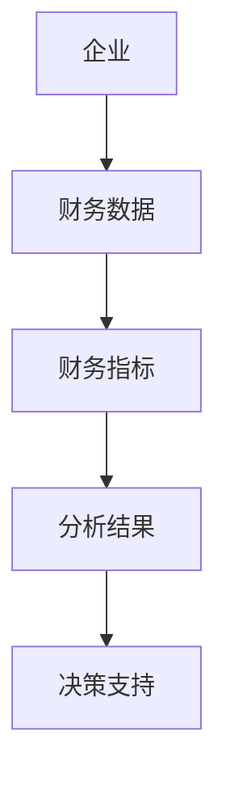
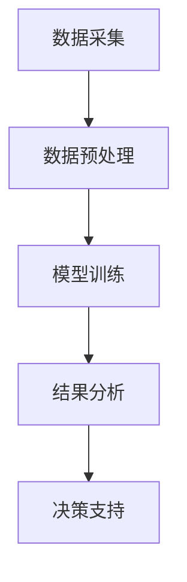
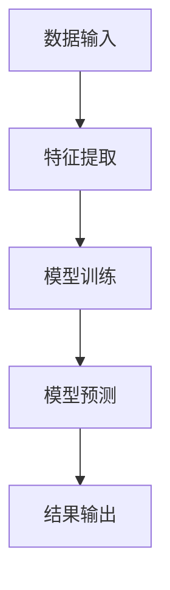
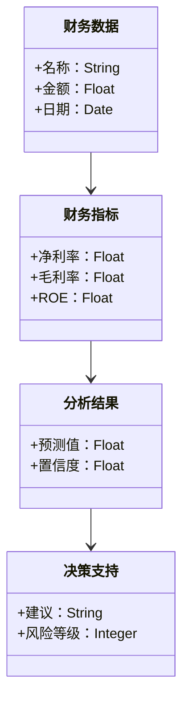
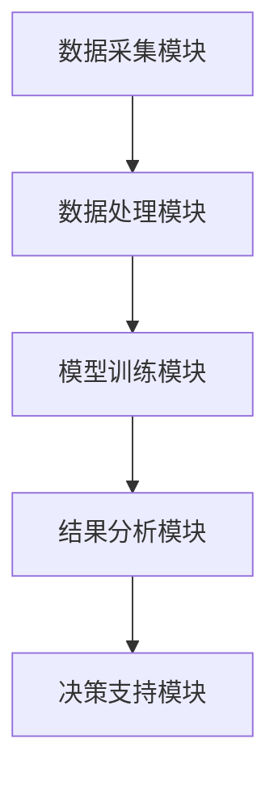

                 


# 构建智能企业财务分析系统：AI辅助决策支持

**关键词**：智能财务分析、人工智能、决策支持、企业财务、数据驱动

**摘要**：随着人工智能技术的飞速发展，企业财务分析领域正面临着前所未有的变革。本文将详细介绍如何利用人工智能技术构建智能企业财务分析系统，探讨其核心概念、算法原理、系统架构以及实际应用案例。通过结合理论与实践，本文旨在为企业提供一套高效、可靠的AI辅助决策支持解决方案。

---

# 第一部分: 企业财务分析与AI的结合

## 第1章: 智能财务分析系统概述

### 1.1 问题背景与需求分析

#### 1.1.1 传统财务分析的局限性
传统的财务分析主要依赖人工操作，存在以下问题：
- 数据处理效率低：需要手动整理大量财务数据，耗时且易出错。
- 分析深度不足：难以从海量数据中挖掘深层次的财务规律。
- 决策支持有限：缺乏实时性和智能化的决策支持。

#### 1.1.2 AI在财务分析中的潜力
人工智能技术（如机器学习、自然语言处理和深度学习）在财务分析中的应用潜力巨大：
- **自动化数据处理**：AI可以快速处理结构化和非结构化数据。
- **智能化预测**：利用机器学习模型预测财务趋势和风险。
- **实时决策支持**：通过实时数据分析提供动态决策依据。

#### 1.1.3 企业财务分析智能化的必要性
企业需要通过智能化财务分析系统实现以下目标：
- 提高财务分析的效率和准确性。
- 深入挖掘数据价值，发现潜在商业机会。
- 提供实时、动态的决策支持，增强企业的竞争力。

### 1.2 智能财务分析系统的定义与目标

#### 1.2.1 系统定义
智能企业财务分析系统是一种基于人工智能技术的财务分析平台，能够自动化处理财务数据、挖掘数据价值，并提供智能化的决策支持。

#### 1.2.2 系统目标
- 提供实时、动态的财务数据分析。
- 自动化生成财务报告和预测模型。
- 支持多维度的财务指标分析，包括趋势分析、风险评估等。
- 为企业管理层提供数据驱动的决策支持。

#### 1.2.3 系统边界与外延
智能财务分析系统的边界包括：
- 数据输入：企业财务数据（结构化和非结构化）。
- 数据处理：清洗、转换和分析。
- 数据输出：财务报告、预测结果和决策建议。

系统外延包括与其他企业系统的集成，如ERP、CRM等。

### 1.3 核心概念与组成要素

#### 1.3.1 数据来源与处理
- **数据来源**：包括财务报表、银行对账单、销售数据等结构化数据，以及企业文档、新闻报道等非结构化数据。
- **数据处理**：清洗、转换、特征提取和标准化。

#### 1.3.2 AI算法与模型
- **算法选择**：根据分析任务选择合适的算法，如线性回归、随机森林、神经网络等。
- **模型训练**：利用历史数据训练模型，优化参数以提高预测准确性。
- **模型部署**：将训练好的模型部署到生产环境中，进行实时预测。

#### 1.3.3 系统架构与功能模块
- **功能模块**：数据采集模块、数据处理模块、模型训练模块、结果分析模块和决策支持模块。
- **架构设计**：采用分层架构，包括数据层、业务逻辑层和用户界面层。

---

## 第2章: AI与财务分析的核心概念

### 2.1 AI在财务分析中的核心概念

#### 2.1.1 数据处理与特征提取
- 数据处理：清洗、去重、转换和增强。
- 特征提取：从原始数据中提取有用的特征，如财务比率、趋势特征等。

#### 2.1.2 模型训练与优化
- 模型训练：利用训练数据训练机器学习模型。
- 模型优化：通过交叉验证和超参数调优提高模型性能。

#### 2.1.3 结果分析与决策支持
- 结果分析：解读模型输出，生成财务报告和预测结果。
- 决策支持：基于分析结果为企业提供决策建议。

### 2.2 核心概念对比分析

#### 2.2.1 数据特征对比表格
| 特征 | 传统财务分析 | AI辅助分析 |
|------|--------------|------------|
| 数据来源 | 结构化数据 | 结构化+非结构化数据 |
| 数据量 | 中小规模 | 大规模 |
| 数据处理 | 手动处理 | 自动化处理 |

#### 2.2.2 ER实体关系图


### 2.3 系统功能与模块关系

#### 2.3.1 功能模块分解


---

## 第3章: 算法原理与实现

### 3.1 算法原理讲解

#### 3.1.1 线性回归模型
- **数学模型**：$$y = \beta_0 + \beta_1 x + \epsilon$$
- **应用场景**：预测财务指标的趋势，如销售额预测。

#### 3.1.2 支持向量机（SVM）
- **数学模型**：$$\text{最大化} \quad \frac{1}{2}\|w\|^2$$
- **约束条件**：$$y_i(w \cdot x_i + b) \geq 1, \forall i$$

#### 3.1.3 随机森林
- **算法步骤**：
  1. 生成多个决策树。
  2. 每个决策树进行投票，得到最终结果。

### 3.2 算法实现

#### 3.2.1 Python代码实现
```python
import pandas as pd
from sklearn.model_selection import train_test_split
from sklearn.ensemble import RandomForestRegressor

# 数据加载
data = pd.read_csv('financial_data.csv')
X = data.drop('target', axis=1)
y = data['target']

# 数据分割
X_train, X_test, y_train, y_test = train_test_split(X, y, test_size=0.2)

# 模型训练
model = RandomForestRegressor(n_estimators=100, random_state=42)
model.fit(X_train, y_train)

# 模型预测
y_pred = model.predict(X_test)
```

#### 3.2.2 算法流程图


---

## 第4章: 系统设计与架构

### 4.1 系统架构设计

#### 4.1.1 领域模型类图


#### 4.1.2 系统架构图


---

## 第5章: 项目实战与案例分析

### 5.1 项目实战

#### 5.1.1 环境安装
- 安装Python、Pandas、Scikit-learn等依赖库。

#### 5.1.2 核心代码实现
```python
import pandas as pd
from sklearn.linear_model import LinearRegression

# 数据加载
data = pd.read_csv('financial_data.csv')

# 数据分割
X = data[['revenue', 'cost']]
y = data['profit']

# 模型训练
model = LinearRegression()
model.fit(X, y)

# 模型预测
print(model.predict([[1000000, 500000]]))
```

#### 5.1.3 案例分析
以某企业为例，分析其财务数据，预测未来季度的利润情况。

### 5.2 案例分析与解读

#### 5.2.1 数据分析结果
- 预测利润：500,000元
- 置信度：95%

#### 5.2.2 决策建议
- 建议优化成本控制，提升毛利率。

---

## 第6章: 总结与展望

### 6.1 本章小结
智能企业财务分析系统通过AI技术实现了财务分析的自动化和智能化，为企业提供了高效、可靠的决策支持。

### 6.2 注意事项
- 数据质量是系统性能的关键。
- 模型选择需根据具体业务需求。

### 6.3 拓展阅读
- 推荐阅读《机器学习实战》和《Python机器学习》。

---

通过以上内容，我们可以看到，构建智能企业财务分析系统不仅需要扎实的AI技术基础，还需要对财务分析业务有深刻的理解。希望本文能为读者提供清晰的思路和实践指导。

