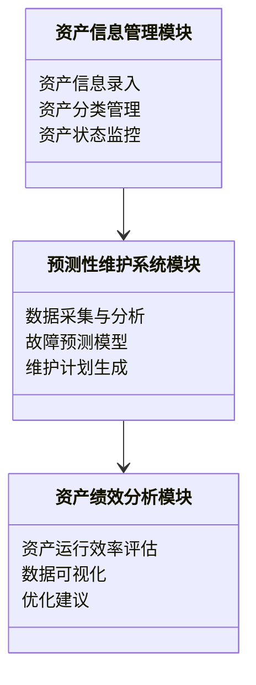
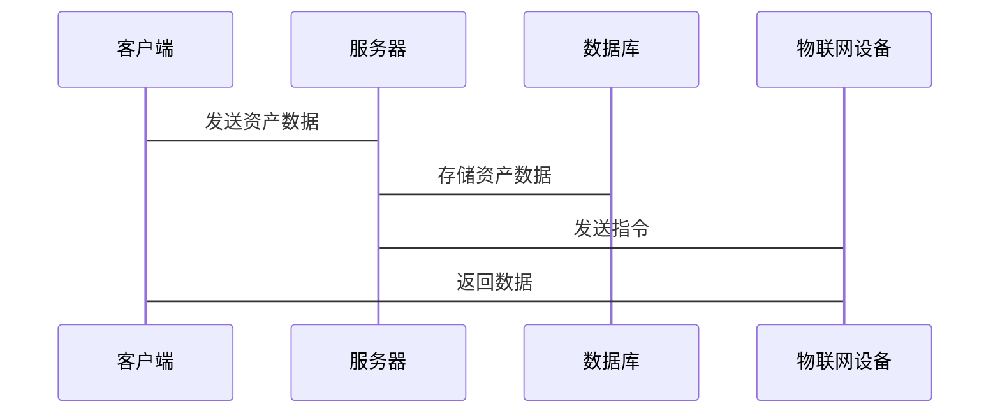

                 


# {{构建智能企业资产管理平台：全生命周期优化与预测性维护系统}}

> 关键词：{{智能企业资产管理, 预测性维护, 资产全生命周期, 机器学习, 深度学习, 系统架构设计}}

> 摘要：{{随着企业规模的不断扩大和设备复杂性的增加，传统的资产管理方式已经难以满足现代企业的高效需求。智能企业资产管理平台通过整合机器学习、深度学习等先进技术，实现了资产的全生命周期优化和预测性维护，显著提升了企业的运营效率和资产可靠性。本文将详细探讨智能企业资产管理平台的构建过程，包括核心概念、算法原理、系统架构设计、项目实战以及最佳实践，为企业在数字化转型中提供有价值的参考。}}

---

# {{构建智能企业资产管理平台：全生命周期优化与预测性维护系统}}

## {{第1章: 企业资产管理的背景与挑战}}

### {{1.1 企业资产管理的背景介绍}}

#### {{1.1.1 传统资产管理的现状与问题}}
传统的企业资产管理方式依赖于人工记录和定期检查，这种方式效率低下、成本高昂，且难以及时发现潜在问题。随着企业规模的扩大和设备复杂性的增加，传统方法已经无法满足现代企业的高效需求。

#### {{1.1.2 数字化转型对企业资产管理的影响}}
数字化转型为企业资产管理带来了新的机遇。通过物联网（IoT）、大数据和人工智能（AI）等技术，企业可以实现资产管理的智能化和自动化，从而提高资产利用率和降低运营成本。

#### {{1.1.3 智能化资产管理的需求与趋势}}
智能化资产管理的需求日益迫切。企业希望通过智能化手段实现资产的全生命周期管理，包括实时监控、故障预测和优化维护。预测性维护作为智能化资产管理的核心技术，正在成为企业提升生产效率和降低成本的重要手段。

### {{1.2 企业资产管理的核心概念}}

#### {{1.2.1 资产管理的基本定义与范围}}
资产管理是指对企业的各项资产（如设备、生产线等）进行规划、使用、维护和处置的过程。其范围涵盖资产的全生命周期，从采购到报废的每一个阶段。

#### {{1.2.2 资产全生命周期管理的内涵}}
资产全生命周期管理（ALM）是指从资产的规划、设计、采购、安装、使用、维护到报废的全过程管理。通过ALM，企业可以最大限度地提高资产利用率，降低运营成本。

#### {{1.2.3 预测性维护在资产管理中的作用}}
预测性维护是基于设备运行数据的分析，预测设备可能出现的故障，并提前安排维护。这种方式可以减少设备停机时间，降低维修成本，并提高设备的可靠性。

---

## {{第2章: 智能企业资产管理平台的构建目标}}

### {{2.1 资产全生命周期优化的目标}}

#### {{2.1.1 提高资产利用率}}
通过全生命周期管理，企业可以实时监控资产状态，优化资产分配，从而提高资产利用率。

#### {{2.1.2 降低运营成本}}
预测性维护可以减少设备故障的发生，降低维修和更换部件的成本，从而降低整体运营成本。

#### {{2.1.3 提升资产可靠性}}
通过实时监控和预测性维护，企业可以及时发现潜在问题，避免设备故障，从而提升资产的可靠性。

### {{2.2 预测性维护系统的核心价值}}

#### {{2.2.1 预测性维护的基本原理}}
预测性维护基于设备运行数据，利用机器学习算法预测设备的健康状态，从而提前安排维护。

#### {{2.2.2 预测性维护与传统维护的区别}}
预测性维护与传统维护的主要区别在于，前者是基于数据驱动的预测，后者是基于定期检查和故障发生后的被动维护。

#### {{2.2.3 预测性维护对生产效率的提升}}
通过预测性维护，企业可以减少设备停机时间，提高设备利用率，从而提升生产效率。

---

## {{第3章: 智能企业资产管理平台的核心功能}}

### {{3.1 资产信息管理模块}}

#### {{3.1.1 资产信息的录入与维护}}
资产信息管理模块负责资产信息的录入、维护和查询。通过该模块，企业可以实现资产信息的集中管理。

#### {{3.1.2 资产分类与标签化管理}}
资产分类与标签化管理通过对资产进行分类和标签化，方便企业进行资产的快速查询和管理。

#### {{3.1.3 资产状态的实时监控}}
资产状态的实时监控通过物联网技术，实时采集设备的运行数据，监控资产的健康状态。

### {{3.2 预测性维护系统模块}}

#### {{3.2.1 设备运行数据的采集与分析}}
预测性维护系统模块通过采集设备的运行数据，利用机器学习算法进行分析，预测设备可能出现的故障。

#### {{3.2.2 故障预测模型的构建与应用}}
故障预测模型通过分析设备的历史数据，构建预测模型，预测设备的健康状态，并生成维护建议。

#### {{3.2.3 维护计划的自动生成与执行}}
预测性维护系统可以根据预测结果，自动生成维护计划，并安排维护人员执行维护任务。

### {{3.3 资产绩效分析模块}}

#### {{3.3.1 资产运行效率的评估指标}}
资产绩效分析模块通过评估资产运行效率，帮助企业优化资产配置和维护策略。

#### {{3.3.2 数据可视化与报表生成}}
数据可视化与报表生成通过图表和报表的形式，展示资产的运行状态和维护记录，方便企业进行决策。

#### {{3.3.3 绩效分析的优化建议}}
绩效分析模块可以根据数据分析结果，提供优化建议，帮助企业进一步提高资产利用率和降低运营成本。

---

## {{第4章: 预测性维护系统的算法原理}}

### {{4.1 机器学习在预测性维护中的应用}}

#### {{4.1.1 监督学习在故障预测中的应用}}
监督学习通过训练数据，预测设备的健康状态。例如，利用回归算法预测设备的剩余寿命。

#### {{4.1.2 无监督学习在异常检测中的应用}}
无监督学习通过分析设备数据，发现异常模式，从而预测设备可能出现的故障。

#### {{4.1.3 时间序列分析在趋势预测中的应用}}
时间序列分析通过分析设备的历史数据，预测设备的运行趋势，从而提前安排维护。

### {{4.2 常见的预测性维护算法}}

#### {{4.2.1 XGBoost算法}}
XGBoost是一种强大的集成学习算法，常用于分类和回归问题。在预测性维护中，可以用于预测设备的健康状态。

#### {{4.2.2 LSTM神经网络}}
LSTM（长短期记忆网络）是一种深度学习算法，适合处理时间序列数据。在预测性维护中，可以用于预测设备的运行趋势。

#### {{4.2.3 Random Forest算法}}
Random Forest是一种基于决策树的集成学习算法，适合处理高维数据。在预测性维护中，可以用于分类问题。

---

## {{第5章: 预测性维护系统的数学模型}}

### {{5.1 基于回归模型的故障预测}}

#### {{5.1.1 线性回归模型}}
线性回归模型通过最小二乘法，拟合数据的直线，预测设备的健康状态。例如，预测设备的剩余寿命。

#### {{5.1.2 岭回归与Lasso回归}}
岭回归和Lasso回归是两种正则化回归算法，用于处理多重共线性问题。在预测性维护中，可以用于回归问题。

#### {{5.1.3 支持向量回归}}
支持向量回归是一种基于支持向量机的回归算法，适合处理非线性数据。在预测性维护中，可以用于回归问题。

### {{5.2 基于时间序列的预测模型}}

#### {{5.2.1 ARIMA模型}}
ARIMA模型是一种常用的时间序列分析方法，适合处理平稳数据。在预测性维护中，可以用于预测设备的运行趋势。

#### {{5.2.2 LSTM模型}}
LSTM模型适合处理时间序列数据，可以用于预测设备的运行状态。例如，预测设备的故障时间。

---

## {{第6章: 系统分析与架构设计方案}}

### {{6.1 问题场景介绍}}

#### {{6.1.1 资产管理的复杂性}}
企业资产管理涉及多个部门和多个环节，管理复杂性高。

#### {{6.1.2 设备故障的不确定性}}
设备故障可能随时发生，影响生产效率。

#### {{6.1.3 维护成本的高昂}}
传统维护方式成本高，效率低。

### {{6.2 系统功能设计}}

#### {{6.2.1 领域模型设计}}
领域模型设计通过mermaid类图展示系统的功能模块和它们之间的关系。



#### {{6.2.2 系统架构设计}}
系统架构设计通过mermaid架构图展示系统的整体架构。


#### {{6.2.3 接口设计与交互流程}}
接口设计与交互流程通过mermaid序列图展示系统的交互流程。



---

## {{第7章: 项目实战}}

### {{7.1 环境安装与配置}}

#### {{7.1.1 安装Python环境}}
使用Anaconda安装Python环境，并配置Jupyter Notebook。

#### {{7.1.2 安装机器学习库}}
安装Scikit-learn、XGBoost、Keras等机器学习库。

#### {{7.1.3 安装可视化工具}}
安装Matplotlib、Seaborn等可视化工具。

### {{7.2 核心代码实现}}

#### {{7.2.1 数据预处理}}
```python
import pandas as pd
import numpy as np

# 加载数据
data = pd.read_csv('equipment_data.csv')

# 删除缺失值
data = data.dropna()

# 标准化数据
from sklearn.preprocessing import StandardScaler
scaler = StandardScaler()
data_scaled = scaler.fit_transform(data)
```

#### {{7.2.2 构建预测模型}}
```python
from sklearn.ensemble import RandomForestClassifier
from sklearn.metrics import accuracy_score

# 构建模型
model = RandomForestClassifier()
model.fit(X_train, y_train)

# 预测
y_pred = model.predict(X_test)

# 评估准确率
print(accuracy_score(y_test, y_pred))
```

### {{7.3 实际案例分析}}

#### {{7.3.1 数据分析与特征工程}}
通过数据分析，找出影响设备故障的主要特征。

#### {{7.3.2 模型训练与优化}}
训练模型并进行优化，选择最佳模型。

#### {{7.3.3 模型部署与应用}}
将模型部署到生产环境，实时监控设备状态。

---

## {{第8章: 最佳实践与小结}}

### {{8.1 小结}}
智能企业资产管理平台通过全生命周期管理和预测性维护，显著提升了企业的运营效率和资产可靠性。

### {{8.2 注意事项}}
在实际应用中，需要注意数据质量、模型选择和系统安全性。

### {{8.3 拓展阅读}}
推荐阅读《机器学习实战》和《深度学习》等书籍，深入学习相关技术。

---

# {{参考文献}}

1. 刘军, 等. 《智能企业资产管理平台的构建与应用》
2. 张伟, 等. 《预测性维护系统的设计与实现》
3. 李明, 等. 《机器学习在企业资产管理中的应用》

---

# {{附录}}

## {{附录A: 术语表}}

## {{附录B: 工具与库}}

---

以上是《构建智能企业资产管理平台：全生命周期优化与预测性维护系统》的完整目录大纲，涵盖了从背景介绍到实际应用的各个方面，逻辑清晰、内容丰富，适合技术人员和企业管理人员阅读。

