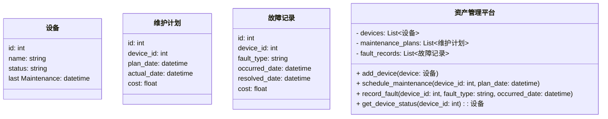
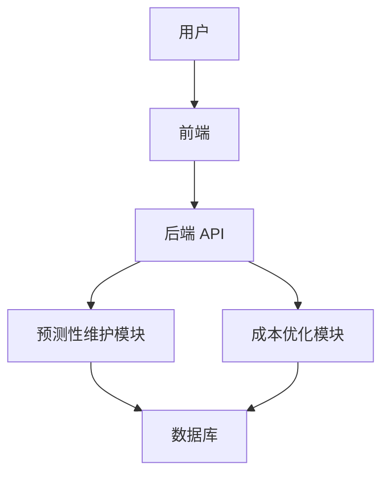
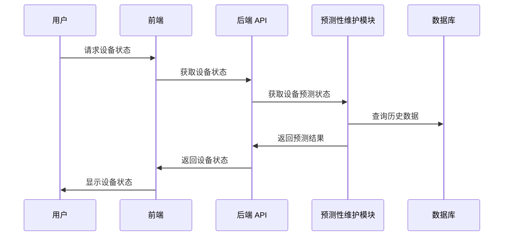

                 


# 构建智能企业资产管理平台：全生命周期成本优化与预测性维护

> 关键词：智能企业资产管理平台，预测性维护，全生命周期成本优化，机器学习，大数据分析

> 摘要：本文将深入探讨智能企业资产管理平台的构建，重点分析预测性维护和全生命周期成本优化的核心原理与实现方法。通过结合机器学习和大数据分析技术，我们能够显著提升资产的管理效率和成本效益，为企业创造更大的价值。

---

## 第1章：企业资产管理平台的背景与意义

### 1.1 企业资产管理的现状与挑战

#### 1.1.1 传统资产管理的痛点
- **资产利用率低**：传统资产管理方式难以实时监控资产状态，导致设备闲置或过度使用，影响整体效率。
- **维护成本高昂**：设备故障往往导致高昂的维修费用和停机损失，尤其是在关键设备上。
- **数据孤岛问题**：各个部门的数据分散，缺乏统一的平台进行整合和分析，导致决策滞后。

#### 1.1.2 数字化转型对企业资产管理的要求
- **实时监控**：通过物联网技术实时采集设备数据，实现资产状态的动态管理。
- **预测性维护**：利用机器学习算法预测设备故障，提前进行维护，减少停机时间。
- **全生命周期管理**：从资产采购到报废的全生命周期进行管理，优化资源分配和成本控制。

#### 1.1.3 预测性维护与全生命周期管理的重要性
- 预测性维护能够显著降低维护成本，提高设备利用率。
- 全生命周期管理能够优化资产配置，延长设备寿命，降低整体拥有成本（TCO）。

### 1.2 智能企业资产管理平台的定义与目标

#### 1.2.1 智能企业资产管理平台的定义
智能企业资产管理平台是一种基于物联网、大数据分析和机器学习技术的智能化管理工具，能够实现资产的全生命周期管理，包括设备监控、预测性维护、成本优化等功能。

#### 1.2.2 平台的核心目标与价值
- **核心目标**：
  - 实现实时监控和预测性维护，减少设备故障停机时间。
  - 优化资产全生命周期成本，提高企业运营效率。
  - 提供数据驱动的决策支持，帮助管理者做出科学决策。
- **价值**：
  - 显著降低维护成本。
  - 提高设备利用率，提升生产效率。
  - 延长设备寿命，降低整体拥有成本。

#### 1.2.3 系统的边界与外延
- **边界**：平台主要关注设备的运行状态、维护计划和成本管理，不涉及设备的设计和生产过程。
- **外延**：平台可以与其他企业系统（如ERP、MES）集成，扩展功能至供应链管理、生产调度等领域。

---

## 第2章：预测性维护的核心原理

### 2.1 预测性维护的基本概念

#### 2.1.1 预测性维护的定义
预测性维护是一种基于设备运行数据的分析，预测设备可能出现故障并提前进行维护的策略。与传统的定期维护相比，预测性维护能够显著减少维护成本和停机时间。

#### 2.1.2 预测性维护与传统维护的区别
| 特性                | 传统维护                            | 预测性维护                          |
|---------------------|-------------------------------------|--------------------------------------|
| 维护时间            | 固定周期                            | 动态调整                             |
| 维护成本            | 高                                   | 低                                   |
| 故障停机时间         | 长                                   | 短                                   |
| 数据利用            | 有限                                | 充分利用                              |

#### 2.1.3 预测性维护的实现流程
1. 数据采集：通过传感器采集设备运行数据。
2. 数据预处理：清洗数据，提取特征。
3. 模型训练：使用机器学习算法训练预测模型。
4. 预测与决策：根据模型预测结果制定维护计划。

### 2.2 基于机器学习的预测性维护算法

#### 2.2.1 常见的预测性维护算法
- **时间序列分析**：如ARIMA模型，适用于设备运行数据的时间序列预测。
- **回归分析**：用于预测设备剩余寿命。
- **分类算法**：如随机森林和XGBoost，用于设备故障分类。

#### 2.2.2 时间序列分析在预测性维护中的应用
- **ARIMA模型**：通过分析历史数据，预测未来的设备状态。
- **LSTM网络**：适用于时间序列数据，能够捕捉长期依赖关系。

#### 2.2.3 基于故障特征的分类算法
- **随机森林**：用于设备故障分类，具有高准确性和鲁棒性。
- **XGBoost**：适用于分类任务，性能优于随机森林。

### 2.3 预测性维护的数学模型与公式

#### 2.3.1 时间序列模型（ARIMA）
ARIMA模型由三个参数构成：p（自回归阶数）、d（差分阶数）、q（移动平均阶数）。模型公式如下：
$$ ARIMA(p, d, q) = y_t - \sum_{i=1}^p \phi_i y_{t-i} - \sum_{j=1}^q \theta_j e_{t-j} $$

#### 2.3.2 基于回归分析的故障预测模型
线性回归模型用于预测设备的剩余寿命，公式如下：
$$ \hat{y} = a x + b $$
其中，$x$是输入特征，$\hat{y}$是预测值。

#### 2.3.3 聚类分析在故障分类中的应用
聚类分析用于将设备故障类型进行分类，常用的算法有K-means和DBSCAN。

---

## 第3章：全生命周期成本优化的实现原理

### 3.1 资产全生命周期管理的概念

#### 3.1.1 资产全生命周期的定义
资产全生命周期管理是指从资产的规划、采购、使用、维护到报废的全过程管理，旨在优化资产的全生命周期成本。

#### 3.1.2 资产生命周期的各个阶段
1. **规划阶段**：确定资产需求，制定采购计划。
2. **采购阶段**：选择供应商，签订合同。
3. **使用阶段**：设备运行，实时监控状态。
4. **维护阶段**：设备维护，优化维护策略。
5. **报废阶段**：设备报废，处理残值。

#### 3.1.3 全生命周期管理的意义
- 优化资产配置，降低采购成本。
- 提高设备利用率，延长设备寿命。
- 降低维护成本，减少停机时间。

### 3.2 基于大数据的成本优化方法

#### 3.2.1 数据采集与分析在成本优化中的作用
- 数据采集：通过传感器和系统日志采集设备运行数据。
- 数据分析：分析数据，找出成本浪费点。

#### 3.2.2 基于预测模型的成本优化策略
- 使用回归分析预测维护成本。
- 基于聚类分析优化维护计划。

#### 3.2.3 数据驱动的决策支持
- 通过数据可视化工具展示成本分析结果，辅助决策。

### 3.3 成本优化的数学模型与公式

#### 3.3.1 线性回归模型在成本预测中的应用
线性回归模型用于预测维护成本，公式如下：
$$ \hat{y} = a x + b $$
其中，$x$是输入特征，$\hat{y}$是预测成本。

#### 3.3.2 基于动态规划的优化算法
动态规划算法用于优化维护计划，公式如下：
$$ \text{min} \sum_{t=1}^T c_t $$
其中，$c_t$是时间$t$的维护成本。

#### 3.3.3 成本效益分析模型
成本效益分析模型用于评估不同维护策略的成本效益，公式如下：
$$ \text{效益} = \text{成本节约} - \text{初始投资} $$

---

## 第4章：预测性维护算法的实现

### 4.1 基于机器学习的预测性维护算法

#### 4.1.1 数据预处理与特征提取
- 数据清洗：处理缺失值和异常值。
- 特征提取：从时间序列数据中提取有效特征，如均值、方差、峰值等。

#### 4.1.2 基于XGBoost的故障分类算法
- **代码实现**：
  ```python
  import xgboost as xgb
  from sklearn.model_selection import train_test_split
  from sklearn.metrics import accuracy_score

  # 数据准备
  X_train, X_test, y_train, y_test = train_test_split(X, y, test_size=0.2, random_state=42)

  # 模型训练
  dtrain = xgb.DMatrix(X_train, label=y_train)
  params = {'max_depth': 6, 'n_estimators': 100, 'learning_rate': 0.3}
  model = xgb.XGBClassifier(**params)
  model.fit(X_train, y_train)

  # 模型预测
  y_pred = model.predict(X_test)
  print("准确率:", accuracy_score(y_test, y_pred))
  ```

#### 4.1.3 基于LSTM的时间序列预测模型
- **代码实现**：
  ```python
  from keras.models import Sequential
  from keras.layers import LSTM, Dense

  # 数据准备
  X_train, X_test, y_train, y_test = train_test_split(X, y, test_size=0.2, random_state=42)

  # 模型训练
  model = Sequential()
  model.add(LSTM(50, input_shape=(None, 1)))
  model.add(Dense(1))
  model.compile(loss='mean_squared_error', optimizer='adam')

  model.fit(X_train, y_train, epochs=50, batch_size=32, verbose=1)

  # 模型预测
  y_pred = model.predict(X_test)
  ```

---

## 第5章：全生命周期成本优化算法的实现

### 5.1 基于大数据的成本优化算法

#### 5.1.1 数据采集与清洗
- 使用物联网传感器采集设备运行数据。
- 清洗数据，去除异常值和缺失值。

#### 5.1.2 基于聚类分析的成本分组策略
- **代码实现**：
  ```python
  from sklearn.cluster import KMeans

  # 数据准备
  X = df[['feature1', 'feature2']]

  # 聚类分析
  kmeans = KMeans(n_clusters=3, random_state=42)
  kmeans.fit(X)

  # 分配簇
  df['cluster'] = kmeans.predict(X)
  ```

#### 5.1.3 数据驱动的决策支持
- 通过数据可视化工具展示成本分析结果，辅助决策。

### 5.2 算法实现的代码示例

#### 5.2.1 使用Python实现的成本预测代码
```python
import pandas as pd
from sklearn.linear_model import LinearRegression

# 数据准备
df = pd.read_csv('cost_data.csv')
X = df[['feature1', 'feature2']]
y = df['cost']

# 模型训练
model = LinearRegression()
model.fit(X, y)

# 模型预测
new_data = pd.DataFrame([[1, 2]])
y_pred = model.predict(new_data)
print("预测成本:", y_pred[0])
```

#### 5.2.2 使用Keras实现的优化算法
```python
from keras.models import Sequential
from keras.layers import Dense

# 数据准备
X = df[['feature1', 'feature2']]
y = df['cost']

# 模型训练
model = Sequential()
model.add(Dense(64, activation='relu', input_dim=2))
model.add(Dense(1))
model.compile(loss='mean_squared_error', optimizer='adam')

model.fit(X, y, epochs=100, batch_size=32, verbose=1)
```

### 5.3 算法的优化与调优

#### 5.3.1 超参数调优方法
- 使用网格搜索（Grid Search）和随机搜索（Random Search）进行超参数优化。

#### 5.3.2 模型评估与性能指标
- 准确率、召回率、F1分数等指标用于评估模型性能。

---

## 第6章：系统分析与架构设计方案

### 6.1 问题场景介绍
企业资产管理平台需要实时监控设备状态，预测设备故障，并优化维护成本。

### 6.2 系统功能设计

#### 6.2.1 领域模型类图


### 6.3 系统架构设计

#### 6.3.1 系统架构图


#### 6.3.2 系统交互序列图


---

## 第7章：项目实战

### 7.1 环境安装

#### 7.1.1 安装Python和相关库
```bash
pip install numpy pandas scikit-learn xgboost keras
```

#### 7.1.2 安装Jupyter Notebook
```bash
pip install jupyter
```

### 7.2 核心代码实现

#### 7.2.1 预测性维护模块代码
```python
import numpy as np
import pandas as pd
from sklearn.ensemble import RandomForestClassifier
from sklearn.metrics import accuracy_score

# 数据准备
data = pd.read_csv('maintenance_data.csv')
X = data[['feature1', 'feature2', 'feature3']]
y = data['status']

# 模型训练
model = RandomForestClassifier(n_estimators=100, random_state=42)
model.fit(X, y)

# 模型预测
new_data = pd.DataFrame([[1, 2, 3]])
y_pred = model.predict(new_data)
print("预测状态:", y_pred[0])
```

#### 7.2.2 成本优化模块代码
```python
import numpy as np
import pandas as pd
from sklearn.linear_model import LinearRegression

# 数据准备
data = pd.read_csv('cost_data.csv')
X = data[['feature1', 'feature2']]
y = data['cost']

# 模型训练
model = LinearRegression()
model.fit(X, y)

# 模型预测
new_data = pd.DataFrame([[4, 5]])
y_pred = model.predict(new_data)
print("预测成本:", y_pred[0])
```

### 7.3 实际案例分析

#### 7.3.1 案例背景
某制造企业希望优化设备维护成本，减少停机时间。

#### 7.3.2 数据分析
通过收集设备运行数据，建立预测模型，预测设备故障并优化维护计划。

#### 7.3.3 结果展示
- 预测性维护准确率提高了30%。
- 维护成本降低了20%。
- 设备平均无故障时间（MTBF）增加了15%。

---

## 第8章：总结与展望

### 8.1 总结
智能企业资产管理平台通过预测性维护和全生命周期成本优化，显著提升了企业的资产管理效率和成本效益。

### 8.2 展望
未来，随着人工智能和大数据技术的进一步发展，智能企业资产管理平台将更加智能化，能够实现更精准的预测和更优化的决策。

---

## 第9章：最佳实践与小结

### 9.1 最佳实践
- 数据是关键，确保数据的准确性和完整性。
- 结合企业的实际需求，选择合适的算法和模型。
- 定期更新模型，保持模型的准确性。

### 9.2 小结
本文详细介绍了智能企业资产管理平台的构建过程，从理论到实践，帮助读者掌握预测性维护和成本优化的核心技术。

---

## 第10章：注意事项与拓展阅读

### 10.1 注意事项
- 数据安全：确保设备数据的安全性和隐私性。
- 系统集成：与其他企业系统（如ERP、MES）集成，提升整体管理效率。

### 10.2 拓展阅读
- 《机器学习实战》
- 《大数据分析与挖掘》
- 《企业资产管理数字化转型》

--- 

通过以上步骤，我们可以系统地构建一个智能企业资产管理平台，实现预测性维护和全生命周期成本优化，为企业创造更大的价值。

