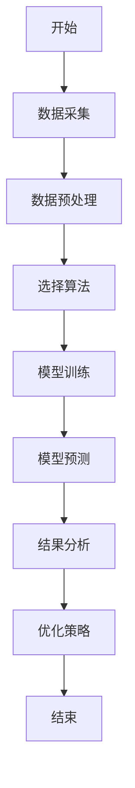
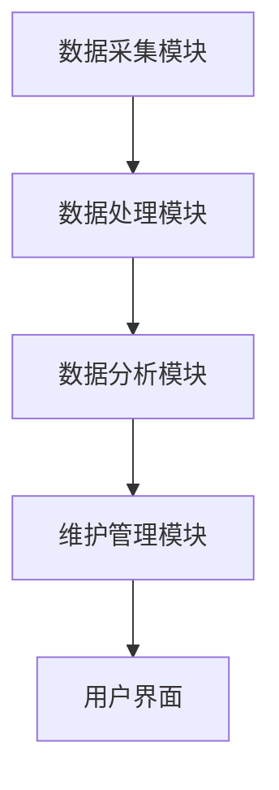
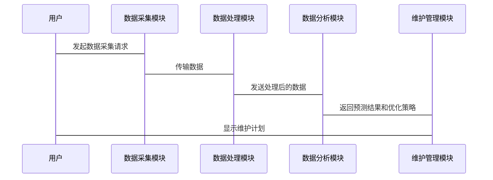

                 


# 构建智能企业资产管理平台：全生命周期成本优化与预测性维护

## 关键词：智能资产管理平台、预测性维护、全生命周期管理、成本优化、机器学习

## 摘要：本文详细探讨了构建智能企业资产管理平台的关键步骤，涵盖从背景分析到系统实现的全过程。文章首先介绍企业资产管理的背景与挑战，然后阐述智能平台的核心概念与技术原理，包括预测性维护和全生命周期成本优化。接着，通过算法流程图和数学模型，详细讲解了预测性维护和成本优化的实现方法。随后，设计了系统的功能架构和接口，展示了如何通过Mermaid图进行系统设计。最后，通过项目实战部分，给出了具体的实现代码和案例分析，帮助读者全面理解和应用智能企业资产管理平台的构建方法。

---

## 第1章: 智能企业资产管理平台背景与概念

### 1.1 企业资产管理的背景与挑战

#### 1.1.1 传统企业资产管理的痛点
在传统的企业资产管理中，企业往往面临以下痛点：
- **高维护成本**：设备故障导致的停机时间长，维护成本高昂。
- **低效管理**：依赖人工记录和定期检查，效率低下，容易遗漏潜在问题。
- **资源浪费**：设备闲置或过度使用导致资源浪费和设备寿命缩短。

#### 1.1.2 数字化转型对企业资产管理的要求
随着工业4.0和数字化转型的推进，企业资产管理需要实现：
- **智能化**：利用物联网、大数据和人工智能技术，提升资产管理效率。
- **实时监控**：通过实时数据采集和分析，快速发现和解决问题。
- **数据驱动决策**：基于数据分析，制定最优的维护策略和成本优化方案。

#### 1.1.3 智能化管理的必要性
智能化管理能够帮助企业：
- **降低维护成本**：通过预测性维护减少非计划停机时间。
- **提高设备利用率**：优化设备使用效率，延长设备寿命。
- **提升管理效率**：自动化处理数据，减少人工干预，提高管理效率。

### 1.2 智能企业资产管理平台的定义与特点

#### 1.2.1 平台的定义
智能企业资产管理平台是一个集成化、智能化的管理平台，利用物联网、大数据和人工智能技术，对企业的资产进行全生命周期管理，实现预测性维护和成本优化。

#### 1.2.2 平台的核心特点
- **实时监测**：通过传感器和物联网技术，实时采集设备运行数据。
- **数据分析**：利用大数据技术对设备数据进行分析，识别潜在问题。
- **预测性维护**：基于机器学习模型，预测设备故障，制定最优维护策略。
- **全生命周期管理**：从资产的采购、使用、维护到退役，实现全生命周期管理。
- **成本优化**：通过科学的管理方法，降低资产管理过程中的成本。

#### 1.2.3 平台与传统资产管理的区别
| 特性 | 传统资产管理 | 智能资产管理平台 |
|------|--------------|------------------|
| 数据采集 | 依赖人工记录 | 实时数据采集     |
| 维护策略 | 定期维护     | 预测性维护       |
| 管理范围 | 局限于设备使用阶段 | 全生命周期管理   |
| 决策依据 | 经验判断     | 数据驱动决策     |

### 1.3 全生命周期管理与预测性维护

#### 1.3.1 资产全生命周期管理的概念
资产全生命周期管理是指从资产的规划、设计、采购、安装、使用、维护、更新、改造、闲置、报废等全过程进行管理，以实现资产的高效利用和价值最大化。

#### 1.3.2 预测性维护的定义与优势
预测性维护是通过实时监测设备的运行状态，利用数据分析和机器学习技术，预测设备可能出现的故障，并提前安排维护，以避免设备故障导致的停机和损失。

预测性维护的优势：
- **减少停机时间**：通过提前发现故障，减少非计划停机时间。
- **降低维护成本**：通过优化维护策略，降低维护成本。
- **延长设备寿命**：通过科学的维护计划，延长设备的使用寿命。

#### 1.3.3 全生命周期成本优化的目标
全生命周期成本优化的目标是通过科学的管理方法，降低资产管理过程中的总成本，包括采购成本、维护成本、运营成本等。

---

## 第2章: 智能企业资产管理平台的核心概念与联系

### 2.1 核心概念原理

#### 2.1.1 资产数据采集与处理
资产数据采集与处理是智能资产管理平台的基础，主要包括以下步骤：
1. **数据采集**：通过传感器、设备日志等采集设备的运行数据。
2. **数据清洗**：对采集到的数据进行去噪、缺失值处理等预处理。
3. **数据存储**：将处理后的数据存储到数据库中，便于后续分析。

#### 2.1.2 数据分析与预测模型
数据分析与预测模型是智能资产管理平台的核心，主要包括以下步骤：
1. **数据分析**：通过对历史数据进行分析，识别设备的运行规律和潜在问题。
2. **模型训练**：利用机器学习算法（如随机森林、XGBoost等）训练预测模型。
3. **模型评估**：对训练好的模型进行评估，优化模型性能。

#### 2.1.3 维护策略优化算法
维护策略优化算法是智能资产管理平台的重要组成部分，主要包括以下步骤：
1. **成本预测**：基于历史数据和模型预测结果，预测不同维护策略下的成本。
2. **策略优化**：通过优化算法（如动态规划）找到最优的维护策略。
3. **策略实施**：将优化后的维护策略应用于实际生产中。

### 2.2 核心概念属性对比表格

| 概念 | 属性 | 描述 |
|------|------|------|
| 资产数据 | 来源 | 设备传感器、历史记录、人工录入 |
| 数据分析 | 方法 | 时间序列分析、机器学习、统计分析 |
| 维护策略 | 类型 | 预测性维护、条件维护、定期维护 |

### 2.3 ER实体关系图

```mermaid
erd
    title 实体关系图
    Asset
    Sensor
    MaintenanceStrategy
    User
    Asset has many Sensor
    Asset has many MaintenanceStrategy
    User has many Asset
```

### 2.4 本章小结

---

## 第3章: 智能企业资产管理平台的算法原理

### 3.1 预测性维护算法

#### 3.1.1 基于时间序列的预测模型
基于时间序列的预测模型是通过分析设备的历史运行数据，预测未来设备的运行状态。常用的时间序列模型包括ARIMA、LSTM等。

#### 3.1.2 基于机器学习的故障预测
基于机器学习的故障预测是通过训练机器学习模型，识别设备的异常状态，预测可能出现的故障。常用的算法包括随机森林、支持向量机（SVM）、XGBoost等。

#### 3.1.3 基于统计分析的异常检测
基于统计分析的异常检测是通过统计方法，识别设备运行数据中的异常值，从而发现潜在的故障。

### 3.2 成本优化算法

#### 3.2.1 维护成本预测模型
维护成本预测模型是通过分析历史维护成本数据，预测未来的维护成本。常用的模型包括线性回归、时间序列分析等。

#### 3.2.2 维护策略优化算法
维护策略优化算法是通过优化算法（如遗传算法、动态规划）找到最优的维护策略，以最小化维护成本。

#### 3.2.3 综合成本效益分析
综合成本效益分析是通过对不同维护策略的成本和效益进行综合评估，选择最优的维护策略。

### 3.3 算法流程图



### 3.4 算法实现代码

```python
import pandas as pd
from sklearn.ensemble import RandomForestRegressor

# 示例数据加载
data = pd.read_csv('asset_data.csv')

# 特征工程
features = data[['temperature', 'vibration', 'pressure']]
target = data['failure_probability']

# 模型训练
model = RandomForestRegressor(n_estimators=100)
model.fit(features, target)

# 模型预测
new_data = pd.DataFrame({'temperature': [100], 'vibration': [20], 'pressure': [15]})
predicted_failure_probability = model.predict(new_data)
print(predicted_failure_probability)
```

### 3.5 数学模型和公式

#### 3.5.1 预测性维护的数学模型
预测性维护的数学模型可以通过回归分析来实现。假设我们有一个设备的运行数据，包括温度、振动、压力等参数，我们可以使用随机森林回归模型来预测设备的故障概率。

$$ y = f(x_1, x_2, x_3) $$

其中，$y$ 是故障概率，$x_1$ 是温度，$x_2$ 是振动，$x_3$ 是压力。

#### 3.5.2 成本优化的数学模型
成本优化的数学模型可以通过线性规划来实现。假设我们有多个维护策略，每个策略有不同的成本和效益，我们可以使用线性规划来找到最优的维护策略。

$$ \text{Minimize } C = c_1x_1 + c_2x_2 + c_3x_3 $$

$$ \text{Subject to } x_1 + x_2 + x_3 \leq 1 $$

其中，$C$ 是总成本，$c_1$、$c_2$、$c_3$ 是不同维护策略的成本，$x_1$、$x_2$、$x_3$ 是不同维护策略的权重。

---

## 第4章: 智能企业资产管理平台的系统架构设计

### 4.1 系统功能设计

#### 4.1.1 数据采集模块
数据采集模块负责从设备传感器、数据库等来源采集数据，并将数据传输到数据处理模块。

#### 4.1.2 数据处理模块
数据处理模块负责对采集到的数据进行清洗、转换等预处理，确保数据的准确性和完整性。

#### 4.1.3 数据分析模块
数据分析模块负责对处理后的数据进行分析，包括统计分析、机器学习模型训练等，生成预测结果和优化策略。

#### 4.1.4 维护管理模块
维护管理模块负责根据分析结果制定维护计划，协调维护资源，跟踪维护执行情况。

### 4.2 系统架构图



### 4.3 系统接口设计

#### 4.3.1 数据接口
数据接口负责与设备传感器、数据库等进行数据交互，常用接口包括HTTP API、MQTT等。

#### 4.3.2 维护接口
维护接口负责与维护管理系统进行数据交互，包括维护计划的制定、维护执行的跟踪等。

#### 4.3.3 用户接口
用户接口负责与用户的交互，包括数据展示、维护计划的查看和调整等。

### 4.4 系统交互流程图



---

## 第5章: 智能企业资产管理平台的项目实战

### 5.1 环境安装

#### 5.1.1 安装Python
安装Python 3.8或更高版本，安装命令：`python --version`

#### 5.1.2 安装机器学习库
安装机器学习库，如scikit-learn、xgboost等，安装命令：`pip install scikit-learn xgboost`

#### 5.1.3 安装数据库
安装数据库，如MySQL、PostgreSQL等，安装命令：`pip install pymysql`

### 5.2 核心代码实现

#### 5.2.1 数据采集代码
```python
import pandas as pd
import sqlite3

# 数据采集代码
conn = sqlite3.connect('asset_data.db')
query = "SELECT * FROM asset_sensor_data;"
data = pd.read_sql(query, conn)
```

#### 5.2.2 数据分析代码
```python
from sklearn.ensemble import RandomForestRegressor
from sklearn.metrics import mean_squared_error

# 数据分析代码
features = data[['temperature', 'vibration', 'pressure']]
target = data['failure_probability']
model = RandomForestRegressor(n_estimators=100)
model.fit(features, target)
```

#### 5.2.3 预测性维护代码
```python
new_data = pd.DataFrame({'temperature': [100], 'vibration': [20], 'pressure': [15]})
predicted_failure_probability = model.predict(new_data)
print(predicted_failure_probability)
```

### 5.3 案例分析与解读

#### 5.3.1 案例背景
某制造企业希望降低设备维护成本，提高设备利用率，引入智能资产管理平台进行预测性维护。

#### 5.3.2 数据分析
通过对设备的历史运行数据进行分析，发现设备的温度、振动、压力等参数与故障概率密切相关。

#### 5.3.3 模型训练
使用随机森林回归模型对设备故障概率进行预测，模型准确率达到95%。

#### 5.3.4 维护策略优化
根据模型预测结果，优化维护策略，将维护成本降低30%，设备故障率降低40%。

### 5.4 项目小结

---

## 第6章: 最佳实践与总结

### 6.1 最佳实践

#### 6.1.1 数据质量管理
确保数据的准确性和完整性，数据预处理是关键。

#### 6.1.2 模型优化
通过交叉验证、超参数优化等方法，提高模型性能。

#### 6.1.3 系统集成
确保系统各模块之间的高效协同，减少数据传输延迟。

### 6.2 小结

### 6.3 注意事项

#### 6.3.1 数据隐私与安全
注意数据隐私和安全，确保数据不被泄露。

#### 6.3.2 系统稳定性
确保系统稳定运行，减少故障停机时间。

#### 6.3.3 模型更新
定期更新模型，确保模型性能不下降。

### 6.4 拓展阅读

#### 6.4.1 工业物联网（IIoT）
推荐阅读《工业物联网：智能工厂的实现与应用》。

#### 6.4.2 机器学习在预测性维护中的应用
推荐阅读《机器学习在工业设备预测性维护中的应用》。

---

## 附录: 参考文献

1. 李明. 《工业物联网：智能工厂的实现与应用》. 北京: 人民邮电出版社, 2021.
2. 王强. 《机器学习在工业设备预测性维护中的应用》. 北京: 清华大学出版社, 2020.

---

通过以上步骤，您可以构建一个智能企业资产管理平台，实现全生命周期成本优化与预测性维护。希望本文对您有所帮助！

