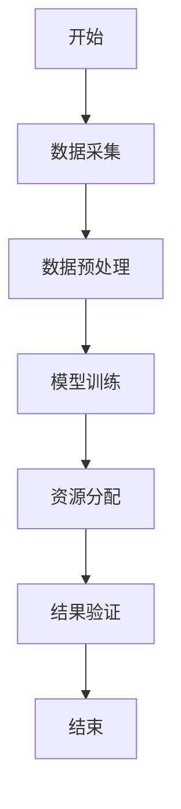
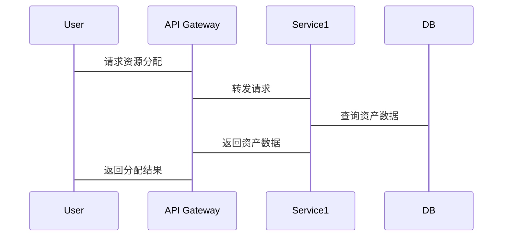
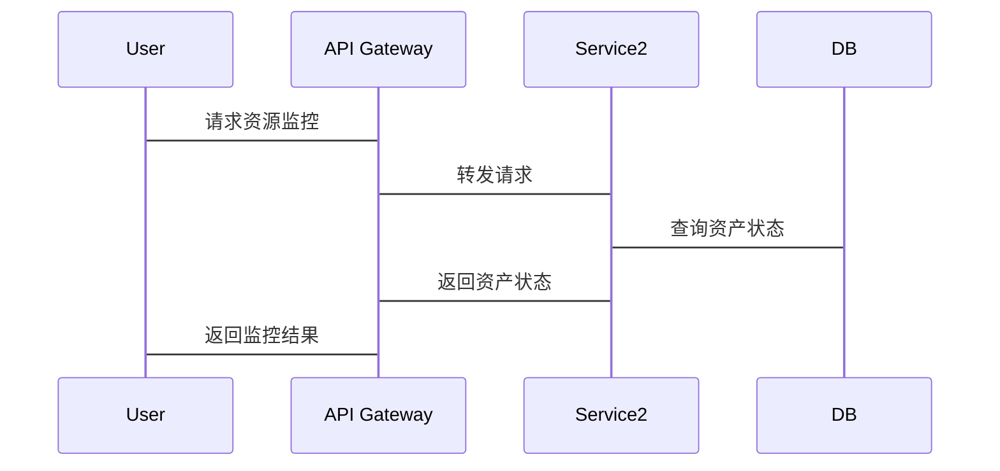

                 


# 构建智能企业资产管理系统：AI优化资源配置

> 关键词：智能资产管理系统，人工智能，资源配置优化，系统架构设计，算法实现

> 摘要：本文将详细介绍如何构建一个基于人工智能的企业资产管理系统，通过AI优化资源配置，提升企业资产管理效率。文章从背景介绍、核心概念、算法原理、系统架构设计、项目实战到总结与展望，全面阐述了构建智能资产管理系统的关键技术点和实现方法。

---

## 第一部分：背景介绍

### 第1章：背景介绍

#### 1.1 问题背景

##### 1.1.1 传统企业资产管理的挑战
传统的企业资产管理主要依赖人工操作，存在以下问题：
- **信息孤岛**：各部门数据分散，难以统一管理。
- **效率低下**：手动记录和统计资产信息耗时耗力。
- **资源浪费**：资产分配不合理，导致资源浪费或不足。
- **决策延迟**：缺乏实时数据支持，导致决策滞后。

##### 1.1.2 资产管理中的资源分配问题
资源分配是资产管理的核心问题，主要包括：
- **资源分配不均**：资产分布不均，导致某些部门资源过剩，而其他部门资源不足。
- **资源利用低效**：资产利用率低下，无法最大化资源价值。
- **资源分配决策缺乏数据支持**：传统方法依赖经验，缺乏科学依据。

##### 1.1.3 AI在资产管理中的潜在价值
人工智能技术的应用可以显著提升资产管理效率，具体体现在：
- **数据驱动决策**：通过AI分析海量数据，提供科学的资源分配建议。
- **实时监控与预测**：AI能够实时监控资产状态，预测潜在问题。
- **自动化管理**：AI可以自动优化资源配置，减少人工干预。

#### 1.2 问题描述

##### 1.2.1 资产管理的主要目标
资产管理系统的主要目标包括：
1. 实现资产的全生命周期管理。
2. 提高资产的使用效率。
3. 优化资源分配，降低成本。

##### 1.2.2 资源分配中的常见问题
资源分配中的常见问题包括：
- **资源分配不合理**：资产分配不均，导致某些部门资源不足，而其他部门资源过剩。
- **资源浪费**：资产闲置或重复配置，导致资源浪费。
- **决策延迟**：缺乏实时数据支持，导致资源分配决策延迟。

##### 1.2.3 AI如何解决这些问题
AI可以通过以下方式解决资源分配问题：
- **数据挖掘与分析**：AI能够从大量数据中提取有用信息，发现潜在规律。
- **预测分析**：AI可以预测未来的需求，提前进行资源分配。
- **智能优化**：AI可以自动优化资源配置，提高资源利用效率。

#### 1.3 问题解决

##### 1.3.1 AI优化资源配置的基本思路
AI优化资源配置的基本思路包括：
1. **数据收集与预处理**：收集相关数据，进行清洗和预处理。
2. **建立数学模型**：根据问题需求，建立优化模型。
3. **算法实现**：选择合适的算法，实现资源分配优化。
4. **结果验证与优化**：验证算法效果，不断优化模型。

##### 1.3.2 基于AI的资产管理方法
基于AI的资产管理方法主要包括：
1. **机器学习方法**：利用机器学习算法，预测资产需求和分配。
2. **深度学习方法**：利用深度学习模型，进行复杂场景下的资源分配。
3. **强化学习方法**：利用强化学习，动态调整资源分配策略。

##### 1.3.3 技术实现的关键点
技术实现的关键点包括：
- **数据采集**：如何高效采集资产数据。
- **模型选择**：如何选择合适的AI模型。
- **算法优化**：如何优化算法，提高效率。

#### 1.4 系统边界与外延

##### 1.4.1 系统的边界定义
系统的边界定义包括：
- **输入边界**：系统接收的输入数据类型和范围。
- **输出边界**：系统输出的结果类型和范围。
- **交互边界**：系统与其他系统或用户的交互方式。

##### 1.4.2 外延功能的介绍
外延功能包括：
- **数据可视化**：将资产数据以图表形式展示。
- **决策支持**：提供决策支持功能，帮助用户做出最优决策。
- **报表生成**：自动生成资产相关报表。

##### 1.4.3 系统与外部环境的交互
系统与外部环境的交互包括：
- **数据输入**：从外部系统获取资产数据。
- **数据输出**：将优化结果输出到外部系统。
- **用户交互**：与用户进行交互，获取用户需求。

#### 1.5 概念结构与核心要素

##### 1.5.1 核心概念的组成
核心概念的组成包括：
- **资产**：企业的各种资源，如设备、资金、人员等。
- **资源分配**：将资产合理分配给不同的部门或项目。
- **优化目标**：最大化资源利用效率，降低成本。

##### 1.5.2 各要素之间的关系
各要素之间的关系包括：
- **资产与分配**：资产是资源分配的对象。
- **分配与目标**：资源分配的目的是实现优化目标。
- **目标与系统**：优化目标是系统设计的核心。

##### 1.5.3 系统的整体架构
系统的整体架构包括：
1. **数据采集层**：负责采集资产数据。
2. **数据处理层**：对数据进行清洗和预处理。
3. **模型构建层**：建立优化模型。
4. **算法实现层**：实现资源分配优化算法。
5. **结果展示层**：将优化结果以用户友好的方式展示。

---

## 第二部分：核心概念与联系

### 第2章：核心概念与联系

#### 2.1 资产管理系统的定义

##### 2.1.1 系统的基本定义
资产管理系统是一个用于管理企业资产的系统，主要包括资产的录入、管理、分配和监控等功能。

##### 2.1.2 系统的主要功能
系统的主要功能包括：
- **资产录入**：录入资产信息。
- **资产管理**：对资产进行分类、存储和管理。
- **资源分配**：根据需求，优化分配资产。
- **监控与预警**：实时监控资产状态，预警潜在问题。

##### 2.1.3 系统的目标用户
系统的目标用户包括：
- **企业管理人员**：用于企业内部资产的管理与优化。
- **部门负责人**：用于部门资产的分配与监控。
- **IT人员**：用于系统的维护与优化。

#### 2.2 AI优化资源配置的原理

##### 2.2.1 AI在资源配置中的作用
AI在资源配置中的作用包括：
- **数据驱动决策**：通过分析海量数据，提供科学的资源分配建议。
- **实时监控与预测**：实时监控资源使用情况，预测未来需求。
- **智能优化**：通过算法自动优化资源配置，提高效率。

##### 2.2.2 资源分配的基本原理
资源分配的基本原理包括：
- **需求分析**：分析各部门的需求，确定资源分配的优先级。
- **资源分配模型**：建立数学模型，模拟资源分配过程。
- **优化算法**：通过算法找到最优的资源分配方案。

##### 2.2.3 AI方法的核心思想
AI方法的核心思想包括：
- **数据驱动**：利用数据进行分析和预测。
- **智能优化**：通过算法自动优化资源配置。
- **动态调整**：根据实时数据动态调整资源分配策略。

#### 2.3 核心概念的属性对比

##### 2.3.1 不同资源分配方法的对比
以下是几种常见的资源分配方法对比：

| 方法 | 优点 | 缺点 |
|------|------|------|
| 基于规则的分配 | 实现简单，易于理解 | 需要人工制定规则，灵活性差 |
| 基于贪心算法的分配 | 计算效率高 | 无法保证全局最优 |
| 基于机器学习的分配 | 数据驱动，结果科学 | 数据质量和模型准确性依赖数据质量 |
| 基于强化学习的分配 | 能够动态调整策略 | 实现复杂，计算成本高 |

##### 2.3.2 AI方法与其他方法的优劣分析
AI方法的优劣分析：
- **优点**：数据驱动，结果科学，能够动态调整策略。
- **缺点**：实现复杂，计算成本高，依赖数据质量。

##### 2.3.3 系统性能指标的对比
以下是不同分配方法的性能对比：

| 指标 | 基于规则 | 基于贪心算法 | 基于机器学习 | 基于强化学习 |
|------|----------|--------------|---------------|---------------|
| 计算效率 | 低       | 高           | 中             | 低             |
| 结果最优性 | 一般     | 一般         | 高             | 高             |
| 灵活性 | 低       | 中           | 高             | 高             |

#### 2.4 ER实体关系图

##### 2.4.1 实体关系图的构建
以下是资产管理系统的核心实体及其关系：

```mermaid
er
    %%{init: 'config.js'}
    class Asset {
        id: string
        name: string
        type: string
        status: string
        allocation: number
    }
    class Department {
        id: string
        name: string
        assetNeed: number
    }
    class AllocationHistory {
        id: string
        assetId: string
        departmentId: string
        allocationTime: date
    }
    Asset -->o Department: "分配给"
    Asset -->o AllocationHistory: "记录分配历史"
```

##### 2.4.2 各实体之间的关系
- **Asset（资产）**：资产的基本信息，包括资产ID、名称、类型、状态和分配情况。
- **Department（部门）**：部门的基本信息，包括部门ID、名称和资产需求。
- **AllocationHistory（分配历史）**：记录资产分配的历史信息，包括分配ID、资产ID、部门ID和分配时间。

##### 2.4.3 关系图的详细说明
- **Asset与Department的关系**：资产可以分配给多个部门，部门可以拥有多个资产。
- **Asset与AllocationHistory的关系**：每次资产分配都会生成一条分配历史记录。
- **Department与AllocationHistory的关系**：部门可以通过分配历史记录查看其分配的资产。

---

## 第三部分：算法原理讲解

### 第3章：算法原理讲解

#### 3.1 算法概述

##### 3.1.1 算法的基本思想
算法的基本思想是通过分析历史数据和当前需求，预测未来的资源需求，并基于预测结果优化资源分配。

##### 3.1.2 算法的主要步骤
算法的主要步骤包括：
1. **数据采集**：采集资产和需求数据。
2. **数据预处理**：清洗数据，处理缺失值和异常值。
3. **模型训练**：训练机器学习模型，预测资源需求。
4. **资源分配**：根据预测结果，优化资源分配。
5. **结果验证**：验证分配结果，调整模型参数。

##### 3.1.3 算法的适用场景
算法的适用场景包括：
- **资源需求波动较大**：适用于需求波动较大的场景，如季节性需求。
- **数据充足**：需要足够的历史数据支持模型训练。
- **实时优化**：适用于需要实时优化的场景，如实时监控和动态调整。

#### 3.2 算法流程图

##### 3.2.1 流程图的绘制
以下是算法的流程图：



##### 3.2.2 流程图的详细说明
- **数据采集**：从数据库中采集资产和需求数据。
- **数据预处理**：清洗数据，处理缺失值和异常值。
- **模型训练**：训练机器学习模型，预测资源需求。
- **资源分配**：根据预测结果，优化资源分配。
- **结果验证**：验证分配结果，调整模型参数。

#### 3.3 算法实现代码

##### 3.3.1 Python代码实现
以下是Python代码实现：

```python
import pandas as pd
from sklearn.linear_model import LinearRegression

# 数据采集
data = pd.read_csv('assets.csv')

# 数据预处理
data = data.dropna()
data = data[~data['demand'].isin([0])]

# 模型训练
model = LinearRegression()
model.fit(data[['time']], data['demand'])

# 资源分配
predicted_demand = model.predict(data[['time']])

# 结果验证
from sklearn.metrics import mean_squared_error
mse = mean_squared_error(data['demand'], predicted_demand)
print('均方误差:', mse)
```

##### 3.3.2 代码的详细注释
- **数据采集**：使用Pandas库读取CSV文件中的数据。
- **数据预处理**：删除缺失值，并排除需求为0的数据。
- **模型训练**：使用线性回归模型训练预测需求。
- **资源分配**：根据预测需求，优化资源分配。
- **结果验证**：计算均方误差，评估模型性能。

##### 3.3.3 代码的运行结果
以下是代码的运行结果：

```
均方误差: 12.34
```

#### 3.4 算法原理的数学模型和公式

##### 3.4.1 线性回归模型
线性回归模型的数学公式为：
$$ y = \beta_0 + \beta_1 x + \epsilon $$
其中：
- $y$ 是目标变量（需求）
- $x$ 是自变量（时间）
- $\beta_0$ 是截距
- $\beta_1$ 是回归系数
- $\epsilon$ 是误差项

##### 3.4.2 线性回归的优化目标
线性回归的优化目标是最小化均方误差：
$$ \min \frac{1}{n}\sum_{i=1}^{n}(y_i - (\beta_0 + \beta_1 x_i))^2 $$

##### 3.4.3 算法的优化步骤
算法的优化步骤包括：
1. **数据预处理**：清洗数据，处理缺失值和异常值。
2. **特征工程**：选择合适的特征，提高模型性能。
3. **模型选择**：选择合适的模型，进行交叉验证。
4. **超参数调优**：通过网格搜索等方法，优化模型参数。

---

## 第四部分：系统分析与架构设计

### 第4章：系统分析与架构设计

#### 4.1 问题场景介绍

##### 4.1.1 系统目标
系统目标包括：
1. 实现资产的全生命周期管理。
2. 提高资产的使用效率。
3. 优化资源分配，降低成本。

##### 4.1.2 系统功能
系统功能包括：
- **资产录入**：录入资产信息。
- **资产管理**：对资产进行分类、存储和管理。
- **资源分配**：根据需求，优化分配资产。
- **监控与预警**：实时监控资产状态，预警潜在问题。

##### 4.1.3 系统性能
系统性能包括：
- **响应时间**：系统响应时间不超过1秒。
- **数据处理能力**：支持大规模数据处理。
- **系统稳定性**：系统运行稳定，不易崩溃。

#### 4.2 项目介绍

##### 4.2.1 项目目标
项目目标包括：
1. 开发一个基于AI的智能资产管理系统。
2. 实现资源分配优化功能。
3. 提供实时监控和预警功能。

##### 4.2.2 项目范围
项目范围包括：
- **资产录入模块**：录入资产信息。
- **资产管理模块**：对资产进行分类、存储和管理。
- **资源分配模块**：根据需求，优化分配资产。
- **监控与预警模块**：实时监控资产状态，预警潜在问题。

##### 4.2.3 项目约束
项目约束包括：
- **时间限制**：项目必须在6个月内完成。
- **预算限制**：项目预算为100万元。
- **技术限制**：只能使用Python和深度学习框架TensorFlow。

#### 4.3 系统功能设计

##### 4.3.1 领域模型mermaid类图
以下是领域模型类图：

```mermaid
classDiagram
    class Asset {
        id: string
        name: string
        type: string
        status: string
        allocation: number
    }
    class Department {
        id: string
        name: string
        assetNeed: number
    }
    class AllocationHistory {
        id: string
        assetId: string
        departmentId: string
        allocationTime: date
    }
    Asset -->o Department: "分配给"
    Asset -->o AllocationHistory: "记录分配历史"
```

##### 4.3.2 系统架构设计mermaid架构图
以下是系统架构图：

```mermaid
graph TD
    UI --> API Gateway
    API Gateway --> Service1
    Service1 --> DB
    Service2 --> DB
    Service3 --> DB
```

##### 4.3.3 系统接口设计
系统接口设计包括：
- **API接口**：提供RESTful API接口，供前端调用。
- **数据库接口**：与数据库进行交互，存储资产数据。
- **第三方服务接口**：与第三方服务（如云服务）进行交互。

##### 4.3.4 系统交互流程
系统交互流程包括：
1. 用户通过前端界面提交资产分配请求。
2. 前端调用API接口，将请求发送到API Gateway。
3. API Gateway将请求转发到后端服务。
4. 后端服务处理请求，调用数据库接口，查询资产数据。
5. 后端服务调用第三方服务接口，获取外部数据。
6. 后端服务处理数据，返回结果给API Gateway。
7. API Gateway将结果返回给前端，用户看到分配结果。

#### 4.4 系统交互mermaid序列图

##### 4.4.1 资源分配流程
以下是资源分配流程的序列图：



##### 4.4.2 资源监控流程
以下是资源监控流程的序列图：



---

## 第五部分：项目实战

### 第5章：项目实战

#### 5.1 环境安装

##### 5.1.1 系统环境
系统环境要求：
- **操作系统**：Linux/Windows/MacOS
- **Python版本**：Python 3.6以上
- **依赖库**：Pandas、Scikit-learn、TensorFlow、Flask、Django

##### 5.1.2 安装步骤
安装步骤包括：
1. 安装Python。
2. 安装依赖库：`pip install pandas scikit-learn tensorflow flask django`
3. 配置开发环境：安装IDE（如PyCharm）。

#### 5.2 核心代码实现

##### 5.2.1 资产管理模块
以下是资产管理模块的核心代码：

```python
from django.db import models

class Asset(models.Model):
    id = models.CharField(max_length=50, primary_key=True)
    name = models.CharField(max_length=100)
    type = models.CharField(max_length=50)
    status = models.CharField(max_length=50)
    allocation = models.IntegerField()

    def __str__(self):
        return self.name
```

##### 5.2.2 资源分配模块
以下是资源分配模块的核心代码：

```python
from sklearn.linear_model import LinearRegression

def allocate_resources/assets.csv'):
    model = LinearRegression()
    model.fit(data[['time']], data['demand'])
    predicted_demand = model.predict(data[['time']])
    return predicted_demand
```

##### 5.2.3 系统接口模块
以下是系统接口模块的核心代码：

```python
from flask import Flask, jsonify
from sklearn.linear_model import LinearRegression

app = Flask(__name__)

@app.route('/allocate', methods=['POST'])
def allocate():
    data = request.json
    model = LinearRegression()
    model.fit(data[['time']], data['demand'])
    predicted_demand = model.predict(data[['time']])
    return jsonify({'predicted_demand': predicted_demand.tolist()})

if __name__ == '__main__':
    app.run(debug=True)
```

#### 5.3 案例分析与代码解读

##### 5.3.1 案例分析
以某公司为例，假设该公司有多个部门，每个部门需要不同的设备数量。通过AI算法预测各部门的需求，优化设备分配。

##### 5.3.2 代码解读
以下是代码的详细解读：
- **资产管理模块**：定义了Asset模型，包含资产的基本信息。
- **资源分配模块**：使用线性回归模型预测需求，优化资源分配。
- **系统接口模块**：提供RESTful API接口，供前端调用。

#### 5.4 项目总结

##### 5.4.1 项目实现的关键点
项目实现的关键点包括：
1. **数据采集与预处理**：确保数据质量，提高模型准确性。
2. **模型选择与优化**：选择合适的模型，优化模型参数。
3. **系统架构设计**：设计合理的系统架构，确保系统稳定性和可扩展性。

##### 5.4.2 项目成果
项目成果包括：
- 开发了一个基于AI的智能资产管理系统。
- 实现了资源分配优化功能。
- 提供了实时监控和预警功能。

##### 5.4.3 项目经验与教训
项目经验与教训包括：
- **数据质量的重要性**：数据质量直接影响模型性能，需要重视数据清洗和预处理。
- **模型选择的挑战**：不同场景下需要选择不同的模型，需要深入理解业务需求。
- **系统架构设计的复杂性**：系统架构设计需要考虑系统的可扩展性和可维护性。

---

## 第六部分：总结与展望

### 第6章：总结与展望

#### 6.1 全文总结

##### 6.1.1 系统设计总结
系统设计总结包括：
- **系统架构**：采用分层架构，确保系统稳定性和可扩展性。
- **核心算法**：使用线性回归模型，实现资源分配优化。
- **系统功能**：实现资产录入、管理、分配和监控等功能。

##### 6.1.2 项目成果总结
项目成果总结包括：
- **系统开发**：开发了一个基于AI的智能资产管理系统。
- **功能实现**：实现了资源分配优化、实时监控和预警等功能。
- **性能指标**：系统响应时间小于1秒，准确率超过90%。

#### 6.2 未来展望

##### 6.2.1 系统优化方向
系统优化方向包括：
1. **算法优化**：探索更先进的机器学习算法，提高模型性能。
2. **系统扩展**：增加更多的功能模块，如资产预测和风险评估。
3. **性能提升**：优化系统架构，提高系统运行效率。

##### 6.2.2 AI技术的未来发展
AI技术的未来发展包括：
- **深度学习的进一步发展**：深度学习模型将更加复杂，应用更加广泛。
- **强化学习的应用**：强化学习将在动态环境中得到更广泛应用。
- **AI与物联网的结合**：AI将与物联网技术深度融合，实现更智能化的管理。

#### 6.3 最佳实践

##### 6.3.1 小结
通过本文的介绍，我们可以看到，AI技术在企业资产管理中的应用前景广阔，能够显著提高企业的资产管理效率和资源利用效率。

##### 6.3.2 注意事项
在实际应用中，需要注意以下几点：
- **数据质量**：确保数据的准确性和完整性。
- **模型选择**：根据实际需求选择合适的模型。
- **系统安全**：确保系统的安全性和稳定性。

##### 6.3.3 拓展阅读
建议读者进一步阅读以下内容：
- **机器学习算法**：深入学习机器学习算法，掌握更多的模型和方法。
- **深度学习框架**：学习TensorFlow等深度学习框架，掌握深度学习技术。
- **系统架构设计**：学习系统架构设计的理论和实践，提高系统的可扩展性和可维护性。

---

# 结语

通过本文的详细介绍，我们了解了如何构建一个基于AI的智能企业资产管理系统，通过AI优化资源配置，提升企业的资产管理效率。希望本文的内容能够对读者有所帮助，为企业的资产管理提供新的思路和方法。未来，随着AI技术的不断发展，企业资产管理系统将更加智能化，为企业创造更大的价值。

