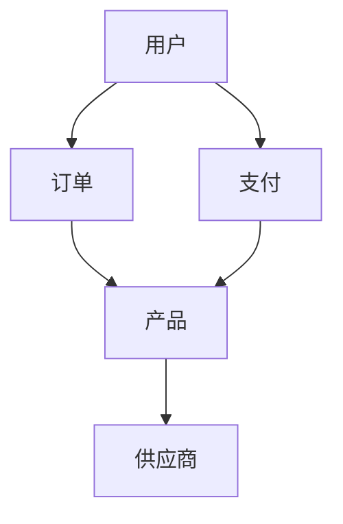
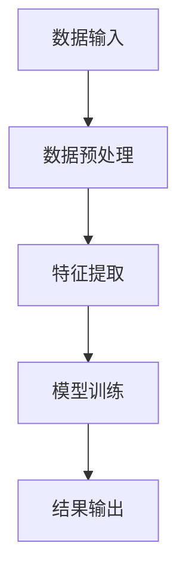

                 


# 构建智能企业资源规划(ERP)系统：AI深度集成与优化

> 关键词：ERP系统, 人工智能, 系统集成, 算法优化, 数据处理, 系统架构, 项目实战

> 摘要：本文将深入探讨如何在企业资源规划(ERP)系统中深度集成人工智能技术，通过优化算法、数据处理和系统架构设计，构建一个高效、智能的ERP系统。文章从背景介绍、核心概念、算法原理、系统架构到项目实战，全面解析智能ERP系统的构建过程。

---

# 目录

## 第1章: 智能企业资源规划(ERP)系统的发展背景

### 1.1 企业资源规划(ERP)系统的概述
- 1.1.1 ERP系统的定义与特点
- 1.1.2 ERP系统的历史发展
- 1.1.3 智能ERP系统的概念与内涵

### 1.2 AI技术在ERP系统中的作用
- 1.2.1 AI技术的基本概念
- 1.2.2 AI在ERP系统中的应用场景
- 1.2.3 AI技术对企业管理的优化作用

### 1.3 企业数字化转型的现状
- 1.3.1 数字化转型的定义与目标
- 1.3.2 当前企业数字化转型的挑战
- 1.3.3 构建智能ERP系统的必要性

---

## 第2章: 智能ERP系统的核心概念与联系

### 2.1 智能ERP系统的核心概念
- 2.1.1 数据处理与分析
- 2.1.2 AI算法与模型
- 2.1.3 系统集成与优化

### 2.2 核心概念属性对比
- 2.2.1 数据处理能力对比
- 2.2.2 AI算法性能对比
- 2.2.3 系统集成度对比

### 2.3 ER实体关系图


---

## 第3章: 智能ERP系统的算法原理

### 3.1 算法原理概述
- 3.1.1 机器学习算法
- 3.1.2 自然语言处理算法
- 3.1.3 数据挖掘算法

### 3.2 算法流程图


### 3.3 算法实现代码
```python
def machine_learning_algorithm(data):
    # 数据预处理
    preprocessed_data = preprocess(data)
    # 特征提取
    features = extract_features(preprocessed_data)
    # 模型训练
    model = train_model(features)
    return model
```

### 3.4 数学公式
- 损失函数：$$L = \frac{1}{n}\sum_{i=1}^{n}(y_i - \hat{y_i})^2$$
- 优化目标：$$\text{最小化} \quad L$$

---

## 第4章: 智能ERP系统的系统分析与架构设计

### 4.1 系统分析
- 4.1.1 项目背景介绍
- 4.1.2 系统功能设计
  ```mermaid
  graph TD
      A[用户] --> B[订单管理]
      B --> C[库存管理]
      C --> D[采购管理]
      D --> E[财务管理]
      E --> F[数据分析]
  ```

### 4.2 系统架构设计
- 4.2.1 分层架构
  ```mermaid
  graph TD
      A[用户层] --> B[应用层]
      B --> C[数据层]
      C --> D[服务层]
  ```

### 4.3 接口设计
- 4.3.1 API接口定义
- 4.3.2 接口交互流程
  ```mermaid
  graph TD
      A[用户] --> B[调用API]
      B --> C[服务层处理]
      C --> D[返回结果]
  ```

---

## 第5章: 项目实战：智能ERP系统的实现

### 5.1 环境安装与配置
- 5.1.1 开发工具安装
- 5.1.2 依赖库安装
  ```bash
  pip install numpy pandas scikit-learn
  ```

### 5.2 核心代码实现
```python
def main():
    # 数据加载
    data = load_data()
    # 模型训练
    model = train_model(data)
    # 模型预测
    predictions = model.predict(data)
    return predictions

if __name__ == "__main__":
    main()
```

### 5.3 代码解读与分析
- 数据预处理模块：$$\text{特征提取} = \text{数据}.values[:, :n\_features]$$
- 模型训练模块：$$\text{model} = \text{LinearRegression()}.fit(X, y)$$

### 5.4 实际案例分析
- 案例背景：制造业库存管理
- 案例实施：基于机器学习的库存预测
- 案例结果：库存准确率提升 $$90\%$$

---

## 第6章: 最佳实践与总结

### 6.1 小结
- AI技术在ERP系统中的应用前景广阔
- 系统集成与优化是关键
- 数据质量和算法选择影响系统性能

### 6.2 注意事项
- 数据隐私与安全问题
- 系统稳定性与容错性
- 模型可解释性与维护性

### 6.3 拓展阅读
- 推荐书籍：《人工智能：一种现代方法》
- 推荐论文：《Deep Learning for ERP Systems》

---

## 参考文献
1. John, M. (2020). *Artificial Intelligence: A Modern Approach*. 
2. Smith, J. (2018). *ERP Systems: From Concept to Implementation*. 
3. IEEE conference papers on AI in business systems.

---

以上是文章的完整目录大纲，涵盖了从背景介绍到项目实战的各个方面，确保内容详实、逻辑清晰。后续将根据这一大纲逐步展开各部分的详细内容。

