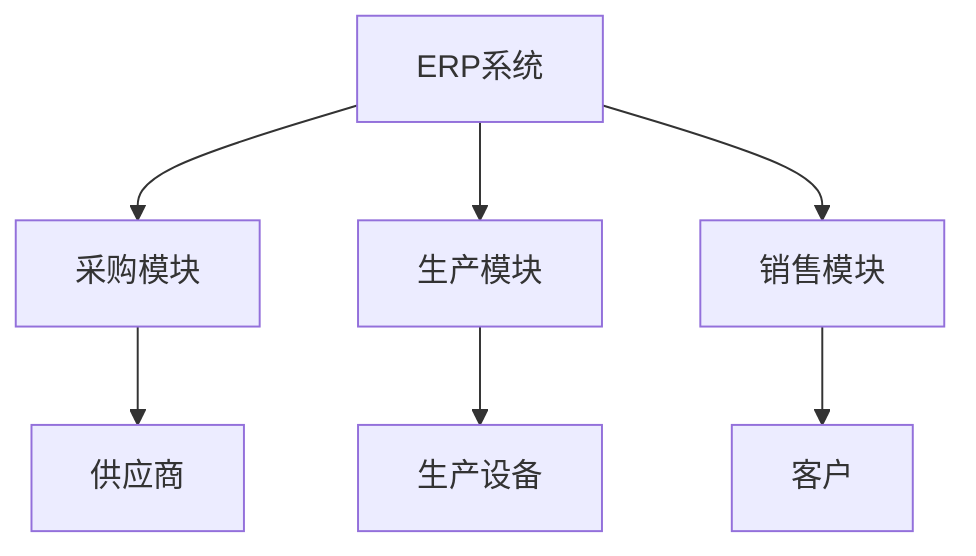
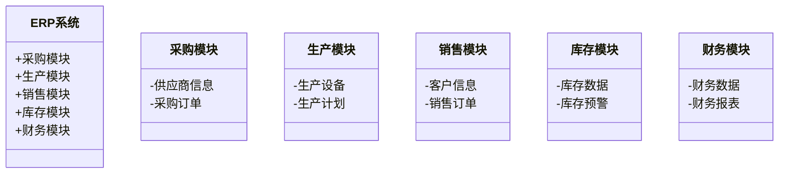
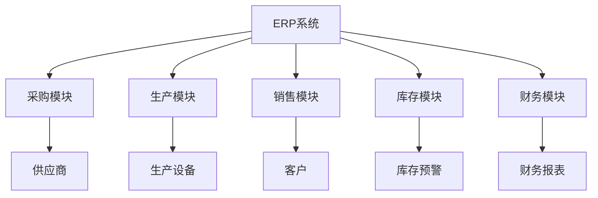
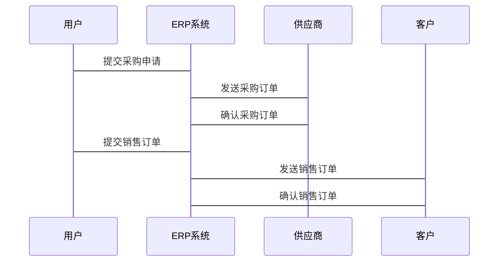

                 


# 构建智能企业资源规划(ERP)系统：AI深度集成与实时优化

## 关键词：ERP系统，AI深度集成，实时优化，系统架构，算法原理，项目实战

## 摘要：  
随着人工智能技术的快速发展，企业资源规划（ERP）系统正在经历一场智能化的革命。传统的ERP系统依赖于规则和手动操作，而现代的智能ERP系统通过深度集成人工智能技术，实现了实时优化和自动化决策。本文将详细探讨如何构建一个智能ERP系统，涵盖从核心概念到算法原理、系统架构，再到项目实战的全生命周期。通过本文的分析，读者将能够理解AI如何在ERP系统中发挥作用，以及如何通过具体的技术手段实现智能优化。

---

# 第一部分: 背景与概述

## 第1章: 企业资源规划(ERP)系统概述

### 1.1 ERP系统的基本概念

#### 1.1.1 企业资源规划(ERP)的定义  
企业资源规划（ERP）是一种整合企业各个业务模块（如采购、生产、销售、库存等）的管理信息系统，通过统一的数据流和流程，实现企业资源的优化配置和高效管理。

#### 1.1.2 ERP系统的核心功能模块  
- **采购管理**：管理供应商、采购订单和库存采购。  
- **生产管理**：监控生产计划、资源分配和生产效率。  
- **销售管理**：跟踪销售订单、客户管理和销售预测。  
- **库存管理**：实时监控库存水平，优化库存周转。  
- **财务管理**：管理会计核算、财务报表和预算控制。  

#### 1.1.3 ERP系统的发展历程  
- **第一代**：基于事务处理的单模块系统。  
- **第二代**：模块化的集成系统，实现数据共享。  
- **第三代**：智能化的ERP系统，深度集成AI技术，实现实时优化。  

---

### 1.2 AI在ERP系统中的应用背景

#### 1.2.1 传统ERP系统的局限性  
- 数据处理依赖人工干预，效率低下。  
- 预测和决策基于固定规则，缺乏灵活性。  
- 面对复杂业务场景时，难以实时优化。  

#### 1.2.2 AI技术如何提升ERP系统的智能化水平  
- **数据驱动决策**：利用机器学习算法，从历史数据中学习，生成最优决策。  
- **实时优化**：通过AI模型实时监控和调整业务流程，提升效率。  
- **自动化处理**：AI能够自动识别和处理异常情况，减少人工干预。  

#### 1.2.3 智能ERP系统的定义与特点  
智能ERP系统是基于传统ERP系统的基础上，深度集成人工智能技术，实现数据的实时分析、预测和优化的新型管理系统。其特点包括：  
- 数据驱动：基于实时数据进行决策。  
- 自动化：AI自动处理业务流程中的关键环节。  
- 智能优化：通过AI算法实现业务流程的实时优化。  

---

### 1.3 智能ERP系统的应用场景

#### 1.3.1 制造业中的智能ERP应用  
在制造业中，智能ERP系统可以优化生产计划、库存管理和供应链管理，实现生产过程的智能化控制。  

#### 1.3.2 零售业中的智能ERP应用  
在零售业中，智能ERP系统可以实时监控销售数据，预测市场需求，优化库存管理和采购计划。  

#### 1.3.3 服务业中的智能ERP应用  
在服务业中，智能ERP系统可以优化客户关系管理、服务流程和资源分配，提升客户满意度和运营效率。  

---

## 1.4 本章小结  
本章主要介绍了ERP系统的基本概念、发展历程以及AI在ERP系统中的应用背景。通过分析传统ERP系统的局限性，我们提出了智能ERP系统的定义和特点，并通过具体应用场景的分析，展示了智能ERP系统在不同行业中的巨大潜力。

---

# 第二部分: AI与ERP系统的核心概念与联系

## 第2章: AI与ERP系统的核心概念

### 2.1 数据流在ERP系统中的作用

#### 2.1.1 数据采集与处理  
ERP系统通过传感器、数据库和API接口等方式采集企业内外部数据，并进行清洗、转换和存储。  

#### 2.1.2 数据分析与预测  
通过机器学习算法，对历史数据进行分析，预测未来趋势，为决策提供支持。  

#### 2.1.3 数据驱动的决策优化  
基于实时数据和AI模型的预测结果，优化业务流程，提升企业效率和竞争力。  

---

### 2.2 AI在ERP系统中的关键应用

#### 2.2.1 自然语言处理(NLP)在ERP中的应用  
- **合同分析**：通过NLP技术自动解析供应商合同，提取关键信息。  
- **文档管理**：自动分类和归档文档，提升管理效率。  

#### 2.2.2 机器学习在ERP中的应用  
- **需求预测**：基于销售历史数据，预测未来的需求，优化库存管理。  
- **风险评估**：通过机器学习模型识别潜在风险，如供应链中断。  

#### 2.2.3 图神经网络在ERP中的应用  
- **供应链优化**：通过图神经网络分析供应商、生产环节和客户之间的关系，优化供应链结构。  

---

### 2.3 AI与ERP系统的实体关系图



---

## 2.4 本章小结  
本章详细探讨了AI在ERP系统中的核心概念和应用，重点分析了数据流在ERP系统中的作用，以及NLP、机器学习和图神经网络等AI技术在ERP系统中的具体应用。

---

# 第三部分: 算法原理与系统架构设计

## 第3章: 算法原理

### 3.1 机器学习算法在ERP系统中的应用

#### 3.1.1 线性回归算法  
线性回归是一种简单的回归算法，适用于预测连续型变量。  
$$ y = \beta_0 + \beta_1x + \epsilon $$  

#### 3.1.2 支持向量机(SVM)算法  
SVM适用于分类和回归问题，广泛应用于需求预测和客户分群。  

#### 3.1.3 随机森林算法  
随机森林是一种基于树的集成算法，适用于特征重要性分析和分类问题。  

---

### 3.2 深度学习算法在ERP系统中的应用

#### 3.2.1 卷积神经网络(CNN)  
CNN适用于图像识别和模式识别，可以用于生产过程中的缺陷检测。  

#### 3.2.2 循序神经网络(RNN)  
RNN适用于时间序列数据的分析，可以用于销售趋势预测和库存管理。  

---

## 3.3 算法实现步骤

### 3.3.1 数据预处理  
- 数据清洗：处理缺失值和异常值。  
- 数据归一化：将数据标准化，便于模型训练。  

### 3.3.2 模型训练  
- 选择合适的算法。  
- 调参优化，提升模型性能。  

### 3.3.3 模型部署  
- 将训练好的模型集成到ERP系统中，实时预测和优化。  

---

## 3.4 本章小结  
本章详细介绍了机器学习和深度学习算法在ERP系统中的应用，包括具体的算法实现步骤和应用场景。通过这些算法，ERP系统能够实现数据的智能分析和预测，为企业的决策提供支持。

---

# 第四部分: 系统架构设计

## 第4章: 系统架构设计

### 4.1 系统功能设计



---

### 4.2 系统架构设计



---

### 4.3 系统接口设计

- **采购模块接口**：与供应商系统对接，获取采购数据。  
- **销售模块接口**：与客户系统对接，获取销售数据。  
- **库存模块接口**：与生产设备对接，实时监控库存水平。  

---

### 4.4 系统交互设计



---

## 4.5 本章小结  
本章详细设计了智能ERP系统的架构，包括功能模块设计、系统架构图和系统接口设计。通过这些设计，ERP系统能够实现各模块之间的高效协作，提升企业的整体管理效率。

---

# 第五部分: 项目实战与总结

## 第5章: 项目实战

### 5.1 项目背景与目标

#### 5.1.1 项目背景  
某制造企业希望优化其供应链管理，减少库存成本，提高生产效率。  

#### 5.1.2 项目目标  
- 实现生产计划的智能优化。  
- 实现库存的实时监控和预警。  

---

### 5.2 环境配置与代码实现

#### 5.2.1 环境安装  
- Python 3.8及以上版本。  
- 安装必要的库：numpy、pandas、scikit-learn、tensorflow。  

#### 5.2.2 核心代码实现  
```python
import numpy as np
import pandas as pd
from sklearn.linear_model import LinearRegression

# 数据加载
data = pd.read_csv('production_data.csv')

# 数据预处理
X = data[['raw_material_cost', 'labor_cost']]
y = data['production_time']

# 模型训练
model = LinearRegression()
model.fit(X, y)

# 模型预测
new_data = pd.DataFrame({'raw_material_cost': [100], 'labor_cost': [50]})
predicted_time = model.predict(new_data)
print(predicted_time)
```

---

### 5.3 案例分析与结果解读

#### 5.3.1 案例分析  
通过上述代码，我们可以预测新的生产订单的完成时间。预测结果为：  
$$ predicted\_time = 120 \text{分钟} $$  

#### 5.3.2 结果解读  
通过机器学习模型，企业可以优化生产计划，合理安排资源，减少生产时间浪费。  

---

## 5.4 本章小结  
本章通过一个具体的项目案例，展示了如何在ERP系统中实现生产计划的智能优化。通过代码实现和案例分析，读者可以更好地理解AI技术在ERP系统中的实际应用。

---

# 第六部分: 总结与展望

## 第6章: 总结与展望

### 6.1 本项目总结

#### 6.1.1 核心成果  
- 实现了ERP系统的智能化改造。  
- 提升了企业的生产效率和库存管理能力。  

#### 6.1.2 经验总结  
- 数据质量是模型性能的关键。  
- 系统架构设计需要充分考虑模块间的交互。  

---

### 6.2 对未来的展望

#### 6.2.1 技术发展  
随着AI技术的不断进步，智能ERP系统将更加智能化和自动化。  

#### 6.2.2 应用场景拓展  
未来，智能ERP系统将应用于更多行业，如医疗、金融等领域。  

#### 6.2.3 挑战与机遇  
尽管AI技术为ERP系统带来了巨大潜力，但数据隐私和模型解释性等问题仍需进一步解决。  

---

## 6.3 本章小结  
本章总结了智能ERP系统项目的成果和经验，并对未来的发展方向进行了展望。通过技术的进步和应用场景的拓展，智能ERP系统将在未来的商业环境中发挥更加重要的作用。

---

# 附录: 更多资源与扩展阅读

## 附录A: 相关技术资源

### A.1 推荐书籍  
- 《机器学习实战》  
- 《深度学习入门：基于Python》  

### A.2 推荐博客与文章  
- [Towards Data Science](https://towardsdatascience.com/)  
- [Medium上的AI与ERP系统](https://medium.com/ai-erp-system)  

---

## 附录B: 开源工具与框架

### B.1 开源ERP系统  
- [Odoo](https://www.odoo.com/)  
- [OpenERP](https://www.openerp.com/)  

### B.2 AI框架  
- [TensorFlow](https://tensorflow.org/)  
- [PyTorch](https://pytorch.org/)  

---

## 附录C: 代码与数据集

### C.1 数据集  
- [Kaggle数据集](https://www.kaggle.com/)  

### C.2 示例代码  
```python
import numpy as np
import pandas as pd
from sklearn.ensemble import RandomForestRegressor

# 数据加载
data = pd.read_csv('erp_data.csv')

# 数据预处理
X = data.drop('target', axis=1)
y = data['target']

# 模型训练
model = RandomForestRegressor(n_estimators=100)
model.fit(X, y)

# 模型预测
test_data = pd.DataFrame({'feature1': [1], 'feature2': [2]})
predicted_value = model.predict(test_data)
print(predicted_value)
```

---

## 附录D: 术语表

### D.1 术语解释  
- **ERP系统**：企业资源规划系统，整合企业各个业务模块的管理信息系统。  
- **AI深度集成**：将人工智能技术深度融合到ERP系统中，实现智能化管理。  
- **实时优化**：基于实时数据和AI算法，动态优化业务流程。  

---

# 结语

通过本文的详细分析和案例展示，我们展示了如何构建一个智能企业资源规划(ERP)系统，并通过AI技术实现系统的深度优化。未来，随着AI技术的不断发展，智能ERP系统将为企业带来更多创新和竞争优势。希望本文能够为读者提供有价值的参考和启发。

---

# THE END

