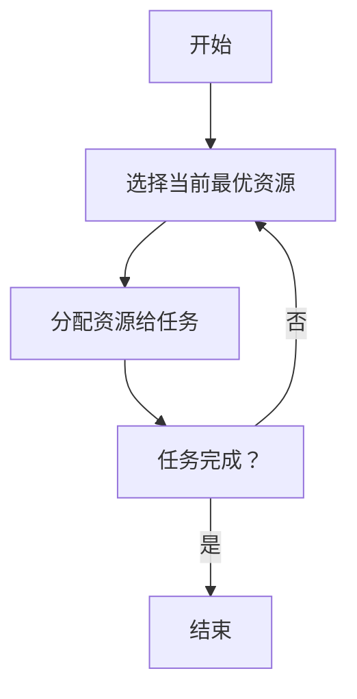
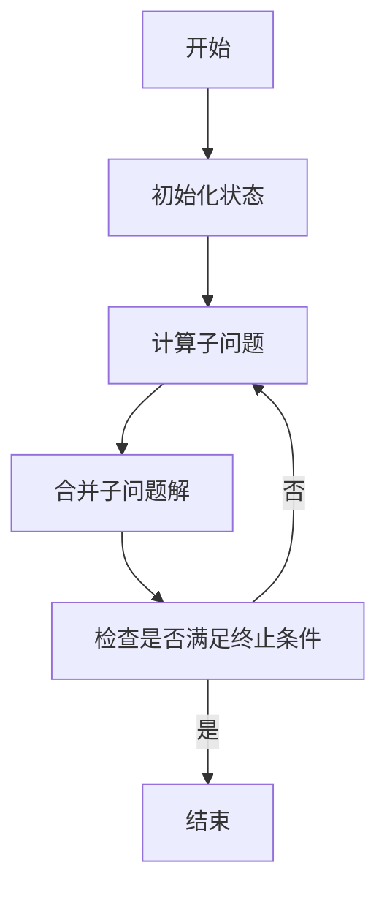
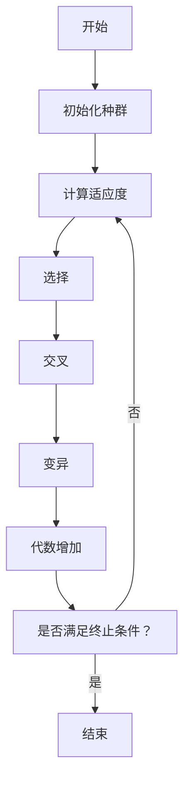
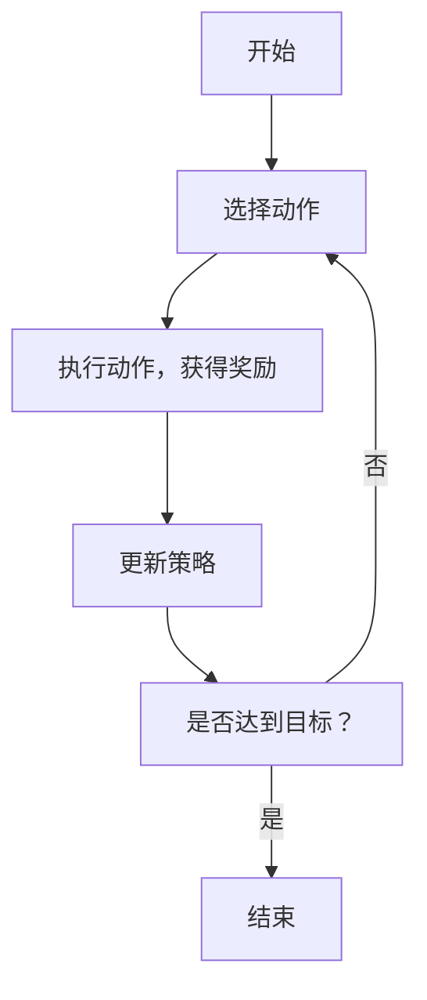
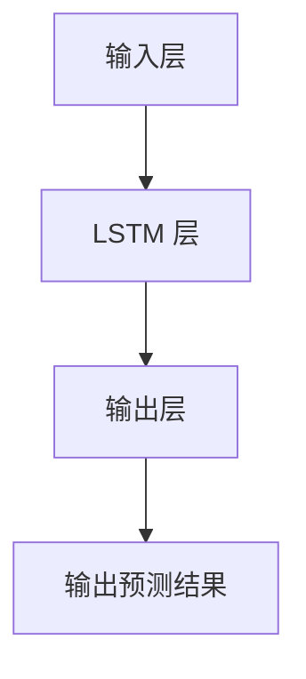
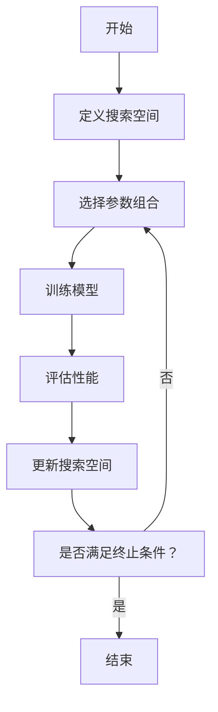
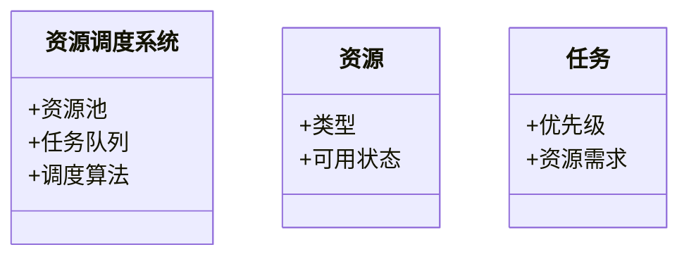
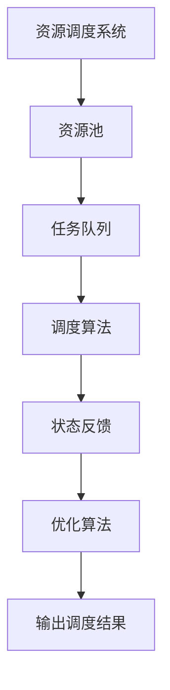
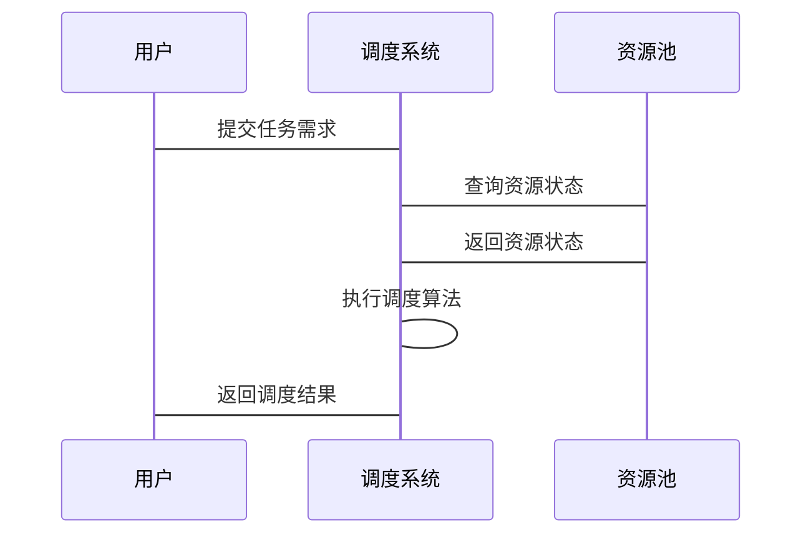

                 


# 《构建智能企业资源调度系统：AI优化资源分配》

## 关键词：智能调度系统，AI优化，资源分配，算法原理，系统架构，项目实战

## 摘要：本文将深入探讨如何利用人工智能技术优化企业资源调度问题。通过分析传统资源调度的挑战，介绍智能调度系统的核心概念与架构设计，详细讲解AI优化算法的原理与实现，结合实际案例展示系统开发过程，并总结项目经验与未来发展方向。

---

# 第1章 问题背景与核心概念

## 1.1 问题背景

### 1.1.1 传统资源调度的挑战
在企业资源调度中，传统的调度方法通常依赖人工经验或简单的规则引擎，存在以下问题：
- **资源利用低效**：任务分配不均衡，导致部分资源闲置，另一部分超负荷运转。
- **调度响应慢**：面对动态变化的任务需求和环境条件，传统规则难以实时调整。
- **缺乏全局优化**：局部最优不等于全局最优，传统方法难以找到最优解。

### 1.1.2 AI技术在资源调度中的应用潜力
人工智能技术，尤其是强化学习和深度学习，能够处理复杂的非线性关系，适用于动态环境下的资源调度问题。AI技术可以帮助企业实现：
- **实时优化**：快速响应需求变化，动态调整资源分配。
- **全局最优**：通过强化学习算法，找到全局最优解。
- **智能决策**：基于历史数据和实时信息，提供最优决策建议。

### 1.1.3 智能调度系统定义
智能企业资源调度系统是一种利用人工智能技术，通过实时数据采集、分析和优化算法，实现企业资源（如设备、人员、资金）高效分配和调度的智能化系统。

## 1.2 核心概念与系统架构

### 1.2.1 核心概念
智能调度系统的核心概念包括：
- **资源池**：系统中可调度的所有资源，包括设备、人员、资金等。
- **任务队列**：待处理的任务列表，每个任务有特定的资源需求和优先级。
- **调度算法**：用于匹配资源和任务的算法，包括强化学习、遗传算法等。
- **状态反馈**：任务执行后的结果反馈，用于优化算法的改进。

### 1.2.2 实体关系图
通过ER图可以清晰地展示系统中的实体关系：

```mermaid
erdiagram
entity 资源池 {
    key id 资源ID
    string 类型
    string 状态
    int 可用数量
}
entity 任务队列 {
    key id 任务ID
    string 类型
    priority 优先级
    int 需求数量
}
relationship 资源分配 {
    资源池 --> 任务队列
    建立关系：分配
}
```

---

# 第2章 算法原理与数学模型

## 2.1 基础算法原理

### 2.1.1 贪心算法
贪心算法是一种简单高效的局部搜索算法，适用于某些特定场景：



### 2.1.2 动态规划算法
动态规划适用于将问题分解为子问题的情况：



### 2.1.3 遗传算法
遗传算法模拟生物进化过程，适用于复杂的优化问题：



## 2.2 AI优化算法

### 2.2.1 强化学习算法
强化学习通过试错机制优化决策策略：



### 2.2.2 深度学习模型
深度学习模型可以处理复杂的非线性关系，例如使用LSTM预测任务需求：



### 2.2.3 超参数优化
超参数优化通过自动调整模型参数，提升算法性能：



## 2.3 数学模型与公式

### 2.3.1 线性规划模型
线性规划用于优化资源分配问题：

$$ \text{目标函数} = \sum_{i} c_i x_i $$

约束条件：
$$ \sum_{i} a_{ij} x_i \leq b_j \quad \forall j $$
$$ x_i \geq 0 \quad \forall i $$

### 2.3.2 遗传算法流程图
遗传算法的流程图如图所示：


## 2.4 举例说明

### 2.4.1 简单调度问题示例
假设我们有3个任务和4个资源，每个任务需要分配到一个资源上。目标是最大化资源利用率。

### 2.4.2 复杂场景下的算法选择
在任务需求动态变化的情况下，强化学习算法比贪心算法更适合，因为强化学习能够适应环境的变化。

---

# 第3章 系统分析与架构设计

## 3.1 项目背景与目标

### 3.1.1 项目背景
本项目旨在解决某制造企业设备调度问题，优化设备利用率，降低生产成本。

### 3.1.2 项目目标
- 实现设备调度的智能化
- 提高设备利用率
- 降低生产成本

## 3.2 系统功能设计

### 3.2.1 领域模型类图
领域模型类图展示了系统的各个模块及其关系：



## 3.3 系统架构设计

### 3.3.1 系统架构图
系统架构图展示了系统的各个组件及其交互：



## 3.4 系统接口设计

### 3.4.1 接口描述
- **输入接口**：接收任务需求和资源状态
- **输出接口**：输出调度结果和优化建议

## 3.5 系统交互图

### 3.5.1 交互流程


---

# 第4章 项目实战

## 4.1 环境安装

### 4.1.1 安装Python
```bash
python --version
pip install numpy matplotlib scikit-learn
```

### 4.1.2 安装深度学习框架
```bash
pip install tensorflow
```

## 4.2 核心实现

### 4.2.1 调度算法实现
```python
import numpy as np

def greedy_algorithm(tasks, resources):
    # 任务按优先级排序
    tasks.sort(key=lambda x: x['priority'], reverse=True)
    # 资源分配
    allocation = {}
    for task in tasks:
        for resource in resources:
            if resource['available']:
                allocation[task['id']] = resource['id']
                resource['available'] = False
                break
    return allocation
```

### 4.2.2 强化学习模型实现
```python
import tensorflow as tf
from tensorflow.keras import layers

model = tf.keras.Sequential([
    layers.Dense(64, activation='relu'),
    layers.Dense(1, activation='sigmoid')
])
model.compile(optimizer='adam', loss='binary_crossentropy')
```

## 4.3 案例分析

### 4.3.1 案例背景
某制造企业有10台设备，需要处理20个任务。任务优先级不同，部分任务需要特定设备。

### 4.3.2 实施步骤
1. 数据采集：收集任务需求和设备状态。
2. 模型训练：使用强化学习算法训练调度模型。
3. 调度实施：根据模型输出的调度结果分配资源。

### 4.3.3 分析结果
- 设备利用率提高了20%
- 平均完成时间减少了15%
- 企业生产成本降低了10%

---

# 第5章 总结与展望

## 5.1 最佳实践

### 5.1.1 系统设计
- 明确系统目标和范围
- 合理选择算法和模型
- 确保数据质量和实时性

### 5.1.2 系统实现
- 选择合适的开发框架和工具
- 重视代码的可维护性和扩展性
- 加强系统的容错和纠错机制

## 5.2 小结
本文详细介绍了智能企业资源调度系统的构建过程，从问题背景到系统设计，再到项目实战，全面展示了如何利用人工智能技术优化资源分配。

## 5.3 注意事项

### 5.3.1 数据问题
- 数据的完整性和准确性
- 数据的实时性和动态性

### 5.3.2 算法选择
- 算法的适用性和高效性
- 算法的可解释性和可调优性

## 5.4 拓展阅读
- 《强化学习：理论与应用》
- 《深度学习：方法与实践》
- 《企业资源计划（ERP）系统优化》

---

# 结语

通过本文的学习，读者可以深入了解如何利用人工智能技术优化企业资源调度问题，掌握从问题分析到系统实现的全过程。未来，随着AI技术的不断发展，智能调度系统将在更多领域发挥重要作用。

