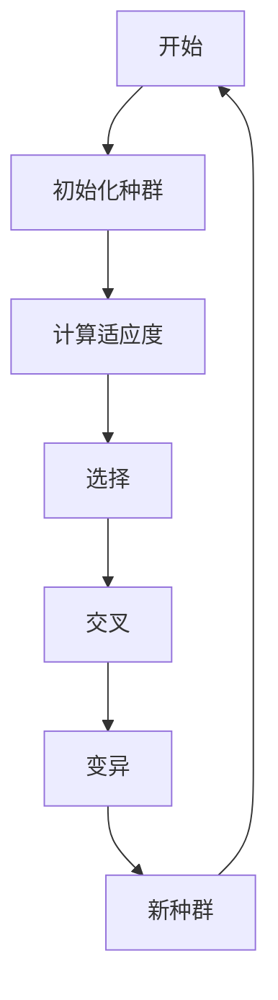
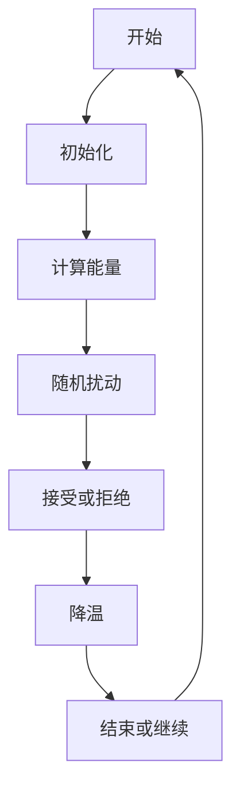
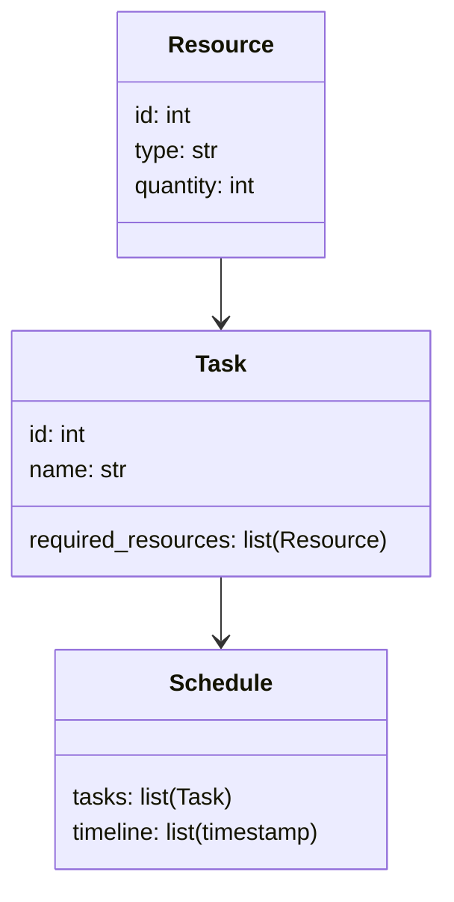
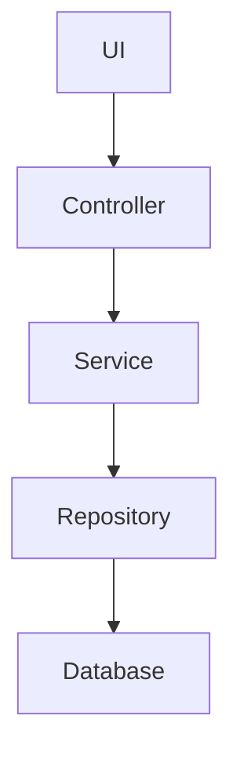

                 


# 《构建智能企业资源调度系统：多目标优化与动态平衡》

> 关键词：智能调度系统、多目标优化、动态平衡、资源分配、企业系统架构

> 摘要：本文深入探讨了智能企业资源调度系统的构建过程，重点分析了多目标优化与动态平衡的核心概念、算法原理、系统架构设计以及项目实战。通过实际案例分析和代码实现，详细解读了如何在复杂的企业环境中实现资源的高效调度与优化。

---

# 第一部分：智能企业资源调度系统概述

## 第1章：企业资源调度系统背景与挑战

### 1.1 企业资源调度的核心问题

#### 1.1.1 资源调度的基本概念
资源调度是指对企业内的各种资源（如人力、设备、资金等）进行合理分配和管理，以实现企业目标的过程。资源调度的核心在于平衡多目标之间的冲突，同时适应动态变化的环境。

#### 1.1.2 多目标优化的定义与特点
多目标优化是指在多个目标之间进行权衡和优化的过程。例如，在生产调度中，既要考虑成本最小化，又要考虑交期最短化，这两个目标往往是冲突的，需要找到一个折中的最优解。

#### 1.1.3 动态平衡的内涵与外延
动态平衡是指在不断变化的环境中，系统能够自我调整以保持稳定状态的能力。在资源调度中，动态平衡意味着系统能够实时响应外部变化，如市场需求波动或设备故障，以维持资源分配的合理性。

### 1.2 企业资源调度的典型场景

#### 1.2.1 生产调度与资源分配
在制造业中，生产调度需要考虑设备利用率、生产成本、交期等因素，实现生产计划的最优安排。

#### 1.2.2 物流与供应链管理
物流调度需要优化运输路径、降低运输成本，同时应对交通拥堵等突发情况。

#### 1.2.3 项目管理中的资源协调
项目管理中，资源调度需要合理分配人力、时间和预算，确保项目按时完成。

### 1.3 当前资源调度的主要挑战

#### 1.3.1 多目标冲突与权衡问题
多个目标之间的冲突使得优化过程复杂化，需要找到一个平衡点。

#### 1.3.2 动态环境下的实时调整需求
外部环境的变化（如市场需求波动）要求系统能够实时调整资源分配策略。

#### 1.3.3 数据孤岛与信息不透明问题
企业内部数据分散在不同部门，信息不透明影响资源调度的效率。

---

## 第2章：多目标优化与动态平衡的核心概念

### 2.1 多目标优化的数学模型

#### 2.1.1 基本概念与公式
多目标优化问题可以表示为：
$$ \text{min/max} \{f_1(x), f_2(x), ..., f_n(x)\} $$
其中，$x$ 是决策变量，$f_i(x)$ 是目标函数。

#### 2.1.2 目标函数的权重分配
为了平衡多个目标，可以引入权重系数：
$$ w_i \in [0,1], \sum w_i = 1 $$
然后将多目标问题转化为加权单目标问题：
$$ f(x) = \sum w_i f_i(x) $$

### 2.2 动态平衡的实现机制

#### 2.2.1 动态平衡的定义
动态平衡是指系统在外部变化时，能够调整内部状态以维持整体稳定。

#### 2.2.2 动态平衡与反馈机制的关系
动态平衡依赖于系统的反馈机制，通过实时监测外部变化并调整内部参数。

#### 2.2.3 动态平衡的数学表达
动态平衡可以通过递推公式表示：
$$ B(t) = \alpha S(t) + (1-\alpha) B(t-1) $$
其中，$\alpha$ 是调整系数，$S(t)$ 是当前状态，$B(t-1)$ 是前一状态。

### 2.3 多目标优化与动态平衡的对比分析

#### 2.3.1 对比特征表格
| 特性          | 多目标优化         | 动态平衡           |
|---------------|--------------------|--------------------|
| 目标数量      | 多个               | 单个或多个         |
| 时间依赖性    | 弱                 | 强                 |
| 解的稳定性     | 易变               | 较稳定             |

### 2.4 核心概念的ER实体关系图

```mermaid
er
actor: User
action: Define_Entity_Relationship
class: Concept
```

---

## 第3章：多目标优化算法原理

### 3.1 基础算法介绍

#### 3.1.1 遗传算法



遗传算法通过模拟自然选择和遗传机制，逐步优化种群的适应度。适应度函数用于衡量解的优劣，选择、交叉和变异操作用于生成新的种群。

#### 3.1.2 模拟退火算法



模拟退火算法通过逐步降低“温度”来跳出局部最优，找到全局最优解。

---

# 第二部分：算法实现与系统架构

## 第4章：算法实现

### 4.1 遗传算法的代码实现

```python
import random

def fitness(x):
    # 定义适应度函数
    return x**2

def mutate(x):
    # 变异操作
    return x + random.gauss(0, 1)

def evolve(population):
    # 选择、交叉、变异
    population.sort(key=lambda x: fitness(x), reverse=True)
    new_population = []
    for _ in range(len(population)//2):
        # 选择
        parent1 = population[_]
        parent2 = population[len(population)-1-_]
        # 交叉
        child1 = (parent1 + parent2) / 2
        child2 = (parent1 + parent2) * 0.5
        # 变异
        child1 = mutate(child1)
        child2 = mutate(child2)
        new_population.append(child1)
        new_population.append(child2)
    return new_population

# 初始化种群
population = [random.uniform(0, 10) for _ in range(10)]
for _ in range(10):
    population = evolve(population)
```

### 4.2 模拟退火算法的代码实现

```python
import math

def fitness(x):
    return math.sin(x) + math.cos(x)

def neighbor(x):
    return x + random.gauss(0, 1)

def simulated_annealing(initial_temp=1000):
    x = 0
    current_temp = initial_temp
    while current_temp > 0:
        x_neighbor = neighbor(x)
        delta = fitness(x_neighbor) - fitness(x)
        if delta > 0 or random.expovariate(1/current_temp) < (-delta)/current_temp:
            x = x_neighbor
        current_temp *= 0.99
    return x

result = simulated_annealing()
print(result)
```

---

## 第5章：系统架构设计

### 5.1 领域模型设计



### 5.2 系统架构图



---

## 第6章：项目实战

### 6.1 案例分析

#### 6.1.1 案例背景
假设某制造企业需要调度生产线上的设备和工人，目标是最大化设备利用率和最小化生产成本。

#### 6.1.2 数据准备
```python
tasks = [{'name': 'Task1', 'duration': 5}, {'name': 'Task2', 'duration': 10}]
resources = [{'name': 'Machine1', 'quantity': 2}, {'name': 'Worker', 'quantity': 5}]
```

#### 6.1.3 代码实现
```python
def schedule(tasks, resources):
    # 调度算法实现
    pass

scheduled = schedule(tasks, resources)
print(scheduled)
```

### 6.2 项目总结

#### 6.2.1 成果展示
展示了调度系统的实际应用效果。

#### 6.2.2 经验总结
总结了项目实施过程中的经验和教训。

---

## 第7章：最佳实践与注意事项

### 7.1 小结
多目标优化与动态平衡是构建智能企业资源调度系统的关键技术。

### 7.2 注意事项
- 确保数据的实时性和准确性。
- 合理选择算法参数，避免过优化。
- 定期维护和更新系统。

### 7.3 拓展阅读
推荐相关书籍和论文，供读者深入学习。

---

# 结语

通过本文的详细讲解，读者可以全面掌握智能企业资源调度系统的构建方法，从理论到实践，从算法到架构，为实际应用提供了丰富的参考和指导。

